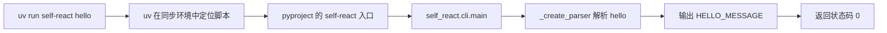

# Day 3：项目骨架代码讲解

> 适用范围：Day 3 的最小可执行工程骨架

## 目录与文件职责

```text
pyproject.toml                 # 项目元数据、构建、命令入口与开发工具配置
src/
  self_react/
    __init__.py                # 顶层包边界；暂不承载领域逻辑
    cli.py                     # hello 命令的参数解析、分派与标准输出
tests/
  test_cli.py                  # 在同一进程中验证 hello 的返回码和输出
docs/
  daily/day-03-...md          # 当日学习与交付记录
  architecture/day-03-...md   # 本文：配置和调用链的代码讲解
```

这里采用 `src` 布局：应用代码不会因为从仓库根目录执行测试而被偶然导入，测试
必须通过安装后的包或测试环境中显式加入的源码路径访问 `self_react`。这能及早
发现漏打包或错误导入路径的问题。

## `pyproject.toml` 的作用

[`pyproject.toml`](../../pyproject.toml) 统一声明工程约束：

- `[build-system]` 选择 Hatchling，将 `src/self_react` 构建为可安装包。
- `[project]` 中的 `requires-python = ">=3.11"` 是项目兼容性边界；本机可以用
  更高版本运行，但不能以低于 3.11 的解释器安装。
- `[project.scripts]` 将 `self-react` 映射到
  [`self_react.cli:main`](../../src/self_react/cli.py)，使安装后生成跨平台命令。
- `[dependency-groups].dev` 只放开发期的 pytest 与 Ruff；运行 `hello` 不需要
  模型 SDK、网络客户端或 API Key。
- `[tool.pytest.ini_options]` 限定测试目录并保留简短失败摘要；Ruff 配置选择
  Python 3.11 语法基线、基础错误检查、导入排序和统一格式化。

`uv sync` 读取这些配置，创建或更新 `.venv`、解析依赖并把项目以可编辑方式装入
环境。`.venv` 已在 [`.gitignore`](../../.gitignore) 中排除，不会进入版本控制。

## `hello` 的调用过程



[`cli.py`](../../src/self_react/cli.py) 使用标准库 `argparse`，只登记一个必需的
`hello` 子命令。`main(argv=None)` 默认处理真实命令行参数；可选的 `argv` 参数
专门保留给测试调用，因此测试可以覆盖相同的解析和分派逻辑，而不必依赖 shell
或平台特定的子进程行为。

命令输出由 `HELLO_MESSAGE` 这个固定契约定义。选择固定字符串是为了验证环境
链路，而不是设计最终交互文案：它保证首次安装后得到的结果无需模型、网络或
密钥，出现问题时也能快速区分“工程没有跑通”和“后续业务能力失败”。

## 测试如何验证代码

[`tests/test_cli.py`](../../tests/test_cli.py) 直接调用 `main(["hello"])`，再用
pytest 的 `capsys` 捕获标准输出。测试断言三件事：返回码为 `0`、输出精确等于
`HELLO_MESSAGE` 加换行、标准错误为空。这正对应 CLI 的可观察契约，并确保测试
不依赖真实模型、网络服务或 API Key。

`uv run pytest` 将在由 `uv` 管理的环境中执行该测试。`uv run ruff check .` 检查
代码错误和导入顺序，`uv run ruff format --check .` 只验证格式而不修改文件，适合
在提交或 CI 前作为可重复门禁。

## 后续扩展位置

Day 4 的领域对象应放在 `src/self_react/models.py`，并为其添加对应测试文件。Day
5 的模型抽象可放入 `llm.py`；Day 7 起的工具协议和注册表应置于 `tools/` 子包；
解析器和有界 ReAct 循环分别在 `parser.py`、`agent.py`。CLI 只负责读取参数与
展示结果，不应直接实现模型调用、工具执行或循环控制。这样的职责边界能让每一
层独立测试，也与 [ReAct 循环架构](react-loop.md) 中的阶段划分保持一致。
