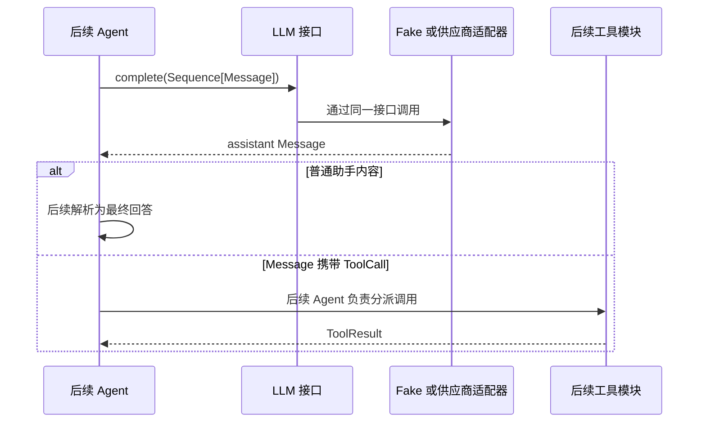

# Day 5：LLM 模块代码导读

> 阅读目标：能讲清楚模型调用接缝为什么只接收 `Message` 序列并返回一条
> assistant `Message`，Fake LLM 如何支持确定性测试，以及哪些职责明确不在
> LLM 模块中。

## 目录与职责

```text
src/self_react/
  models.py       # Message、ToolCall 等跨模块领域数据
  llm.py          # LLM 接口、稳定错误与 FakeLLM 适配器
tests/
  test_llm.py     # 只通过公开接口验证输入、输出、顺序、历史与错误
```

`models.py` 定义“跨模块传递什么”，`llm.py` 定义“怎样请求一次模型决策”。
LLM 模块复用已有 `Message` 和 `ToolCall`，没有再创建 `LLMRequest`、
`LLMResponse` 或另一套工具调用类型。这样 Agent 以后可以把
`AgentState.messages` 直接交给 LLM，也可以把返回的 assistant `Message`
直接追加到上下文。

## 接口所在的接缝

`LLM` 是带 `@runtime_checkable` 的 `Protocol`，只公开一个入口：

```python
def complete(self, messages: Sequence[Message]) -> Message: ...
```

这个接口包含的不只是类型标注，还包括以下调用约束：

| 约束 | 公开行为 |
| --- | --- |
| 输入 | 至少一条已经通过领域模型校验的 `Message`；列表和元组都可用 |
| 输入所有权 | 适配器不能修改调用方提供的序列或消息 |
| 输出 | 一条 `role=assistant` 的 `Message`，可以是普通内容，也可以携带 `ToolCall` |
| 工具语义 | `ToolCall` 只是模型请求，不表示工具已经执行 |
| 错误 | 非法上下文、非法响应和 Fake 响应耗尽使用稳定异常类型表示 |

选择 `Protocol` 是因为这里存在两个确定的适配方向：测试使用 `FakeLLM`，Day 6
开始的真实供应商模块实现同一接口。Agent 只需要结构化类型约束，不需要继承某个
基类或知道适配器构造参数。

`runtime_checkable` 只检查对象是否具有所需方法，不能验证完整方法签名、返回角色
或方法内部是否访问网络。类型检查器负责静态签名检查；每个适配器负责把供应商
响应转换成合法 assistant `Message`，公开行为测试负责验证运行时不变量。

## 数据流



图中的后半段是后续模块的消费位置，不代表 Day 5 已实现 Agent、解析器或工具。
LLM 层到返回 assistant `Message` 为止：它不执行 `ToolCall`，不构造
`ToolResult`，不把结果转成 `Observation`，也不修改 `AgentState`。

普通 assistant 内容目前也不自动成为 `FinalAnswer`。Day 10 至 Day 11 的输出格式
与解析器会决定一条模型消息怎样转换为 `FinalAnswer | ToolCall`；提前在 LLM 层
做这个判断，会把供应商适配和循环决策耦合在一起。

## Fake LLM 如何工作

`FakeLLM` 构造时接收 `Sequence[Message]`，逐项确认响应确实是 assistant
`Message`，然后保存深拷贝。空响应序列是合法配置，用于直接测试耗尽分支。

一次 `complete()` 调用按以下顺序执行：

1. 确认输入是非空 `Message` 序列。
2. 深拷贝输入并追加到调用历史。
3. 检查响应队列是否耗尽。
4. 按游标取下一条响应，移动游标并返回新的深拷贝。

输入和响应都使用深拷贝，是因为 Pydantic 模型当前允许赋值。调用方在调用后修改
原消息，或者修改 Fake 返回的消息，都不能倒过来改变测试预置值和历史。`calls`
属性再次返回深拷贝，测试本身修改读取结果也不会污染 Fake 内部状态。

响应耗尽的合法调用会计入 `call_count` 和 `calls`。这让测试可以同时回答两个
问题：Agent 实际尝试调用了多少次，以及 Fake 是否还有足够的预置响应。非法输入
在记录历史和消费响应之前失败，因此不会伪造一次模型调用。

调用历史和响应游标是测试适配器的运行时状态，不是 ReAct 领域状态。它们不得写入
`AgentState`；需要诊断调用时，通过 Fake 的公开只读快照访问即可。

## 错误类型

```text
LLMError
├── LLMInputError
├── LLMResponseError
└── LLMResponseExhaustedError
```

- `LLMInputError`：调用上下文为空、不是 `Sequence`，或包含非 `Message` 元素。
- `LLMResponseError`：Fake 预置项不是 `Message`，或响应角色不是 assistant。
- `LLMResponseExhaustedError`：有效调用已没有下一条预置响应。

测试只依赖异常类型，不匹配中文错误文本。这样提示可以继续改进，调用方的控制流
仍保持稳定。LLM 错误也不直接等于 `TerminationReason`：未来由 Agent 决定是否
记录、转换或终止，LLM 模块不会私自重试。

## 测试组织

[`test_llm.py`](../../tests/test_llm.py) 从接口观察行为：

- 普通 assistant 内容按预期返回，元组输入可用，输入和输出修改不污染快照；
- 携带 `ToolCall` 的响应保持原样返回，不产生工具执行副作用；
- 多条预置响应严格按顺序消费，耗尽时抛出稳定错误；
- 空上下文、非 `Message` 输入、错误响应角色和错误响应类型被拒绝；
- 一个没有继承项目基类的独立适配器也能结构化满足 `LLM`。

这些测试没有读取 `_responses`、`_next_response_index` 或 `_calls`，因此 Fake 的
内部容器以后可以替换，调用方测试无需跟随修改。

## Day 6 的供应商适配位置

真实适配器应作为新的 `LLM` 实现放在 LLM 相关模块中，负责：

1. 从外部配置接收客户端或必要配置，而不是在领域状态中查找密钥；
2. 把 `Sequence[Message]` 转成供应商请求格式；
3. 发起一次模型请求；
4. 把供应商响应转换成合法 assistant `Message`；
5. 把供应商调用或响应错误转换成稳定的 LLM 层错误。

真实适配器仍不能执行工具、修改 Agent 状态或自行决定循环重试。Fake 与真实适配器
应共享 `LLM` 接口，但不会共享 Fake 的 `responses`、`calls` 或 `call_count` 字段。

## 最小动手验证

```python
from self_react.llm import FakeLLM
from self_react.models import Message, MessageRole

llm = FakeLLM(
    [
        Message(role=MessageRole.ASSISTANT, content="确定性回答"),
    ]
)
response = llm.complete((Message(role=MessageRole.USER, content="测试"),))

print(response.content)  # 确定性回答
print(llm.call_count)  # 1
```

把第二个 `complete()` 调用加到示例中，会得到
`LLMResponseExhaustedError`，且 `call_count` 变为 `2`。这正是后续 Agent 测试可用
来发现意外额外模型调用的确定性信号。
