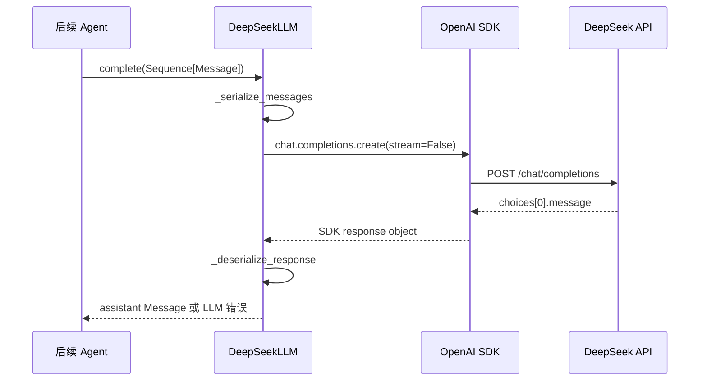
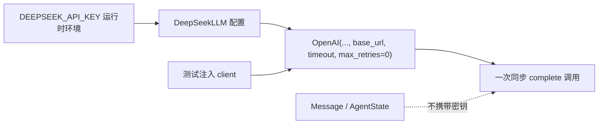
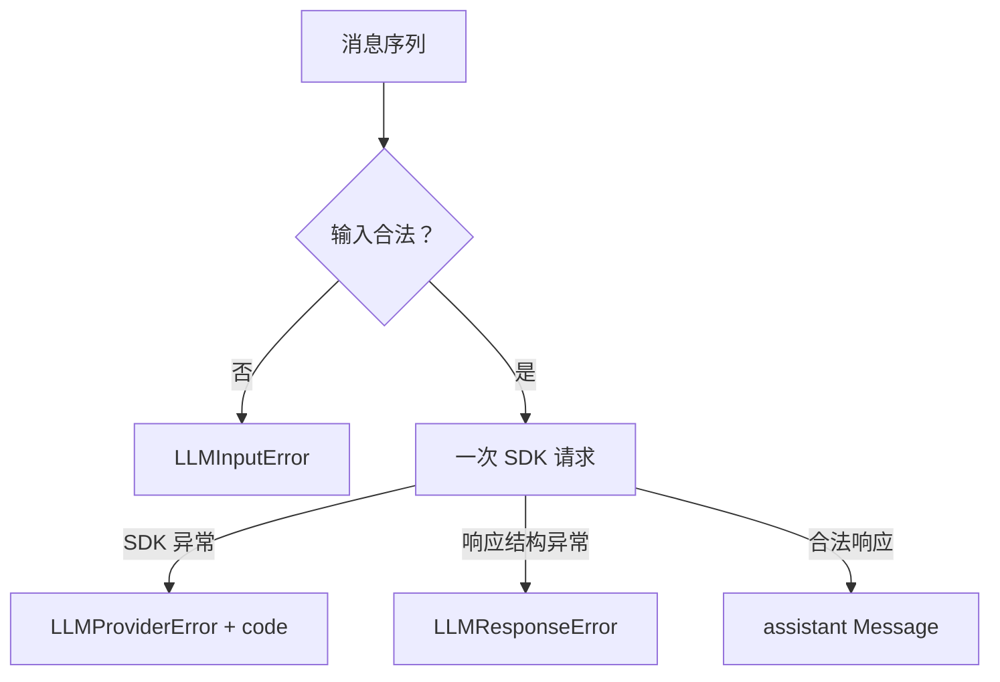

# Day 6：DeepSeek 适配器代码导读

> 阅读目标：理解 DeepSeekLLM 如何守住 Day 5 的 LLM 接口，完成领域消息与 OpenAI 兼容请求之间的双向转换，并把供应商失败压缩为稳定的 LLM 层错误。

## 目录与职责

```text
src/self_react/
  models.py       # Message、ToolCall 与 tool 消息关联
  llm.py          # LLM Protocol、FakeLLM 与稳定错误基类
  deepseek.py     # DeepSeek/OpenAI Chat Completions 适配器
tests/
  test_deepseek.py # 注入客户端的离线请求/响应测试
examples/
  deepseek_chat.py # 显式真实调用入口
```

适配器的公开接缝仍然是：

```python
def complete(self, messages: Sequence[Message]) -> Message: ...
```

DeepSeekLLM 不继承 FakeLLM，也不要求调用方知道 OpenAI SDK 的响应类。调用方只看到一条 assistant Message 或 LLM 层稳定异常。

## 端到端数据流



这张图只覆盖一次模型调用。若返回 assistant tool_calls，适配器仍然在最后一步停止；工具执行、ToolResult、Observation 和下一轮调用由未来 Agent 负责。

## 配置流



构造函数先校验 model、base_url 和 timeout。没有注入客户端时才读取 DEEPSEEK_API_KEY；没有密钥会得到 LLMConfigurationError。注入客户端后不需要密钥，便于测试完全离线运行。

## 请求转换：Message 到供应商字典

_serialize_messages 的职责是输入闸门和格式转换：

1. 拒绝字符串、空序列和非 Message 元素，错误类型为 LLMInputError。
2. 对每条 Message 做深拷贝后再生成普通字典，调用方修改原对象不会改变已构造请求。
3. system、user、assistant、tool 使用相同的 role 字符串值。
4. assistant 的 ToolCall 映射为 id、type=function、function.name 和 JSON 字符串 arguments。
5. tool 消息追加 tool_call_id，保持与 assistant 请求编号的关联。

对应的供应商请求形状是：

```json
{
  "role": "assistant",
  "content": "",
  "tool_calls": [
    {
      "id": "call-1",
      "type": "function",
      "function": {"name": "calculator", "arguments": "{\"expression\":\"2 + 2\"}"}
    }
  ]
}
```

适配器没有 tools 参数，因为 Day 6 只负责传递已有消息中的工具调用；工具定义和注册表属于 Day 7。

## 响应转换：供应商对象到 assistant Message

_deserialize_response 依次检查：

- choices 是非空序列；
- 第一项存在 message，且 role 等于 assistant；
- content 是字符串或 null；null 被规范化为空字符串；
- tool_calls 是序列，每个调用都有字符串 id、函数名和 JSON 对象 arguments；
- 最后交给 Day 4 Message 和 ToolCall 校验器，拒绝空决策、重复调用编号或非法字段。

因此普通响应得到 assistant Message(content=...)，只有工具调用的响应得到 content 为空且携带 ToolCall 的 assistant Message。响应中的 ToolCall 不会在本模块执行。

## 错误边界



SDK 异常只映射为 AUTHENTICATION、TIMEOUT、CONNECTION、RATE_LIMIT、BAD_REQUEST、SERVICE 或 UNKNOWN。错误消息不包含 SDK 原始文本、请求头、响应体或密钥；适配器也固定 max_retries=0，不在 LLM 层启动重试循环。

## 测试替身与真实调用位置

tests/test_deepseek.py 的 RecordingClient 只实现 chat.completions.create，并记录 model、messages 和 stream。它可以断言完整请求字典，也可以返回普通回答、tool_calls 或非法结构，因此测试不需要 OpenAI 网络客户端。

examples/deepseek_chat.py 是唯一的最小真实调用入口。它在调用前检查 DEEPSEEK_API_KEY，成功时只输出 assistant_message 或 assistant_tool_calls 数量，失败时只输出稳定异常类名。默认 CLI、pytest 和模块导入路径不会触发它。

## 阅读后的边界检查

- 如果看到 ToolCall，不要在 deepseek.py 中执行工具；它仍只是 assistant Message 的数据。
- 如果看到供应商异常，不要把原始异常文本放进 AgentState；只让 Agent 决定如何处理稳定 LLM 错误。
- 如果需要新增流式、异步或供应商特有字段，先确认是否超出 Issue #11，而不是扩张 LLM.complete 接缝。

## 与后续 Day 7 的连接

Day 7 可以消费 DeepSeekLLM 返回的 ToolCall，使用工具注册表执行并构造 ToolResult，再通过 Observation.as_message() 追加到下一次 complete 的消息序列。这个连接不要求修改 DeepSeekLLM，也不要求工具模块了解 OpenAI SDK。
