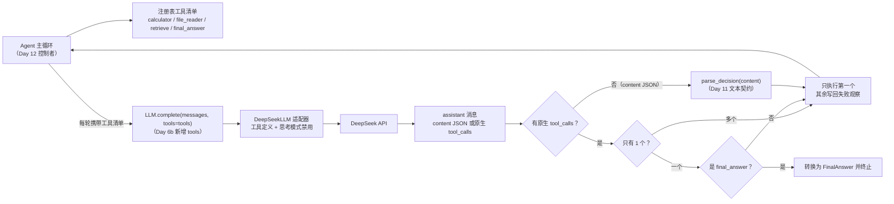
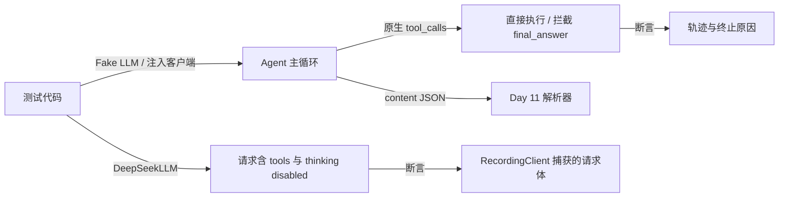
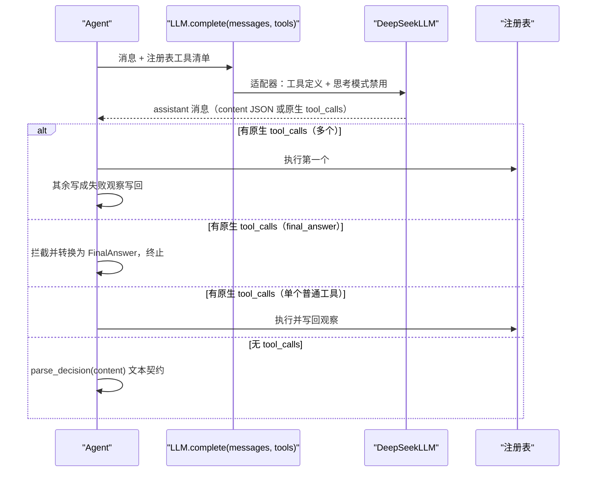

# Day 6b：DeepSeek 原生工具调用代码导读（模型适配补全）

> 这篇文档怎么读（先看森林，再看树木）：
> - **第 0 步**：只看图，先建立整体印象，不要急着看代码；
> - **第 1 步**：认识"原生工具调用"要解决的两个 API 硬约束；
> - **第 2 步**：打开代码，按小节顺序逐段读；
> - **第 3 步**：看测试如何验证，最后回到森林图复查。

## 0. 先看森林：这一章到底在做什么

### 0.1 用大白话讲

Day 15 把命令行入口接上了真实 DeepSeek，但第一次真实调用就失败：任务跑
第一轮没问题，一旦工具执行完、要把结果送回模型，API 就报 400。逐层诊断
发现 DeepSeek 有两条"家规"：

1. **工具结果消息前面必须有一条原生工具调用消息**。模型说"我要调用计算器"
   这件事，必须写成 API 规定的 `tool_calls` 格式；我们之前把这句话写在
   文本里（`content` JSON），API 不认，于是拒绝后续的工具结果消息。
2. **思考模式下，模型的"草稿"（`reasoning_content`）必须原样送回去**。
   我们只保留模型最终输出的 JSON，把草稿丢了，下一轮又被拒绝。

Day 6b 的修复方向很直接：**跟 API 讲同一种语言**——请求里带上工具定义
（`tools`）、关掉思考模式、直接消费模型返回的原生 `tool_calls`。同时，真实
模型还暴露出两个需要框架显式约束的行为：它喜欢一次请求多个工具（并行），
还会把提示词里的 `final_answer` 当成一个工具来调用。今天分别用"提示词 +
防御分支"和"特殊工具拦截"把它们收进现有边界。

### 0.2 森林全景图



读法：从左上往右下。**今天的新增集中在两条路**：`LLM.complete` 的 `tools`
参数（左边），以及 `Raw -> Native -> Single/Final -> Exec/Answer` 的分流
（中间）。右下角"执行并写回观察"是 Day 12 就有的路径，今天只是让它也能
消费原生 `tool_calls`。

### 0.3 一句话预告

一次真实模型的完整运行做四件事：

1. **带清单问模型**：`Agent` 把注册表工具清单传给 `LLM.complete`；
2. **翻译成 API 的语言**：DeepSeek 适配器把工具清单变成 `tools` 定义，
   并禁用思考模式；
3. **拆响应**：有原生 `tool_calls` 直接执行（多调用只执行第一个，其余
   写回失败观察；`final_answer` 拦截成最终回答），没有则继续走 Day 11
   的文本 JSON 解析；
4. **回到循环**：观察写回后继续，直到最终回答、解析失败或步数耗尽。

同时，今天**坚决不做**四件事：

- **不引入并行工具调度**：每轮仍只有一个决策，多余的调用折叠成失败观察；
- **不修改领域模型**：`Decision`、`TraceStep`、`AgentState` 全部原样；
- **不把工具执行塞进适配器**：适配器只做翻译，执行仍归注册表；
- **不放弃文本 JSON 契约**：Fake LLM 与既有测试路径完全不变。

### 0.4 名词小词典（遇到不懂的词回来查）

| 名词 | 大白话解释 |
| --- | --- |
| 原生工具调用（native tool calls） | API 规定的 `tool_calls` 结构：`id` + `type` + `function.name/arguments` |
| 工具定义（tool definitions） | 请求里告诉模型"有哪些工具、各叫什么、做什么"的清单 |
| 思考模式（thinking mode） | DeepSeek 让模型先"打草稿"再回答的模式，草稿叫 `reasoning_content` |
| `reasoning_content` | 思考模式的草稿字段，DeepSeek 要求后续请求原样带回 |
| 特殊工具（special tool） | 不代表外部动作、由 Agent 拦截处理的工具，如 `final_answer` |
| 防御分支（defensive branch） | 为模型越界行为准备的兜底处理路径 |

## 1. 认识新模块

Day 6b 新增 1 个文件（`final_answer.py`），改动 6 个已有文件。对照表：

| 文件 | 改了什么 | 为什么 |
| --- | --- | --- |
| `llm.py` | `complete` 增加可选 `tools` 参数；Fake LLM 记录工具清单 | 适配器需要工具定义，Agent 负责提供 |
| `deepseek.py` | 序列化工具定义、默认禁用思考模式 | 满足 DeepSeek 两个 API 硬约束 |
| `agent.py` | 消费原生 `tool_calls`、处理多调用与 `final_answer` 拦截 | 让主循环理解模型的原生输出 |
| `tools/final_answer.py`（新增） | `FinalAnswerTool` 特殊工具 | 让"结束对话"成为模型可调用的显式动作 |
| `tools/__init__.py`、`cli.py` | 登记 `FinalAnswerTool` | 真实 CLI 的注册表包含全部可调用工具 |
| `prompts.py` | 明确"每轮只能输出一个 tool_call" | 约束模型的并行倾向 |

### 1.1 两条最终回答路径对照表

| 模型交付形态 | 处理位置 | 结果 |
| --- | --- | --- |
| `content` 里是 `{"kind": "final_answer", ...}` | `parse_decision`（Day 11） | `FinalAnswer` 决策并终止 |
| 原生 `tool_calls` 调用 `final_answer` | Agent 分派前拦截 | 转换为 `FinalAnswer` 并终止 |
| 原生 `tool_calls` 调用普通工具 | 注册表执行 | `ToolResult` -> 观察写回 |
| 原生 `tool_calls` 一次返回多个 | Agent 防御分支 | 执行第一个，其余写回失败观察 |

## 2. 进入树木：按这个顺序读代码

建议顺序：

1. [`llm.py`](../../src/self_react/llm.py)（只看 `complete` 签名与 Fake 记录）；
2. [`deepseek.py`](../../src/self_react/deepseek.py)（工具序列化与请求参数）；
3. [`agent.py`](../../src/self_react/agent.py)（原生调用分流与拦截）；
4. [`tools/final_answer.py`](../../src/self_react/tools/final_answer.py)（特殊工具）；
5. [`prompts.py`](../../src/self_react/prompts.py)（输出规则第 3 条）；
6. [`test_deepseek.py`](../../tests/test_deepseek.py) 与
   [`test_agent.py`](../../tests/test_agent.py)（考官）。

读代码时脑子里记着四个问题（这就是本段的骨架）：

1. 工具定义从哪来、由谁转换成 API 格式？
2. 为什么默认禁用思考模式？
3. 多个原生 `tool_calls` 时，Agent 怎么保住"每轮一个决策"？
4. `final_answer` 为什么必须是注册表里的工具，而不是注册表外的特判？

### 2.1 第一站：LLM 接口多了一个 `tools`

```python
def complete(
    self,
    messages: Sequence[Message],
    *,
    tools: Sequence[object] | None = None,
) -> Message: ...
```

`tools` 是可选参数：供应商适配器需要它来生成工具定义，Fake LLM 只做记录。
`Agent` 每轮都把自己的注册表工具清单传进去，因此适配器不用自己感知注册表，
接口边界保持干净。

Fake LLM 的 `calls_with_tools` 把每次调用的消息快照和工具清单一起保存，
测试可以用它断言"工具清单确实传给了 LLM"：

```python
@property
def calls_with_tools(self):
    return tuple(
        (
            tuple(message.model_copy(deep=True) for message in messages),
            tools,
        )
        for messages, tools in self._calls_with_tools
    )
```

### 2.2 第二站：DeepSeek 适配器生成工具定义

```python
def _serialize_tools(tools: Sequence[object]) -> list[dict[str, Any]]:
    serialized: list[dict[str, Any]] = []
    seen: set[str] = set()
    for tool in tools:
        name = _tool_name(tool)
        if name in seen:
            raise LLMInputError(f"工具定义重复：{name}")
        seen.add(name)
        serialized.append(
            {
                "type": "function",
                "function": {
                    "name": name,
                    "description": _tool_description(tool),
                    "parameters": {"type": "object", "properties": {}},
                },
            }
        )
    return serialized
```

每个工具变成一个 OpenAI/DeepSeek 风格的 function 定义。`parameters` 故意
用宽松的 `{"type": "object", "properties": {}}`：参数长什么样由各工具的
`description` 说明，实际校验由 Day 7 注册表在边界完成，适配器不复制工具
业务逻辑。

### 2.3 第三站：默认禁用思考模式

```python
DEFAULT_THINKING_DISABLED = True

def __init__(self, *, ..., thinking_disabled: bool = DEFAULT_THINKING_DISABLED, ...):
    self.thinking_disabled = bool(thinking_disabled)

def complete(self, messages, *, tools=None):
    ...
    extra_body: dict[str, Any] = {}
    if self.thinking_disabled:
        extra_body["thinking"] = {"type": "disabled"}
    response = self._client.chat.completions.create(
        model=self.model,
        messages=payload,
        stream=False,
        tools=serialized_tools,
        extra_body=extra_body,
    )
```

为什么默认关掉思考模式？因为思考模式会在响应里带 `reasoning_content`，
DeepSeek 要求后续请求原样带回；我们的契约只保留模型最终输出的 `content`，
无法保证草稿完整往返。关掉后响应不再有 `reasoning_content`，多轮工具调用
就能通过。`thinking_disabled=False` 保留为显式配置，未来若要做思考模式
往返再补字段。

### 2.4 第四站：Agent 消费原生 `tool_calls`

```python
if response.tool_calls:
    if len(response.tool_calls) > 1:
        # 只执行第一个，其余写成可恢复失败观察并写回消息
        decision = response.tool_calls[0]
        result = self._registry.execute(decision)
        observation = Observation.from_tool_result(result)
        messages.append(observation.as_message())
        for extra_call in response.tool_calls[1:]:
            messages.append(
                Observation(
                    tool_call_id=extra_call.call_id,
                    tool_name=extra_call.name,
                    content="本轮只执行了一个工具；请在后续轮次再请求该工具",
                    is_error=True,
                    error_code=ToolErrorCode.TOOL_EXECUTION_ERROR,
                    retryable=True,
                ).as_message()
            )
        ...
        continue
    decision = response.tool_calls[0]
else:
    decision = parse_decision(response.content)
```

两个关键点：

1. **单工具调用**直接作为决策，不经过文本 JSON 解析——这就是"原生与文本
   双轨"的分叉点；
2. **多工具调用**只执行第一个：领域模型每轮只支持一个决策，其余调用写成
   可恢复失败观察并写回消息。这既满足 DeepSeek"每个 `tool_call_id` 都要
   有响应"的约束，又提示模型把其余工具留到后续轮次。

### 2.5 第五站：`final_answer` 拦截

```python
if decision.name == FinalAnswerTool.name:
    content = decision.arguments.get("content")
    if not isinstance(content, str) or not content.strip():
        content = "（无内容）"
    answer = FinalAnswer(content=content)
    messages.append(
        Observation(
            tool_call_id=decision.call_id,
            tool_name=FinalAnswerTool.name,
            content=content,
            is_error=False,
        ).as_message()
    )
    step = TraceStep(..., decision=answer, ...)
    state = self._rebuild_state(..., final_answer=answer,
                                termination_reason=TerminationReason.FINAL_ANSWER)
    break
```

真实模型在原生工具模式下会把 `final_answer` 当成工具调用。这里在分派到
注册表**之前**拦截：把调用转换为 `FinalAnswer` 决策、终止循环，同时写回
一条 tool 消息（`tool_call_id` 有响应），保持 API 历史完整。轨迹步骤只
记录 `FinalAnswer` 决策，不伪造工具观察。

为什么要把 `final_answer` 注册成工具而不是在 Agent 里硬编码字符串判断？
因为模型只有从请求的 `tools` 列表和提示词里看到这个名字，才会把它当作
合法动作；注册成工具让它在工具定义、提示词和拦截逻辑三处保持一致，也避免
"模型想结束对话却被告知未知工具"的尴尬。

### 2.6 第六站：特殊工具类与提示词约束

```python
class FinalAnswerTool:
    name = "final_answer"
    description = (
        "任务完成时使用本工具结束对话并交付最终回答。"
        "参数 content 是给用户的最终回答文本。"
    )

    def execute(self, arguments: JsonObject) -> str:
        content = arguments.get("content")
        if not isinstance(content, str) or not content.strip():
            return "（无内容）"
        return content
```

`FinalAnswerTool` 满足 `Tool` 协议（所以能注册进注册表），但它的 `execute`
在正常流程中不会被调用——Agent 在分派前就拦截了。它更像一个"路标"：告诉
模型（和读者）"结束对话"也是一种可以请求的动作。

提示词输出规则同时约束模型的并行倾向：

```text
3. 每轮只能输出一个 tool_call；即使需要多个工具，也要分多轮依次请求，
   等待前一个工具的结果返回后再请求下一个。
```

提示词是软约束，Agent 的防御分支是硬兜底，两者配合才能稳定处理真实模型的
随机行为。

### 2.7 真实运行结果

```powershell
uv run self-react run "计算 2 + 2，并检索 react 主题" --model deepseek --show-trace
```

```text
最终回答：结果如下：

1. **计算 2 + 2**：结果是 **4**。

2. **react 主题检索**：ReAct（Reason + Act）是一种让模型推理与行动交错的智能体范式，由 Yao 等人在 2022 年提出：模型先用推理规划，再执行动作获取新信息。

任务：计算 2 + 2，并检索 react 主题
终止原因：最终回答（FINAL_ANSWER）
步数：3 / 5

第 1 步
输入摘要：计算 2 + 2，并检索 react 主题
决策：调用工具 calculator
调用编号：call_00_LoXK5iMESZPUEPHvND0M5621
参数：{"expression": "2 + 2"}
观察（成功）：4
耗时：2258.042 毫秒

第 2 步
输入摘要：本轮只执行了一个工具；请在后续轮次再请求该工具
决策：调用工具 retrieve
调用编号：call_00_nqKwmuJM5kEmeuREa6lX2322
参数：{"query": "react"}
观察（成功）：ReAct（Reason + Act）是一种让模型推理与行动交错的智能体范式，由 Yao 等人在 2022 年提出：模型先用推理规划，再执行动作获取新信息。
耗时：1476.686 毫秒

第 3 步
输入摘要：ReAct（Reason + Act）是一种让模型推理与行动交错的智能体范式，由 Yao 等人在 2022 年提出：模型先用推理规划，再执行动作获取新信息。
决策：最终回答
回答内容：结果如下：……
耗时：1625.233 毫秒
```

注意第 2 步的输入摘要正是"本轮只执行了一个工具；请在后续轮次再请求该
工具"——模型第一轮并行请求了两个工具，Agent 执行了第一个，把这个提示写回
消息，模型第二轮正确地只请求了 retrieve。真实模型的最终回答最终以
`content` JSON 交付，被 Day 11 解析器正常解析。

## 3. 考官怎么看（测试）

Day 6b 新增 8 个用例，全部使用 Fake LLM 与注入客户端，不访问网络。最代表
性的几组：

1. **DeepSeek 请求断言**（`test_deepseek.py`）：传入工具清单后，断言请求
   `tools` 是预期 function 定义、`extra_body` 是
   `{"thinking": {"type": "disabled"}}`；`thinking_disabled=False` 时
   `extra_body` 为空。
2. **Agent 原生调用**（`test_agent.py`）：assistant 消息带单个原生
   `tool_calls` 时直接执行并写回观察；带两个时只执行第一个，第二个得到
   失败观察且两个 `tool_call_id` 都有 tool 消息。
3. **final_answer 拦截**：模型调用 `final_answer` 工具后，终态带
   `FinalAnswer`、终止原因为 `FINAL_ANSWER`，tool 消息回指调用编号。
4. **工具清单透传**：`FakeLLM.calls_with_tools` 断言四个工具
   （calculator/file_reader/final_answer/retrieve）都传给了 LLM。
5. **提示词约束**：渲染结果包含"每轮只能请求调用一个工具"。



## 4. 回到森林：把整条路再走一遍



"原生与文本双轨、每轮一个决策"的检查清单：

- 工具定义：由 Agent 提供、适配器序列化，适配器不感知注册表；
- 思考模式：默认禁用，避免 `reasoning_content` 往返；
- 多调用：只执行第一个，其余写回失败观察，历史完整；
- `final_answer`：注册为工具、分派前拦截，转换为 `FinalAnswer`；
- 文本契约：`content` JSON 仍走 Day 11 解析器，Fake LLM 路径不变。

自测题（能答上来就算学会）：

1. `LLM.complete` 的 `tools` 参数是谁提供的、由谁序列化成 API 格式？
2. 为什么默认禁用 DeepSeek 思考模式？
3. 模型一次返回三个工具调用，Agent 会怎么处理？
4. `final_answer` 为什么必须注册成工具？拦截后为什么还要写回 tool 消息？
5. 文本 JSON 契约（Fake LLM 路径）有没有被破坏？

自测题参考答案（先自己写，再对照）：

1. **`Agent` 每轮把注册表工具清单传给 `LLM.complete`；DeepSeek 适配器用
   `_serialize_tools` 序列化成 API 的 function 定义。** 接口只传"工具对象
   序列"，适配器负责供应商格式，Fake LLM 只记录不解释。
2. **思考模式返回 `reasoning_content`，DeepSeek 要求后续请求原样带回；
   我们的契约只保留 `content`，无法保证草稿往返。** 禁用后响应不再带
   该字段，多轮工具调用即可通过；`thinking_disabled=False` 保留给未来
   补齐字段往返的场景。
3. **只执行第一个并写回真实结果；第二个、第三个写成
   "本轮只执行了一个工具；请在后续轮次再请求该工具"的可恢复失败观察并写回
   消息。** 这样 API 历史里每个 `tool_call_id` 都有响应，模型下一轮继续
   请求剩余工具。
4. **因为模型只有从 `tools` 列表和提示词里看到这个名字，才会把它当作合法
   动作。** 注册成工具让三处一致；拦截后写回 tool 消息是为了满足
   "每个 `tool_call_id` 都要有响应"的 API 约束，历史不残缺。
5. **没有。** `content` 里的 JSON 仍走 `parse_decision`；Fake LLM 路径、
   Day 10/11 的既有测试全部原样通过，`response.tool_calls` 为空时才走文本
   解析。

## 5. 与 Day 16 的连接

Day 16 会基于现在可用的真实模型链路编写端到端示例：单工具、多工具、工具
失败后恢复。到时可以直接运行
`self-react run "任务" --model deepseek --show-trace` 观察完整轨迹；如果
真实模型暴露出新的随机行为（例如再次尝试并行调用），Agent 的防御分支已经
提供了兜底，示例文档只需记录实际观察到的形态。
