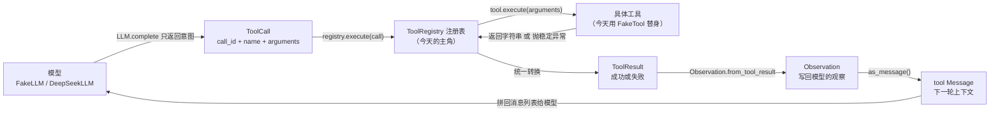
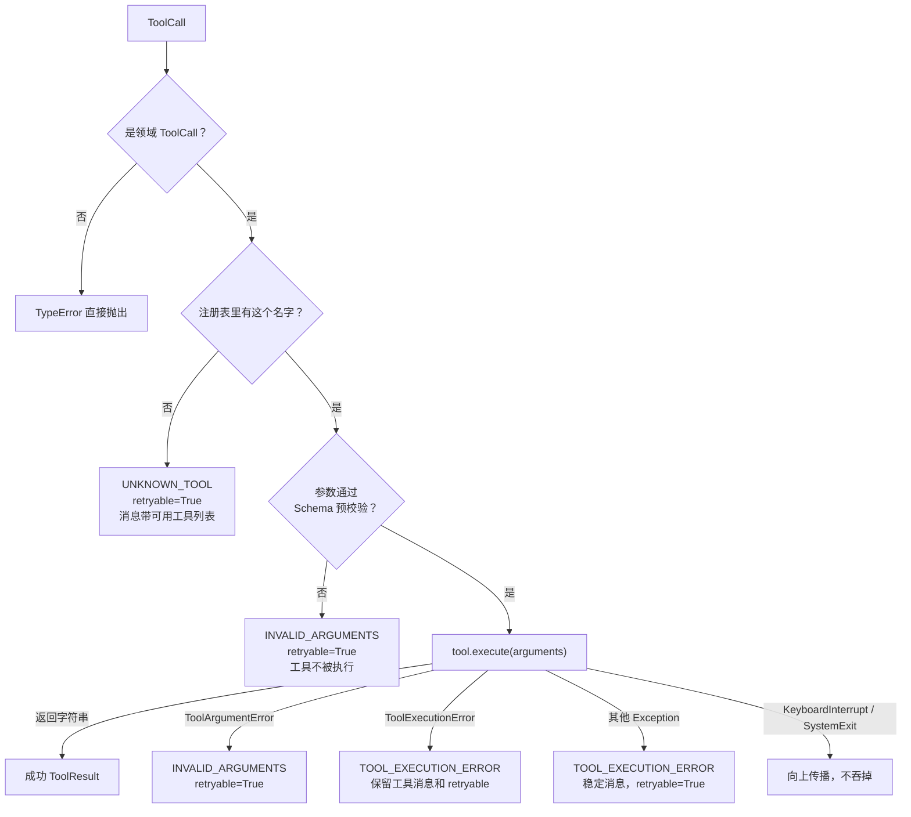
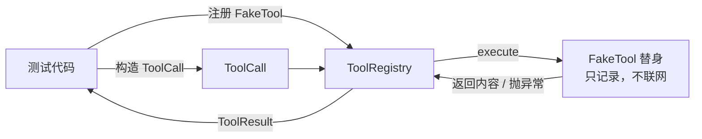
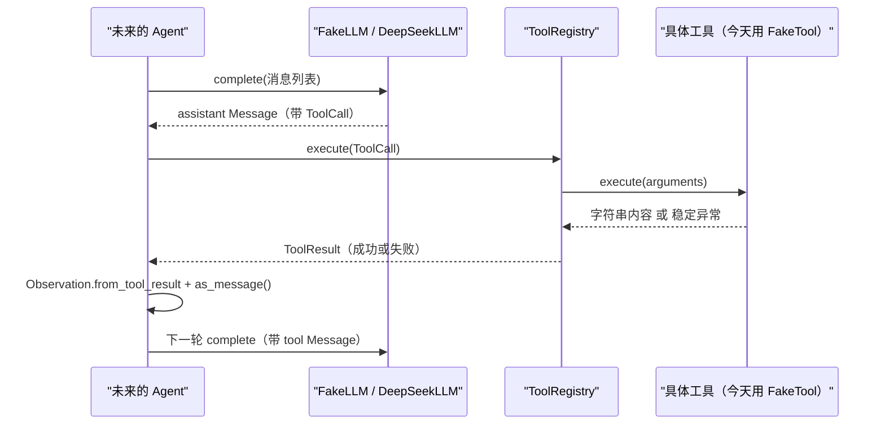

# Day 7：工具层代码导读

> 这篇文档怎么读（先看森林，再看树木）：
> - **第 0 步**：只看图，先建立整体印象，不要急着看代码；
> - **第 1 步**：认识协议、注册表和三种异常的职责分工；
> - **第 2 步**：打开代码，按小节顺序逐段读；
> - **第 3 步**：看测试如何验证，最后回到森林图复查。

## 0. 先看森林：这一章到底在做什么

### 0.1 用大白话讲

前几天，项目已经有了"普通话"数据（`Message`、`ToolCall`、`ToolResult`），
也有了"翻译官"（FakeLLM / DeepSeekLLM）。但翻译官只负责转达模型的意图：
模型说"我想调用计算器"，翻译官就把这个意图装进 `ToolCall` 交出来。真正
去"按计算器"的人还没有出现。

今天要雇两个新角色：

- **工具协议（合同）**：规定任何工具必须长什么样——叫什么名字、怎么向模型
  介绍自己、怎么执行。
- **工具注册表（花名册 + 传达室）**：把允许使用的工具登记在一本名册里，
  收到 `ToolCall` 时按名字查册子。查得到就放进去执行，查不到就退回一张
  写清楚错误码的回执，绝不去外面"临时找人"（不按名字动态导入代码）。

这本名册还要统一"回执格式"：成功、参数不对、工具自己报错、工具抛了意料
之外的异常，全部写成同一种 `ToolResult`，带稳定的错误码和"是否值得再试"
（`retryable`）。这样未来的 Agent 只需要看错误码做决定，不用匹配异常文本。

### 0.2 森林全景图



读法：从左上往右下看。**今天只关注中间这一列**：`ToolRegistry` 怎样把
`ToolCall` 变成 `ToolResult`。左边和右下是已经存在的模块，只是用来展示
未来的消费位置。

### 0.3 一句话预告：注册表只做三件事（Day 23 起多一道 Schema 安检）

一次 `execute` 调用只做三件事：

1. **查名册**：按 `ToolCall.name` 精确查找，找不到就返回 `UNKNOWN_TOOL`；
2. **执行并转换**：调用工具的 `execute`，把字符串内容或异常统一变成
   `ToolResult`；
3. **守边界**：系统级取消或退出（`KeyboardInterrupt`、`SystemExit`）
   继续向上传播，不吞掉。

Day 23（R-03）在这三步之间多了一道**安检**：找到工具后、执行之前，先按
工具声明的参数 JSON Schema 预校验 `call.arguments`，非法参数在注册表
边界以 `INVALID_ARGUMENTS` 被拒，工具根本不会被调用。详见
[第 6 节](#6-day-23-增补r-03schema-预校验)。

同时，工具层**坚决不做**三件事：

- **不执行动态名称**：模型给的任何字符串都只是名字，不是代码；
- **不把工具/密钥写进状态**：`ToolResult`、`Message`、`AgentState` 里
  永远只有可序列化数据；
- **不替 Agent 决定循环**：工具失败会不会结束运行，由未来的控制器判断。

### 0.4 名词小词典（遇到不懂的词回来查）

| 名词 | 大白话解释 |
| --- | --- |
| 协议（Protocol） | 双方约定的"合同"：你必须有这些字段和方法 |
| 注册表（registry） | 一本"花名册"，只允许用登记过的名字 |
| 替身（test double） | 长得像真工具、但行为完全可控的测试专用替代品 |
| 边界（boundary） | 模块之间的"门"：所有进出都走同一个入口 |
| 错误码（error code） | 固定的错误分类，如 `INVALID_ARGUMENTS` |
| 可重试（retryable） | 这次失败是否值得让模型换一种方式再试 |
| 序列化（serialize） | 把对象转成能安全保存/传输的 JSON 数据 |
| 领域对象（domain object） | 项目自己的"普通话"数据类型，如 `ToolCall`、`ToolResult` |

## 1. 认识两个角色：协议和注册表

### 1.1 `Tool` 协议（合同）

协议只规定"长什么样"，不规定"怎么实现"：

```python
@runtime_checkable
class Tool(Protocol):
    name: str
    description: str

    def execute(self, arguments: JsonObject) -> str: ...
```

三个成员的含义：

| 成员 | 作用 | 谁消费 |
| --- | --- | --- |
| `name` | 精确名称，注册表用它在花名册里查人 | `ToolRegistry` |
| `description` | 给模型的介绍，告诉模型这个工具能干什么 | 未来的提示词（Day 10） |
| `execute(arguments)` | 真正执行，返回模型可读的字符串 | `ToolRegistry` |

`execute` 只接收参数字典，不接收整个 `ToolCall`。调用编号和工具名由注册表
保管，工具不需要知道"我是被哪一次调用请来的"，这样工具没法伪造关联。

### 1.2 `ToolRegistry`（花名册 + 传达室）

注册表内部只有一本字典：`{"工具名": 工具对象}`。四个公开能力：

| 方法/属性 | 行为 |
| --- | --- |
| `register(tool)` | 检查合同和名称，登记进字典；重复或空名称当场拒绝 |
| `execute(call)` | 唯一执行大门：`ToolCall` 进，`ToolResult` 出；Day 23 起先按参数 Schema 预校验，非法参数以 `INVALID_ARGUMENTS` 被拒 |
| `get(name)` / `names` / `in` | 只读查询，方便外部了解有哪些工具 |

字典查找就是"精确名称查找"的全部实现：`call.name` 不匹配任何键就返回
`UNKNOWN_TOOL`，永远不会把名字当代码执行。

### 1.3 三种稳定异常

```text
ToolArgumentError      -> INVALID_ARGUMENTS       （参数不对，模型可改）
ToolExecutionError     -> TOOL_EXECUTION_ERROR    （业务失败，带 retryable）
ToolRegistrationError  -> 注册时抛出给调用方       （合同或名称不合格）
```

前两个由工具在执行时抛出，注册表负责"接住并翻译"；第三个是注册表自己在
`register` 时抛给开发者的，不会进入 `ToolResult`。

## 2. 进入树木：按这个顺序读代码

建议顺序：

1. [tools/base.py](../../src/self_react/tools/base.py)（全文，核心只有几十行）；
2. [tools/__init__.py](../../src/self_react/tools/__init__.py)（公共出口）；
3. [test_tools.py](../../tests/test_tools.py)（验证注册表是否合格的"考官"）。

读的时候脑子里记着四个问题（这就是本段的骨架）：

1. 谁负责查名字？找不到会发生什么？
2. 工具的返回值或异常是怎样变成 `ToolResult` 的？
3. 系统级退出为什么不会被吞掉？
4. 注册表**不**把什么写进结果？

### 2.1 第一站：三种异常（错误信号）

```python
class ToolArgumentError(ValueError): ...


class ToolExecutionError(Exception):
    def __init__(self, message: str, *, retryable: bool = True) -> None:
        self.retryable = retryable
        super().__init__(message)


class ToolRegistrationError(ValueError): ...
```

工具作者在 `execute` 里发现参数不对，抛 `ToolArgumentError("表达式无效")`；
发现业务执行失败，抛 `ToolExecutionError("存储已满", retryable=False)`。
`retryable` 默认 `True`，工具可以显式改成 `False` 表示"再试也没用"。
`ToolRegistrationError` 是注册表对开发者的报错，跟工具执行无关。

### 2.2 第二站：`Tool` 协议（合同）

```python
@runtime_checkable
class Tool(Protocol):
    name: str
    description: str

    def execute(self, arguments: JsonObject) -> str:
        """执行一次工具调用并返回内容；失败时抛出稳定工具异常。"""
        ...
```

`@runtime_checkable` 表示运行时可以用 `isinstance(tool, Tool)` 检查一个
对象是否"长得像"工具（字段在不在、方法在不在）。注意它只检查形状，不检查
`execute` 到底做了什么；真正可靠的契约由注册表的转换逻辑和测试保证。

### 2.3 第三站：注册（`register`）

```python
def register(self, tool: Tool) -> None:
    if not isinstance(tool, Tool):
        raise ToolRegistrationError("只能注册满足 Tool 协议的对象")
    if not isinstance(tool.name, str) or not tool.name.strip():
        raise ToolRegistrationError("工具 name 必须是非空字符串")
    if not isinstance(tool.description, str) or not tool.description.strip():
        raise ToolRegistrationError("工具 description 必须是非空字符串")
    if tool.name in self._tools:
        raise ToolRegistrationError(f"工具已注册：{tool.name}")
    self._tools[tool.name] = tool
```

注册是"入场安检"：先查合同形状，再查名称和介绍是否非空，最后查重名。
`self._tools[tool.name] = tool` 这一行的关键点是**名称在注册时被固定成
字典键**。之后即使外部把 `tool.name` 改掉，花名册里的键也不会变，查找
行为完全确定。

### 2.4 第四站：唯一大门（`execute`）

```python
def execute(self, call: ToolCall) -> ToolResult:
    if not isinstance(call, ToolCall):
        raise TypeError("execute 只接受领域 ToolCall")

    tool = self._tools.get(call.name)
    if tool is None:
        available = tuple(sorted(self._tools))
        return ToolResult.failure(
            tool_call_id=call.call_id,
            tool_name=call.name,
            code=ToolErrorCode.UNKNOWN_TOOL,
            message=(
                f"未知工具：{call.name}；可用工具：{', '.join(available) or '无'}"
            ),
            retryable=True,
            details={
                "requested_tool": call.name,
                "available_tools": list(available),
            },
        )

    try:
        content = tool.execute(call.arguments)
    except ToolArgumentError as exc:
        return ToolResult.failure(
            tool_call_id=call.call_id,
            tool_name=call.name,
            code=ToolErrorCode.INVALID_ARGUMENTS,
            message=str(exc),
            retryable=True,
        )
    except ToolExecutionError as exc:
        return ToolResult.failure(
            tool_call_id=call.call_id,
            tool_name=call.name,
            code=ToolErrorCode.TOOL_EXECUTION_ERROR,
            message=str(exc),
            retryable=exc.retryable,
        )
    except Exception:
        return ToolResult.failure(
            tool_call_id=call.call_id,
            tool_name=call.name,
            code=ToolErrorCode.TOOL_EXECUTION_ERROR,
            message=f"工具执行失败：{call.name}",
            retryable=True,
        )

    if not isinstance(content, str):
        return ToolResult.failure(
            tool_call_id=call.call_id,
            tool_name=call.name,
            code=ToolErrorCode.TOOL_EXECUTION_ERROR,
            message=f"工具 {call.name} 必须返回字符串内容",
            retryable=False,
        )

    return ToolResult.success(
        tool_call_id=call.call_id,
        tool_name=call.name,
        content=content,
    )
```

按顺序读四件事：

1. **只认 `ToolCall`**：第一行就拦下字典、字符串等其他对象，保证"输入必须
   来自领域模型"。
2. **查不到就写回执**：`dict.get` 找不到时，返回 `UNKNOWN_TOOL` 失败结果，
   消息里同时写清"你请求了谁"和"名册上都有谁"，方便模型下一轮纠正。
3. **先按 Schema 安检再执行**（Day 23 增补）：找到工具后，读取工具声明的
   `parameters`（未声明时回退到宽松对象），用
   `schema.validate_parameters` 预校验参数字典；不合规直接返回
   `INVALID_ARGUMENTS` 失败结果，`execute` 根本不会被调用。
4. **异常按类别分流**：`ToolArgumentError` 的说明原样给模型（那是工具作者
   写好的安全文本）；`ToolExecutionError` 保留工具自己的说明和
   `retryable`；其他 `Exception` 一律换成稳定消息 `工具执行失败：xxx`，
   不把原始异常文本漏出去。
5. **系统级退出天然不被吞**：`KeyboardInterrupt` 和 `SystemExit` 继承自
   `BaseException`，`except Exception` 根本接不到它们，所以它们会继续
   向上传播——这正是我们想要的行为，代码里不需要特殊处理。

Day 23 起 `execute` 的前半段（找到工具之后）变成：

```python
parameters = getattr(tool, "parameters", None)
if parameters is None:
    parameters = dict(DEFAULT_PARAMETERS_SCHEMA)
schema_error = validate_parameters(call.arguments, parameters)
if schema_error is not None:
    return ToolResult.failure(
        tool_call_id=call.call_id,
        tool_name=call.name,
        code=ToolErrorCode.INVALID_ARGUMENTS,
        message=f"参数校验失败：{schema_error}",
        retryable=True,
    )
```

`validate_parameters` 是项目内的最小 JSON Schema 子集校验器（不引入
`jsonschema` 依赖），返回第一个稳定中文错误消息；只有通过安检的参数才会
进入业务 `execute`。这样"参数结构"由 Schema 负责，"业务语义"（表达式
语法、路径是否越界、主题是否存在）仍由工具自己负责，两层分工不重叠。

### 2.5 错误分流图（`execute` 的路由）



（Day 23 增补：`Schema` 分支是注册表新增的安检；`Args` 与 `Args2` 都输出
`INVALID_ARGUMENTS`，但前者发生在执行前、后者发生在业务校验失败时。）

### 2.6 公共出口（`__init__.py`）

```python
from self_react.tools.base import (
    Tool,
    ToolArgumentError,
    ToolExecutionError,
    ToolRegistrationError,
    ToolRegistry,
)
```

调用方写 `from self_react.tools import ToolRegistry` 即可，不用关心文件内部
怎么划分。`__all__` 只列出这五个名字，明确公共表面。

## 3. 考官怎么看（测试）

测试就是给注册表出题的考官。它不联网、不用真实业务工具，靠一个
**`FakeTool` 替身**：

```python
class FakeTool:
    def __init__(
        self,
        name: str = "echo",
        description: str = "回声工具",
        result: object = "回声内容",
        error: Exception | None = None,
    ) -> None:
        self.name = name
        self.description = description
        self.result = result
        self.error = error
        self.calls: list[dict[str, object]] = []

    def execute(self, arguments: dict[str, object]) -> str:
        self.calls.append(arguments)
        if self.error is not None:
            raise self.error
        return self.result  # type: ignore[return-value]
```

它把每次收到的参数记进 `calls`（用来验证"确实执行了"或"根本没执行"），
然后按配置返回内容或抛出异常。注册表看不出它和未来真实工具的区别，因为它
只通过 `Tool` 协议访问 `name`、`description` 和 `execute`。



五个最有代表性的测试：

1. **成功调用**：注册 `echo`，构造 `call_id="call-1"` 的 `ToolCall`，断言
   结果成功且 `tool_call_id`、`tool_name` 原样保留，替身的 `calls` 收到
   参数——一次完整的"查名册 -> 执行 -> 回执"。
2. **未知工具不执行**：用 `"__import__('os').system('should-not-run')"`
   这种危险字符串当工具名调用，断言返回 `UNKNOWN_TOOL`、替身的 `calls`
   为空——名字永远是名字，不是代码。
3. **参数错误不伪装成功**：让替身抛 `ToolArgumentError("表达式无效")`，
   断言结果是 `INVALID_ARGUMENTS` 失败，`content` 为 `None`，说明进入
   `error.message`。
4. **普通异常变稳定错误**：让替身抛 `RuntimeError("除数不能为零")`，断言
   结果是 `TOOL_EXECUTION_ERROR` 且消息是稳定文本
   `工具执行失败：echo`，原始文本不出现在结果里。
5. **系统级退出传播**：让替身抛 `SystemExit` / `KeyboardInterrupt`，断言
   `pytest.raises` 能捕获到它——注册表没有把退出伪装成工具失败。

另外还有一组"注册纪律"测试：重复名称、空名称、空白名称、`name` 不是
字符串、空 `description`、`object()` 全部在 `register` 时被拒绝；两个
注册表实例互不影响；注册后把 `tool.name` 改成别的名字，花名册仍然按原
名称工作。

## 4. 回到森林：把整条路再走一遍

把今天学到的拼回一张时序图：



以及"工具层不做的事"检查清单：

- 看到任何工具名字符串：**只查字典**，不导入、不执行；
- 看到工具返回字典或 `None`：**按协议违约**返回失败结果，不写对象；
- 看到 `KeyboardInterrupt` / `SystemExit`：**向上传播**；
- 想给模型看错误：**只看错误码和 `error.message`**，不看原始堆栈；
- 想判断是否结束循环：**留给未来的 Agent**，工具层不决定。

自测题（能答上来就算学会）：

1. `ToolRegistry.execute` 的输入和输出分别是什么？
2. 为什么"未知工具"绝不可能是执行任意代码？
3. 工具抛 `ToolArgumentError` 和抛 `RuntimeError` 会得到什么不同结果？
4. 注册后修改 `tool.name`，注册表会发生什么？为什么？
5. 哪个场景下工具失败会 `retryable=False`？

## 5. 与 Day 8/9 的连接

Day 8/9 将基于 `Tool` 协议实现计算器、受限文件读取和确定性检索工具。它们
只需要做两件事：在 `execute` 里校验参数并返回字符串，或者在参数不对时抛
`ToolArgumentError`、业务失败时抛 `ToolExecutionError`。注册表、错误码和
`ToolResult` 转换全部复用今天的地基，不需要修改 `LLM.complete` 接口。

Day 12 的 Agent 主循环将按今天的调用边界消费 `ToolCall`：拿到模型返回的
assistant 消息后调用 `registry.execute`，把 `ToolResult` 转成
`Observation` 和 `tool` 消息，再拼回上下文请求下一轮。整个过程中工具层
和 LLM 层互不认识，它们只通过领域对象通信。

## 6. Day 23 增补（R-03）：Schema 预校验

R-03 把工具参数从"手写字典"升级为"声明即校验"，注册表在这一步多做了
两件小事：

1. **注册时检查声明**：`register` 会先检查工具声明的 `parameters` 是否为
   可用的参数 JSON Schema（JSON 对象、可序列化、`type` 为 `object`、
   `properties`/`required` 形状正确），非法声明在注册时就以
   `ToolRegistrationError` 被拒，不让坏 Schema 混进名册；
2. **执行前预校验**：`execute` 在调用工具之前按 Schema 拒绝非法参数，
   返回 `INVALID_ARGUMENTS` 且工具不被执行；未声明 Schema 的工具回退到
   宽松对象，行为与 Day 7 完全一致。

Schema 的来源也从手写改为自动生成：四个业务工具各自声明一个扁平的
Pydantic 参数模型，`generate_parameters_schema` 调用 Pydantic v2 内置
`model_json_schema()` 生成（对普通函数提供 `inspect.signature` 轻量
转换），生成结果与 Day 17 的手写 Schema 等价，由测试钉死。

新增的交叉测试同时验证"Schema 与业务校验一致"（Day 18 记录的候选缺口）：
Schema 声明的属性与 `required` 和业务校验读取的键完全一致；结构非法参数
（缺必需、类型错、多余键）在注册表边界与业务层都会被拒；通过 Schema 的
参数会进入业务层，表达式语法、未知主题等语义规则仍由工具兜底。

完整实现说明见
[Day 23 代码导读](day-23-tool-schema-generation-code-walkthrough.md)。
