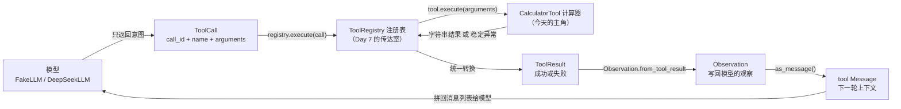
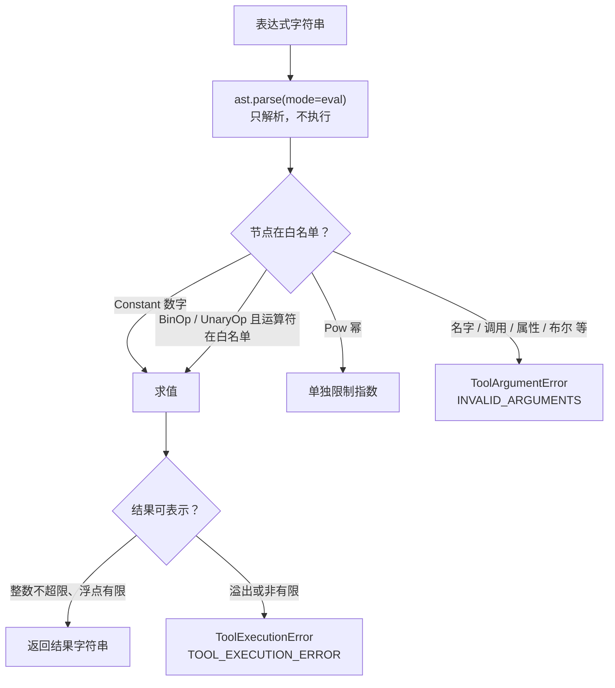
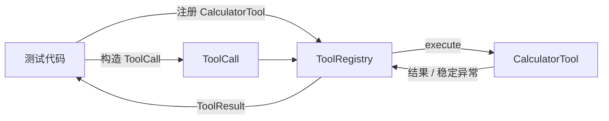
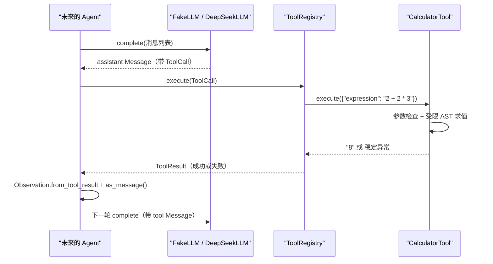

# Day 8：计算器工具代码导读

> 这篇文档怎么读（先看森林，再看树木）：
> - **第 0 步**：只看图，先建立整体印象，不要急着看代码；
> - **第 1 步**：认识计算器的输入契约、错误分类和安全边界；
> - **第 2 步**：打开代码，按小节顺序逐段读；
> - **第 3 步**：看测试如何验证，最后回到森林图复查。

## 0. 先看森林：这一章到底在做什么

### 0.1 用大白话讲

Day 7 建好了"花名册 + 传达室"（`ToolRegistry`），但名册里还没有真人。
今天雇来第一个真人员工：**计算器**。

计算器收到一句话："请算一下 `2 + 2 * 3`"。它要完成三件事：

1. **检查请求**：参数里有没有 `expression`？是不是字符串？有没有夹带
   其他参数？
2. **安全解析**：把字符串变成一棵"语法树"，并且只允许树里出现我们认识
   的节点。谁想借表达式执行代码（比如 `__import__('os')`），谁就在这一步
   被拦下。
3. **求值并返回**：沿着语法树算出数字，转成字符串交回去；算不出来（比如
   除零）就抛出稳定异常，由注册表统一变成失败结果。

全程**不使用 `eval`**。`eval` 会把字符串当代码执行，等于把"大门钥匙"
直接交给输入；而受限 AST 是"先拆开看，只放行认识的东西，再手工计算"。

### 0.2 森林全景图



读法：从左上往右下看。**今天只关注中间这一列**：`CalculatorTool` 怎样把
参数字典变成结果字符串。左边和右下是已经存在的模块，只用来展示消费位置。

### 0.3 一句话预告：计算器只做三件事

一次 `execute` 调用只做三件事：

1. **检查参数**：只认 `{"expression": "..."}` 这一个形状；
2. **受限求值**：解析成语法树，只放行白名单节点，然后手工算出数字；
3. **统一失败**：参数问题抛 `ToolArgumentError`，算不出来抛
   `ToolExecutionError`，绝不自己伪造成功内容。

同时，计算器**坚决不做**三件事：

- **不执行任意代码**：任何不是白名单节点的东西都会被拒绝；
- **不接触外部资源**：不读文件、不联网、不访问密钥；
- **不替 Agent 做决定**：失败会不会结束循环，由未来的控制器判断。

### 0.4 名词小词典（遇到不懂的词回来查）

| 名词 | 大白话解释 |
| --- | --- |
| AST（抽象语法树） | Python 把源码"拆开"后的树形结构；每个节点是一种语法元素 |
| 白名单（whitelist） | 只有列在名单上的节点类型才被允许通过 |
| 字面量（literal） | 直接写出来的值，如数字 `2`、`3.5` |
| 一元/二元运算 | 一个操作数（如 `-5`）叫一元；两个操作数（如 `2 + 3`）叫二元 |
| 有限数（finite） | 不是无穷大（inf）也不是非数（nan）的普通数值 |
| 递归（recursion） | 函数调用自己；这里用于沿语法树逐层求值 |
| 稳定异常 | 错误类别固定的异常，上层只依赖类别，不匹配异常文本 |

## 1. 认识计算器的三张契约

### 1.1 输入契约：只认一个参数

领域 `ToolCall` 的 `arguments` 是 JSON 对象，计算器只接受：

```json
{"expression": "2 + 2 * 3"}
```

| 情况 | 处理 |
| --- | --- |
| 缺少 `expression` 或不是字符串 | `ToolArgumentError` → `INVALID_ARGUMENTS` |
| 空白字符串 | `ToolArgumentError` → `INVALID_ARGUMENTS` |
| 超过 1000 字符 | `ToolArgumentError` → `INVALID_ARGUMENTS` |
| 夹带其他键（如 `{"expression": "1", "x": 2}`） | `ToolArgumentError` → `INVALID_ARGUMENTS` |

### 1.2 错误契约：两类问题、两个出口

```text
参数/解析问题（长什么样不对）  -> ToolArgumentError -> INVALID_ARGUMENTS
运行期问题（合法式子算不出）  -> ToolExecutionError -> TOOL_EXECUTION_ERROR
```

这两类都由 Day 7 的注册表统一翻译成 `ToolResult`，`retryable` 都是
`True`（模型可以换一种方式再试）。

### 1.3 安全契约：白名单说了算



## 2. 进入树木：按这个顺序读代码

建议顺序：

1. [tools/calculator.py](../../src/self_react/tools/calculator.py)（全文，
   核心只有一百多行）；
2. [tools/__init__.py](../../src/self_react/tools/__init__.py)（公共出口，
   看 `CalculatorTool` 怎么被导出）；
3. [test_calculator.py](../../tests/test_calculator.py)（验证计算器是否
   合格的"考官"）。

读的时候脑子里记着四个问题（这就是本段的骨架）：

1. 参数在哪里被检查？什么算"参数不对"？
2. 语法树里哪些节点能通过？哪些会被拒绝？
3. 除零、溢出这些运行期错误在代码的哪一行被抓住？
4. 计算器**不**做什么？

### 2.1 第一站：四个资源上限（模块开头）

```python
MAX_EXPRESSION_LENGTH = 1_000
MAX_AST_DEPTH = 100
MAX_ABS_INT = 10**100
MAX_POW_EXPONENT = 100
```

这是计算器对"自己有多能干"的诚实声明：

| 上限 | 防什么 | 超限时 |
| --- | --- | --- |
| 表达式 1000 字符 | 超长字符串 | `INVALID_ARGUMENTS` |
| 语法树深度 100 | 超深运算链拖垮递归求值 | `INVALID_ARGUMENTS` |
| 整数绝对值 10^100 | 天文数字占用内存、字符串转不出来 | `TOOL_EXECUTION_ERROR` |
| 整数指数 100 | 幂运算爆炸 | `TOOL_EXECUTION_ERROR` |

### 2.2 第二站：参数检查（`_extract_expression`）

```python
def _extract_expression(arguments: JsonObject) -> str:
    unexpected = sorted(set(arguments) - {"expression"})
    if unexpected:
        raise ToolArgumentError(f"不支持的参数：{', '.join(unexpected)}")

    expression = arguments.get("expression")
    if not isinstance(expression, str):
        raise ToolArgumentError("expression 必须是字符串")
    if not expression.strip():
        raise ToolArgumentError("expression 不能为空")
    if len(expression) > MAX_EXPRESSION_LENGTH:
        raise ToolArgumentError("表达式过长")
    return expression
```

这是工具边界的"安检门"，顺序很重要：先拒绝多余参数，再依次检查类型、
空白和长度。任何一项不合格都会抛 `ToolArgumentError`，注册表会把它变成
`INVALID_ARGUMENTS`。注意这里**不执行任何解析**，纯做参数形状检查。

### 2.3 第三站：解析与深度检查（`_parse_expression`、`_check_depth`）

```python
def _parse_expression(expression: str) -> ast.AST:
    try:
        tree = ast.parse(expression, mode="eval")
    except (SyntaxError, ValueError, RecursionError) as exc:
        message = getattr(exc, "msg", None) or "无效的表达式"
        raise ToolArgumentError(f"表达式语法错误：{message}") from exc

    root = tree.body
    _check_depth(root)
    return root
```

`ast.parse(expression, mode="eval")` 只做一件事：把字符串**解析**成一棵
语法树，比如 `"2 + 2"` 会变成一棵根为 `BinOp`、左子是 `2`、右子是 `2`
的树。它不执行任何代码。语法错误（如 `"2 +"`）在这里抛 `SyntaxError`，
被转换成 `ToolArgumentError`。

`_check_depth` 用显式栈（而不是递归）数树的深度，超过 100 层就拒绝：

```python
def _check_depth(root: ast.AST) -> None:
    stack: list[tuple[ast.AST, int]] = [(root, 1)]
    while stack:
        node, depth = stack.pop()
        if depth > MAX_AST_DEPTH:
            raise ToolArgumentError("表达式嵌套过深")
        stack.extend((child, depth + 1) for child in ast.iter_child_nodes(node))
```

之所以用迭代栈，是因为我们不想依赖 Python 的递归限制来兜底：显式栈对
任何输入都有确定的行为。一个有趣的细节是，Python 的 AST **不把括号存成
节点**，所以 `"((1))"` 和 `"1"` 深度一样；真正会撑深的是 `"1+1+1+..."`
这种长运算链。

### 2.4 第四站：求值（`_evaluate`）

```python
def _evaluate(node: ast.AST) -> int | float:
    if isinstance(node, ast.Constant):
        value = node.value
        if isinstance(value, bool) or not isinstance(value, (int, float)):
            raise ToolArgumentError("表达式只支持整数和浮点数字面量")
        return value

    if isinstance(node, ast.BinOp):
        left = _evaluate(node.left)
        right = _evaluate(node.right)
        if type(node.op) is ast.Pow:
            return _apply_power(left, right)
        binary_op = _BINARY_OPERATORS.get(type(node.op))
        if binary_op is None:
            raise ToolArgumentError(f"不支持的运算符：{type(node.op).__name__}")
        return _apply_binary(binary_op, left, right)

    if isinstance(node, ast.UnaryOp):
        operand = _evaluate(node.operand)
        unary_op = _UNARY_OPERATORS.get(type(node.op))
        if unary_op is None:
            raise ToolArgumentError(f"不支持的运算符：{type(node.op).__name__}")
        try:
            return _guard_result(unary_op(operand))
        except (ValueError, OverflowError) as exc:
            raise ToolExecutionError("无法计算该运算", retryable=True) from exc

    raise ToolArgumentError(f"不支持的表达式元素：{type(node).__name__}")
```

这是整个工具的心脏，按节点类型分三路：

1. **`Constant`（数字字面量）**：直接返回数值。布尔值 `True`/`False` 在
   Python 里其实是 `int` 的子类，所以这里显式拒绝，避免把 `True` 当 `1`
   计算。
2. **`BinOp`（二元运算）**：先递归算出左右两个操作数，再查运算符白名单。
   幂运算（`**`）单独交给 `_apply_power`，其余走 `_apply_binary`。
3. **`UnaryOp`（一元运算）**：只有正号 `+` 和负号 `-` 在白名单里。

最后一行是兜底：任何不在上述分支的节点（名字、函数调用、属性访问、列表
等）都会走到这里，被拒绝为"不支持的表达式元素"。这就是白名单的全部含义
——**默认拒绝，只放行认识的东西**。

运算符白名单本身只是两张字典：

```python
_BINARY_OPERATORS = {
    ast.Add: operator.add,
    ast.Sub: operator.sub,
    ast.Mult: operator.mul,
    ast.Div: operator.truediv,
    ast.FloorDiv: operator.floordiv,
    ast.Mod: operator.mod,
}

_UNARY_OPERATORS = {
    ast.UAdd: operator.pos,
    ast.USub: operator.neg,
}
```

`ast.Add` 是"语法树里的加号"这个身份，`operator.add` 是"真的做加法"这个
动作。字典把它们配对，求值时先认身份、再执行动作。

### 2.5 第五站：运行期错误（`_apply_binary`、`_apply_power`、`_guard_result`）

```python
def _apply_binary(binary_op, left, right):
    try:
        return _guard_result(binary_op(left, right))
    except ZeroDivisionError as exc:
        raise ToolExecutionError("除数不能为零", retryable=True) from exc
    except (ValueError, OverflowError) as exc:
        raise ToolExecutionError("无法计算该运算", retryable=True) from exc
```

`1 / 0` 的语法是合法的，所以它不在参数检查被拦，而是在真正做除法时抛
`ZeroDivisionError`，被这里翻译成 `ToolExecutionError("除数不能为零")`。
整除 `//` 和取模 `%` 除零也会走到同一出口。

幂运算单独处理，因为指数是"爆炸源"：

```python
def _apply_power(base, exponent):
    if isinstance(base, int) and isinstance(exponent, int):
        if base == 0 and exponent < 0:
            raise ToolExecutionError("0 不能做负指数幂", retryable=True)
        if exponent >= 0 and exponent > MAX_POW_EXPONENT:
            raise ToolExecutionError("指数过大", retryable=True)

    try:
        return _guard_result(operator.pow(base, exponent))
    except ZeroDivisionError as exc:
        raise ToolExecutionError("0 不能做负指数幂", retryable=True) from exc
    except (ValueError, OverflowError) as exc:
        raise ToolExecutionError("无法计算该运算", retryable=True) from exc
```

`2 ** 101` 的指数超过上限，在真正计算前就被拒绝；`11 ** 100` 虽然指数
合法，但结果是约 1.38 × 10^104，会在 `_guard_result` 里被拦下：

```python
def _guard_result(result):
    if isinstance(result, bool) or not isinstance(result, (int, float)):
        raise ToolExecutionError("计算结果不是数字")
    if isinstance(result, int):
        if abs(result) > MAX_ABS_INT:
            raise ToolExecutionError("计算结果超出可表示范围", retryable=True)
        return result
    if not math.isfinite(result):
        raise ToolExecutionError("计算结果超出可表示范围", retryable=True)
    return result
```

`_guard_result` 在**每一步运算之后**都执行，所以中间结果也不会悄悄变成
天文数字。浮点结果必须"有限"：`1e308 * 10` 会得到无穷大（inf），同样被
拒绝，绝不会把 `inf` 或 `nan` 当成正常答案返回。

### 2.6 第六站：输出格式化与工具类（`_format_result`、`CalculatorTool`）

```python
def _format_result(result: int | float) -> str:
    if isinstance(result, int):
        return str(result)
    if result.is_integer():
        return str(int(result))
    return str(result)
```

`4 / 2` 在 Python 里得到浮点数 `2.0`，这里去掉 `.0` 变成 `"2"`，对模型更
友好；`2 / 4` 得到 `0.5`，原样返回。工具类本身非常薄，只是把三步串起来：

```python
class CalculatorTool:
    name = "calculator"
    description = (
        "计算一个算术表达式，例如 2 + 2 * 3。支持加、减、乘、除、整除、取模、幂和括号。"
    )

    def execute(self, arguments: JsonObject) -> str:
        expression = _extract_expression(arguments)
        tree = _parse_expression(expression)
        result = _evaluate(tree)
        return _format_result(result)
```

`name` 是注册表的花名册键，`description` 是将来给模型看的自我介绍
（Day 10 提示词会消费它），`execute` 是 Day 7 协议要求的唯一入口。工具
没有构造函数状态：同一个实例可以在多个注册表里重复注册使用。

### 2.7 公共出口（`__init__.py`）

```python
from self_react.tools.base import (
    Tool,
    ToolArgumentError,
    ToolExecutionError,
    ToolRegistrationError,
    ToolRegistry,
)
from self_react.tools.calculator import CalculatorTool
```

调用方写 `from self_react.tools import CalculatorTool` 即可，不需要知道
计算器放在哪个文件里。`__all__` 同时列出工具层原有名字和新的
`CalculatorTool`，公共表面保持集中。

## 3. 考官怎么看（测试）

测试就是给计算器出题的考官。它不联网、不用真实模型，通过 `ToolRegistry`
和领域 `ToolCall` 驱动，一共 45 个用例，最有代表性的几组：



1. **成功运算**：`"2 + 2"` → `"4"`，并断言 `tool_call_id` 原样保留、
   `tool_name == "calculator"`。优先级和括号单独验证：
   `"2 + 2 * 3"` → `"8"`，`"2 * (3 + 4)"` → `"14"`。
2. **非法输入不伪装成功**：`"2 +"`、`"$ + 1"`、`"abc"`、
   `"__import__('os')"`、`"().__class__"`、`"True"`、`{}`、`{"expression": 42}`
   全部返回 `INVALID_ARGUMENTS`，`content` 为 `None`，消息不含
   `Traceback`——异常文本绝不混进结果。
3. **除零等运行期错误**：`"1 / 0"`、`"1 // 0"`、`"1 % 0"` 返回
   `TOOL_EXECUTION_ERROR`，消息 `"除数不能为零"`，`retryable=True`；
   `"2 ** 101"` 返回"指数过大"，`"11 ** 100"` 和 `"1e308 * 10"` 返回
   "超出可表示范围"。
4. **边界限制**：1001 字符的表达式和 101 层运算链被拒（`INVALID_
   ARGUMENTS`），恰好 100 层的 `"1+1+...+1"` 仍能算出 `"100"`。
5. **注册表集成**：重复注册抛 `ToolRegistrationError`；两个注册表互相
   隔离；未知工具消息里列出 `calculator`；FakeLLM 返回的 `ToolCall` 能
   端到端得到 `"4"` 并转回 tool 消息。

## 4. 回到森林：把整条路再走一遍



以及"计算器不做的事"检查清单：

- 看到 `__import__('os')` 之类的字符串：**只当表达式解析**，不是白名单
  节点就拒绝，绝不执行；
- 看到除零、溢出：**转成稳定执行错误**，不把 `inf`/`nan`/`Traceback`
  当答案；
- 看到多余参数、非字符串、空字符串：**在工具边界拒绝**，不让它们进入
  解析；
- 想判断失败是否结束循环：**留给未来的 Agent**，工具层不决定。

自测题（能答上来就算学会）：

1. `_extract_expression` 检查了哪几件事？顺序为什么重要？
2. `"abc"` 能通过 `ast.parse` 吗？它在哪一步被拒绝？
3. `1 / 0` 为什么返回 `TOOL_EXECUTION_ERROR` 而不是 `INVALID_ARGUMENTS`？
4. `_guard_result` 在求值流程里扮演什么角色？`1e308 * 10` 为什么失败？
5. 计算器要加一个"开平方"功能，需要动哪几个白名单？

## 5. 与 Day 9 的连接

Day 9 将基于同一个 `Tool` 协议实现受限文件读取和确定性检索/模拟工具。
它们只需要照抄今天的骨架：在 `execute` 里校验参数、做自己的业务、返回
字符串或抛出稳定异常。注册表、错误码和 `ToolResult` 转换全部复用，不需要
修改 `LLM.complete` 接口。多个工具并存时，`ToolRegistry` 的名册、未知
工具消息和注册纪律天然支持，Day 8 的测试已经覆盖了"注册表里只有计算器"
的行为，Day 9 只需验证"多个工具同时可用"。

Day 10 设计提示词时，每个工具的 `description` 就是给模型的说明书：计算器
的说明已经写好，Day 9 的工具也需要同样一句话讲清楚"能干什么、参数怎么
传"。
