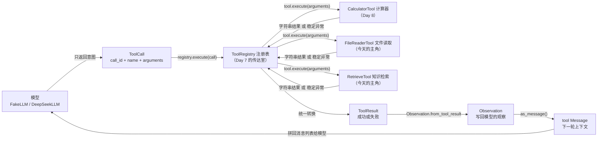
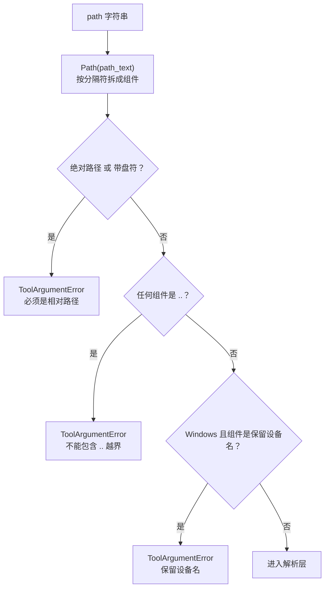
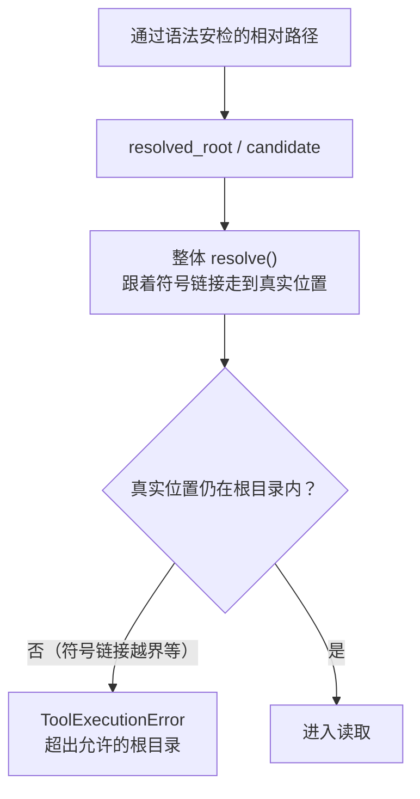
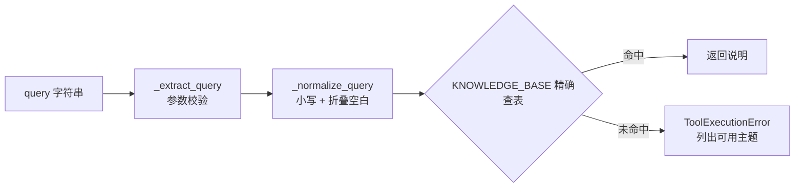
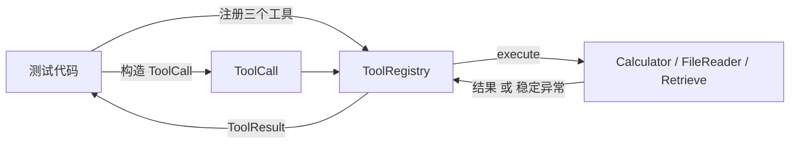
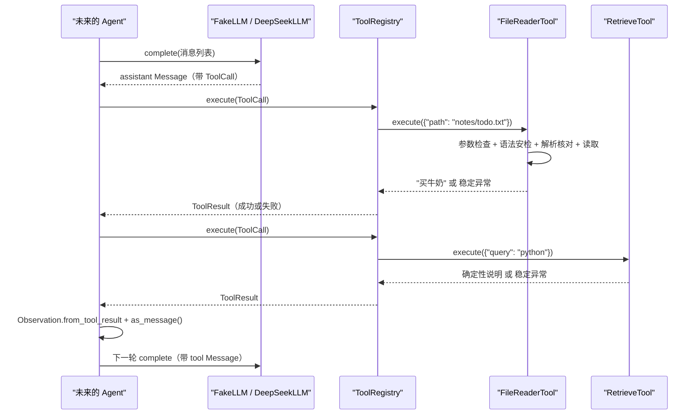

# Day 9：受限文件读取与知识检索代码导读

> 这篇文档怎么读（先看森林，再看树木）：
> - **第 0 步**：只看图，先建立整体印象，不要急着看代码；
> - **第 1 步**：认识两个新工具的职责、输入契约和错误出口；
> - **第 2 步**：打开代码，按小节顺序逐段读；
> - **第 3 步**：看测试如何验证，最后回到森林图复查。

## 0. 先看森林：这一章到底在做什么

### 0.1 用大白话讲

Day 7 建好了"花名册 + 传达室"（`ToolRegistry`），Day 8 雇来了第一个真人
员工：计算器。今天再雇两个新员工：

- **文件读取员（`FileReaderTool`）**：只允许在家门口（一个固定的根目录）
  拿文件回来给模型看。它有两道安检：进门先看路径长什么样（必须是相对路径，
  不能带 `..`、盘符或设备名），进去后再确认文件真实位置确实在家门口内
  （符号链接指到门外也算越界）。
- **知识回答员（`RetrieveTool`）**：把几张"知识卡片"背下来，模型问主题就
  照卡片回答。它不联网、不猜答案，问到没背过的主题就老实说"没有"。

两个员工都遵守 Day 7 的统一规矩：参数不对抛 `ToolArgumentError`，干不了活
抛 `ToolExecutionError`，由注册表统一变成 `ToolResult` 回执。

### 0.2 森林全景图



读法：从左上往右下看。**今天只关注中间这一列新增的两条路**：`FileReaderTool`
和 `RetrieveTool` 怎样把参数字典变成结果字符串。注册表负责查名册、转换异常
和保留调用编号，和 Day 7 完全一样。

### 0.3 一句话预告：两个工具各做一件事

一次 `FileReaderTool.execute` 调用做三件事：

1. **检查参数**：只认 `{"path": "..."}` 一个键，path 必须是合规相对路径；
2. **双重安检**：语法层拒绝绝对路径、盘符、`..` 和保留设备名，解析层确认
   真实位置仍在根目录内；
3. **读取并返回**：按 UTF-8 读取文本，超长则截断并标注，读不到就抛稳定
   异常。

一次 `RetrieveTool.execute` 调用做三件事：

1. **检查参数**：只认 `{"query": "..."}` 一个键；
2. **规范化**：统一大小写、折叠空白；
3. **查表返回**：命中知识库就返回说明，未命中就抛稳定异常并列出可用主题。

### 0.4 名词小词典（遇到不懂的词回来查）

| 名词 | 大白话解释 |
| --- | --- |
| 根目录（root） | 工具被允许读取的那一个目录，安全边界 |
| 相对路径 | 从根目录出发"往哪走"的路径，如 `notes/a.txt` |
| 绝对路径 | 从盘符或系统根出发的完整路径，如 `C:\a.txt` |
| 越界（escape） | 路径最终指向根目录之外 |
| 符号链接（symlink） | 一个"快捷方式"文件，打开它会跳到真实位置 |
| 解析（resolve） | 把路径换算成真实位置，跟着符号链接走到头 |
| 保留设备名 | Windows 里代表设备的特殊名字，如 `CON`、`NUL` |
| 规范化（normalize） | 把输入统一成标准写法，如 `REACT` → `react` |
| 知识库（knowledge base） | 工具内置的"主题 → 说明"固定对照表 |
| 截断（truncate） | 只保留内容前一部分，并明确标注不完整 |

## 1. 认识两个新员工

### 1.1 FileReaderTool：只能在家门口拿东西

| 成员 | 值/行为 |
| --- | --- |
| `name` | `"file_reader"` |
| 输入 | `{"path": "相对路径"}` |
| 允许读取 | 根目录内的 UTF-8 文本文件 |
| 参数问题 | 非字符串、空、超长、多余键、绝对路径、盘符、`..`、保留设备名 → `INVALID_ARGUMENTS` |
| 执行问题 | 根目录缺失、文件不存在、不是常规文件、越界、解码失败、读取失败 → `TOOL_EXECUTION_ERROR` |
| 资源上限 | 路径 ≤ 1000 字符；返回内容 ≤ 10000 字符（超出截断并标注） |

根目录在**构造时**固定（`FileReaderTool(root_directory)`），不是每次调用的
参数。这样模型永远无法通过参数扩大允许范围。

### 1.2 RetrieveTool：只回答背下来的知识

| 成员 | 值/行为 |
| --- | --- |
| `name` | `"retrieve"` |
| 输入 | `{"query": "主题词"}` |
| 内置知识 | `react`、`python`、`deepseek`、`uv`、`pydantic` 五张固定卡片 |
| 参数问题 | 非字符串、空、超长、多余键 → `INVALID_ARGUMENTS` |
| 执行问题 | 输入合规但查不到条目 → `TOOL_EXECUTION_ERROR`（列出可用主题） |
| 确定性 | 相同输入永远返回相同输出 |

## 2. 进入树木：按这个顺序读代码

建议顺序：

1. [tools/file_reader.py](../../src/self_react/tools/file_reader.py)（全文，
   核心是三道安检）；
2. [tools/retrieve.py](../../src/self_react/tools/retrieve.py)（全文，核心是
   规范化 + 查表）；
3. [tools/__init__.py](../../src/self_react/tools/__init__.py)（公共出口）；
4. [test_file_reader.py](../../tests/test_file_reader.py) 与
   [test_retrieve.py](../../tests/test_retrieve.py)（考官）。

读文件读取时脑子里记着四个问题（这就是本段的骨架）：

1. 哪些路径在语法层就被拒绝？为什么？
2. `resolve()` 在安全上扮演什么角色？
3. 符号链接指向门外会发生什么？
4. 文件不存在、不是文本、读不出来各走哪个出口？

### 2.1 第一站：file_reader.py 的资源上限与保留设备名

```python
MAX_PATH_LENGTH = 1_000
MAX_OUTPUT_CHARS = 10_000
TRUNCATION_MARKER = "\n…（内容过长，已截断）"
_READ_CHUNK = MAX_OUTPUT_CHARS + len(TRUNCATION_MARKER) + 1

_WINDOWS_RESERVED_NAMES = frozenset(
    {"CON", "PRN", "AUX", "NUL"}
    | {f"COM{i}" for i in range(1, 10)}
    | {f"LPT{i}" for i in range(1, 10)}
)
```

前四个常量是资源上限：路径最长 1000 字符；返回内容最多 10000 字符；截断时
附加一个稳定标记。`_READ_CHUNK` 是关键设计：读取时最多读"上限 + 标记长度
+ 1"个字符。如果一次读到超过上限，说明文件更长，就截断；否则原样返回。
这样超大文件不会被整体载入内存。

`_WINDOWS_RESERVED_NAMES` 是 Windows 特有的安全清单：`CON`、`PRN`、`AUX`、
`NUL`、`COM1-9`、`LPT1-9` 是设备名而不是普通文件，打开 `CON` 甚至会读取
控制台输入。把它们列成白名单，语法检查时逐个组件比对。

### 2.2 第二站：参数检查（`_extract_path`）

```python
def _extract_path(arguments: JsonObject) -> str:
    unexpected = sorted(set(arguments) - {"path"})
    if unexpected:
        raise ToolArgumentError(f"不支持的参数：{', '.join(unexpected)}")

    path = arguments.get("path")
    if not isinstance(path, str):
        raise ToolArgumentError("path 必须是字符串")
    if not path.strip():
        raise ToolArgumentError("path 不能为空")
    if len(path) > MAX_PATH_LENGTH:
        raise ToolArgumentError("路径过长")
    if "\x00" in path:
        raise ToolArgumentError("路径不能包含空字节")
    return path
```

这是工具边界的"安检门"，与计算器的 `_extract_expression` 同款：先拒绝多余
键，再依次检查类型、空白、长度和空字节。任何一项不合格都抛
`ToolArgumentError`，注册表会把它变成 `INVALID_ARGUMENTS`。空字节单独检查
是因为 `open()` 遇到它会直接报错，与其让它在执行期失败，不如在参数层说清
楚。

### 2.3 第三站：语法安检（`_reject_unsafe_path`）

```python
def _reject_unsafe_path(candidate: Path) -> None:
    if candidate.is_absolute() or candidate.drive:
        raise ToolArgumentError("路径必须是根目录内的相对路径")
    if ".." in candidate.parts:
        raise ToolArgumentError("路径不能包含 .. 越界")
    if os.name == "nt":
        for part in candidate.parts:
            if part.split(".", 1)[0].upper() in _WINDOWS_RESERVED_NAMES:
                raise ToolArgumentError("路径包含 Windows 保留设备名")
```

这是第一道安检，**不访问文件系统**，只看路径字符串本身：

1. **绝对路径与盘符**：`candidate.is_absolute()` 拦住 `C:\...`、`\...` 和
   `\\server\share`；`candidate.drive` 额外拦住 `C:relative.txt` 这种不带
   盘符分隔符的"盘符相对路径"——它在 Windows 上不是绝对路径，但仍会按
   C 盘当前目录解析，所以必须单独拒绝。
2. **`..` 组件**：`candidate.parts` 把路径按分隔符拆成一段一段，任何一段是
   `..` 就直接拒绝。`a/../b` 虽然最终可能还在根目录内，也一律拒绝——这是
   保守取舍：模型应该直接给出干净路径，不该依赖"看似无害的 `..`"。
3. **保留设备名**：Windows 上把每个组件去掉扩展名后与清单比对，`CON.txt`
   也会被拦住。



### 2.4 第四站：解析与越界检查（`_resolve_safe_path`）

```python
def _resolve_safe_path(path_text: str, root: Path) -> Path:
    try:
        resolved_root = root.resolve()
    except OSError as exc:
        raise ToolExecutionError("允许的根目录无法解析", retryable=True) from exc

    if not resolved_root.is_dir():
        raise ToolExecutionError("允许的根目录不存在或不是目录", retryable=True)

    candidate = Path(path_text)
    _reject_unsafe_path(candidate)

    try:
        resolved_target = (resolved_root / candidate).resolve()
    except OSError as exc:
        raise ToolExecutionError("路径解析失败", retryable=True) from exc

    if not resolved_target.is_relative_to(resolved_root):
        raise ToolExecutionError("路径解析后超出允许的根目录", retryable=True)
    return resolved_target
```

这是第二道安检，也是符号链接逃逸的真正防线：

1. 先把根目录本身 `resolve()` 成真实位置——边界是**真实目录**，不是字符串
   原样，所以根目录是符号链接时也按真实位置算。
2. 确认根目录确实存在且是目录；否则直接执行错误（根目录是工具配置，模型
   无法修复，但结果仍是稳定的 `TOOL_EXECUTION_ERROR`）。
3. 做语法安检（上一站）。
4. 把 `根目录/相对路径` 整体 `resolve()`。`resolve()` 会跟着符号链接走到
   真实位置：链接指向门外，结果就在门外。
5. 用 `is_relative_to` 做包含关系核对，越界就返回"超出允许的根目录"。



### 2.5 第五站：读取与截断（`_read_text`）

```python
def _read_text(resolved: Path) -> str:
    if not resolved.exists():
        raise ToolExecutionError("文件不存在", retryable=True)
    if not resolved.is_file():
        raise ToolExecutionError("目标不是常规文件", retryable=True)

    try:
        with resolved.open("r", encoding="utf-8") as handle:
            content = handle.read(_READ_CHUNK)
    except UnicodeDecodeError as exc:
        raise ToolExecutionError("文件不是有效的 UTF-8 文本", retryable=True) from exc
    except OSError as exc:
        raise ToolExecutionError("读取文件失败", retryable=True) from exc

    if len(content) > MAX_OUTPUT_CHARS:
        return content[:MAX_OUTPUT_CHARS] + TRUNCATION_MARKER
    return content
```

到这里安检全部通过，才开始真正读文件。三种业务失败各走各的稳定消息：目标
不存在（"文件不存在"）、目标是目录或特殊文件（"目标不是常规文件"）、内容
不是 UTF-8（"文件不是有效的 UTF-8 文本"）、打开失败（"读取文件失败"）。
`UnicodeDecodeError` 单独处理是为了给模型一个可理解的说明，而不是把
`Traceback` 漏出去。最后按上一站说的规则截断。

### 2.6 第六站：FileReaderTool 类

```python
class FileReaderTool:
    name = "file_reader"
    description = (
        "读取允许目录内的 UTF-8 文本文件。参数 path 必须是相对于允许目录的相对路径，"
        "例如 notes/todo.txt；绝对路径、盘符路径和 .. 越界会被拒绝。"
        f"单次最多返回 {MAX_OUTPUT_CHARS} 个字符，超出部分会截断并标注。"
    )

    def __init__(self, root_directory: str | os.PathLike[str]) -> None:
        if not isinstance(root_directory, (str, os.PathLike)):
            raise TypeError("root_directory 必须是路径")
        if isinstance(root_directory, str) and not root_directory.strip():
            raise ValueError("root_directory 不能为空")
        self.root = Path(root_directory)

    def execute(self, arguments: JsonObject) -> str:
        path_text = _extract_path(arguments)
        resolved = _resolve_safe_path(path_text, self.root)
        return _read_text(resolved)
```

类本身非常薄：构造时固定根目录，`execute` 把三步串起来（参数检查 → 双重
安检 → 读取）。`description` 是将来给模型看的自我介绍（Day 10 提示词会消费
它），明确告诉模型：只能传相对路径、越界会被拒绝、超长会截断。

### 2.7 第七站：retrieve.py 的知识库与参数检查

```python
MAX_QUERY_LENGTH = 200

KNOWLEDGE_BASE: dict[str, str] = {
    "react": "ReAct（Reason + Act）是一种让模型推理与行动交错的智能体范式，…",
    "python": "Python 是一种解释型、动态类型的通用编程语言，…",
    "deepseek": "DeepSeek 提供与 OpenAI Chat Completions 兼容的 API，…",
    "uv": "uv 是 Python 的包管理与虚拟环境工具，…",
    "pydantic": "Pydantic 是基于类型标注的数据校验库，…",
}
```

知识库是写死在代码里的"主题 → 说明"字典。五条说明都与本项目相关，这样
未来的 Agent 既能演示检索工具，又不会依赖任何外部服务。`_extract_query`
与 `_extract_path` 同款：拒绝多余键、非字符串、空白和超长查询。

### 2.8 第八站：规范化与查表（`_normalize_query`、`RetrieveTool.execute`）

```python
def _normalize_query(query: str) -> str:
    return re.sub(r"\s+", " ", query.strip()).casefold()
```

`casefold()` 是比 `lower()` 更强的小写化（对更多 Unicode 字符有效），
`re.sub(r"\s+", " ", ...)` 把连续空白折叠成单个空格。规范化后
`"REACT"`、`"  react  "` 都会变成 `"react"`，匹配是确定性的。

```python
def execute(self, arguments: JsonObject) -> str:
    query = _extract_query(arguments)
    entry = KNOWLEDGE_BASE.get(_normalize_query(query))
    if entry is None:
        raise ToolExecutionError(
            f"知识库中没有与查询「{query}」匹配的条目；"
            f"可用主题：{', '.join(sorted(KNOWLEDGE_BASE))}",
            retryable=True,
        )
    return entry
```

查表用字典的精确匹配：命中就返回说明，未命中就抛稳定执行错误，消息里同时
带上被查询的词和可用主题列表，方便模型下一轮修正。`retryable=True` 表示
"换个说法再试"是有意义的。



### 2.9 第九站：公共出口（`__init__.py`）

```python
from self_react.tools.calculator import CalculatorTool
from self_react.tools.file_reader import FileReaderTool
from self_react.tools.retrieve import RetrieveTool
```

调用方写 `from self_react.tools import FileReaderTool` 即可，不需要知道文件
放在哪里。三个工具共用同一个注册表入口，名册就是
`("calculator", "file_reader", "retrieve")`。

## 3. 考官怎么看（测试）

测试就是给两个新工具出题的考官，全部使用 pytest 临时目录或内置知识库，
不联网。文件读取测试共 47 个，最有代表性的几组：

1. **成功读取**：`notes/todo.txt` → 返回内容，断言 `tool_call_id` 原样保留、
   `tool_name == "file_reader"`；空文件返回空字符串。
2. **越界与安全**：`../secret.txt`、`a/../b.txt`、绝对路径、盘符路径、UNC
   路径、`CON`/`NUL` 等保留设备名全部返回 `INVALID_ARGUMENTS`；解析后越界
   （真实符号链接 + monkeypatch 模拟）返回 `TOOL_EXECUTION_ERROR`。
3. **执行期失败**：文件不存在、目标是目录、根目录缺失、非 UTF-8 文件、
   打开失败，全部返回稳定的 `TOOL_EXECUTION_ERROR` 且 `retryable=True`，
   原始错误文本不泄漏。
4. **截断策略**：10000 字符整原样返回；超出 10 字符返回"前 10000 字符 +
   截断标记"。
5. **注册表集成**：三个工具同时注册，名册为
   `("calculator", "file_reader", "retrieve")`，未知工具消息列出全部名称，
   重复注册被拒、注册表实例互相隔离。

检索测试共 23 个，最代表性的几组：

1. **确定性**：同一主题连续调用两次结果完全一致；`REACT`、`  react  ` 与
   `react` 得到同一说明。
2. **未知主题**：返回 `TOOL_EXECUTION_ERROR`，消息包含被查询词和可用主题，
   绝不伪造成功内容。
3. **参数边界**：缺失、非字符串、空白、多余键、超长查询返回
   `INVALID_ARGUMENTS`；恰好 200 字符的查询通过参数校验但在执行期报未知。
4. **注册表集成**：与文件读取相同的三工具并存、隔离与未知工具消息断言。



## 4. 回到森林：把整条路再走一遍

把今天学到的拼回一张时序图：



以及"两个新工具不做的事"检查清单：

- 看到 `../`、`C:\...`、`CON`：**在访问文件系统前拒绝**，绝不尝试打开；
- 看到符号链接：**跟随解析**，真实位置在门外就拒绝，不因为名字好看就放行；
- 看到超大文件：**只读一段并标注截断**，不整体载入；
- 看到没背过的主题：**返回稳定错误并列出可用主题**，不编答案；
- 想判断失败是否结束循环：**留给未来的 Agent**，工具层不决定。

自测题（能答上来就算学会）：

1. `_reject_unsafe_path` 为什么还要单独检查 `candidate.drive`？
2. 符号链接指向根目录外的文件，哪一行代码拦住它？
3. `a/../b.txt` 明明可能落在根目录内，为什么还是拒绝？
4. 内容恰好 10000 字符的文件会被截断吗？为什么？
5. `"REACT"` 和 `"react"` 在 `RetrieveTool` 里为什么结果一样？

## 5. 与 Day 10 的连接

Day 10 设计最小提示词时，三个工具的 `description` 就是给模型的说明书：计算
器说明怎么写表达式，文件读取说明必须传相对路径且越界会被拒绝，检索说明
列出可用主题。Day 12 的 Agent 主循环拿到模型返回的 `ToolCall` 后，按名称查
注册表执行工具，把 `ToolResult` 转成 `Observation` 写回上下文——今天新增的
两个工具和计算器共享同一个入口，注册表不需要任何修改。
