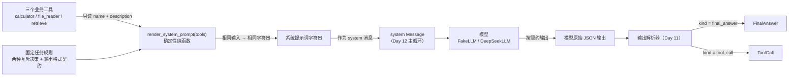
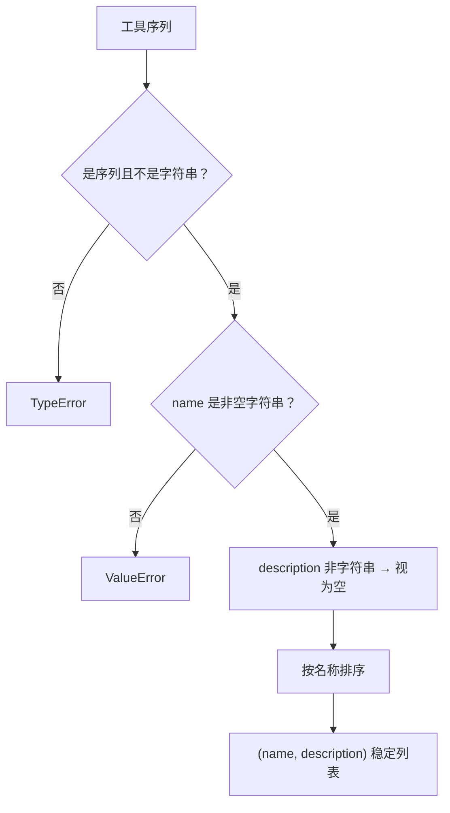
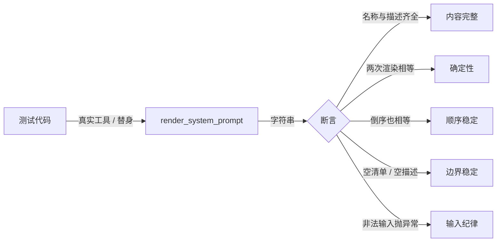
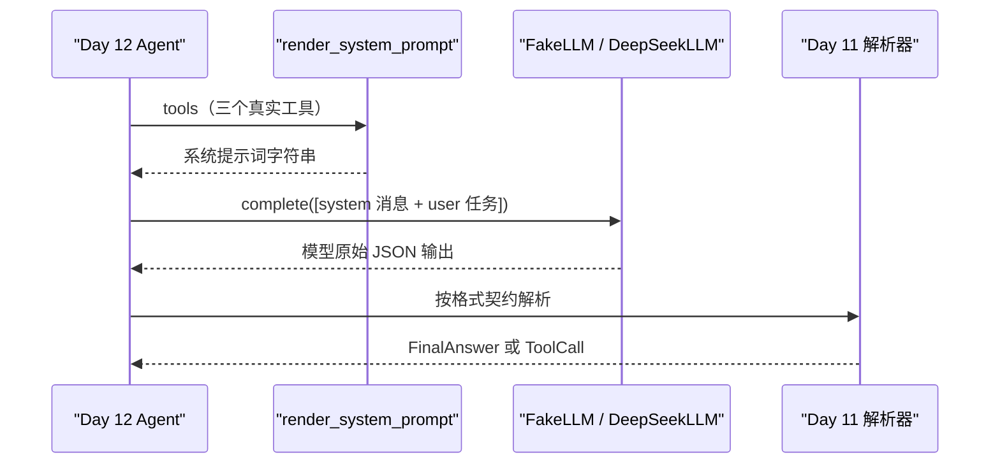

# Day 10：最小系统提示词与输出格式契约代码导读

> 这篇文档怎么读（先看森林，再看树木）：
> - **第 0 步**：只看图，先建立整体印象，不要急着看代码；
> - **第 1 步**：认识提示词渲染函数的输入、输出与确定性承诺；
> - **第 2 步**：打开代码，按小节顺序逐段读；
> - **第 3 步**：看测试如何验证，最后回到森林图复查。

## 0. 先看森林：这一章到底在做什么

### 0.1 用大白话讲

模型刚出厂时不知道自己有哪些工具。Day 8/9 造好了三个"员工"——计算器
（`calculator`）、文件读取（`file_reader`）、知识检索（`retrieve`），但模型
不知道他们的名字、各自擅长什么、怎么下指令。系统提示词就是给模型的
**说明书 + 答题卡**：

- **说明书**：把三个工具的 `name` 和 `description` 抄给模型，让它知道
  什么时候该找谁；
- **答题卡**：规定模型每轮只能交两种答案之一——直接写最终回答
  （`final_answer`），或者请求调用一个工具（`tool_call`），两种答案互斥，
  并且都用固定形状的 JSON 写出来。

`render_system_prompt(tools)` 就是印这张说明书和答题卡的机器：给它工具清单，
它返回一个完整字符串。它是**纯函数**——相同输入永远得到相同输出，不会因为
工具传进来的顺序不同而改变，也不会访问网络或读环境变量。Day 12 会把这张
说明书作为 `system` 消息发给模型，Day 11 则按答题卡上的形状解析模型的回答。

### 0.2 森林全景图



读法：从左上往右下看。**今天只做中间这一件事**：把工具清单和固定规则渲染
成提示词字符串（`Render`）。虚线右侧的 `system Message`、模型调用和解析器
是 Day 11/12 的消费方，今天不实现。

### 0.3 一句话预告

一次 `render_system_prompt(tools)` 调用做三件事：

1. **校验并排序**：检查工具清单合法，把工具按名称排序，保证顺序稳定；
2. **拼装固定规则**：把开场白、最终回答契约、工具调用契约和输出规则四段
   文本拼起来；
3. **插入工具清单**：把每个工具的 `name + description` 渲染成清单条目，
   空描述用占位符，空清单用固定说明，返回完整字符串。

### 0.4 名词小词典（遇到不懂的词回来查）

| 名词 | 大白话解释 |
| --- | --- |
| 系统提示词（system prompt） | 每次对话开头固定给模型的说明书，说明任务规则与可用工具 |
| 纯函数（pure function） | 相同输入永远相同输出，不修改外部状态、不访问网络或环境变量 |
| 格式契约（format contract） | 约定模型输出长什么样的"答题卡"，这里是两种 JSON 形状 |
| 判别字段（discriminator） | 用一个字段区分两种形状，本项目用 `kind` |
| 占位符（placeholder） | 信息缺失时用的固定替代文本，如 `（无描述）` |
| 确定性（deterministic） | 结果可复现、可预测，不依赖随机或外部状态 |

## 1. 认识新模块

### 1.1 render_system_prompt 一览表

| 成员 | 值/行为 |
| --- | --- |
| 输入 | 工具序列（只读取 `name` 与 `description`） |
| 输出 | 完整系统提示词字符串 |
| 确定性 | 相同输入 → 相同字符串；工具按名称排序，与传入顺序无关 |
| 空描述 | 渲染 `（无描述）` 稳定占位符 |
| 空清单 | 渲染"当前没有可用工具。"，仍保留完整格式契约 |
| 非法输入 | 非序列抛 `TypeError`；空名称或缺失名称抛 `ValueError` |

### 1.2 输出格式契约（给 Day 11 的约定）

提示词把模型输出约定成两种互斥的 JSON 形状，`kind` 是判别字段：

| 决策形态 | JSON 形状 | 关键字段 |
| --- | --- | --- |
| 最终回答 | `{"kind": "final_answer", "content": "..."}` | `content` 非空字符串 |
| 工具调用 | `{"kind": "tool_call", "call_id": "...", "name": "...", "arguments": {...}}` | `call_id` 本轮唯一；`name` 精确匹配清单；`arguments` 是 JSON 对象 |

这两个形状与 Day 4 领域模型里的 `FinalAnswer`、`ToolCall` 字段一一对应，
所以 Day 11 解析器拿到模型的 JSON 后，可以机械地转换成领域对象，不需要
猜测。

## 2. 进入树木：按这个顺序读代码

建议顺序：

1. [prompts.py](../../src/self_react/prompts.py)（全文，核心是四段规则 +
   排序 + 占位符）；
2. [test_prompts.py](../../tests/test_prompts.py)（考官）。

读 `prompts.py` 时脑子里记着四个问题（这就是本段的骨架）：

1. 提示词渲染为什么必须是纯函数？
2. 工具清单为什么按名称排序？
3. 空描述和空清单各渲染成什么？
4. 格式契约与 Day 4 领域模型有什么关系？

### 2.1 第一站：稳定常量与占位符

```python
_EMPTY_DESCRIPTION_PLACEHOLDER = "（无描述）"
_NO_TOOLS_TEXT = "当前没有可用工具。"
```

这两个常量是"残缺输入"的兜底：工具描述为空时，清单条目不能只剩
`- name：`，于是用 `（无描述）` 占位；工具清单为空时，工具小节不能消失，
于是输出"当前没有可用工具。"。占位符和兜底文案都是固定字符串，保证任何
边界输入都渲染出完整、可预测的提示词。

### 2.2 第二站：四个固定小节

```python
_SYSTEM_INTRO = (
    "你是 Self-ReAct 智能体。每轮你只能选择一种决策：直接给出最终回答，"
    "或请求调用一个工具。两种决策互斥，不能同时出现，也不能输出这两种 "
    "JSON 形态以外的内容。"
)
```

开场白先定调：只有两种决策，二者互斥。`_FINAL_ANSWER_CONTRACT` 与
`_TOOL_CALL_CONTRACT` 是两张"答题卡"，各写一种 JSON 形状和字段要求；
`_OUTPUT_RULES` 是无论工具清单如何变化都生效的输出纪律（只输出一个 JSON
对象、`kind` 互斥、只能调用清单内工具、无工具时只能给最终回答）。这四段
是固定文本，不依赖任何工具，所以任何一次渲染都包含完整格式契约。

### 2.3 第三站：PromptTool 协议

```python
@runtime_checkable
class PromptTool(Protocol):
    """提示词渲染消费的最小工具形态：名称与描述。"""

    name: str
    description: str
```

提示词只需要知道工具"叫什么、干什么"，不需要调用它。所以渲染函数不要求
`execute` 方法，协议只声明 `name` 与 `description` 两个字段。三个真实业务
工具天然满足这个协议（它们本来就有这两个类属性），测试里的记录型替身也
满足；`@runtime_checkable` 让 `isinstance(CalculatorTool(), PromptTool)`
可以直接验证这一点。

### 2.4 第四站：校验与排序（`_normalize_tools`）

```python
def _normalize_tools(tools: Sequence[PromptTool]) -> list[tuple[str, str]]:
    """校验工具清单，并返回按名称排序的 (名称, 描述) 稳定列表。"""

    if isinstance(tools, (str, bytes)) or not isinstance(tools, Sequence):
        raise TypeError("tools 必须是工具序列")

    normalized: list[tuple[str, str]] = []
    for tool in tools:
        name = getattr(tool, "name", None)
        if not isinstance(name, str) or not name.strip():
            raise ValueError("工具 name 必须是非空字符串")
        description = getattr(tool, "description", "")
        if not isinstance(description, str):
            description = ""
        normalized.append((name.strip(), description))
    return sorted(normalized, key=lambda item: item[0])
```

这是纯函数的第一道关卡，做三件事：

1. **拒绝非序列**：字符串本身也是序列，但绝不是工具清单，单独拦掉；
2. **校验名称**：没有名字的工具模型无法调用，直接抛 `ValueError`，不渲染
   残缺条目；
3. **宽容描述**：描述缺失或不是字符串时当作空字符串，交给占位符兜底。

最后 `sorted(..., key=lambda item: item[0])` 按名称排序。这一步就是
"顺序稳定"的全部秘密：调用方传 `[retrieve, calculator]` 还是
`[calculator, retrieve]`，排序后都是 `calculator` 在前。



### 2.5 第五站：工具清单小节（`_render_tools_section`）

```python
def _render_tools_section(tools: list[tuple[str, str]]) -> str:
    """渲染"可用工具"小节；工具按名称排序，空描述使用稳定占位符。"""

    if not tools:
        return _NO_TOOLS_TEXT

    lines = ["可用工具（只能调用这里的工具，名称必须精确匹配）："]
    lines.extend(
        f"- {name}：{description.strip() or _EMPTY_DESCRIPTION_PLACEHOLDER}"
        for name, description in tools
    )
    return "\n".join(lines)
```

工具清单是唯一"会变"的小节，其余小节都是固定文本。清单为空时直接返回
"当前没有可用工具。"；否则每个工具渲染成一行 `- name：description`。
`description.strip() or _EMPTY_DESCRIPTION_PLACEHOLDER` 是"空则占位"的
惯用法：描述全空白时也走占位符，保证条目格式完整。

### 2.6 第六站：主函数（`render_system_prompt`）

```python
def render_system_prompt(tools: Sequence[PromptTool]) -> str:
    """渲染确定性的最小系统提示词。"""

    normalized = _normalize_tools(tools)
    sections = [
        _SYSTEM_INTRO,
        _FINAL_ANSWER_CONTRACT,
        _TOOL_CALL_CONTRACT,
        _render_tools_section(normalized),
        _OUTPUT_RULES,
    ]
    return "\n\n".join(sections).strip()
```

主函数非常薄：先校验排序，再把五个小节（开场白、两种契约、工具清单、
输出规则）用空行拼起来，最后去掉首尾空白。`normalized` 是内部排序后的
元组列表，传入的工具对象本身没有被修改。整条渲染链路不访问网络、不读
环境变量，所以是确定性纯函数。

### 2.7 第七站：真实渲染结果

用三个真实工具调用一次，得到的就是 Day 12 将作为 `system` 消息发给模型的
完整说明书：

```text
你是 Self-ReAct 智能体。每轮你只能选择一种决策：直接给出最终回答，或请求调用一个工具。两种决策互斥，不能同时出现，也不能输出这两种 JSON 形态以外的内容。

## 决策一：最终回答（FinalAnswer）

当任务已经完成、信息足够直接回答用户时，输出：

{"kind": "final_answer", "content": "给用户的最终回答文本"}

content 必须是非空字符串。

## 决策二：工具调用（ToolCall）

当需要计算、读取文件或检索知识才能继续时，请求调用一个工具：

{"kind": "tool_call", "call_id": "本轮唯一的非空编号", "name": "工具名", "arguments": {"参数名": "参数值"}}

- call_id 是本次调用在本轮上下文中唯一的非空字符串编号；
- name 必须与"可用工具"中的名称精确匹配；
- arguments 必须是 JSON 对象，键名必须与对应工具描述中说明的参数一致；
  描述中未出现的键会被工具拒绝。

可用工具（只能调用这里的工具，名称必须精确匹配）：
- calculator：计算一个算术表达式，例如 2 + 2 * 3。支持加、减、乘、除、整除、取模、幂和括号。
- file_reader：读取允许目录内的 UTF-8 文本文件。参数 path 必须是相对于允许目录的相对路径，例如 notes/todo.txt；绝对路径、盘符路径和 .. 越界会被拒绝。单次最多返回 10000 个字符，超出部分会截断并标注。
- retrieve：在项目内置知识库中按主题检索确定性说明。参数 query 是主题词，例如 react、python、deepseek、uv、pydantic；相同输入返回相同结果，未知主题返回稳定错误。

## 输出规则

1. 只输出一个 JSON 对象，不要包含 JSON 以外的文字、解释或代码块标记。
2. kind 只能是 "final_answer" 或 "tool_call"，二者互斥，不能同时出现。
3. 只能调用"可用工具"中列出的工具；未列出的工具会被拒绝。
4. 当前没有可用工具时，只能输出 final_answer。
```

注意 `file_reader` 的说明里已经写清了"相对路径"规则，这份说明来自工具
自己，提示词只是原样抄录——这就是"提示词消费工具的 `description`"的含义。

## 3. 考官怎么看（测试）

测试就是给渲染函数出题的考官，全部使用真实工具对象和记录型替身，不联网。
`tests/test_prompts.py` 共 15 个用例，最有代表性的几组：

1. **内容完整**：三工具渲染后，三个 `name` 与三段 `description` 全部出现；
   `final_answer`、`tool_call`、`"kind"` 判别字段、`call_id`、`arguments`
   与"互斥"说明都出现；`file_reader` 的相对路径提醒存在。
2. **确定性**：相同工具两次渲染字符串完全一致；倒序传入与正序传入完全
   一致；元组与列表传入完全一致；渲染后输入列表和工具对象未被修改。
3. **边界**：空清单渲染出"没有可用工具"且保留完整格式契约；空描述渲染
   `（无描述）` 占位符；真实工具与空描述工具混用仍各有一条完整条目。
4. **顺序**：按名称排序，`calculator` 条目出现在 `file_reader` 之前、
   `file_reader` 在 `retrieve` 之前。
5. **输入纪律**：字符串、字典等非序列输入抛 `TypeError`；空名称、空白
   名称、缺失名称的工具抛 `ValueError`。
6. **协议**：三个真实工具都通过 `isinstance(..., PromptTool)` 检查。



## 4. 回到森林：把整条路再走一遍

把今天学到的拼回未来 Day 12 的消费时序：



以及"提示词不做的事"检查清单：

- 看到工具清单为空：**照常渲染**，说明无可用工具，保留完整格式契约；
- 看到描述为空：**用占位符**，不输出 `- name：` 残缺条目；
- 想解析模型输出：**留给 Day 11**，提示词只定义形状不定义解析；
- 想调用模型或执行工具：**留给 Day 12**，提示词只是字符串；
- 想给具体工具硬编码参数字段：**不做**，参数知识由工具 `description`
  自己维护，提示词只写通用规则。

自测题（能答上来就算学会）：

1. 为什么提示词渲染必须是纯函数？倒序传入工具会发生什么？
2. `_normalize_tools` 为什么先检查"不是字符串"再检查"是序列"？
3. 工具描述为空时渲染成什么？为什么不直接抛异常？
4. `kind` 字段在这个项目里扮演什么角色？它和 Day 4 的
   `Decision = ToolCall | FinalAnswer` 有什么关系？
5. 如果将来新增第四个工具，提示词代码需要改哪些地方？不需要改哪些？

## 5. 与 Day 11/12 的连接

Day 11 的输出解析器会按这里写死的两种 JSON 形状拆解模型输出：`kind` 等于
`final_answer` 就构造 `FinalAnswer(content)`，等于 `tool_call` 就构造
`ToolCall(call_id, name, arguments)`，缺字段或未知工具则返回稳定解析错误。
因为形状由提示词和领域模型两边同时固定，解析器不需要猜测。

Day 12 的 Agent 主循环会把 `render_system_prompt(tools)` 的返回值放进
`Message(role=MessageRole.SYSTEM, content=...)`，拼上用户任务后调用
`LLM.complete`；模型返回原始 JSON 后交给 Day 11 解析器，再走 Day 7 注册表
执行工具——今天新增的 `prompts.py` 不修改 `LLM.complete`、领域模型、
DeepSeek 适配器或任何已有工具。
