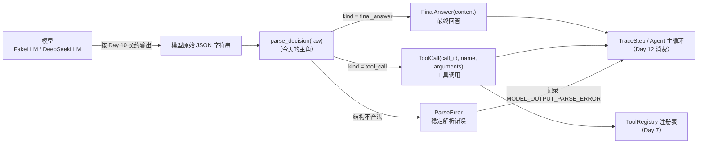
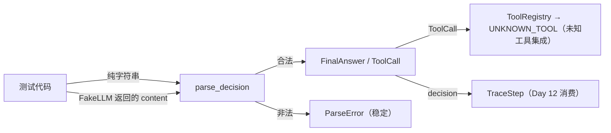
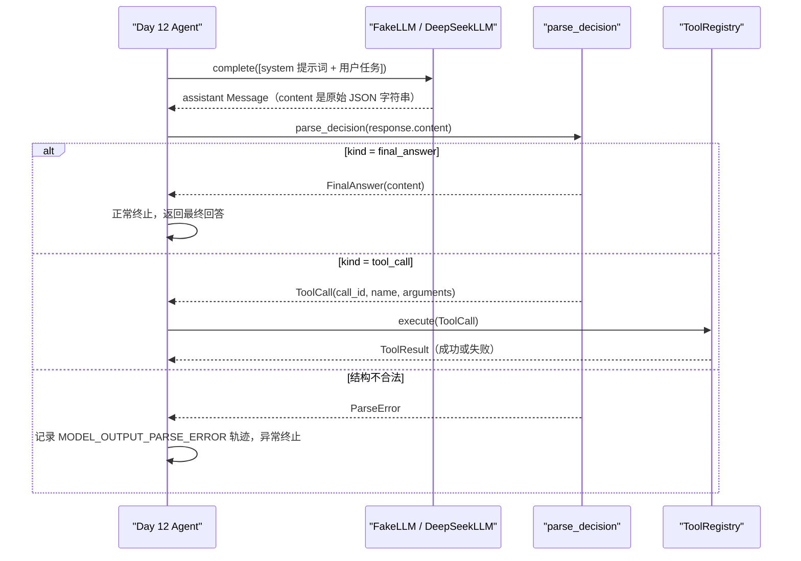

# Day 11：JSON 输出解析器代码导读

> 这篇文档怎么读（先看森林，再看树木）：
> - **第 0 步**：只看图，先建立整体印象，不要急着看代码；
> - **第 1 步**：认识解析器的输入输出与 Day 10 格式契约；
> - **第 2 步**：打开代码，按小节顺序逐段读；
> - **第 3 步**：看测试如何验证，最后回到森林图复查。

## 0. 先看森林：这一章到底在做什么

### 0.1 用大白话讲

模型不会直接返回 Python 对象，它返回的是一个字符串。Day 10 的提示词告诉
模型"你必须输出这两种形状的 JSON"，但收到字符串之后，系统还要验证它真的
长那样，才能把它当作 `FinalAnswer`（最终回答）或 `ToolCall`（工具调用）
使用。Day 11 雇一个**拆信员**：它把模型交来的"信"（字符串）拆开检查，按
信封上的标签（`kind`）决定是"最终回答"还是"工具调用"，再把内容装进项目
自己的数据容器。

拆信员有三个原则：**只拆信**（不做工具查找、不执行工具）、**只交完整结果**
（任何残缺都退回稳定错误）、**错误不吓人**（只报告哪类问题，不把原始异常
或堆栈甩给调用方）。

### 0.2 森林全景图



读法：从左上往右下看。**今天只关注中间这一列**：`Parser` 怎样把字符串变成
`FinalAnswer` 或 `ToolCall`，或在结构不合法时变成 `ParseError`。右侧的注册
表和轨迹是 Day 12 的消费位置，今天不实现。

### 0.3 一句话预告

一次 `parse_decision(raw)` 调用做三件事：

1. **检查输入与 JSON 结构**：非字符串直接拒绝；字符串必须能解析成 JSON 对象；
2. **看判别字段**：`kind` 必须是 `"final_answer"` 或 `"tool_call"`；
3. **按契约构造领域对象**：校验字段齐全、类型正确、没有多余字段，再构造
   `FinalAnswer` 或 `ToolCall`；任何一步失败都抛 `ParseError`。

同时，解析器**坚决不做**三件事：

- **不查注册表**：`name` 是任何字符串都接受，未知工具由 Day 7 注册表拒绝；
- **不执行工具**：拿到 `ToolCall` 就停下，执行是 Day 12 的事；
- **不吞掉错误**：非法输出全部变成稳定 `ParseError`，绝不返回残缺对象。

### 0.4 名词小词典（遇到不懂的词回来查）

| 名词 | 大白话解释 |
| --- | --- |
| 解析器（parser） | 把字符串按规则拆开并验证、转成项目对象的模块 |
| 判别字段（discriminator） | 用一个字段区分两种形状，本项目用 `kind` |
| 格式契约（format contract） | Day 10 写死的两种 JSON 形状，解析器照它检查 |
| 稳定错误（stable error） | 固定类别的错误，消息不依赖具体输入或异常文本 |
| 纯函数（pure function） | 相同输入永远相同输出，不访问网络、不改外部状态 |
| 领域对象（domain object） | 项目自己的"普通话"数据类型，如 `FinalAnswer`、`ToolCall` |
| 异常链（exception chain） | Python 里 `raise ... from ...` 形成的因果链；本项目用 `from None` 切断它 |

## 1. 认识新模块

### 1.1 parse_decision 一览表

| 成员 | 值/行为 |
| --- | --- |
| 输入 | 模型原始输出字符串 |
| 输出 | `FinalAnswer` 或 `ToolCall` |
| 非字符串输入 | 抛 `TypeError`（调用方错误） |
| 非法输出 | 抛 `ParseError`，`code` 为 `MODEL_OUTPUT_PARSE_ERROR` |
| 确定性 | 相同输入 → 相同结果；不访问网络、不读环境变量 |
| 合法字段 | `final_answer`：`kind` + `content`；`tool_call`：`kind` + `call_id` + `name` + `arguments` |
| 多余字段 | 一律拒绝 |

### 1.2 与 Day 10 的格式契约

Day 10 提示词要求模型输出两种互斥 JSON 形状，解析器按同一张表检查：

| 决策形态 | JSON 形状 | 解析器检查 |
| --- | --- | --- |
| 最终回答 | `{"kind": "final_answer", "content": "..."}` | `kind` 精确等于 `final_answer`；`content` 是非空字符串 |
| 工具调用 | `{"kind": "tool_call", "call_id": "...", "name": "...", "arguments": {...}}` | `kind` 精确等于 `tool_call`；`call_id`、`name` 是非空字符串；`arguments` 是 JSON 对象 |

## 2. 进入树木：按这个顺序读代码

建议顺序：

1. [parser.py](../../src/self_react/parser.py)（全文，核心只有一百多行）；
2. [test_parser.py](../../tests/test_parser.py)（考官）。

读 `parser.py` 时脑子里记着四个问题（这就是本段的骨架）：

1. 输入在哪里被检查？非字符串会发生什么？
2. `kind` 为什么是第一步看的字段？
3. 领域模型的 `ValidationError` 怎样变成稳定 `ParseError`？
4. 解析器**不**做什么？

### 2.1 第一站：稳定错误类型（`ParseError`）

```python
class ParseError(ValueError):
    """模型输出无法解析时抛出的稳定错误。

    ``code`` 固定为 ``TraceErrorCode.MODEL_OUTPUT_PARSE_ERROR``，方便 Day
    12 主循环把解析失败记录到轨迹错误中；错误消息只包含稳定说明，不携带
    原始异常对象、堆栈或模型原始输出。
    """

    code = TraceErrorCode.MODEL_OUTPUT_PARSE_ERROR

    def __init__(self, message: str) -> None:
        """保存面向调用方的稳定错误说明。"""

        super().__init__(message)
```

`ParseError` 继承 `ValueError`（值不对，属于数据问题），并带一个类属性
`code = TraceErrorCode.MODEL_OUTPUT_PARSE_ERROR`。这样 Day 12 捕获异常后，
不需要解析消息文本，直接读 `exc.code` 就能知道该记录哪个轨迹错误码。
消息本身由调用点传入固定中文说明，不含原始输入。

### 2.2 第二站：JSON 结构检查（`_parse_json_object`）

```python
def _parse_json_object(raw: str) -> dict[str, Any]:
    """把字符串解析成 JSON 对象；任何结构问题都转成稳定错误。"""

    try:
        data = json.loads(raw)
    except (TypeError, ValueError):
        raise ParseError("模型输出不是合法 JSON") from None

    if not isinstance(data, dict):
        raise ParseError("模型输出必须是 JSON 对象")
    return data
```

两步检查：

1. `json.loads` 把字符串变成 Python 数据。`"hello"`、`"{invalid"` 在这里抛
   `JSONDecodeError`（它是 `ValueError` 的子类），转成 `ParseError`；
2. 即使 JSON 合法，`[1, 2]`、`42`、`"text"`、`null`、`true` 都不是对象，
   也转成 `ParseError`。

`raise ... from None` 是关键细节：它**切断异常链**，调用方看不到底层解析
异常的堆栈，这正是"不泄漏原始异常"的实现手段。

### 2.3 第三站：多余字段检查（`_reject_unexpected_fields`）

```python
def _reject_unexpected_fields(data: dict[str, Any], allowed: set[str]) -> None:
    """拒绝格式契约之外的字段，防止模型夹带无法消费的内容。"""

    unexpected = sorted(set(data) - allowed)
    if unexpected:
        raise ParseError("模型输出包含格式契约之外的字段")
```

契约是精确形状，不是"至少包含这些字段"。两种决策各有自己的允许字段集合，
检查时把实际字段减掉允许字段，剩下的都是多余字段，一律拒绝。这样模型夹带
的任何额外内容都会被挡在领域对象之外。

### 2.4 第四站：构造最终回答（`_parse_final_answer`）

```python
def _parse_final_answer(data: dict[str, Any]) -> FinalAnswer:
    """按契约把 JSON 对象构造成 FinalAnswer。"""

    _reject_unexpected_fields(data, {"kind", "content"})

    if "content" not in data:
        raise ParseError("final_answer 缺少 content 字段")
    content = data["content"]
    if not isinstance(content, str):
        raise ParseError("content 必须是字符串")
    try:
        return FinalAnswer(content=content)
    except ValidationError:
        raise ParseError("content 必须是非空字符串") from None
```

检查顺序：先拒绝多余字段，再检查 `content` 存在、类型是字符串，最后交给
`FinalAnswer` 构造器做领域校验（非空）。`try/except ValidationError` 把
Pydantic 的校验细节变成一句稳定说明——空字符串或全空白会在这里变成
`content 必须是非空字符串`，调用方看不到 `ValidationError` 对象。

### 2.5 第五站：构造工具调用（`_parse_tool_call`）

```python
def _parse_tool_call(data: dict[str, Any]) -> ToolCall:
    """按契约把 JSON 对象构造成 ToolCall。"""

    _reject_unexpected_fields(data, {"kind", "call_id", "name", "arguments"})

    if "call_id" not in data:
        raise ParseError("tool_call 缺少 call_id 字段")
    if "name" not in data:
        raise ParseError("tool_call 缺少 name 字段")
    if "arguments" not in data:
        raise ParseError("tool_call 缺少 arguments 字段")

    call_id = data["call_id"]
    name = data["name"]
    arguments = data["arguments"]

    if not isinstance(call_id, str):
        raise ParseError("call_id 必须是字符串")
    if not isinstance(name, str):
        raise ParseError("name 必须是字符串")
    if not isinstance(arguments, dict):
        raise ParseError("arguments 必须是 JSON 对象")
    if not call_id.strip():
        raise ParseError("call_id 必须是非空字符串")
    if not name.strip():
        raise ParseError("name 必须是非空字符串")
    try:
        return ToolCall(call_id=call_id, name=name, arguments=arguments)
    except ValidationError:
        raise ParseError("arguments 必须只包含可 JSON 序列化的值") from None
```

比 `final_answer` 多两个细节：

1. `arguments` 必须是 JSON 对象（字典），数组、字符串、数字、`null` 全部
   拒绝；
2. `call_id` 和 `name` 还必须是**非空白**字符串——`""` 和 `"   "` 虽然类型
   对，但没有语义，契约要求"非空编号/精确名称"。

最后构造 `ToolCall` 时，领域模型还会校验 `arguments` 能否稳定 JSON
序列化：`{"value": NaN}` 这种 Python 允许但 JSON 规范不允许的值，会在
`ValidationError` 里被转成 `arguments 必须只包含可 JSON 序列化的值`。

### 2.6 第六站：主函数（`parse_decision`）

```python
def parse_decision(raw: str) -> FinalAnswer | ToolCall:
    """把模型原始 JSON 字符串解析成 FinalAnswer 或 ToolCall。

    只接受字符串输入；非法 JSON、JSON 不是对象、``kind`` 缺失或非法、字段
    缺失、类型错误和多余字段都抛 ``ParseError``。解析不访问网络、不读取
    环境变量，相同输入永远返回相同结果。
    """

    if not isinstance(raw, str):
        raise TypeError("parse_decision 只接受字符串输入")

    data = _parse_json_object(raw)

    if "kind" not in data:
        raise ParseError("模型输出缺少 kind 字段")
    kind = data["kind"]
    if not isinstance(kind, str):
        raise ParseError("kind 必须是字符串")

    if kind == _FINAL_ANSWER_KIND:
        return _parse_final_answer(data)
    if kind == _TOOL_CALL_KIND:
        return _parse_tool_call(data)
    raise ParseError("kind 只能是 final_answer 或 tool_call")
```

主函数非常薄，四步走：

1. **输入闸门**：`None`、数字、列表、字节串都抛 `TypeError`——这不是模型
   输出问题，而是调用方传错了类型；
2. **结构检查**：字符串必须解析成 JSON 对象；
3. **判别字段**：`kind` 必须存在且是字符串，这是区分两种决策的"信封标签"；
4. **分派**：等于 `final_answer` 走最终回答构造，等于 `tool_call` 走工具
   调用构造，其他值（如 `"answer"`、`"tool_calls"`）都抛稳定错误。

### 2.7 真实运行结果

用真实模型输出调用一次（这里用手写字符串代替模型返回）：

```text
parse_decision('{"kind": "final_answer", "content": "答案是 4。"}')
  -> FinalAnswer(kind='final_answer', content='答案是 4。')

parse_decision('{"kind": "tool_call", "call_id": "call-1", "name": "calculator", "arguments": {"expression": "2 + 2"}}')
  -> ToolCall(kind='tool_call', call_id='call-1', name='calculator', arguments={'expression': '2 + 2'})

parse_decision('hello')
  -> ParseError: 模型输出不是合法 JSON（code=MODEL_OUTPUT_PARSE_ERROR）

parse_decision('[1, 2]')
  -> ParseError: 模型输出必须是 JSON 对象

parse_decision('{"content": "答案"}')
  -> ParseError: 模型输出缺少 kind 字段

parse_decision('{"kind": "answer", "content": "答案"}')
  -> ParseError: kind 只能是 final_answer 或 tool_call

parse_decision('{"kind": "final_answer", "content": 123}')
  -> ParseError: content 必须是字符串

parse_decision('{"kind": "tool_call", "call_id": "c1", "name": "calculator"}')
  -> ParseError: tool_call 缺少 arguments 字段
```

错误消息全部是固定中文说明，没有原始输出、异常类名或堆栈。

## 3. 考官怎么看（测试）

测试就是给解析器出题的考官，全部使用纯字符串和 Fake LLM，不联网。56 个
用例最有代表性的几组：

1. **合法输入字段保持原样**：`final_answer` 的内容、`tool_call` 的编号/
   名称/嵌套参数逐字段等于构造的领域对象。
2. **确定性**：相同字符串解析两次结果完全一致；JSON 外部的空白不影响结果。
3. **结构边界**：非 JSON、JSON 不是对象、`kind` 缺失/为 `null`/为数字/
   为未知字符串，全部 `ParseError`。
4. **字段边界**：缺失字段、类型错误、空白 `content`/`call_id`/`name`、
   多余字段、`arguments` 含 `NaN`，全部 `ParseError`，绝不返回残缺对象。
5. **错误安全**：`ParseError.code` 对齐 `TraceErrorCode.MODEL_OUTPUT_PARSE_ERROR`；
   消息不含原始输入、`Traceback`、`ValidationError`。
6. **Fake LLM 三类输入**：合法 `final_answer`、合法 `tool_call`、缺字段都
   通过 `FakeLLM.complete` 返回的 content 走解析；未知工具由解析器正常
   解析成 `ToolCall`，再由注册表返回 `UNKNOWN_TOOL`。
7. **Day 12 消费**：解析结果可以直接放进 `TraceStep.decision`。



## 4. 回到森林：把整条路再走一遍

把今天学到的拼回未来 Day 12 的消费时序：



以及"解析器不做的事"检查清单：

- 看到 `name: "unknown_tool"`：**照常解析成 ToolCall**，不查注册表；
- 看到 `arguments: []`：**拒绝**，arguments 必须是 JSON 对象；
- 看到 `{"kind": "final_answer", "content": "答案", "extra": true}`：
  **拒绝**，多余字段超出契约；
- 看到 `hello` 或 `[1, 2]`：**返回稳定 ParseError**，不猜、不补全；
- 想执行工具、写轨迹、决定重试：**留给 Day 12**，解析器到领域对象为止。

自测题（能答上来就算学会）：

1. `parse_decision` 的输入和输出分别是什么？非字符串输入会怎样？
2. 为什么 `kind` 是解析器第一个看的字段？
3. `ValidationError` 为什么不会出现在调用方面前？
4. 解析器收到 `name: "unknown_tool"` 会怎样？谁负责拒绝它？
5. `{"kind": "final_answer", "content": "答案", "extra": true}` 为什么被拒绝？

自测题参考答案（先自己写，再对照）：

1. **输入是模型原始输出字符串，输出是 `FinalAnswer` 或 `ToolCall`。**
   非字符串输入（`None`、数字、列表、字节串）抛 `TypeError`——那是调用方
   传错类型，不是模型输出问题；字符串内容不合法才抛 `ParseError`。
2. **`kind` 是判别字段（信封标签）。** 两种 JSON 形状共用 `kind` 区分，
   Day 4 的 `Decision` 判别联合、Day 10 的提示词、Day 11 的解析器三方共用
   同一个键；先看它才能决定按哪张契约检查字段。
3. **构造领域对象时用 `try/except ValidationError` 转成 `ParseError`，并
   用 `from None` 切断异常链。** 因此调用方只看到稳定错误和固定中文说明，
   看不到 Pydantic 的校验细节和堆栈；测试专门断言消息不含
   `Traceback`/`ValidationError`。
4. **解析器照常解析成 `ToolCall`。** 解析器不知道注册表里有哪些工具，未知
   工具由 Day 7 注册表在分派阶段返回 `UNKNOWN_TOOL`，消息里列出被请求的
   工具名和可用工具名。
5. **因为契约是精确形状。** `final_answer` 只允许 `kind` 和 `content` 两个
   字段，`extra` 是多余字段；接受它会悄悄放宽 Day 10 的格式契约，领域模型
   本身也是 `extra="forbid"`。

## 5. 与 Day 12 的连接

Day 12 的 Agent 主循环会拿到 `LLM.complete` 返回的 assistant 消息，把
`response.content` 交给 `parse_decision`：

- 返回 `FinalAnswer`：循环正常终止，把内容作为最终回答；
- 返回 `ToolCall`：交给 Day 7 注册表执行，结果转成 `Observation` 写回上下文，
  再请求下一轮；
- 抛 `ParseError`：读取 `exc.code`
  （`TraceErrorCode.MODEL_OUTPUT_PARSE_ERROR`）记录 `TraceError` 轨迹步骤，
  并按默认策略终止。

解析器不修改 `LLM.complete`、领域模型、DeepSeek 适配器、Day 10 提示词或
三个已有工具；Day 12 只需要捕获 `ParseError` 并读取 `code`，就能把解析失败
放进既有的轨迹模型。
