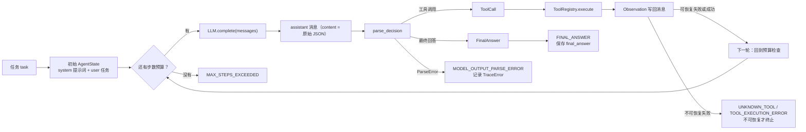
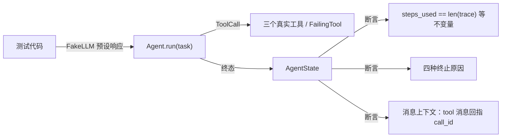
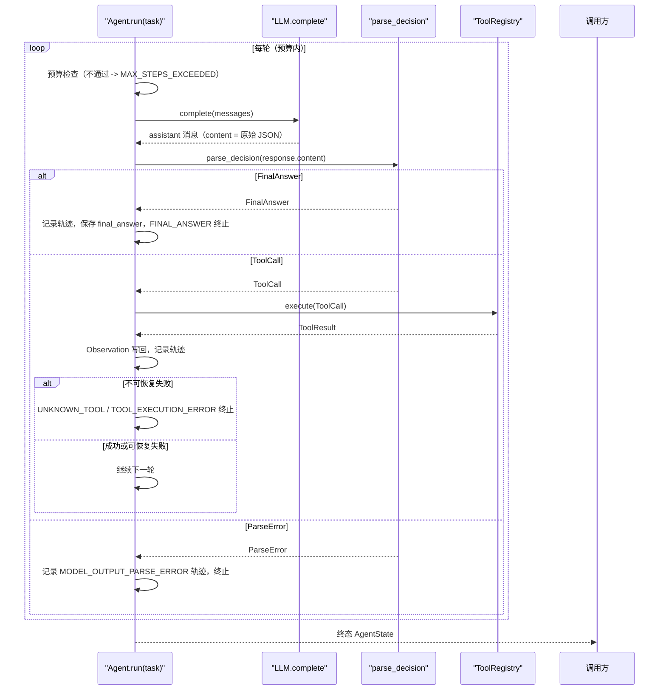

# Day 12：ReAct 主循环代码导读

> 这篇文档怎么读（先看森林，再看树木）：
> - **第 0 步**：只看图，先建立整体印象，不要急着看代码；
> - **第 1 步**：认识 `Agent` 的输入输出与四个终止分支；
> - **第 2 步**：打开代码，按小节顺序逐段读；
> - **第 3 步**：看测试如何验证，最后回到森林图复查。

## 0. 先看森林：这一章到底在做什么

### 0.1 用大白话讲

前面的日子把每个零件都做好了：模型接口（Day 5/6）、工具注册表（Day 7）、
提示词（Day 10）和解析器（Day 11）。但还没有一条**流水线**把它们按顺序接
起来。Day 12 的 `Agent` 就是流水线本身：它拿着一份任务，反复做同一件事——
把"当前消息上下文"交给模型，拿到模型输出的 JSON 字符串，拆成"最终回答"
或"工具调用"两种决策；要工具就执行并把结果写回上下文，再回到开头问模型，
直到有人给出最终回答、输出无法解析、工具失败不可恢复，或者步数预算花光。

流水线有两个铁规矩：

1. **只有一个控制者**：步数计数、预算检查和"该不该停"的判断全部由 `Agent`
   说了算，其他模块不能自己开重试循环；
2. **状态是记账本**：运行过程中所有需要留下的东西（任务、消息、工具名单、
   步数、轨迹、终止原因）都放进 `AgentState`，模型客户端和注册表这类"活的"
   资源绝不进状态。

### 0.2 森林全景图



读法：从左上往右下，再回到"预算检查"。**这一整张图就是 Day 12 的全部**：
循环在 `Budget` 那里转圈，四个出口分别对应四种终止原因。观察写回之后不是
直接结束，而是回到预算检查——这正是"循环"两个字的意义。

### 0.3 一句话预告

一次 `Agent.run(task)` 调用做五件事：

1. **开张**：用 Day 10 提示词渲染 system 消息，加上 user 任务，初始化
   `AgentState`；
2. **查预算**：每轮开始前检查是否还有剩余步数，没有就立刻以
   `MAX_STEPS_EXCEEDED` 结束；
3. **问模型**：调用 `LLM.complete(messages)`，把返回的 assistant 消息追加到
   上下文；
4. **拆决策**：用 Day 11 的 `parse_decision` 解析 `response.content`；
5. **分流**：最终回答 -> 正常结束；工具调用 -> 注册表执行 -> 观察写回 ->
   回到第 2 步；解析失败或不可恢复的工具失败 -> 异常结束。

同时，`Agent` **坚决不做**四件事：

- **不重试**：模型调用失败（如 Fake LLM 响应耗尽）按原样向上抛，不偷偷重试；
- **不流式、不异步、不持久化**：这些能力留给后续日期；
- **不修改其他模块**：`LLM.complete` 接口、领域模型、DeepSeek 适配器、提示词、
  解析器和三个工具全部原封不动；
- **不替模型猜**：解析失败就记录轨迹并终止，不补全、不改写模型输出。

### 0.4 名词小词典（遇到不懂的词回来查）

| 名词 | 大白话解释 |
| --- | --- |
| 主循环（main loop） | 反复执行"问模型 -> 拆决策 -> 执行工具 -> 写回观察"的循环 |
| 控制器（controller） | 决定"下一步做什么、什么时候停"的模块，本日指 `Agent` |
| 预算（budget） | `max_steps`，最多允许发起的模型决策轮数 |
| 终止原因（termination reason） | 运行停下时对外报告的最终原因，如 `FINAL_ANSWER` |
| 轨迹（trace） | 每次决策尝试的记录集合，由 `TraceStep` 组成 |
| 不可恢复（non-retryable） | 失败重试没有意义（如工具协议违约），必须终止 |
| 状态重建（rebuild） | 每轮用完整字段重新构造 `AgentState`，而不是逐个字段改 |

## 1. 认识新模块

### 1.1 Agent 一览表

| 成员 | 值/行为 |
| --- | --- |
| 构造参数 | `llm`（满足 `LLM` 协议）、`registry`（`ToolRegistry`）、`max_steps`（非负整数） |
| 公开入口 | `run(task: str) -> AgentState` |
| 首轮上下文 | system（Day 10 提示词）+ user（任务） |
| 终止分支 | `FINAL_ANSWER`、`MODEL_OUTPUT_PARSE_ERROR`、`UNKNOWN_TOOL`/`TOOL_EXECUTION_ERROR`、`MAX_STEPS_EXCEEDED` |
| 轨迹 | 每轮至少一个 `TraceStep`，含输入摘要、决策/观察/错误、耗时 |
| 确定性 | 相同 Fake LLM + 相同注册表 + 相同任务 -> 相同终态 |
| 不做 | 重试、流式、异步、持久化、并行调度、修改其他模块 |

### 1.2 四个终止分支对照表

| 情况 | 记录什么 | 终止原因 |
| --- | --- | --- |
| 模型给出最终回答 | `TraceStep(decision=FinalAnswer)`，保存 `final_answer` | `FINAL_ANSWER` |
| 模型输出无法解析 | `TraceStep(error=TraceError(...))`，`code=MODEL_OUTPUT_PARSE_ERROR` | `MODEL_OUTPUT_PARSE_ERROR` |
| 工具失败且 `retryable=False` | `TraceStep(decision=ToolCall, observation=失败观察)` | `UNKNOWN_TOOL` 或 `TOOL_EXECUTION_ERROR` |
| 预算耗尽 | 已有轨迹原样保留，不追加伪造步骤 | `MAX_STEPS_EXCEEDED` |

可恢复的工具失败**不在这张表里**：它先作为 `Observation` 写回消息，回到预算
检查继续循环；只有预算随之耗尽才轮到上表第四行。

## 2. 进入树木：按这个顺序读代码

建议顺序：

1. [agent.py](../../src/self_react/agent.py)（全文，核心约一百四十行）；
2. [test_agent.py](../../tests/test_agent.py)（考官）。

读 `agent.py` 时脑子里记着四个问题（这就是本段的骨架）：

1. 预算检查为什么放在每轮最前面？
2. 三种决策结果分别走哪条路，记录什么轨迹？
3. 为什么每轮用 `_rebuild_state` 重建状态而不是原地改字段？
4. 可恢复的工具失败什么时候才变成终止原因？

### 2.1 第一站：输入摘要（`_summarize_input`）

```python
def _summarize_input(state: AgentState) -> str:
    """生成一轮模型输入的摘要。"""

    for message in reversed(state.messages):
        if message.role is MessageRole.TOOL:
            return message.content[:_SUMMARY_LIMIT]
    return state.task[:_SUMMARY_LIMIT]
```

模型每一轮真正"新增"的输入是最近一条工具观察（上一轮执行工具的结果）；首轮
还没有观察，就用任务文本。从消息末尾往前找第一条 `tool` 消息，找到就用它的
内容，找不到就退回任务。`_SUMMARY_LIMIT = 2_000` 与 `TraceStep.input_summary`
的领域上限一致，先截断再构造轨迹，避免校验报错。

### 2.2 第二站：终止原因映射（`_termination_reason_for`）

```python
def _termination_reason_for(result: ToolResult) -> TerminationReason:
    """把不可恢复的工具失败映射为稳定终止原因。"""

    if result.error is not None and result.error.code is ToolErrorCode.UNKNOWN_TOOL:
        return TerminationReason.UNKNOWN_TOOL
    return TerminationReason.TOOL_EXECUTION_ERROR
```

不可恢复失败按错误码分两类：未知工具记 `UNKNOWN_TOOL`，其余（主要是
`TOOL_EXECUTION_ERROR`）记 `TOOL_EXECUTION_ERROR`。`INVALID_ARGUMENTS` 在注册表
里永远 `retryable=True`，不会走到这里，所以不需要单独映射。

### 2.3 第三站：构造参数校验（`__init__`）

```python
if not isinstance(llm, LLM):
    raise TypeError("llm 必须满足 LLM 协议")
if not isinstance(registry, ToolRegistry):
    raise TypeError("registry 必须是 ToolRegistry")
if isinstance(max_steps, bool) or not isinstance(max_steps, int):
    raise ValueError("max_steps 必须是非负整数")
if max_steps < 0:
    raise ValueError("max_steps 必须是非负整数")
```

三个校验点：`llm` 必须满足 Day 5 的 `LLM` 协议（Fake LLM、DeepSeekLLM 都行，
测试里的独立适配器也行）；`registry` 必须是 `ToolRegistry` 实例；`max_steps`
必须是非负整数——布尔值 `True` 在 Python 里是 `int` 子类，所以单独拒绝。

### 2.4 第四站：开张（`run` 的前半段）

```python
tool_names = tuple(self._registry.names)
tools = [tool for name in tool_names if (tool := self._registry.get(name)) is not None]
messages = [
    Message(role=MessageRole.SYSTEM, content=render_system_prompt(tools)),
    Message(role=MessageRole.USER, content=task),
]
```

从注册表取出全部工具名，再用 `get` 拿到工具对象交给 Day 10 的
`render_system_prompt` 渲染 system 消息。`messages` 一开始只有两条：system
提示词和 user 任务。`_rebuild_state` 用这些字段构造初始 `AgentState`
（`steps_used=0`、`trace=[]`）。

### 2.5 第五站：预算闸门（循环开头）

```python
while not state.is_terminated:
    if state.steps_used >= state.max_steps:
        state = self._rebuild_state(
            ...
            termination_reason=TerminationReason.MAX_STEPS_EXCEEDED,
        )
        break
```

预算检查永远在**调用模型之前**，这是"绝不发起第 `max_steps + 1` 次模型调用"
的物理保证。`max_steps=0` 时第一次循环就命中这里，直接返回空轨迹的
`MAX_STEPS_EXCEEDED` 终态。`while not state.is_terminated` 是外层出口，四个
终止分支都会给状态盖上终止原因，循环随之自然结束。

### 2.6 第六站：问模型 + 解析（每轮正文开头）

```python
step_number = state.steps_used + 1
input_summary = _summarize_input(state)
started = time.perf_counter()
response = self._llm.complete(messages)
duration_ms = (time.perf_counter() - started) * 1_000.0
messages.append(response)

try:
    decision = parse_decision(response.content)
except ParseError as exc:
    ...
```

一轮 = 一次模型调用 = 一个 `TraceStep`。先记录本轮编号和输入摘要，用
`perf_counter` 量出耗时，把模型返回的 assistant 消息追加进上下文，然后交给
Day 11 解析器。`LLM.complete` 只被这里调用一次，`Agent` 绝不因为它抛异常就
自行重试。

### 2.7 第七站：解析失败分支

```python
step = TraceStep(
    step_number=step_number,
    input_summary=input_summary,
    error=TraceError(
        code=exc.code,
        message=str(exc),
        retryable=False,
    ),
    duration_ms=duration_ms,
)
state = self._rebuild_state(
    ...
    termination_reason=TerminationReason.MODEL_OUTPUT_PARSE_ERROR,
)
break
```

`ParseError.code` 固定是 `TraceErrorCode.MODEL_OUTPUT_PARSE_ERROR`，直接写进
轨迹错误；`message` 用解析器的稳定中文说明，不携带模型原始输出；`retryable`
固定 `False`（MVP 默认策略不重试）。`TraceStep` 只带 `error`，`decision` 和
`observation` 都是 `None`——这就是"不伪造决策"。

### 2.8 第八站：最终回答分支

```python
if isinstance(decision, FinalAnswer):
    step = TraceStep(
        step_number=step_number,
        input_summary=input_summary,
        decision=decision,
        duration_ms=duration_ms,
    )
    state = self._rebuild_state(
        ...
        final_answer=decision,
        termination_reason=TerminationReason.FINAL_ANSWER,
    )
    break
```

最终回答分支同时做两件事：把 `FinalAnswer` 写进轨迹（`decision`），并把它保存
到状态的 `final_answer` 字段，终止原因盖 `FINAL_ANSWER`。Day 4 校验器要求
"只有 `FINAL_ANSWER` 才能有 `final_answer`"，这里一次构造同时给两个字段，
天然满足。

### 2.9 第九站：工具调用分支（循环的核心）

```python
result = self._registry.execute(decision)
observation = Observation.from_tool_result(result)
messages.append(observation.as_message())
step = TraceStep(
    step_number=step_number,
    input_summary=input_summary,
    decision=decision,
    observation=observation,
    duration_ms=duration_ms,
)
terminated = (
    not result.is_success
    and result.error is not None
    and not result.error.retryable
)
state = self._rebuild_state(
    ...
    termination_reason=(
        _termination_reason_for(result) if terminated else None
    ),
)
```

这是"模型 -> 解析 -> 工具 -> Observation -> 模型"的中间环节：

1. `registry.execute(decision)` 把 `ToolCall` 变成 `ToolResult`（成功或失败都
   有稳定结构）；
2. `Observation.from_tool_result` 把结果转成模型可读的观察；
3. `observation.as_message()` 生成 `tool` 角色消息，追加到 `messages`，下一轮
   模型就能看到；
4. `TraceStep` 同时记 `decision` 和 `observation`，Day 4 校验器保证观察回指
   同一个 `call_id`；
5. 只有 `retryable=False` 的失败才立即终止，否则这一轮结束、循环继续。

可恢复失败（含未知工具）走完这条分支后，`termination_reason` 仍是 `None`，
`while not state.is_terminated` 把循环带回预算闸门。这就是"先作为 Observation
回写、预算内继续"的实现位置。

### 2.10 第十站：状态重建（`_rebuild_state`）

```python
def _rebuild_state(
    self,
    *,
    task,
    tool_names,
    messages,
    steps_used,
    trace,
    final_answer=None,
    termination_reason=None,
) -> AgentState:
    return AgentState(
        task=task,
        messages=list(messages),
        available_tools=list(tool_names),
        max_steps=self._max_steps,
        steps_used=steps_used,
        trace=list(trace),
        final_answer=final_answer,
        termination_reason=termination_reason,
    )
```

`AgentState` 开了 `validate_assignment=True`，且校验器要求"只有 `FINAL_ANSWER`
才能提供 `final_answer`"——逐字段原地赋值会卡在过渡态。所以每一轮结束时把
消息、轨迹、步数和终止信息**一次性**交给构造器，让 Pydantic 整体校验。这样
每个中间状态和终态都满足 `steps_used == len(trace)` 与 `steps_used <=
max_steps`。

### 2.11 真实运行结果

用 Fake LLM 预设三次响应跑一次（这里用手写字符串代替模型输出）：

```text
Agent(llm=FakeLLM([...]), registry=三工具注册表, max_steps=3).run("综合任务")

第 1 轮：{"kind": "tool_call", "call_id": "call-1", "name": "calculator",
         "arguments": {"expression": "2 * 3"}}
  -> 注册表返回 content="6" -> Observation 写回 -> 继续
第 2 轮：{"kind": "tool_call", "call_id": "call-2", "name": "retrieve",
         "arguments": {"query": "react"}}
  -> 注册表返回知识库条目 -> Observation 写回 -> 继续
第 3 轮：{"kind": "final_answer", "content": "计算完成并查到了资料。"}
  -> 保存 final_answer，终止原因 FINAL_ANSWER

终态：steps_used == len(trace) == 3，trace 依次为
  TraceStep(decision=ToolCall(call-1), observation=成功观察)
  TraceStep(decision=ToolCall(call-2), observation=成功观察)
  TraceStep(decision=FinalAnswer("计算完成并查到了资料。"))
```

模型输出 `"这不是 JSON"` 时：

```text
第 1 轮：parse_decision 抛 ParseError
  -> TraceStep(error=TraceError(MODEL_OUTPUT_PARSE_ERROR, ...))
  -> 终止原因 MODEL_OUTPUT_PARSE_ERROR，不调用任何工具
```

## 3. 考官怎么看（测试）

测试全部通过公开缝 `Agent.run(task) -> AgentState` 出题，只用 Fake LLM、三个
真实工具和一个确定性失败工具，不联网。24 个用例最有代表性的几组：

1. **任务直达最终回答**：一轮结束，`termination_reason=FINAL_ANSWER` 且带
   `final_answer`，`llm.call_count == 1`，没有工具观察。
2. **单轮/多轮工具调用**：`ToolCall -> ToolResult -> Observation` 写回 ->
   下一轮；断言 tool 消息按顺序出现、`tool_call_id` 回指、第二轮模型调用能
   看到观察，`steps_used == len(trace)`。
3. **步数耗尽**：`max_steps=2` 只预设 2 条工具响应，断言 `llm.call_count ==
   2`，绝不发起第 3 次模型调用，返回 `MAX_STEPS_EXCEEDED` 与已有轨迹。
4. **解析失败**：记录 `MODEL_OUTPUT_PARSE_ERROR` 轨迹步骤，`decision` 为
   `None`，消息不泄漏原始输出。
5. **未知工具与工具失败**：先作为 `Observation`（含错误码与 `retryable`）
   回写，预算内继续到最终回答；预算耗尽则以 `MAX_STEPS_EXCEEDED` 结束。
6. **不可恢复失败终止**：确定性 `FailingTool` 抛
   `ToolExecutionError(retryable=False)`，终止原因 `TOOL_EXECUTION_ERROR`。
7. **状态不变量**：参数化四种终止路径，全部断言 `steps_used == len(trace)`
   且不超预算。
8. **构造校验**：负数、浮点、布尔 `max_steps`、非 LLM、非注册表都被拒绝；
   任何满足 `LLM` 协议的独立适配器都可以替换。



## 4. 回到森林：把整条路再走一遍



"循环控制器拥有唯一步数计数与终止判断"的检查清单：

- 预算检查：只在 `run` 的循环开头，模型调用之前；
- 终止原因：只在 `run` 的四个分支里写入，其他模块无权修改；
- 轨迹：每轮由 `run` 追加一个 `TraceStep`，`_rebuild_state` 保证状态一致；
- 可恢复失败：先写观察继续循环，绝不在工具层直接"判死刑"；
- 想重试、流式、异步、持久化：都不在本日范围，后续日期再接。

自测题（能答上来就算学会）：

1. `Agent.run` 的输入和输出分别是什么？`max_steps=0` 会发生什么？
2. 为什么预算检查必须放在每轮模型调用之前？
3. `ParseError` 分支为什么 `TraceStep` 里没有 `decision`？
4. 未知工具会被立即终止吗？什么情况下它才会成为终止原因？
5. `AgentState` 为什么每轮都要重建而不是原地改字段？

自测题参考答案（先自己写，再对照）：

1. **输入是任务字符串，输出是终态 `AgentState`。** `max_steps=0` 时第一次循环
   就命中预算闸门，直接返回空轨迹、终止原因为 `MAX_STEPS_EXCEEDED` 的状态，
   一次模型调用都不会发起。
2. **因为"步数预算"定义的是一次模型决策轮数。** 只有先检查剩余预算，才能保证
   恰好消耗完 `max_steps` 后绝不发起第 `max_steps + 1` 次调用；测试用
   `llm.call_count == max_steps` 验证这一点。
3. **因为解析失败意味着没有合法的决策可记。** `TraceStep` 只带
   `error=TraceError(MODEL_OUTPUT_PARSE_ERROR, ...)`，`decision` 和
   `observation` 都是 `None`，这才是"不伪造决策、不猜测修补"。
4. **不会立即终止。** 注册表对未知工具返回 `UNKNOWN_TOOL` 且 `retryable=True`，
   主循环先把它写成 `Observation` 回写，预算内继续；只有预算随后耗尽（得到
   `MAX_STEPS_EXCEEDED`）或失败本身不可恢复时，才成为终止原因。
5. **因为 `AgentState` 开了 `validate_assignment`，且校验器要求只有
   `FINAL_ANSWER` 才能提供 `final_answer`。** 原地逐字段赋值会卡在"先赋哪个
   都违反校验"的过渡态；一次性重建让构造器整体校验，每个中间状态都满足
   `steps_used == len(trace)` 与 `steps_used <= max_steps`。

## 5. 与 Day 13 的连接

Day 12 已经把主循环跑通，`AgentState.trace` 里积累了每一轮的输入摘要、决策、
观察、错误和耗时，但还没有人把它展示给人看。Day 13 的"状态与轨迹"会消费这些
`TraceStep`：输出人类可读的 trace、设计每次运行都能被复述的展示方式，并决定
轨迹中哪些内容该隐藏、哪些该保留。主循环的接口和状态结构不需要为展示而改动，
这正是"领域模型 -> 主循环 -> 展示层"各管一段的边界。
