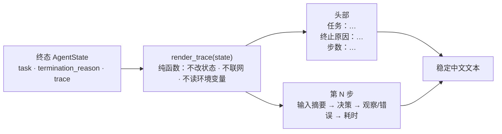
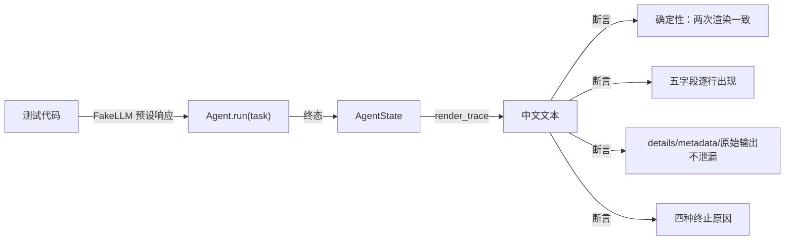
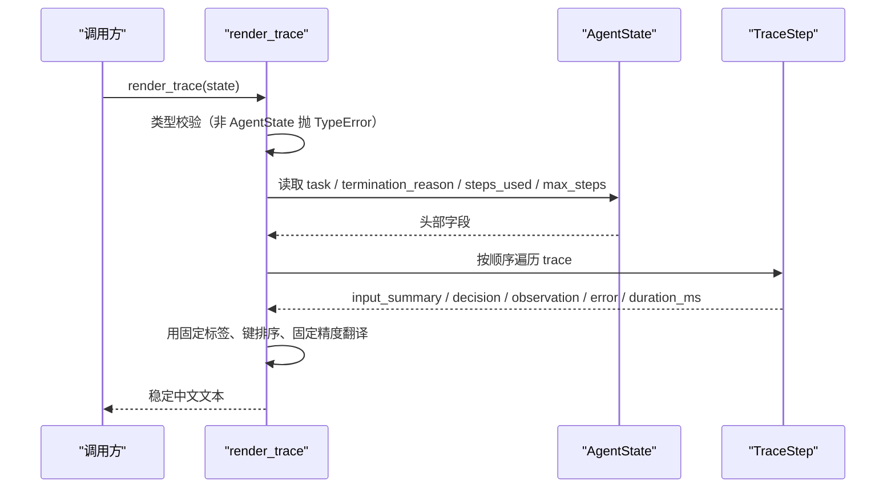

# Day 13：人类可读轨迹渲染代码导读

> 这篇文档怎么读（先看森林，再看树木）：
> - **第 0 步**：只看图，先建立整体印象，不要急着看代码；
> - **第 1 步**：认识 `render_trace` 的输入输出与四类轨迹形态；
> - **第 2 步**：打开代码，按小节顺序逐段读；
> - **第 3 步**：看测试如何验证，最后回到森林图复查。

## 0. 先看森林：这一章到底在做什么

### 0.1 用大白话讲

Day 12 把"问模型 -> 拆决策 -> 执行工具 -> 写回观察"的主循环跑通了，每轮
都在 `AgentState.trace` 里记下输入摘要、决策、观察、错误和耗时。但这些记录
是 Pydantic 对象，打印出来是 `TraceStep(step_number=1, ...)` 这样的东西，
只有程序读得顺。Day 13 加了一个**展示层**：一个叫 `render_trace` 的纯函数，
把一份终态状态变成一份能直接读的中文"运行记录单"。

展示层有两个铁规矩：

1. **只读不判**：它只把状态里已有的字段翻译成文本，不改状态、不做决策、
   不调用模型和工具；所以它永远不可能把一次运行"改坏"；
2. **相同状态永远相同输出**：标签怎么翻译、参数怎么排序、耗时怎么格式化
   全是固定规则，不会因为字典插入顺序或运行次数而变化。

### 0.2 森林全景图



读法：从左到右。`render_trace` 接收终态状态，拆成两部分——头部（任务、
终止原因、步数预算）和按顺序排列的每一步；最后拼成一段完整文本。**这一整
段就是 Day 13 的全部**：没有循环、没有分支决策，只有"翻译 + 拼接"。

### 0.3 一句话预告

一次 `render_trace(state)` 调用做三件事：

1. **验输入**：不是 `AgentState` 就抛 `TypeError`；
2. **渲染头部**：任务、终止原因（中文标签 + 英文代码）、步数预算；
3. **逐步骤渲染**：每一步依次是输入摘要、决策、观察、错误、耗时，步骤之间
   用空行隔开。

同时，展示层**坚决不做**四件事：

- **不修改其他模块**：`LLM.complete` 接口、领域模型、DeepSeek 适配器、提示词、
  解析器、`Agent` 主循环和三个工具全部原封不动；
- **不打印调试细节**：`TraceError.details`、`Observation.metadata`、模型原始
  输出和调试堆栈一概不渲染；
- **不访问网络、不读环境变量**：渲染是纯函数，输入只有状态本身；
- **不接入 CLI**：命令行参数展示留给 Day 15。

### 0.4 名词小词典（遇到不懂的词回来查）

| 名词 | 大白话解释 |
| --- | --- |
| 展示层（rendering layer） | 只负责把数据"翻译"给人看的模块，本日指 `trace.py` |
| 纯函数（pure function） | 同样的输入永远返回同样的输出，且不改变任何外部状态 |
| 确定性（deterministic） | 输出只由输入决定，与运行次数、字典顺序、环境无关 |
| 标签映射（label mapping） | 枚举代码（如 `FINAL_ANSWER`）到中文说明（如"最终回答"）的固定对照表 |
| 键排序（key sorting） | 把参数字典按键名排序后再转 JSON，保证顺序稳定 |
| 字段一一对应 | 轨迹步骤里的每个字段都能在渲染文本里找到对应的行 |

## 1. 认识新模块

### 1.1 trace 一览表

| 成员 | 值/行为 |
| --- | --- |
| 公开入口 | `render_trace(state: AgentState) -> str` |
| 输入 | Day 12 的终态 `AgentState`（含 `trace`） |
| 输出 | 稳定中文文本：头部 + 按顺序排列的步骤 |
| 每步字段 | 输入摘要、决策、观察、错误、耗时（与 `TraceStep` 一致） |
| 决策形态 | 最终回答（回答内容）或工具调用（工具名、调用编号、参数 JSON） |
| 观察形态 | 成功/失败；失败附带错误码中文标签与可重试标记 |
| 错误形态 | 错误码中文标签 + 稳定说明 + 可重试标记 |
| 安全 | 隐藏 `details`、`metadata`、模型原始输出、调试堆栈 |
| 不做 | 修改状态、调用模型/工具、联网、读环境变量、改 CLI |

### 1.2 四类轨迹对照表

| 轨迹形态 | 渲染出来的样子（节选） |
| --- | --- |
| 最终回答 | `决策：最终回答` + `回答内容：…` |
| 工具调用（成功） | `决策：调用工具 calculator` + `观察（成功）：4` |
| 工具调用（失败/未知工具） | `观察（失败）：…` + `错误码：工具执行失败（TOOL_EXECUTION_ERROR）` + `可重试：是` |
| 解析失败 | `错误：模型输出解析失败（MODEL_OUTPUT_PARSE_ERROR）：…` + `可重试：否` |
| 步数耗尽 | 头部 `终止原因：步数耗尽（MAX_STEPS_EXCEEDED）`，已有步骤原样保留 |

## 2. 进入树木：按这个顺序读代码

建议顺序：

1. [`trace.py`](../../src/self_react/trace.py)（全文，核心约一百四十行）；
2. [`test_trace.py`](../../tests/test_trace.py)（考官）。

读 `trace.py` 时脑子里记着三个问题（这就是本段的骨架）：

1. 确定性来自哪三处固定约定？
2. 每个 `TraceStep` 的五个字段分别在哪一行渲染？
3. 调试细节（`details`、`metadata`）为什么被刻意隐藏？

### 2.1 第一站：三张标签映射表

```python
_TERMINATION_LABELS: dict[TerminationReason, str] = {
    TerminationReason.FINAL_ANSWER: "最终回答",
    TerminationReason.MAX_STEPS_EXCEEDED: "步数耗尽",
    ...
}
_TRACE_ERROR_LABELS: dict[TraceErrorCode, str] = {...}
_TOOL_ERROR_LABELS: dict[ToolErrorCode, str] = {...}
```

三张表分别翻译终止原因、轨迹错误码和工具错误码。它们是**模块级常量**，不会
随运行变化，这是确定性的第一处来源。新枚举值若未来加入，`_labeled` 的兜底
分支会直接显示英文代码，不会崩溃。

### 2.2 第二站：三个小工具函数（`_labeled` / `_format_duration` / `_format_json`）

```python
def _labeled(value, labels):
    ...
    return f"{label}（{name}）"


def _format_duration(duration_ms):
    if duration_ms is None:
        return "（未记录）"
    text = f"{duration_ms:.{_DURATION_PRECISION}f}".rstrip("0").rstrip(".")
    return f"{text} 毫秒"


def _format_json(value):
    return json.dumps(value, ensure_ascii=False, sort_keys=True)
```

三个函数对应确定性的三处来源：

- `_labeled` 把枚举值变成 `中文标签（英文代码）`，例如
  `最终回答（FINAL_ANSWER）`；
- `_format_duration` 固定三位小数再去尾零：`12.5` -> `12.5 毫秒`，
  `10.0` -> `10 毫秒`；`None` -> `（未记录）`；
- `_format_json` 用 `sort_keys=True` 按键名排序，`{"b": 1, "a": 2}` 和
  `{"a": 2, "b": 1}` 渲染结果完全相同。

### 2.3 第三站：头部（`_render_header`）

```python
def _render_header(state):
    reason = state.termination_reason
    reason_text = (
        _labeled(reason, _TERMINATION_LABELS) if reason is not None else "（未终止）"
    )
    return "\n".join(
        [
            f"任务：{state.task}",
            f"终止原因：{reason_text}",
            f"步数：{state.steps_used} / {state.max_steps}",
        ]
    )
```

头部只有三行：任务、终止原因、步数预算。`终止原因：最终回答（FINAL_ANSWER）`
这类写法同时给了人读的中文和程序对照的枚举值。`Agent.run` 返回的都是已终止
状态，`（未终止）` 只是防御分支。

### 2.4 第四站：决策、观察与错误（三个渲染函数）

```python
def _render_decision(decision):
    if isinstance(decision, FinalAnswer):
        return ["决策：最终回答", f"回答内容：{decision.content}"]
    if isinstance(decision, ToolCall):
        return [
            f"决策：调用工具 {decision.name}",
            f"调用编号：{decision.call_id}",
            f"参数：{_format_json(decision.arguments)}",
        ]


def _render_observation(observation):
    status = "成功" if not observation.is_error else "失败"
    lines = [f"观察（{status}）：{observation.content}"]
    if observation.is_error:
        lines.append(f"错误码：{_labeled(observation.error_code, _TOOL_ERROR_LABELS)}")
        lines.append(f"可重试：{'是' if observation.retryable else '否'}")
    return lines


def _render_error(error):
    return [
        f"错误：{_labeled(error.code, _TRACE_ERROR_LABELS)}：{error.message}",
        f"可重试：{'是' if error.retryable else '否'}",
    ]
```

三个函数分别负责一个字段区域：

- 决策：`FinalAnswer` 走"最终回答 + 回答内容"，`ToolCall` 走"工具名 + 调用
  编号 + 键排序参数"；
- 观察：用 `is_error` 区分成功/失败；失败观察额外渲染错误码中文标签和
  `retryable`（这也是"可恢复失败先写回观察"在展示层的体现）；
- 错误：解析失败等轨迹错误渲染为 `错误：中文标签（代码）：稳定说明`，只带
  面向调用方的 message，不带 `details`。

### 2.5 第五站：一个步骤（`_render_step`）

```python
def _render_step(step):
    lines = [f"第 {step.step_number} 步"]
    if step.input_summary is None:
        lines.append("输入摘要：（无）")
    else:
        lines.append(f"输入摘要：{step.input_summary}")
    if step.decision is not None:
        lines.extend(_render_decision(step.decision))
    if step.observation is not None:
        lines.extend(_render_observation(step.observation))
    if step.error is not None:
        lines.extend(_render_error(step.error))
    lines.append(f"耗时：{_format_duration(step.duration_ms)}")
    return "\n".join(lines)
```

这是"字段一一对应"的实现位置：行顺序与 `TraceStep` 字段顺序完全一致——
`step_number`、`input_summary`、`decision`、`observation`、`error`、
`duration_ms`。可选字段（决策/观察/错误）为 `None` 时整段跳过，`None` 的
输入摘要和耗时用占位符，保证每步至少有一行可读内容。

### 2.6 第六站：公开入口（`render_trace`）

```python
def render_trace(state):
    if not isinstance(state, AgentState):
        raise TypeError("render_trace 只接受 AgentState")

    sections = [_render_header(state)]
    sections.extend(_render_step(step) for step in state.trace)
    return "\n\n".join(sections)
```

入口只做三件事：校验类型、把头部和每一步分别渲染、用空行拼接。空轨迹
（`max_steps=0`）时 `sections` 只有头部，输出三行，不伪造任何步骤。

### 2.7 真实运行结果

用 Fake LLM 预设三次响应跑一次（这里用手写字符串代替模型输出）：

```text
Agent(llm=FakeLLM([...]), registry=计算器+检索注册表, max_steps=3)
  .run("计算 2 + 2，并检索 react 主题")

任务：计算 2 + 2，并检索 react 主题
终止原因：最终回答（FINAL_ANSWER）
步数：3 / 3

第 1 步
输入摘要：计算 2 + 2，并检索 react 主题
决策：调用工具 calculator
调用编号：call-1
参数：{"expression": "2 + 2"}
观察（成功）：4
耗时：0.029 毫秒

第 2 步
输入摘要：4
决策：调用工具 retrieve
调用编号：call-2
参数：{"query": "react"}
观察（成功）：ReAct（Reason + Act）是一种让模型推理与行动交错的智能体范式……
耗时：0.04 毫秒

第 3 步
输入摘要：ReAct（Reason + Act）是一种让模型推理与行动交错的智能体范式……
决策：最终回答
回答内容：计算完成，并查到了 ReAct 的说明。
耗时：0.038 毫秒
```

模型输出 `"这不是 JSON"` 时：

```text
任务：任务
终止原因：模型输出解析失败（MODEL_OUTPUT_PARSE_ERROR）
步数：1 / 3

第 1 步
输入摘要：任务
错误：模型输出解析失败（MODEL_OUTPUT_PARSE_ERROR）：模型输出不是合法 JSON
可重试：否
耗时：0.026 毫秒
```

注意第二段里没有 `这不是 JSON` 这几个字：解析器早就把原始输出滤掉了，渲染层
只展示稳定错误说明。

## 3. 考官怎么看（测试）

测试全部通过公开缝 `render_trace(state) -> str` 出题，只用 Fake LLM、三个
真实工具和一个确定性失败工具，不联网。18 个用例最有代表性的几组：

1. **精确输出**：直接构造确定性的 `AgentState`（固定耗时），断言整段文本逐字
   相等，锁定格式本身不会漂移。
2. **确定性**：同一个状态渲染两次完全一致；两个参数键插入顺序相反的
   `ToolCall` 渲染结果一致（`sort_keys` 生效）。
3. **字段一一对应**：工具调用步骤断言输入摘要、决策、调用编号、参数、成功
   观察和耗时逐行出现；失败观察断言错误码中文标签与可重试标记。
4. **四类轨迹**：最终回答、工具调用、解析失败、步数耗尽各有对应用例，空轨迹
   只输出头部三行。
5. **端到端**：用 `Agent.run` 真实跑完再渲染，覆盖任务直达最终回答、多轮
   三个真实工具、解析失败、步数耗尽、未知工具后恢复、可恢复失败后恢复、
   不可恢复失败终止。
6. **安全**：构造带 `details={"raw_output": ...}` 与 `metadata={"debug": ...}`
   的步骤，断言渲染文本不含这些调试内容；解析失败端到端断言原始输出不泄漏。
7. **类型校验**：`render_trace(object())` 抛 `TypeError`。



## 4. 回到森林：把整条路再走一遍



"展示层只读不判、永远确定"的检查清单：

- 输入：只有 `AgentState`，其他类型被拒绝；
- 输出：头部 + 步骤，每步五字段顺序固定，步骤顺序与 `trace` 一致；
- 确定性：标签映射固定、参数键排序、耗时固定精度；
- 安全：不渲染 `details`、`metadata`、模型原始输出、调试堆栈；
- 边界：不改状态、不调模型/工具、不联网、不读环境变量、不改 CLI。

自测题（能答上来就算学会）：

1. `render_trace` 的输入和输出分别是什么？空轨迹会输出什么？
2. 确定性来自哪三处固定约定？
3. 为什么参数 JSON 要 `sort_keys=True`？
4. 失败观察和解析错误在渲染上有什么不同？
5. 为什么渲染层不展示 `TraceError.details` 和 `Observation.metadata`？

自测题参考答案（先自己写，再对照）：

1. **输入是终态 `AgentState`，输出是稳定中文文本。** 空轨迹（`max_steps=0`）
   只输出头部三行：任务、终止原因、步数，不伪造任何步骤。
2. **枚举值到中文标签的固定映射、参数 JSON 按键排序、耗时固定三位小数并去
   尾零。** 三者都由模块级常量或固定格式化规则决定，与运行次数和字典插入
   顺序无关。
3. **因为同一个字典只是键的插入顺序不同，`json.dumps` 默认会输出不同文本，
   破坏"相同状态永远相同输出"。** `sort_keys=True` 让参数始终按键名排序。
4. **失败观察出现在工具调用步骤里，渲染 `观察（失败）：内容`、错误码中文
   标签和可重试标记；解析错误出现在没有决策的步骤里，渲染
   `错误：中文标签（代码）：稳定说明` 和可重试标记。** 两者都不会携带调试
   细节或模型原始输出。
5. **因为"人类可读"不等于"全量输出"。** 这两个字段用于机器调试，混进文本
   既破坏可读性，也可能泄漏内部信息；领域模型的校验器已保证核心字段足够
   解释一次运行。

## 5. 与 Day 14、Day 15 的连接

Day 13 只负责"翻译"，不负责"决策"：无论 Day 14 鲁棒性增加多少错误分支
（模型超时、重复动作、工具异常），渲染层都不需要改变接口——新增的错误码
只要在标签映射表里补一行即可。Day 15 的命令行体验会消费 `render_trace`：
`agent`/`run` 子命令拿到终态状态后，把这份中文文本打印给用户，展示层与
主循环的边界保持不变。
