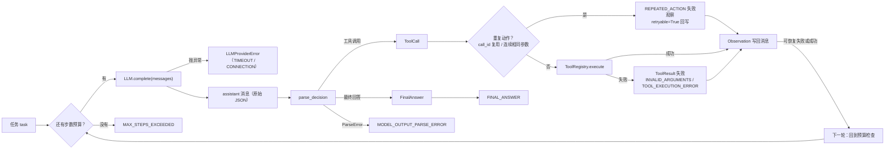
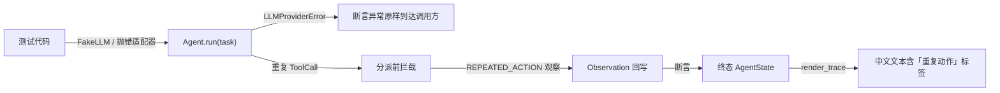
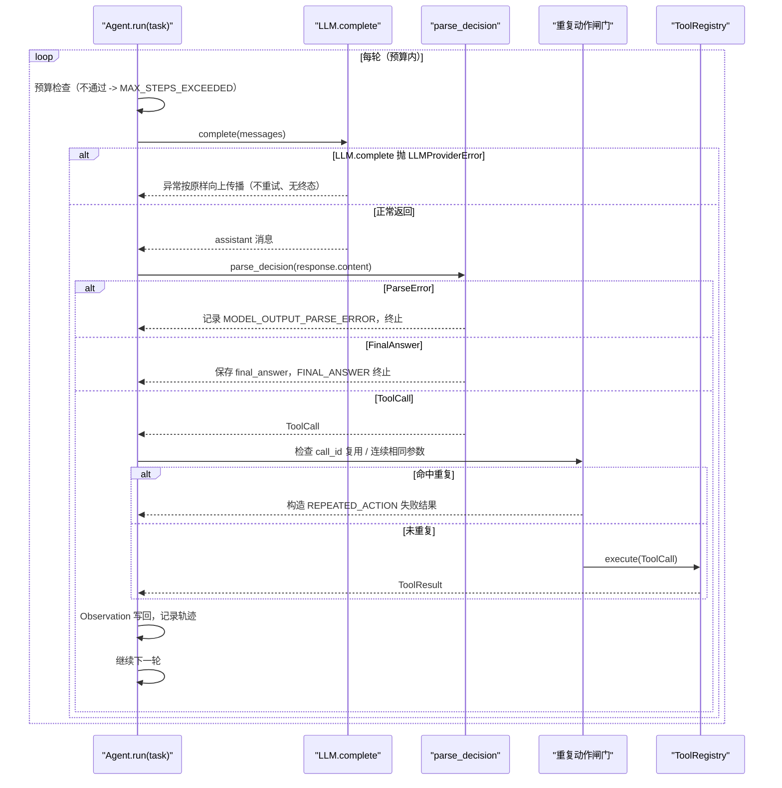

# Day 14：鲁棒性代码导读

> 这篇文档怎么读（先看森林，再看树木）：
> - **第 0 步**：只看图，先建立整体印象，不要急着看代码；
> - **第 1 步**：认识四个错误分支各自的处理位置与终止语义；
> - **第 2 步**：打开代码，按小节顺序逐段读；
> - **第 3 步**：看测试如何验证，最后回到森林图复查。

## 0. 先看森林：这一章到底在做什么

### 0.1 用大白话讲

Day 12 把主循环跑通了：问模型、拆决策、执行工具、写回观察，直到给出最终
回答、解析失败、工具失败不可恢复或步数耗尽。但"跑通"不等于"扛得住事故"。
Day 14 给主循环补三类鲁棒性：

1. **模型层事故**：模型请求超时、网络断开，`LLM.complete` 抛出适配器错误。
   这一轮没有产出任何决策，主循环不重试、不吞掉，把错误按原样交给调用方；
2. **重复动作**：模型复用同一个 `call_id`，或紧挨着用完全相同的参数再调
   一次同一个工具。主循环在分派前就拦住，写成"重复动作"失败观察回写，让
   模型换一种方式继续；
3. **回归确认**：解析失败不重试、步数耗尽兜底、工具异常统一转
   `ToolResult`，这些 Day 7/11/12 就有的边界，用测试钉死，避免以后改坏。

鲁棒性的总原则是**错误分层**：模型层错误按原样向上传播，工具层错误统一转
成 `ToolResult`，重复动作在主循环分派前拦截——每类事故都有明确、可复述的
处理位置，谁也不越界。

### 0.2 森林全景图



读法：从上往下。相比 Day 12 的图，Day 14 只多了一条**分派前的闸门**
（`Repeat` -> `RepeatObs`）和一个**模型错误的直通出口**（`LLM` -> `ErrLLM`，
直接抛给调用方）。其他分支全部是 Day 12 已有行为的回归确认。

### 0.3 一句话预告

Day 14 的改动很小，只有三个地方：

1. **领域模型**加一个稳定错误码 `REPEATED_ACTION`；
2. **主循环**在执行工具前检查"是不是重复动作"，是就构造失败结果回写观察；
3. **渲染层**给新错误码补一行中文标签，接口一个字都不用改。

模型超时/连接失败则**什么都不用加**：Day 12 已经约定"按原样向上传播"，
Day 14 只是用测试把它锁住。

### 0.4 名词小词典（遇到不懂的词回来查）

| 名词 | 大白话解释 |
| --- | --- |
| 适配器错误（adapter error） | 模型供应商调用失败时抛出的稳定错误，含 `TIMEOUT`/`CONNECTION` 等类别 |
| 向上传播（propagate） | 函数不吞掉异常，让它继续抛给调用方处理 |
| 重复动作（repeated action） | 模型再次请求一个已经执行过的动作：复用 `call_id` 或连续相同参数 |
| 分派（dispatch） | 把 `ToolCall` 交给注册表找到对应工具并执行的过程 |
| 拦截（intercept） | 在某个边界之前先检查并处理，不让它继续往下走 |
| 稳定错误类别（stable error code） | 不依赖 SDK 异常文本、可被程序安全判断的枚举值 |

## 1. 认识新模块

Day 14 没有新增文件，只改动了三个已有文件。对照表如下：

| 文件 | 改了什么 | 为什么 |
| --- | --- | --- |
| `src/self_react/models.py` | `ToolErrorCode` 新增 `REPEATED_ACTION` | 重复动作需要稳定错误类别 |
| `src/self_react/agent.py` | 新增 `_repeated_action_reason`，分派前调用 | 主循环是唯一控制者，拦截归它管 |
| `src/self_react/trace.py` | `_TOOL_ERROR_LABELS` 增加一行 | 让新错误码有中文标签，接口不变 |

### 1.1 四个错误分支对照表

| 分支 | 发生位置 | 处理方式 | 终止语义 |
| --- | --- | --- | --- |
| 模型超时/连接失败 | `LLM.complete` 抛 `LLMProviderError` | 按原样向上传播，不重试 | 无终态：异常交给调用方 |
| 重复动作 | 主循环分派前 | 转 `REPEATED_ACTION` 失败观察回写 | 预算内继续；耗尽时 `MAX_STEPS_EXCEEDED` |
| 解析失败 | `parse_decision` 抛 `ParseError` | 记录轨迹错误，默认不重试 | `MODEL_OUTPUT_PARSE_ERROR` |
| 步数耗尽 | 每轮预算闸门 | 已有轨迹原样保留 | `MAX_STEPS_EXCEEDED` |
| 工具异常 | `ToolRegistry.execute` | 统一转 `ToolResult` 失败 | `retryable=False` 才终止 |

注意：模型超时/连接失败**没有终态**——`Agent.run` 直接抛异常，调用方收到
的是 `LLMProviderError` 而不是 `AgentState`。这是"错误分层"的边界：这一轮
连决策都没有，不该伪造一个状态。

## 2. 进入树木：按这个顺序读代码

建议顺序：

1. [`models.py`](../../src/self_react/models.py)（只看 `ToolErrorCode` 附近）；
2. [`agent.py`](../../src/self_react/agent.py)（核心新增约二十行）；
3. [`trace.py`](../../src/self_react/trace.py)（只看标签映射表）；
4. [`test_agent.py`](../../tests/test_agent.py) 与
   [`test_trace.py`](../../tests/test_trace.py)（考官）。

读代码时脑子里记着三个问题（这就是本段的骨架）：

1. 为什么重复动作检测要放在主循环而不是注册表？
2. 为什么模型错误直接抛给调用方，而工具错误先回写观察？
3. 新增错误码为什么不需要改渲染接口？

### 2.1 第一站：领域模型加错误码

```python
class ToolErrorCode(str, Enum):
    """工具边界可以稳定识别的错误类别。"""

    INVALID_ARGUMENTS = "INVALID_ARGUMENTS"
    UNKNOWN_TOOL = "UNKNOWN_TOOL"
    TOOL_EXECUTION_ERROR = "TOOL_EXECUTION_ERROR"
    REPEATED_ACTION = "REPEATED_ACTION"
    TIMEOUT = "TIMEOUT"
    PERMISSION_DENIED = "PERMISSION_DENIED"
```

只加了一行。`REPEATED_ACTION` 与 `UNKNOWN_TOOL` 平级：它们是"调用没有正常
执行"的稳定类别，供主循环、观察和渲染层用同一套枚举沟通，不依赖任何异常
文本。

### 2.2 第二站：主循环的重复动作闸门（`_repeated_action_reason`）

```python
def _repeated_action_reason(decision: ToolCall, state: AgentState) -> str | None:
    """返回重复动作的稳定说明；没有重复时返回 ``None``。"""

    for step in state.trace:
        prior = step.decision
        if isinstance(prior, ToolCall):
            if prior.call_id == decision.call_id:
                return f"重复动作：调用编号 {decision.call_id} 已被使用"
            if prior.name == decision.name and prior.arguments == decision.arguments:
                return (
                    f"重复动作：工具 {decision.name} 已用相同参数调用过；"
                    f"如需再次调用请更换参数或使用新编号"
                )
    return None
```

两种重复形态：

1. **`call_id` 复用**：在 `state.trace` 里找到任意一个更早的 `ToolCall`
   决策，它的 `call_id` 和当前一样——说明模型没有生成新编号；
2. **连续相同参数**：更早步骤出现过"同一个工具 + 完全相同的参数"。
   `arguments` 是 Pydantic 校验过的 JSON 对象，字典相等比较是确定性的。

消息只带工具名和编号，不带参数值，避免把可能敏感的参数写进上下文。

### 2.3 第三站：分派前的调用点

```python
repeated_message = _repeated_action_reason(decision, state)
if repeated_message is not None:
    result = ToolResult.failure(
        tool_call_id=decision.call_id,
        tool_name=decision.name,
        code=ToolErrorCode.REPEATED_ACTION,
        message=repeated_message,
        retryable=True,
    )
else:
    result = self._registry.execute(decision)
observation = Observation.from_tool_result(result)
messages.append(observation.as_message())
```

拦截点正好在 `registry.execute` 之前。命中重复时，主循环直接构造一个
`retryable=True` 的失败 `ToolResult`，然后走与普通工具失败完全相同的路径：
`Observation.from_tool_result` -> `as_message()` -> 写回消息 -> 记录轨迹 ->
下一轮预算检查。业务工具一次都没有被调用。

为什么放在这里而不是注册表？因为"重复"是**跨轮次**的语义，注册表只处理
"单次调用"；主循环持有完整轨迹，是唯一能看到历史的控制者。

### 2.4 第四站：模型错误的直通出口

主循环里 `LLM.complete` 这一行**没有 try/except**：

```python
response = self._llm.complete(messages)
```

这就是"按原样向上传播"的实现：`LLMProviderError(TIMEOUT)` 从适配器抛出后，
穿过 `Agent.run` 直接到调用方。主循环不重试、不转观察、不构造状态。Day 12
的文档早就写了这条约定，Day 14 只是用测试确认它还在。

### 2.5 第五站：渲染层补一行标签

```python
_TOOL_ERROR_LABELS: dict[ToolErrorCode, str] = {
    ToolErrorCode.INVALID_ARGUMENTS: "参数无效",
    ToolErrorCode.UNKNOWN_TOOL: "未知工具",
    ToolErrorCode.TOOL_EXECUTION_ERROR: "工具执行失败",
    ToolErrorCode.REPEATED_ACTION: "重复动作",
    ToolErrorCode.TIMEOUT: "超时",
    ToolErrorCode.PERMISSION_DENIED: "权限不足",
}
```

Day 13 的导读预言过这件事：新增错误码"只要在标签映射表里补一行即可"。
`render_trace(state) -> str` 的签名、步骤顺序和输出格式都没有变——失败观察
依然渲染为 `观察（失败）：内容` + `错误码：重复动作（REPEATED_ACTION）` +
`可重试：是`。

### 2.6 真实运行结果

模型超时（Fake LLM 换成抛 `LLMProviderError(TIMEOUT)` 的适配器）：

```text
Agent(...).run("任务")
  -> LLM.complete 抛 LLMProviderError(code=TIMEOUT)
  -> 异常穿过 Agent.run 原样到达调用方
  -> 没有 AgentState，没有重试
```

重复动作（模型先调用 calculator，再复用同一个 call_id 调用一次）：

```text
第 1 轮：ToolCall(call_id="call-1", calculator, {"expression": "2 + 2"})
  -> 注册表执行 -> 观察（成功）：4 -> 继续
第 2 轮：ToolCall(call_id="call-1", calculator, {"expression": "2 + 2"})
  -> _repeated_action_reason 命中（call_id 已被使用）
  -> 不执行工具，Observation：
     重复动作：调用编号 call-1 已被使用（REPEATED_ACTION，retryable=True）
  -> 继续
第 3 轮：FinalAnswer("我换了一个新编号，结果还是 4。")
  -> FINAL_ANSWER 终止

终态：steps_used == len(trace) == 3
```

## 3. 考官怎么看（测试）

Day 14 新增 12 个用例，全部只用 Fake LLM、确定性工具和固定异常对象，不联网。
最有代表性的几组：

1. **模型错误传播**（参数化）：`LLMProviderError(TIMEOUT)` 与
   `LLMProviderError(CONNECTION)` 从 `Agent.run` 原样抛出，`code` 与消息都
   不变，且不是 `UNKNOWN` 兜底类别。
2. **重复动作拦截**：同一 `call_id` 复用、同一工具连续相同参数都被识别为
   `REPEATED_ACTION` 失败观察；模型下一轮给出最终回答，`steps_used == 3`。
3. **不触达工具层**：用带调用计数的 `CountingCalculator` 断言第二次相同调用
   没有执行工具（`call_count == 1`）。
4. **预算兜底**：重复动作后预算耗尽，返回 `MAX_STEPS_EXCEEDED`，失败观察
   仍被记录，模型调用次数恰为 2。
5. **误判防护**：中间隔了其他动作的相同参数调用是合法新调用，不会被当成
   重复；但非连续复用 `call_id` 仍会被拦截（编号语义与"连续参数"分开判断）。
6. **渲染标签**：直接构造含 `REPEATED_ACTION` 观察的状态，断言中文标签
   `重复动作（REPEATED_ACTION）` 与 `可重试：是` 出现在文本中。
7. **错误类别稳定**：`ToolResult.failure(code=REPEATED_ACTION)` 可转成失败
   观察；DeepSeek 适配器的 `TIMEOUT` 与 `CONNECTION` 是互不混淆的两个枚举值。



## 4. 回到森林：把整条路再走一遍



"错误分层"的检查清单：

- 模型层错误：`LLM.complete` 的异常不在主循环里被捕获，原样交给调用方；
- 工具层错误：`ToolRegistry.execute` 统一转 `ToolResult`，可恢复的写回观察；
- 重复动作：由主循环在分派前拦截，注册表与业务工具无感知；
- 渲染层：新增错误码只补标签，`render_trace` 接口与格式不变；
- 确定性：所有测试用 Fake LLM 与确定性工具，不访问网络。

自测题（能答上来就算学会）：

1. 模型超时和工具失败的处理方式有什么不同？为什么？
2. `_repeated_action_reason` 识别哪两种重复形态？
3. 为什么重复动作检测放在主循环而不是注册表？
4. 重复动作的错误消息为什么不拼参数值？
5. Day 14 需要修改 `render_trace` 的签名吗？

自测题参考答案（先自己写，再对照）：

1. **模型超时按原样向上传播，不产生终态；工具失败统一转 `ToolResult`，
   可恢复的先回写观察。** 因为模型层这一轮没有产出任何决策，谈不上"写回
   观察"；工具层则一定有调用关联和稳定错误码，可以回写让模型纠正。
2. **同一 `call_id` 在任意更早步骤中使用过；同一工具连续使用完全相同的
   参数。**
3. **因为"重复"是跨轮次的历史语义，主循环持有完整轨迹且是唯一控制者；
   注册表只处理单次调用，不应该感知历史。**
4. **遵循 Day 13 的安全原则：人类可读不等于全量输出。** 消息只说明工具名
   和"已用相同参数调用过"，避免把可能敏感的参数值写进上下文。
5. **不需要。** 新增错误码只在 `_TOOL_ERROR_LABELS` 补一行，
   `render_trace(state) -> str` 的签名和输出格式完全不变。

## 5. 与 Day 15、Day 16 的连接

Day 14 把所有错误分支都钉上了回归测试，主循环在事故面前的行为可以复述、
可以验证。Day 15 会把 `render_trace` 接入 CLI（任务输入、最大步数、是否
展示轨迹等参数）；Day 16 会用真实 DeepSeek 调用跑端到端示例，验证重复动作
拦截和可恢复失败回写在真实模型下同样成立。届时如果发现真实模型的行为需要
新分支，再按"先写失败测试、再实现最小边界"的流程另开 Issue。
