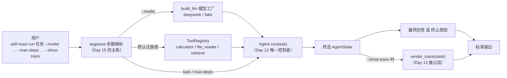
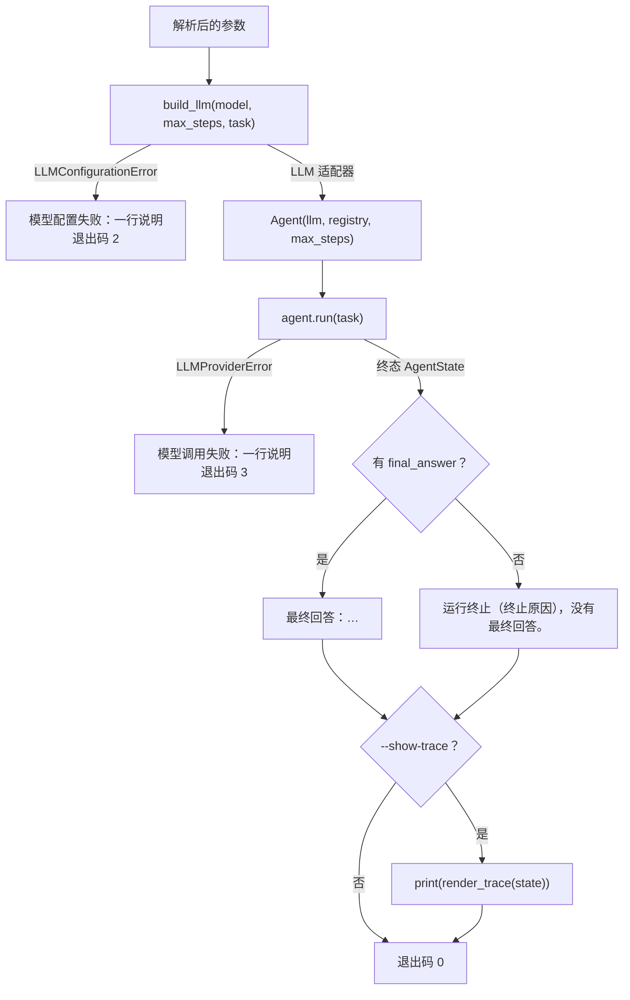
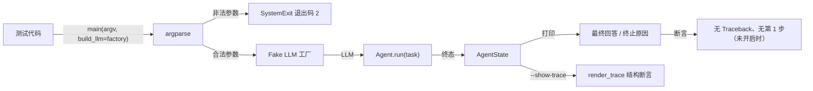
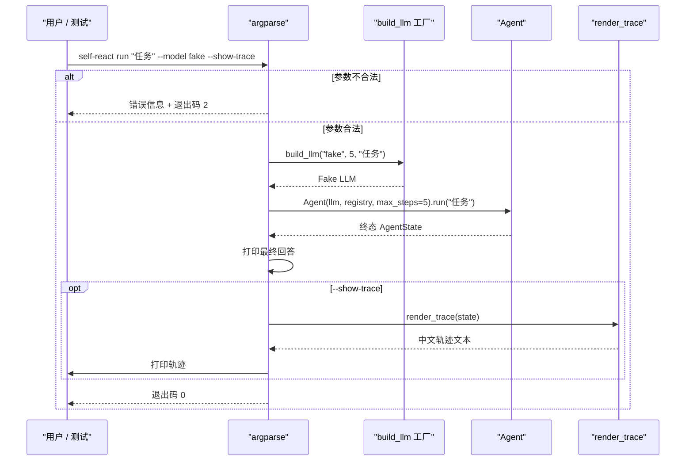

# Day 15：命令行体验代码导读

> 这篇文档怎么读（先看森林，再看树木）：
> - **第 0 步**：只看图，先建立整体印象，不要急着看代码；
> - **第 1 步**：认识 `run` 子命令的输入输出、四个参数和三类出口；
> - **第 2 步**：打开代码，按小节顺序逐段读；
> - **第 3 步**：看测试如何验证，最后回到森林图复查。

## 0. 先看森林：这一章到底在做什么

### 0.1 用大白话讲

前十四天把智能体造好了：模型会"想"，工具会"做"，`Agent` 把"想和做"串成
循环，`render_trace` 能把整趟运行翻译成中文记录单。但用户怎么用呢？总不能
每次都打开 Python 写脚本。Day 15 在命令行开了一扇**大门**：

```powershell
self-react run "计算 2 + 2" --model fake --show-trace
```

这扇大门就是 `cli.py` 里的 `run` 子命令。它只做三件事：

1. **收参数**：任务文本、用哪个模型、最多跑几步、要不要展示轨迹；
2. **组装配件**：按 `--model` 造一个模型适配器，再装好三个真实工具；
3. **开门放行**：把任务交给 `Agent.run`，把最终回答（或终止原因）打印给
   用户，需要时再打印整份人类可读轨迹。

它**不参与智能体本身**：循环怎么跑、什么时候停，全部还是 `Agent` 说了算。
CLI 就像餐厅门口的迎宾员——帮忙记菜单、领座位，但菜是后厨（`Agent`）做的。

### 0.2 森林全景图



读法：从上往下。**今天只关注 `Parser` 和它左右两侧的接线**：参数怎么被
接收（左），以及参数怎么变成 `Agent` 的输入和终端输出（右）。中间蓝色的
`Agent.run` 是 Day 12 已经完成的循环，今天一行都不改它。

### 0.3 一句话预告

一次 `self-react run "任务"` 调用做四件事：

1. **验参数**：`task` 必须有、`--max-steps` 必须是正整数、`--model` 只能是
   登记过的名字，任何一项不合格都在进入业务逻辑前被拒绝；
2. **造模型**：调用 `build_llm`，`deepseek` 走真实适配器，`fake` 走确定性
   离线演示；
3. **跑循环**：把任务和三个工具交给 `Agent.run`，拿到终态 `AgentState`；
4. **打印结果**：有最终回答就打印，没有就打印终止原因；`--show-trace`
   时再打印 `render_trace(state)`。

同时，CLI **坚决不做**四件事：

- **不复制主循环逻辑**：步数计数、预算检查、终止判断全部属于 `Agent`；
- **不要求 API Key 才开机**：`--help`、参数错误路径和 `fake` 演示都不读
  `DEEPSEEK_API_KEY`；
- **不泄漏堆栈**：配置缺失和供应商错误只打印一行稳定说明；
- **不改任何已有模块**：`LLM.complete`、领域模型、DeepSeek 适配器、提示词、
  解析器、`Agent`、`render_trace` 和三个工具全部原封不动。

### 0.4 名词小词典（遇到不懂的词回来查）

| 名词 | 大白话解释 |
| --- | --- |
| CLI（命令行界面） | 在终端里敲命令控制程序的入口，本日指 `self-react` |
| 子命令（subcommand） | 同一个程序的不同命令，如 `hello` 与 `run` |
| 参数解析（argument parsing） | 把命令行字符串拆成结构化选项的过程 |
| 模型工厂（factory） | 一个"造模型适配器"的函数，按配置返回不同实现 |
| 注入（inject） | 把东西从外面塞进来；这里指测试传入自己的模型工厂 |
| 退出码（exit code） | 进程结束时报给系统的整数，0 成功、非 0 失败 |
| 适配器（adapter） | 夹在两个系统之间做翻译的模块，如 `DeepSeekLLM` |
| 确定性（deterministic） | 相同输入永远相同输出，不依赖随机或网络 |

## 1. 认识新模块

Day 15 没有新增文件，只扩展了 `cli.py`（Day 3 的 `hello` 基线保持不变）。
对照表如下：

| 成员 | 值/行为 |
| --- | --- |
| `run` 子命令 | `self-react run <task> [--model …] [--max-steps N] [--show-trace]` |
| `--model` | `deepseek`（真实 API）或 `fake`（确定性离线演示），默认 `deepseek` |
| `--max-steps` | 正整数，默认 5；0、负数、浮点、非数字都被拒绝 |
| `--show-trace` | 默认关闭；开启后打印 `render_trace(state)` 的完整中文轨迹 |
| `build_llm(model, max_steps, task)` | 默认模型工厂，把模型名变成 LLM 适配器 |
| `main(argv, *, build_llm=build_llm)` | 公开入口，`build_llm` 是测试注入点 |
| 退出码 | 参数错误 2；模型配置失败 2；供应商调用失败 3；成功 0 |
| 不做 | 复制循环逻辑、持久化、流式、异步、并行调度、修改已有模块 |

### 1.1 三类出口对照表

| 情况 | 打印什么 | 退出码 |
| --- | --- | --- |
| 正常运行且有最终回答 | `最终回答：…`（可加轨迹） | 0 |
| 正常运行但无最终回答 | `运行终止（终止原因），没有最终回答。` | 0 |
| 参数校验失败 | argparse 错误信息 | 2 |
| 模型配置失败（如缺 API Key） | `模型配置失败：…` | 2 |
| 供应商调用失败（如超时） | `模型调用失败：…` | 3 |

## 2. 进入树木：按这个顺序读代码

建议顺序：

1. [`cli.py`](../../src/self_react/cli.py)（全文，核心约两百四十行）；
2. [`test_cli.py`](../../tests/test_cli.py)（考官）。

读 `cli.py` 时脑子里记着四个问题（这就是本段的骨架）：

1. 参数校验发生在哪一步？为什么 `--help` 不需要 API Key？
2. `build_llm` 为什么单独成为一个函数？
3. CLI 怎么做到"不复制主循环逻辑"？
4. 错误路径为什么只打印一行说明，而不是堆栈？

### 2.1 第一站：三个常量与终止原因标签

```python
HELLO_MESSAGE = "Hello from Self-ReAct!"
DEFAULT_MAX_STEPS = 5
_MODEL_CHOICES = ("deepseek", "fake")
```

`HELLO_MESSAGE` 是 Day 3 的既有契约，测试和 CLI 共享同一个字符串。
`DEFAULT_MAX_STEPS` 是 `--max-steps` 的默认值：5 步足够完成"计算器 ->
检索 -> 最终回答"这类演示任务，也给真实模型留出纠错空间。
`_MODEL_CHOICES` 是 `--model` 的白名单，`argparse` 会用它直接拒绝名单外
的模型名。

`_TERMINATION_LABELS` 是终止原因到中文标签的映射，与 Day 13 渲染层的标签
保持一致：当运行没有最终回答时，CLI 打印 `运行终止（步数耗尽），没有最终
回答。` 这类可读说明。这张表只负责"告诉用户为什么停了"，判断本身仍然由
`Agent` 完成。

### 2.2 第二站：确定性离线演示（`_demo_fake_llm`）

```python
def _demo_fake_llm() -> FakeLLM:
    """构造确定性离线演示用 Fake LLM。"""

    return FakeLLM(
        [Message(role=MessageRole.ASSISTANT, content=json.dumps({...})), ...]
    )
```

这个函数给 `--model fake` 准备三条预置响应：第一条请求 `calculator` 计算
`2 + 2`，第二条请求 `retrieve` 检索 `react`，第三条给出最终回答。它们都
是符合 Day 10 格式契约的 JSON 字符串，Fake LLM 按顺序逐条返回，所以
演示运行是确定性的：同一个命令永远得到同一份轨迹。

为什么需要它？`--help` 和参数错误路径只需要"开机"，但用户还想在没配密钥
时看一眼智能体真的会干活的样子。`fake` 模型就是这条零成本的演示通道；真实
调用仍由 `--model deepseek` 负责。

### 2.3 第三站：模型工厂（`build_llm`）

```python
def build_llm(model: str, max_steps: int, task: str) -> LLM:
    if model == "fake":
        return _demo_fake_llm()
    if model == "deepseek":
        from self_react.deepseek import DeepSeekLLM

        return DeepSeekLLM(model="deepseek-v4-flash")
    raise LLMConfigurationError(f"未知模型：{model}")
```

`build_llm` 是一个**工厂函数**：输入模型名，输出满足 `LLM` 协议的适配器。
两个细节值得注意：

1. `deepseek` 分支把导入放在函数内部。这样 `--model fake` 或参数错误路径
   根本不会加载 DeepSeek 模块，也就不会触发密钥检查；`--model deepseek`
   才真正构造适配器（密钥缺失时 `DeepSeekLLM.__init__` 抛
   `LLMConfigurationError`）。
2. `max_steps` 与 `task` 在签名里保留，但默认实现不用它们。这是给测试留
   的"观察缝"：测试工厂可以断言 CLI 是否把用户参数原样传给了工厂。

`BuildLLM = Callable[[str, int, str], LLM]` 给这个工厂形态起了一个名字，
`main` 的参数就写 `build_llm: BuildLLM`，调用方一眼能看出"这里可以换一个
造模型的函数"。

### 2.4 第四站：正整数校验（`_positive_int`）

```python
def _positive_int(value: str) -> int:
    try:
        parsed = int(value)
    except ValueError:
        raise argparse.ArgumentTypeError("必须是正整数") from None
    if parsed <= 0:
        raise argparse.ArgumentTypeError("必须是正整数")
    return parsed
```

`argparse` 的 `type=` 参数会在解析阶段调用这个函数：`"3"` 变成 `3`，
`"0"`、`"-1"`、`"1.5"`、`"abc"` 都抛 `ArgumentTypeError`，由 argparse
统一显示成 `error: argument --max-steps: 必须是正整数` 并返回退出码 2。

注意这里的校验发生在**任何业务逻辑之前**：`--max-steps 0` 不会走到
`build_llm`，也不需要 API Key。CLI 的校验比 `Agent` 的构造校验更严格
（`Agent` 允许 0，因为 `max_steps=0` 是合法的"不运行"测试边界；CLI 面向
真实用户，0 步跑不出任何任务，直接拒绝）。

### 2.5 第五站：默认注册表（`_build_registry`）

```python
def _build_registry() -> ToolRegistry:
    registry = ToolRegistry()
    registry.register(CalculatorTool())
    registry.register(FileReaderTool(root_directory="C:/allowed"))
    registry.register(RetrieveTool())
    return registry
```

CLI 组装 Day 7 注册表并登记三个真实工具。`file_reader` 的根目录写死为
`C:/allowed`（一个通常不存在的目录）：这是有意取舍——CLI 本期不提供目录
配置参数，模型请求读取文件时会得到"根目录不存在或不是目录"的可恢复错误
并继续，`calculator` 与 `retrieve` 两个确定性工具始终可用。安全边界没有
放宽：CLI 永远不会把任意目录交给 `file_reader`。

### 2.6 第六站：参数解析器（`_create_parser`）

```python
run_parser.add_argument(
    "task",
    help='要执行的任务文本，例如 "计算 2 + 2"。',
)
run_parser.add_argument(
    "--model",
    choices=_MODEL_CHOICES,
    default="deepseek",
    help="模型适配器：deepseek（真实 API）或 fake（确定性离线演示）。",
)
run_parser.add_argument(
    "--max-steps",
    type=_positive_int,
    default=DEFAULT_MAX_STEPS,
    metavar="N",
    help="最大决策步数（正整数），默认 5。",
)
run_parser.add_argument(
    "--show-trace",
    dest="show_trace",
    action=argparse.BooleanOptionalAction,
    default=False,
    help="是否打印人类可读执行轨迹；默认不打印。",
)
```

四个参数对应四个验收点：

| 参数 | 类型 | 失败路径 |
| --- | --- | --- |
| `task`（位置参数） | 非空字符串 | 缺任务 -> 退出码 2 |
| `--model` | 白名单选择 | 未知模型名 -> 退出码 2 |
| `--max-steps` | 正整数 | 0/负数/浮点/非数字 -> 退出码 2 |
| `--show-trace` | 布尔开关 | 无（`BooleanOptionalAction` 自动生成 `--no-show-trace`） |

`BooleanOptionalAction` 是 argparse 的"成对开关"：声明 `--show-trace` 后
自动获得反向的 `--no-show-trace`，帮助信息显示为
`--show-trace | --no-show-trace`。

### 2.7 第七站：run 的执行体（`_run_command`）

```python
def _run_command(arguments: argparse.Namespace, build_llm: BuildLLM) -> int:
    try:
        llm = build_llm(arguments.model, arguments.max_steps, arguments.task)
    except LLMError as exc:
        print(f"模型配置失败：{exc}", file=sys.stderr)
        return 2

    registry = _build_registry()
    agent = Agent(llm=llm, registry=registry, max_steps=arguments.max_steps)
    try:
        state = agent.run(arguments.task)
    except LLMProviderError as exc:
        print(f"模型调用失败：{exc}", file=sys.stderr)
        return 3

    if state.final_answer is not None:
        print(f"最终回答：{state.final_answer.content}")
    elif state.termination_reason is not None:
        label = _TERMINATION_LABELS.get(
            state.termination_reason,
            state.termination_reason.value,
        )
        print(f"运行终止（{label}），没有最终回答。")
    else:
        print("运行未终止，且没有最终回答。")

    if arguments.show_trace:
        print()
        print(render_trace(state))
    return 0
```

这是整个模块的"主心骨"，只有六步：

1. **造模型**：先调 `build_llm`。配置缺失（如没设 `DEEPSEEK_API_KEY`）抛
   `LLMConfigurationError`，它是 `LLMError` 的子类，被转成一行
   `模型配置失败：缺少 DEEPSEEK_API_KEY` 与退出码 2；
2. **装工具**：`_build_registry()` 准备三个真实工具；
3. **组装 Agent**：`Agent(llm, registry, max_steps)` 是 Day 12 的唯一
   控制者，CLI 只负责把参数传进去；
4. **跑循环**：`agent.run(task)`。供应商层错误（超时、断网等）抛
   `LLMProviderError`，被转成一行 `模型调用失败：…` 与退出码 3——注意
   Day 14 约定模型错误"按原样向上传播"，CLI 就是那个最终接住并展示给用户
   的调用方；
5. **打印结果**：有 `final_answer` 打印 `最终回答：…`；否则打印终止原因
   （如 `运行终止（步数耗尽），没有最终回答。`）；
6. **可选轨迹**：`--show-trace` 时先打印空行，再原样打印
   `render_trace(state)` 的中文文本。

两个 `try/except` 的边界很重要：**模型配置错误**在 `build_llm` 阶段就暴露
（还没开始跑），**供应商调用错误**在 `agent.run` 阶段暴露（循环已经发起
真实请求），两者都只打印稳定说明，不打印 `Traceback`、不泄漏密钥。



### 2.8 第八站：公开入口（`main`）

```python
def main(
    argv: Sequence[str] | None = None,
    *,
    build_llm: BuildLLM = build_llm,
) -> int:
    arguments = _create_parser().parse_args(argv)
    if arguments.command == "hello":
        print(HELLO_MESSAGE)
        return 0
    if arguments.command == "run":
        return _run_command(arguments, build_llm)
    return 2
```

入口非常薄：解析参数、按命令分派。`build_llm` 默认是生产工厂，测试可以
传自己的工厂——这就是"测试不需要网络"的关键：测试工厂返回 Fake LLM，
`Agent.run` 完全感知不到区别。`hello` 分支保持 Day 3 的行为，最后的
`return 2` 只是防御分支（`argparse` 已保证命令只能是已登记子命令）。

### 2.9 真实运行结果

```powershell
uv run self-react run "计算 2 + 2" --model fake --show-trace
```

```text
最终回答：计算完成，并查到了 ReAct 的说明。

任务：计算 2 + 2
终止原因：最终回答（FINAL_ANSWER）
步数：3 / 5

第 1 步
输入摘要：计算 2 + 2
决策：调用工具 calculator
调用编号：call-1
参数：{"expression": "2 + 2"}
观察（成功）：4
耗时：0.021 毫秒

第 2 步
输入摘要：4
决策：调用工具 retrieve
调用编号：call-2
参数：{"query": "react"}
观察（成功）：ReAct（Reason + Act）是一种让模型推理与行动交错的智能体范式，由 Yao 等人在 2022 年提出：模型先用推理规划，再执行动作获取新信息。
耗时：0.031 毫秒

第 3 步
输入摘要：ReAct（Reason + Act）是一种让模型推理与行动交错的智能体范式，由 Yao 等人在 2022 年提出：模型先用推理规划，再执行动作获取新信息。
决策：最终回答
回答内容：计算完成，并查到了 ReAct 的说明。
耗时：0.034 毫秒
```

注意轨迹部分和 Day 13 的 `render_trace` 输出格式完全一样：头部三行 + 每步
五字段。耗时是实测值，所以两次运行可能有亚毫秒差异——这正是测试用"结构
一致"而不是"逐字一致"来验证的原因。

缺 API Key 时运行 `--model deepseek`：

```text
模型配置失败：缺少 DEEPSEEK_API_KEY
```

只有一行说明和退出码 2，没有 `Traceback`、没有密钥。

## 3. 考官怎么看（测试）

测试就是给 CLI 出题的考官。`tests/test_cli.py` 共 16 个用例，全部通过
`main(argv, build_llm=...)` 公开入口在同一 Python 进程里验证，不启动子
进程、不访问网络、不依赖真实 API Key。最有代表性的几组：

1. **hello 回归**：`main(["hello"])` 仍输出 `Hello from Self-ReAct!` 并返回
   0，Day 3 的基线没有被 `run` 破坏。
2. **参数失败路径**（参数化）：未知子命令、`run` 缺任务、
   `--max-steps 0/-1/1.5/abc`、`--model gpt-4` 全部以
   `pytest.raises(SystemExit)` 捕获，退出码都是 2，错误信息提到对应参数。
3. **端到端不展示轨迹**：注入返回 Fake LLM 的工厂，断言输出恰好是
   `最终回答：…\n`，没有 `第 1 步` 也没有 `终止原因`。
4. **端到端展示轨迹**：`--show-trace` 后断言第一行是最终回答、第二行是空行，
   之后是 `任务：…` 头部与三步轨迹；轨迹行的内容与顺序和 `render_trace`
   的格式一致（耗时是实测值，不逐字比对）。
5. **参数透传**：用录制型工厂断言 `--model fake` 和 `--model deepseek`
   原样到达工厂，`--max-steps 3` 被用于构造 `Agent`。
6. **错误路径**：工厂抛 `LLMConfigurationError` 或 `LLMProviderError` 时，
   CLI 返回非零退出码、打印一行稳定说明、输出不含 `Traceback`。
7. **工厂本身**：`build_llm("fake", ...)` 返回满足 `LLM` 协议的适配器；
   清空 `DEEPSEEK_API_KEY` 后 `build_llm("deepseek", ...)` 抛
   `LLMConfigurationError`。



## 4. 回到森林：把整条路再走一遍



"CLI 只做三件事"的检查清单：

- 参数怎么来：`argparse` 统一负责，失败路径在业务逻辑之前；
- 模型怎么来：`build_llm` 工厂负责，`deepseek`/`fake` 各归其位；
- 结果怎么展示：最终回答 / 终止原因 + 可选 `render_trace`；
- 循环怎么跑：`Agent.run` 唯一控制，CLI 不复制任何循环逻辑；
- 错误怎么报：一行稳定说明 + 固定退出码，不打印堆栈、不泄漏密钥。

自测题（能答上来就算学会）：

1. `self-react run` 的四个参数分别是什么？每个参数的失败路径长什么样？
2. 为什么 `--help` 和参数错误路径不需要 API Key？
3. `build_llm` 为什么单独成为一个函数？测试为什么需要它？
4. `--show-trace` 打印的内容和 `render_trace` 是什么关系？
5. CLI 的 `--max-steps` 校验和 `Agent` 的构造校验有什么不同？为什么？

自测题参考答案（先自己写，再对照）：

1. **`task`（位置参数，缺了报"required: task"）、`--model`（白名单
   `deepseek`/`fake`，未知名报"invalid choice"）、`--max-steps`（正整数，
   0/负数/浮点/非数字报"必须是正整数"）、`--show-trace`（布尔开关，
   无失败路径）。** 全部由 `argparse` 在进入业务逻辑之前拒绝，退出码 2。
2. **因为参数解析和模型构造是分离的。** `argparse` 只处理字符串，根本不
   碰 `DeepSeekLLM`；`build_llm` 里的 `deepseek` 分支也是"用到才导入"，
   `fake` 分支和错误路径都不会触发密钥检查。只有真正 `--model deepseek`
   运行时才构造适配器、读取 `DEEPSEEK_API_KEY`。
3. **因为"把模型名变成适配器"是一份可以独立测试、独立替换的职责。**
   生产工厂返回 `DeepSeekLLM` 或演示 Fake LLM；测试传入自己的工厂返回
   预置响应的 Fake LLM，`Agent.run` 完全感知不到区别，整条端到端链路
   因此不依赖网络和密钥。
4. **`--show-trace` 打印的就是 `render_trace(终态 AgentState)` 的输出，**
   CLI 只是把渲染结果原样写到标准输出；展示逻辑仍然只属于 Day 13 的
   `render_trace`，CLI 不重新发明格式。
5. **CLI 要求正整数（拒绝 0），`Agent` 允许非负整数（含 0）。**
   因为 `Agent` 是库边界，`max_steps=0` 是合法的"不运行"测试场景；CLI
   是用户入口，0 步跑不出任何任务，直接报参数错误比让用户等一个空结果
   更诚实。两者校验的是不同层的语义，互相不冲突。

## 5. 与 Day 16、Day 17 的连接

Day 16 会写 2 至 3 个端到端示例：单工具、多工具、工具失败后恢复。到那时
`self-react run "任务" --model deepseek` 就是现成的运行入口：CLI 的四个
参数已经覆盖任务输入、模型选择、步数预算和轨迹展示，真实模型调用不需要
修改任何 CLI 代码，只要设置 `DEEPSEEK_API_KEY` 并换 `--model` 即可。

Day 17 对照 LangChain/LangGraph 时，可以带着 Day 15 的边界去问：成熟框架
的 CLI/编排层与这里的 `run` 子命令有什么异同？核心结论预计仍然是——无论
外层怎么包，`Agent` 作为循环控制者的边界不应被 CLI 复制或削弱。
