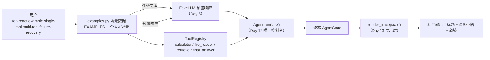
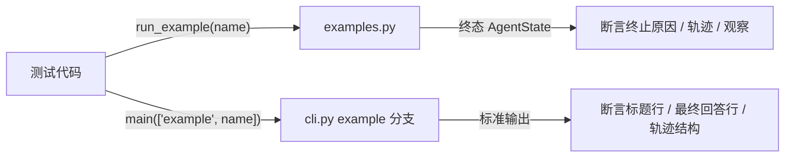
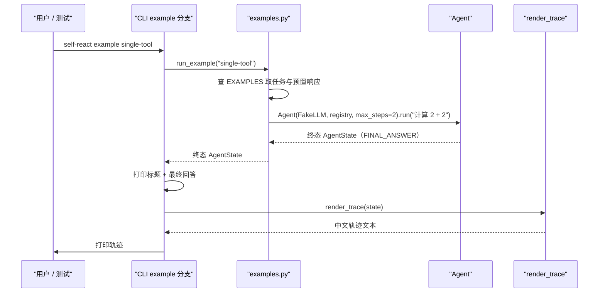

# Day 16：端到端示例代码导读

> 这篇文档怎么读（先看森林，再看树木）：
> - **第 0 步**：只看图，先建立整体印象，不要急着看代码；
> - **第 1 步**：认识 `example` 子命令与三个示例的输入输出；
> - **第 2 步**：打开代码，按小节顺序逐段读；
> - **第 3 步**：看测试如何验证，最后回到森林图复查。

## 0. 先看森林：这一章到底在做什么

### 0.1 用大白话讲

前十五天把智能体造好了，还给它装了命令行大门：`self-react run "任务"`
能把任务交给 `Agent` 执行。但"能跑"和"能复现"是两回事——真实模型每次回答
都不同，演示输出没法做成一份可以贴进文档的固定记录。Day 16 给项目补上
**三条固定的演示流水线**：单工具、多工具、工具失败后恢复。

每条流水线都是一条可以反复敲的命令：

```powershell
self-react example single-tool
self-react example multi-tool
self-react example failure-recovery
```

敲任意一条，终端都会打印最终回答和整份中文轨迹，而且**永远打印同一份**
（只有耗时的小数会变）。为什么能做到？因为示例不是让真实模型临场发挥，
而是用 Day 5 的 Fake LLM 按顺序吐出预置响应，再用三个确定性工具执行。

关键点：**示例只是把已有零件接起来**。`Agent` 主循环、工具注册表、
`render_trace` 都是前面几天做好的；Day 16 新增的 `examples.py` 只负责
"定义场景数据"和"调用这些零件"。`Agent` 仍然是唯一控制者，示例没有复制
一行循环逻辑。

### 0.2 森林全景图



读法：从上往下。**今天只关注左边的 `examples.py` 和它怎么接线**：场景数据
怎么定义（上方），运行入口怎么把 `FakeLLM`、注册表和 `Agent` 接起来
（中间）。右边的 `Agent`、`render_trace` 都是已有模块，一行都不改。

### 0.3 一句话预告

一次 `self-react example <名称>` 调用做三件事：

1. **查场景**：从 `EXAMPLES` 取出任务文本与预置响应；
2. **跑流水线**：`run_example` 用 Fake LLM、默认注册表和 `Agent` 跑完整
   循环，拿到终态 `AgentState`；
3. **打印结果**：CLI 打印示例标题、最终回答和 `render_trace(state)` 的
   完整轨迹。

同时，Day 16 **坚决不做**四件事：

- **不复制主循环逻辑**：步数计数、预算检查、终止判断全部属于 `Agent`；
- **不碰真实模型**：示例永远用 Fake LLM，不读取 `DEEPSEEK_API_KEY`；
- **不改已有核心模块**：`Agent`、`LLM`、提示词、解析器、领域模型和三个
  业务工具全部原封不动；
- **不实现新能力**：持久化、暂停/恢复、流式、异步、并行调度都不在范围内。

### 0.4 名词小词典（遇到不懂的词回来查）

| 名词 | 大白话解释 |
| --- | --- |
| 端到端示例（end-to-end example） | 从命令行输入任务到打印最终回答的完整演示 |
| 场景（scenario） | 一个示例的完整定义：任务 + 预置响应 |
| 预置响应（preset responses） | Fake LLM 按顺序吐出的固定回答，模拟模型决策 |
| 数据类（dataclass） | Python 里用来"只装数据"的轻量类 |
| 冻结（frozen） | 对象创建后不可修改，防止场景数据被意外改写 |
| 确定性（deterministic） | 相同输入永远相同输出，不依赖随机或网络 |

## 1. 认识新模块

Day 16 新增一个库模块 `src/self_react/examples.py`，并给 CLI 增加一个
`example` 子命令。对照表如下：

| 成员 | 值/行为 |
| --- | --- |
| `ExampleScenario` | 冻结数据类：`name`、`title`、`task`、`responses` |
| `EXAMPLES` | 三个固定场景：`single-tool`、`multi-tool`、`failure-recovery` |
| `build_example_llm(name)` | 按名称构造确定性 Fake LLM |
| `build_example_registry()` | 构造四个工具的默认注册表 |
| `run_example(name) -> AgentState` | 组合 `Agent` 跑完一个示例并返回终态 |
| `self-react example <name>` | CLI 入口，打印标题、最终回答与完整轨迹 |
| 不做 | 复制循环逻辑、真实模型、持久化、流式、异步、并行调度、修改已有核心模块 |

### 1.1 三个示例对照表

| 示例 | 任务 | 工具序列 | 最终回答 |
| --- | --- | --- | --- |
| `single-tool`（单工具） | 计算 2 + 2 | calculator | `2 + 2 = 4。` |
| `multi-tool`（多工具） | 计算 2 + 2，并检索 react 主题 | calculator -> retrieve | `计算结果是 4；ReAct 是一种让模型推理与行动交错的智能体范式。` |
| `failure-recovery`（失败恢复） | 先检索 unknown-topic，失败后换 react | retrieve(失败) -> retrieve(成功) | `第一次检索失败后改用 react，成功找到 ReAct 的说明。` |

### 1.2 三条主线的意义

- **单工具**：证明"模型请求一个工具 -> 执行 -> 观察 -> 回答"的最小闭环；
- **多工具**：证明"上一轮观察成为下一轮输入"的上下文接力，工具结果没有被
  丢弃；
- **工具失败后恢复**：证明"可恢复失败先作为 Observation 回写，模型换一种
  方式继续"（Day 12/14 的设计边界在真实流水线里成立）。

## 2. 进入树木：按这个顺序读代码

建议顺序：

1. [`src/self_react/examples.py`](../../src/self_react/examples.py)（全文，
   核心约一百四十行）；
2. [`src/self_react/cli.py`](../../src/self_react/cli.py) 里的 `example`
   相关分支（约三十行）；
3. [`tests/test_examples.py`](../../tests/test_examples.py)（考官）。

读 `examples.py` 时脑子里记着四个问题（这就是本段的骨架）：

1. 场景数据为什么是"数据"而不是"代码"？
2. `run_example` 怎么做到不复制主循环逻辑？
3. `max_steps` 为什么等于预置响应数量？
4. CLI 的 `example` 与 `run` 有什么不同？

### 2.1 第一站：两个消息构造助手

```python
def _tool_call_message(call_id, name, arguments) -> Message:
    return Message(
        role=MessageRole.ASSISTANT,
        content=json.dumps(
            {
                "kind": "tool_call",
                "call_id": call_id,
                "name": name,
                "arguments": arguments,
            },
            ensure_ascii=False,
        ),
    )


def _final_answer_message(content) -> Message:
    return Message(
        role=MessageRole.ASSISTANT,
        content=json.dumps(
            {"kind": "final_answer", "content": content}, ensure_ascii=False
        ),
    )
```

这两个函数只是把 Day 10 的 JSON 格式契约包成一行调用：工具调用
`{"kind": "tool_call", ...}`，最终回答 `{"kind": "final_answer", ...}`。
它们返回的是标准的助手 `Message`，所以 Fake LLM 能直接消费，`Agent` 的
`parse_decision` 也能直接解析。示例没有发明新的消息格式。

### 2.2 第二站：场景数据（`ExampleScenario` 与 `EXAMPLES`）

```python
@dataclass(frozen=True)
class ExampleScenario:
    name: ExampleName
    title: str
    task: str
    responses: tuple[Message, ...]


EXAMPLES: dict[ExampleName, ExampleScenario] = {
    "single-tool": ExampleScenario(
        name="single-tool",
        title="单工具",
        task="计算 2 + 2",
        responses=(
            _tool_call_message("call-1", "calculator", {"expression": "2 + 2"}),
            _final_answer_message("2 + 2 = 4。"),
        ),
    ),
    ...
}
```

`ExampleScenario` 是**冻结数据类**：创建后不可修改，防止运行中被意外改写。
`responses` 是 `tuple`（不可变元组），表示"按顺序吐出这些响应"。

`EXAMPLES` 是一张从示例名到场景的固定字典。三个场景分别对应三条主线：

- `single-tool` 只有 calculator + 最终回答两条响应；
- `multi-tool` 有 calculator + retrieve + 最终回答三条响应；
- `failure-recovery` 有 retrieve（unknown-topic）+ retrieve（react）+
  最终回答三条响应，第一条会触发 `TOOL_EXECUTION_ERROR` 且可重试。

为什么把场景写成数据而不是写死函数？因为"任务、工具、最终回答"是**声明**
而不是**逻辑**：把它们收在数据里，测试可以直接断言、文档可以直接引用，
CLI 只需要查表，谁也不会各写一套。

### 2.3 第三站：运行入口（`build_example_llm` / `build_example_registry` / `run_example`）

```python
def build_example_llm(name: str) -> FakeLLM:
    scenario = EXAMPLES[name]
    return FakeLLM(list(scenario.responses))


def build_example_registry() -> ToolRegistry:
    registry = ToolRegistry()
    registry.register(CalculatorTool())
    registry.register(FileReaderTool(root_directory="C:/allowed"))
    registry.register(RetrieveTool())
    registry.register(FinalAnswerTool())
    return registry


def run_example(name: str) -> AgentState:
    scenario = EXAMPLES[name]
    llm = build_example_llm(name)
    registry = build_example_registry()
    agent = Agent(llm=llm, registry=registry, max_steps=len(scenario.responses))
    return agent.run(scenario.task)
```

`run_example` 是整章的主心骨，只有四步：

1. **取场景**：`EXAMPLES[name]` 拿到任务与预置响应；
2. **造模型**：`build_example_llm` 把预置响应交给 Fake LLM；
3. **装工具**：`build_example_registry` 登记四个工具（与 CLI `run` 完全
   一致）；
4. **跑循环**：`Agent(llm, registry, max_steps=len(responses)).run(task)`。

注意 `max_steps` 为什么等于响应数量：预置响应的最后一条总是
`final_answer`，`Agent` 会在那一步以 `FINAL_ANSWER` 终止。步数预算恰好
够用，示例既不会提前耗尽，也不会留下"多余预算"。

这里没有一行步数计数或终止判断——那些全在 `Agent` 里。`run_example` 只是
"把东西接好然后交给唯一控制者"，这就是"只组合不复制"。

### 2.4 第四站：CLI 的 `example` 子命令

```python
example_parser = subcommands.add_parser(
    "example",
    help="运行 Day 16 确定性端到端示例（无需网络与 API Key）。",
)
example_parser.add_argument(
    "name",
    choices=sorted(EXAMPLES),
    metavar="NAME",
    help="示例名称：single-tool（单工具）、multi-tool（多工具）、failure-recovery（工具失败后恢复）。",
)
```

`choices=sorted(EXAMPLES)` 让 argparse 只接受三个已登记的示例名，未知名称
直接在参数层被拒绝（退出码 2），不会走到业务逻辑。

```python
def _example_command(arguments: argparse.Namespace) -> int:
    scenario = EXAMPLES[arguments.name]
    state = run_example(arguments.name)

    print(f"=== 示例：{scenario.title}（{scenario.name}） ===")
    if state.final_answer is not None:
        print(f"最终回答：{state.final_answer.content}")
    elif state.termination_reason is not None:
        ...
    print()
    print(render_trace(state))
    return 0
```

`_example_command` 只做展示：先打印示例标题，再打印最终回答（与 `run`
的格式一致），空行后原样打印 `render_trace(state)`。它不复制主循环，
不构造 DeepSeek，不读取密钥。

`example` 与 `run` 的三个区别：

| 维度 | `run` | `example` |
| --- | --- | --- |
| 模型 | 可配 `--model deepseek/fake` | 固定 Fake LLM |
| 任务 | 用户命令行输入 | 场景内置 |
| 轨迹 | `--show-trace` 才打印 | 始终打印 |

相同点：两者都只负责组装与打印，循环控制权都在 `Agent` 手里。

### 2.5 真实运行结果

```powershell
uv run self-react example single-tool
```

```text
=== 示例：单工具（single-tool） ===
最终回答：2 + 2 = 4。

任务：计算 2 + 2
终止原因：最终回答（FINAL_ANSWER）
步数：2 / 2

第 1 步
输入摘要：计算 2 + 2
决策：调用工具 calculator
调用编号：call-1
参数：{"expression": "2 + 2"}
观察（成功）：4
耗时：0.024 毫秒

第 2 步
输入摘要：4
决策：最终回答
回答内容：2 + 2 = 4。
耗时：0.028 毫秒
```

```powershell
uv run self-react example failure-recovery
```

```text
=== 示例：工具失败后恢复（failure-recovery） ===
最终回答：第一次检索失败后改用 react，成功找到 ReAct 的说明。

任务：先检索 unknown-topic，失败后换正确主题 react 继续
终止原因：最终回答（FINAL_ANSWER）
步数：3 / 3

第 1 步
输入摘要：先检索 unknown-topic，失败后换正确主题 react 继续
决策：调用工具 retrieve
调用编号：call-1
参数：{"query": "unknown-topic"}
观察（失败）：知识库中没有与查询「unknown-topic」匹配的条目；可用主题：deepseek, pydantic, python, react, uv
错误码：工具执行失败（TOOL_EXECUTION_ERROR）
可重试：是
耗时：0.027 毫秒

第 2 步
输入摘要：知识库中没有与查询「unknown-topic」匹配的条目；可用主题：deepseek, pydantic, python, react, uv
决策：调用工具 retrieve
调用编号：call-2
参数：{"query": "react"}
观察（成功）：ReAct（Reason + Act）是一种让模型推理与行动交错的智能体范式，由 Yao 等人在 2022 年提出：模型先用推理规划，再执行动作获取新信息。
耗时：0.03 毫秒

第 3 步
输入摘要：ReAct（Reason + Act）是一种让模型推理与行动交错的智能体范式，由 Yao 等人在 2022 年提出：模型先用推理规划，再执行动作获取新信息。
决策：最终回答
回答内容：第一次检索失败后改用 react，成功找到 ReAct 的说明。
耗时：0.033 毫秒
```

失败恢复示例值得细看第 1 步：`retrieve` 对 `unknown-topic` 返回了
`TOOL_EXECUTION_ERROR` 且"可重试：是"，这条失败观察被写回消息上下文，
第 2 步模型（Fake LLM 预置响应）改用 `react` 成功。这正是 Day 12/14
设计的"可恢复错误先作为 Observation 返回模型"在端到端流水线里的样子。

耗时是实测值，两次运行可能有亚毫秒差异；除此之外，相同命令永远得到相同
决策与观察。

## 3. 考官怎么看（测试）

测试就是给示例出题的考官。`tests/test_examples.py` 共 11 个用例，全部通过
`self_react.examples` 公开入口与 `main(["example", ...])` CLI 入口在同一
Python 进程里验证，不启动子进程、不访问网络、不依赖真实 API Key。最有
代表性的几组：

1. **场景固定**：`EXAMPLES` 恰好包含三个场景，标题与任务符合预期；
2. **单工具**：`run_example("single-tool")` 两步骤，calculator 观察
   `4`，最终回答 `2 + 2 = 4。`；
3. **多工具**：`run_example("multi-tool")` 三步骤，两条成功观察写回，
   注册表包含四个工具；
4. **失败恢复**：第一次观察 `is_error=True`、`TOOL_EXECUTION_ERROR`、
   `retryable=True`，第二次观察等于 `KNOWLEDGE_BASE["react"]`；
5. **确定性**：相同示例运行两次，`TraceStep` 的决策、观察、错误逐项相等
   （耗时不在比较范围）；
6. **CLI 输出结构**：参数化三个示例，断言第一行是标题、第二行是最终回答、
   第三行是空行，之后是 `render_trace` 的头部与轨迹关键词；
7. **错误路径**：未知示例名被 argparse 拒绝（退出码 2）；
8. **离线**：清空 `DEEPSEEK_API_KEY` 后 `example` 仍正常输出。



## 4. 回到森林：把整条路再走一遍



"示例只组合、不复制"的检查清单：

- 场景怎么来：`EXAMPLES` 数据表，测试与 CLI 共用；
- 模型怎么来：`build_example_llm` 固定 Fake LLM，不读密钥；
- 循环怎么跑：`run_example` 把 `Agent` 接好就放手，`Agent` 唯一控制；
- 结果怎么展示：`_example_command` 打印标题、最终回答与 `render_trace`；
- 不做什么：不复制主循环、不碰真实模型、不修改已有核心模块。

自测题（能答上来就算学会）：

1. `EXAMPLES` 里每个场景包含哪四个字段？为什么 `responses` 用元组？
2. `run_example` 的四步分别是什么？它为什么不需要自己数步数？
3. `max_steps` 为什么等于预置响应数量？如果设小一号会发生什么？
4. `example` 子命令和 `run` 子命令的三个区别是什么？
5. 为什么测试断言"决策与观察一致"而不是"整段输出逐字一致"？

自测题参考答案（先自己写，再对照）：

1. **`name`（示例名）、`title`（中文标题）、`task`（任务文本）、
   `responses`（Fake LLM 预置响应）。** 用元组是因为预置响应是"按顺序
   吐完"的序列，元组不可变，防止场景被意外改写；配合冻结数据类，整个
   场景定义在运行期是只读的。
2. **取场景（`EXAMPLES[name]`）、造模型（`build_example_llm`）、装工具
   （`build_example_registry`）、跑循环（`Agent.run(task)`）。** 步数计数、
   预算检查和终止判断都封装在 `Agent.run` 里，`run_example` 只负责把依赖
   接好，这就是"只组合不复制"。
3. **预置响应的最后一条总是 `final_answer`，`Agent` 会在那一步以
   `FINAL_ANSWER` 终止；预算恰好等于响应数量，示例既不提前耗尽也不留
   多余预算。** 如果设小一号，示例会在最后一条响应之前 `MAX_STEPS_EXCEEDED`
   终止，拿不到预置的最终回答，可复现性就破了。
4. **模型固定（Fake LLM 对可配置）、任务内置（场景任务对用户输入）、
   轨迹始终打印（对 `--show-trace` 可选）。** 相同点是两者都只组装与打印，
   循环控制权都在 `Agent`。
5. **因为轨迹里有 `perf_counter` 实测的耗时，两次运行会有亚毫秒差异；
   决策、观察、错误才是确定性的部分。** 所以测试分层：库测试比较确定性
   字段，CLI 测试只断言输出结构，与 Day 15 的策略一致。

## 5. 与 Day 17、Day 18 的连接

Day 17 对照 LangChain/LangGraph 时，可以带着 Day 16 的边界去问：成熟框架
怎么组织端到端示例？它们的 demo 是"声明式数据 + 运行器"，还是把示例逻辑
写死在文档和脚本里？核心结论预计仍然是——示例层只负责组合和展示，循环
控制权不能被示例复制或削弱。

Day 18 做测试与质量收尾时，这三个示例本身就是现成的"演示回归测试"：
任何一天修改主循环或工具行为，`self-react example` 的输出变化都会立刻被
`tests/test_examples.py` 捕获。
