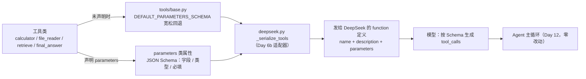
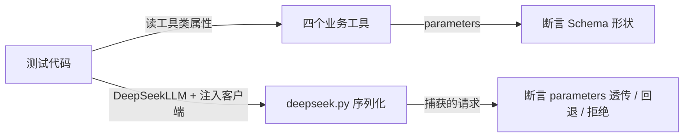
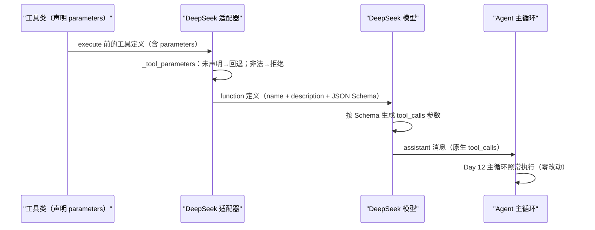

# Day 17：工具参数 Schema 代码导读

> 这篇文档怎么读（先看森林，再看树木）：
> - **第 0 步**：只看图，先建立整体印象，不要急着看代码；
> - **第 1 步**：认识这次改动改了什么、没改什么；
> - **第 2 步**：打开代码，按小节顺序逐段读；
> - **第 3 步**：看测试如何验证，最后回到森林图复查。

## 0. 先看森林：这一章到底在做什么

### 0.1 用大白话讲

Day 17 的主题是"对照优秀实现"：去看 LangChain/LangGraph 怎么定义工具、
怎么处理状态，然后只吸收**一个**有明确价值的改进。

读完官方文档和源码后，我们的结论是：LangChain 把工具定义成"名称 + 描述 +
输入参数的 JSON Schema"三件套；而我们 Day 6b 发给 DeepSeek 的工具定义里，
参数形状是一个**空的宽松对象** `{"type": "object", "properties": {}}`。

可以这样理解差距：模型是个新员工，你只告诉他"有个工具叫 calculator，
用来算数"，却不告诉他参数表长什么样，他只能靠猜。猜错了，工具就返回
"参数无效"，浪费一轮步数。Day 17 补上的正是**参数表**：给四个工具各写
一份 JSON Schema（字段名、类型、必填项、是否允许多余字段），让 DeepSeek
在发起工具调用前就拿到精确的形状。

关键点：**这次改动只动"模型看到的工具定义"**。`Agent` 主循环、注册表、
提示词、解析器、领域模型一行都没改；真实工具的 `execute` 行为也没变。
Fake LLM 不消费工具定义，所以 Day 16 的三条示例输出完全不变。

### 0.2 森林全景图



读法：从上往下。**今天的新代码是左边到中间这一段**（工具声明 Schema、
适配器读取并下放）；右边的 `Agent` 主循环和模型交互都是既有行为，不在此
次改动范围内。

### 0.3 一句话预告

一次真实 DeepSeek 调用的工具定义，从"只有名字和描述、参数是空对象"变成
"名字、描述、精确参数 Schema"三件套，模型据此生成合法参数，减少
`INVALID_ARGUMENTS` 失败轮次。

同时，Day 17 **坚决不做**：

- **不做第二遍参数校验**：工具自己已经在 `execute` 里校验参数（Day 7
  边界），Schema 只负责"提前告诉模型"，不在注册表再验一次；
- **不改 `Agent` 主循环**：步数、终止、重复动作检测等逻辑全部原封不动；
- **不引入新依赖**：JSON Schema 就是普通 Python 字典，不装任何校验库；
- **不实现新能力**：持久化、暂停/恢复、流式、异步、并行调度都不在范围内。

### 0.4 名词小词典（遇到不懂的词回来查）

| 名词 | 大白话解释 |
| --- | --- |
| JSON Schema | 用 JSON 描述"一个数据对象长什么样"的标准：字段、类型、必填 |
| 工具定义（tool definition） | 发给模型的一段 JSON，告诉模型有什么工具、怎么用 |
| function 定义 | OpenAI 兼容 API 里工具定义的正式名称 |
| 宽松对象（loose object） | `{"type": "object", "properties": {}}`，只声明"要个对象"不声明字段 |
| `additionalProperties` | Schema 关键字：`False` 表示不允许对象里出现未声明的字段 |
| `args_schema` | LangChain 里显式指定工具输入 Schema 的参数 |
| 适配器（adapter） | 把领域消息翻译成供应商请求、再把响应翻译回来的模块（Day 6） |

## 1. 认识改动：改了什么、没改什么

| 文件 | 改动 | 一句话解释 |
| --- | --- | --- |
| `src/self_react/tools/base.py` | 新增 `DEFAULT_PARAMETERS_SCHEMA`；`Tool` 协议文档说明可选 `parameters` | 给"宽松回退"一个公开的家，并把约定写进协议文档 |
| `src/self_react/tools/calculator.py` | 新增 `parameters` 类属性 | 声明 `expression` 必填字符串 |
| `src/self_react/tools/file_reader.py` | 新增 `parameters` 类属性 | 声明 `path` 必填字符串 |
| `src/self_react/tools/retrieve.py` | 新增 `parameters` 类属性 | 声明 `query` 必填字符串 |
| `src/self_react/tools/final_answer.py` | 新增 `parameters` 类属性 | 声明 `content` 必填字符串 |
| `src/self_react/tools/__init__.py` | 重导出 `DEFAULT_PARAMETERS_SCHEMA` | 让调用方从 `self_react.tools` 一处导入 |
| `src/self_react/deepseek.py` | 新增 `_tool_parameters`，`_serialize_tools` 改用它 | 适配器把 Schema 下发给模型 |
| `tests/test_tool_schemas.py` | 新增 10 个用例 | 钉死 Schema 形状与适配器行为 |

**没改**：`agent.py`、`llm.py`、`prompts.py`、`parser.py`、`models.py`、
`trace.py`、`cli.py`、`examples.py`、`tools/base.py` 里的 `Tool` 协议成员。

## 2. 进入树木：按这个顺序读代码

建议顺序：

1. [`src/self_react/tools/base.py`](../../src/self_react/tools/base.py)
   （协议与回退常量的家）；
2. [`src/self_react/tools/retrieve.py`](../../src/self_react/tools/retrieve.py)
   或任意一个业务工具（一份 Schema 长什么样）；
3. [`src/self_react/tools/__init__.py`](../../src/self_react/tools/__init__.py)
   （重导出）；
4. [`src/self_react/deepseek.py`](../../src/self_react/deepseek.py) 里的
   `_tool_parameters` 与 `_serialize_tools`（核心接线）；
5. [`tests/test_tool_schemas.py`](../../tests/test_tool_schemas.py)
   （考官）。

读代码时脑子里记着四个问题（这就是本段的骨架）：

1. `parameters` 为什么是"可选约定"而不是协议必需成员？
2. 一份 JSON Schema 怎么表达"必填、类型、拒绝多余字段"？
3. 适配器怎么区分"没声明"和"声明非法"？
4. 为什么不在注册表里用 Schema 再校验一遍？

### 2.1 第一站：`tools/base.py`——协议与回退常量的家

```python
DEFAULT_PARAMETERS_SCHEMA: JsonObject = {"type": "object", "properties": {}}
```

这是**宽松回退**：工具没声明 `parameters` 时，适配器就用这个形状发给模型，
和 Day 6b 的行为一字不差。把它定义在工具层而不是适配器私有常量，是为了让
"回退长什么样"成为工具层公开约定，测试和未来新增工具都能引用。

`Tool` 协议本体没有变：

```python
class Tool(Protocol):
    name: str
    description: str

    def execute(self, arguments: JsonObject) -> str: ...
```

协议文档新增了一段说明：可选的 `parameters` 是 JSON Schema 对象，适配器
通过 `getattr` 读取，未声明时使用 `DEFAULT_PARAMETERS_SCHEMA`。注意文档里
特意强调"**不是协议必需成员**"——为什么？因为 `Tool` 是运行时检查协议，
`isinstance(tool, Tool)` 会检查成员是否齐全；如果把 `parameters` 加进协议，
测试里不声明 schema 的 `FakeTool`、`IndependentTool` 会全部注册失败。所以
`parameters` 只存在于文档与各工具类里，协议保持最简。

### 2.2 第二站：一个业务工具的 `parameters` 声明

以 `retrieve.py` 为例：

```python
parameters: JsonObject = {
    "type": "object",
    "properties": {
        "query": {
            "type": "string",
            "description": "知识库主题词，例如 react、python、deepseek、uv、pydantic",
        },
    },
    "required": ["query"],
    "additionalProperties": False,
}
```

逐行翻译成人话：

- `"type": "object"`：这个工具的参数整体是一个 JSON 对象；
- `"properties"`：对象里允许出现的字段表，目前只有 `query` 一个；
- `"query": {"type": "string", "description": ...}`：`query` 必须是字符串，
  中文描述告诉模型它是什么意思；
- `"required": ["query"]`：调用时这个字段必填；
- `"additionalProperties": False`：**不允许出现 `query` 以外的字段**——
  这与 `_extract_query` 里"拒绝未声明参数"的真实行为完全一致。

另外三个工具是同一模式，只是字段名不同：`calculator` 要 `expression`、
`file_reader` 要 `path`、`final_answer` 要 `content`。四份 Schema 都由
测试钉死，防止声明与实际校验分叉。

### 2.3 第三站：`tools/__init__.py` 重导出

```python
from self_react.tools.base import (
    DEFAULT_PARAMETERS_SCHEMA,
    Tool,
    ...
)

__all__ = [
    "CalculatorTool",
    "DEFAULT_PARAMETERS_SCHEMA",
    ...
]
```

`tools/__init__.py` 一直承担"集中重导出公开名称"的职责，把回退常量加进去
后，调用方和测试都能从 `self_react.tools` 一处导入，不必知道它在
`base.py` 还是别的文件。

### 2.4 第四站：`deepseek.py`——核心接线

先看新的 `_tool_parameters`：

```python
def _tool_parameters(tool: object, name: str) -> dict[str, Any]:
    parameters = getattr(tool, "parameters", None)
    if parameters is None:
        return dict(DEFAULT_PARAMETERS_SCHEMA)
    if not isinstance(parameters, dict):
        raise LLMInputError(f"工具 {name} 的 parameters 必须是 JSON 对象")
    try:
        json.dumps(parameters, ensure_ascii=False, allow_nan=False)
    except (TypeError, ValueError) as exc:
        raise LLMInputError(
            f"工具 {name} 的 parameters 必须只包含可 JSON 序列化的值"
        ) from exc
    return parameters
```

这个函数处理三种情况，对应三个边界：

1. **没声明**（`getattr(..., None)` 拿到 `None`）：返回宽松回退的浅拷贝
   `dict(DEFAULT_PARAMETERS_SCHEMA)`。浅拷贝是防止调用方修改共享常量——
   每个工具定义拿到的是独立字典。
2. **声明了但不是对象**（比如传了个列表）：抛 `LLMInputError`。Schema
   必须是 JSON 对象，非法声明不能悄悄发给供应商。
3. **声明了但不可 JSON 序列化**（比如值里夹了一个 Python 函数）：
   `json.dumps` 会抛 `TypeError`，同样转成 `LLMInputError`。

再看 `_serialize_tools` 里的一处改动：

```python
serialized.append(
    {
        "type": "function",
        "function": {
            "name": name,
            "description": _tool_description(tool),
            "parameters": _tool_parameters(tool, name),
        },
    }
)
```

原来的 `"parameters": {"type": "object", "properties": {}}` 被
`_tool_parameters(tool, name)` 取代。名称、描述、参数三件套齐全，模型在
发起工具调用前就能看到精确参数形状。

### 2.5 真实请求长什么样

改动后，发给 DeepSeek 的 calculator 工具定义是：

```json
{
  "type": "function",
  "function": {
    "name": "calculator",
    "description": "计算一个算术表达式，例如 2 + 2 * 3。支持加、减、乘、除、整除、取模、幂和括号。",
    "parameters": {
      "type": "object",
      "properties": {
        "expression": {
          "type": "string",
          "description": "要计算的算术表达式，例如 2 + 2 * 3"
        }
      },
      "required": ["expression"],
      "additionalProperties": false
    }
  }
}
```

改动前，`parameters` 是 `{"type": "object", "properties": {}}`——模型只
知道"要个对象"，不知道字段。这就是 Day 17 吸收的改进在请求层面的样子。

## 3. 考官怎么看（测试）

`tests/test_tool_schemas.py` 共 10 个用例，全部在同一个 Python 进程里用
注入客户端完成，不启动子进程、不访问网络、不依赖真实 API Key。最有代表性
的几组：

1. **回退形状**：`DEFAULT_PARAMETERS_SCHEMA` 恰好是宽松对象；
2. **四份 Schema**：参数化遍历四个工具，断言 `type == "object"`、
   `additionalProperties is False`、字段集合与必填列表精确匹配、且可
   `json.dumps`；
3. **参数描述**：每个字段都带非空的 `type` 与中文 `description`；
4. **适配器透传**：`DeepSeekLLM.complete(tools=[CalculatorTool()])` 后，
   捕获到的请求里 `function["parameters"] == CalculatorTool().parameters`；
5. **回退兼容**：不声明 `parameters` 的简单工具，序列化结果仍是宽松对象；
6. **非法拒绝**：`parameters` 是列表或含不可序列化对象时抛
   `LLMInputError`，且 `client.calls == []`（请求根本没发出去）。



## 4. 回到森林：把整条路再走一遍



"只吸收一个改进"的检查清单：

- 借鉴了什么：LangChain 工具三件套（name + description + 输入 JSON
  Schema），[官方文档](https://docs.langchain.com/oss/python/langchain/tools)；
- 为什么值得：模型提前看到参数形状，减少 `INVALID_ARGUMENTS` 失败轮次；
- 代价是什么：每个工具多维护一份 `parameters`，声明必须与工具校验一致，
  由测试钉死；
- 没抄什么：ToolNode 的错误 ToolMessage 与 `handle_tool_errors`（Day 7/14
  已有等价边界）、并行工具调用（明确不做）、checkpoint 持久化（明确不做）；
- 边界守住了吗：`Agent` 主循环、注册表执行路径、提示词、解析器、领域模型
  全部零改动，Day 16 示例输出不变。

自测题（能答上来就算学会）：

1. `parameters` 为什么不能写进 `Tool` 协议必需成员？
2. `{"type": "object", "properties": {}, "required": [...],
   "additionalProperties": false}` 每一行表达什么？
3. `_tool_parameters` 怎么区分"没声明"和"声明非法"？为什么非法时要抛错
   而不是悄悄回退？
4. 为什么适配器返回回退常量前要做 `dict(...)` 浅拷贝？
5. 既然工具自己会校验参数，为什么还要把 Schema 发给模型？

自测题参考答案（先自己写，再对照）：

1. **`Tool` 是运行时检查协议，`isinstance` 会检查成员是否齐全；把
   `parameters` 加进协议会让不声明 schema 的简单工具（测试里的
   `FakeTool`、`IndependentTool`）注册失败。** 所以它只是写在协议文档里
   的可选约定，适配器用 `getattr` 读取。
2. **`type: object` 说参数整体是对象；`properties` 列出允许的字段及各自
   类型与描述；`required` 列出必填字段；`additionalProperties: false`
   拒绝未声明字段。** 这四行共同把"参数表"完整告诉模型。
3. **`getattr(tool, "parameters", None)` 拿到 `None` 就是没声明，回退宽松
   对象；声明了但不是 `dict`、或 `json.dumps` 失败就是非法，抛
   `LLMInputError`。** 非法声明说明工具作者写错了，悄悄回退会掩盖 bug，
   让错误一直存在却没人发现。
4. **避免调用方拿到后修改共享常量，影响后续所有请求。** 每个工具定义
   拿到独立副本，互不干扰。
5. **工具校验是"执行时拦截"，Schema 是"调用前预防"。** 把 Schema 发给
   模型能减少它生成非法参数的次数，少一次失败就少一轮步数；执行时校验
   仍然保留，作为最后一道防线。

## 5. 与 Day 18、Day 19 的连接

Day 18 做测试与质量收尾时，可以带着 Day 17 的问题去验证：真实 DeepSeek
调用中结构化 Schema 是否让非法参数轮次下降（真实行为不作自动化前置条件）；
`tests/test_tool_schemas.py` 也是未来新增工具时的"提醒器"——新工具如果
忘了声明 `parameters`，它仍能运行（回退宽松对象），但测试会促使作者补上
参数表。

Day 19 文档与演示时，这份"模型看到的工具定义"可以放进架构说明：从
`tools/base.py` 的协议约定，到四个工具的 Schema，再到适配器序列化，一条
线讲清楚"工具如何向模型自述"。
