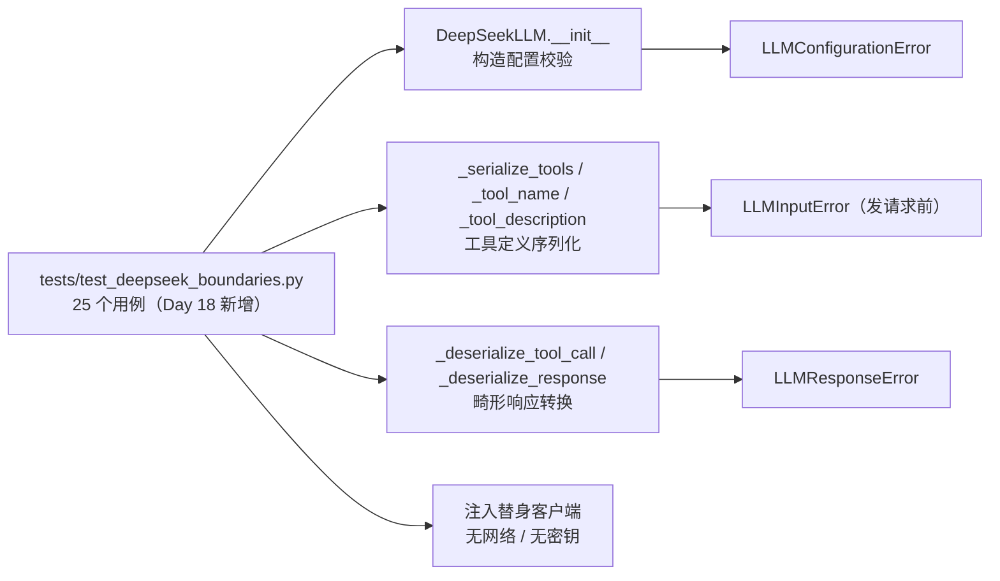
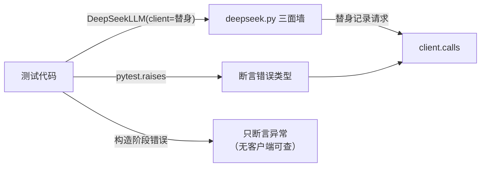
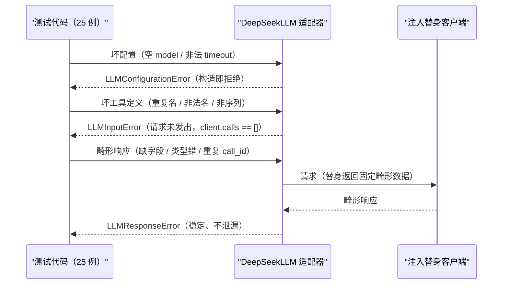

# Day 18：DeepSeek 适配器边界测试代码导读

> 这篇文档怎么读（先看森林，再看树木）：
> - **第 0 步**：只看图，先建立整体印象，不要急着看代码；
> - **第 1 步**：认识这次改动改了什么、没改什么；
> - **第 2 步**：打开代码，按小节顺序逐段读；
> - **第 3 步**：看测试如何验证，最后回到森林图复查。

## 0. 先看森林：这一章到底在做什么

### 0.1 用大白话讲

Day 18 的主题是"测试与质量"：执行完整测试与 ruff 检查，并**补齐关键
分支里仍然缺的测试**。逐模块复盘 Day 4 至 Day 17 的测试覆盖后，发现
DeepSeek 适配器（[`src/self_react/deepseek.py`](../../src/self_react/deepseek.py)）
有三类防御代码写好了、却没有一个用例验证：

1. **构造配置校验**：`DeepSeekLLM` 拒绝空模型名、空地址、非法超时；
2. **工具定义序列化**：重复工具名、非法工具名、非序列输入在发请求前
   被拒绝；
3. **畸形供应商响应**：缺字段、类型错误、重复调用编号都被转换成稳定的
   `LLMResponseError`，不泄漏 SDK 文本。

Day 18 做的唯一一件事：新增 25 个确定性测试把这些承诺钉死。**没有修改
一行生产代码**——适配器本来就这么工作，缺的只是验证。

可以这样理解：适配器像一个门卫，早就写好"坏配置、坏工具、坏响应都在
门口被拦下"的规则。Day 18 不是改规则，而是请了一组考官（测试）逐条
验证门卫真的会拦。谁以后把规则改松了或改漏了，考官立刻报警。

### 0.2 森林全景图



读法：**测试是入口**，它同时打三面墙——构造配置墙、工具定义墙、响应
转换墙；每面墙都只放行合法输入，非法输入被转成稳定错误。下面所有代码
都在这三面墙里。

### 0.3 一句话预告

Day 18 之后，`deepseek.py` 里每一段"拒绝坏输入"的代码都有对应测试；
`uv run pytest` 从 332 通过 / 3 跳过变成 357 通过 / 3 跳过，新增的 25
个用例全部离线运行。

同时，Day 18 **坚决不做**：

- **不改生产代码**：`DeepSeekLLM`、`_serialize_tools`、
  `_deserialize_response` 等一行未动；
- **不碰网络与密钥**：所有测试使用注入客户端，`DEEPSEEK_API_KEY` 可
  以不存在；
- **不复制既有用例**：三类分支在 `test_deepseek.py` 与
  `test_tool_schemas.py` 里均未覆盖；
- **不实现新能力**：持久化、暂停/恢复、流式、异步、并行调度都不在
  范围内。

### 0.4 名词小词典（遇到不懂的词回来查）

| 名词 | 大白话解释 |
| --- | --- |
| 注入客户端（injected client） | 构造 `DeepSeekLLM(client=...)` 时传一个替身，替代真实 OpenAI SDK 客户端 |
| 构造配置校验 | `__init__` 在创建客户端前检查模型名、地址、超时是否合法 |
| 发请求前拒绝 | 输入错误在 `complete` 里先被拦下，替身客户端的调用记录保持为空 |
| 畸形响应 | 供应商返回的结构不符合契约，例如缺字段、类型错误、重复编号 |
| `LLMConfigurationError` | 适配器配置无效时的稳定错误（Day 6） |
| `LLMInputError` | 调用方传给适配器的输入不满足约束时的稳定错误（Day 6） |
| `LLMResponseError` | 适配器准备返回的响应不满足助手消息约束时的稳定错误（Day 6） |

## 1. 认识改动：改了什么、没改什么

| 文件 | 改动 | 一句话解释 |
| --- | --- | --- |
| `tests/test_deepseek_boundaries.py` | 新增 25 个用例 | 钉死构造配置、工具定义、畸形响应三类边界 |
| 其它所有文件 | 无改动 | 生产代码与既有测试全部原封不动 |

**没改**：`src/self_react/deepseek.py`、`agent.py`、`llm.py`、
`prompts.py`、`parser.py`、`models.py`、`trace.py`、`cli.py`、
`examples.py`、`tools/*`，以及既有 14 个测试文件。

## 2. 进入树木：按这个顺序读代码

建议顺序：

1. [`src/self_react/deepseek.py`](../../src/self_react/deepseek.py) 里的
   `DeepSeekLLM.__init__`（第一面墙：配置）；
2. 同一个文件里的 `_tool_name`、`_tool_description`、`_serialize_tools`
   （第二面墙：工具定义）；
3. 同一个文件里的 `_deserialize_tool_call`、`_deserialize_response`
   （第三面墙：响应）；
4. [`tests/test_deepseek_boundaries.py`](../../tests/test_deepseek_boundaries.py)
   （考官）。

读代码时脑子里记着四个问题（这就是本段的骨架）：

1. 为什么构造配置校验不需要客户端，甚至不需要密钥？
2. 工具定义错误为什么必须"发请求前"拒绝？测试怎么证明？
3. 畸形响应为什么统一转成 `LLMResponseError`，而不是让调用方看到 SDK
   异常？
4. 为什么错误消息必须稳定，不泄漏异常类名或堆栈？

### 2.1 第一站：`DeepSeekLLM.__init__`——构造配置墙

```python
if not isinstance(model, str) or not model.strip():
    raise LLMConfigurationError("model 必须是非空字符串")
if not isinstance(base_url, str) or not base_url.strip():
    raise LLMConfigurationError("base_url 必须是非空字符串")
if isinstance(timeout, bool) or not isinstance(timeout, (int, float)) or timeout <= 0:
    raise LLMConfigurationError("timeout 必须是正数")
```

三个判断分别守住模型名、地址与超时。注意 `isinstance(timeout, bool)`
排在最前面：`bool` 是 `int` 的子类，不先拦掉的话 `True` 会被当成 `1`
通过校验。校验全部发生在 `if client is not None` 之前，因此**传入注入
客户端时不需要 API Key**，配置错误也在任何网络动作之前被拦住。

### 2.2 第二站：工具定义墙

`_tool_name` 要求名称必须是非空字符串：

```python
name = getattr(tool, "name", None)
if not isinstance(name, str) or not name.strip():
    raise LLMInputError("工具 name 必须是非空字符串")
```

`_serialize_tools` 用 `seen` 集合拦截重复名称：

```python
if name in seen:
    raise LLMInputError(f"工具定义重复：{name}")
```

入口还检查 `tools` 本身必须是序列。这三道检查全部在
`self._client.chat.completions.create(...)` 之前执行，所以测试可以用
`client.calls == []` 证明"请求根本没发出去"。

`_tool_description` 对非字符串描述做了宽容处理：回退到稳定占位符
`（无描述）`，而不是把数字或对象写进请求。这是与 `name` 不同的策略：
名称错了无法调用（必须拒绝），描述错了只是信息缺失（可以占位）。

### 2.3 第三站：畸形响应墙

`_deserialize_tool_call` 按字段逐级校验：

```python
call_id = _text(_field(raw_call, "id"), field_name="tool_call.id")
call_type = _text(_field(raw_call, "type"), field_name="tool_call.type")
if call_type != "function":
    raise LLMResponseError("供应商工具调用 type 必须是 function")
function = _field(raw_call, "function")
name = _text(_field(function, "name"), field_name="tool_call.function.name")
```

缺 `id`、缺 `type`、`type` 非 `function`、缺 `function`、缺 `name`、
缺 `arguments` 各自触发 `LLMResponseError`。`_field` 对字典与 SDK 对象
都兼容，因此同一套测试数据既能模拟 OpenAI 返回的字典，也能模拟真实
SDK 对象。

`_deserialize_response` 再兜一层：`content` 必须是字符串或 `null`、
`tool_calls` 必须是序列，最后构造 `Message` 时如果出现重复 `call_id`
（领域模型要求同一 assistant 消息里调用编号唯一），整个响应会被包成
`LLMResponseError`。这一层保证适配器**永远不会返回半合法消息**。

## 3. 测试怎么验证：考官清单

新增的 25 个用例可以分成五组：

| 组 | 用例数 | 验证什么 |
| --- | --- | --- |
| 构造配置非法 | 8（参数化） | 空/空白 model、空/空白 base_url、timeout 为 0 / -1 / True / "30" 都抛 `LLMConfigurationError` |
| 构造配置合法 | 1 | 正数浮点 timeout 可用，注入客户端无需密钥 |
| 工具定义非法 | 5 | 重复名、非字符串名、空白名、非序列 tools 都抛 `LLMInputError` 且 `client.calls == []` |
| 工具描述占位 | 1 | 非字符串描述回退"（无描述）"，请求正常发出 |
| 畸形响应 | 10 | 缺字段、类型错误、非序列、重复 call_id 都抛 `LLMResponseError`，且错误消息稳定不泄漏 |



两条断言路径的区别：工具定义错误发生在 `complete` 阶段，可以追加断言
`client.calls == []`；配置错误发生在 `__init__` 阶段，客户端还没创建，
只断言异常类型即可。

## 4. 回到森林：把整条路再走一遍



"只补一个可独立验收目标"的检查清单：

- 补了什么缺口：DeepSeek 适配器构造配置、工具定义、畸形响应三类未测
  分支；
- 为什么值得：这些防御分支是"代码写了但没人验证"的承诺，测试把它们
  钉成契约，防止未来被改坏；
- 代价是什么：新增一个测试文件、25 个用例，不引入任何依赖，不修改
  生产代码；
- 边界守住了吗：`Agent` 主循环、`LLM.complete` 接口、提示词、解析器、
  领域模型、工具注册表全部零改动，Day 16 示例输出不变；
- 没抄什么：没有把 `test_deepseek.py` 的既有用例复制改名，三类分支
  逐条对照确认此前未覆盖。

自测题（能答上来就算学会）：

1. `DeepSeekLLM.__init__` 为什么要在校验超时时先检查 `isinstance(timeout,
   bool)`？
2. 为什么测试工具定义错误时能断言 `client.calls == []`，而配置错误
   不能？
3. 同一个供应商响应，为什么既能用字典模拟又能用 SDK 对象模拟？
4. `content` 类型错误和 `tool_calls` 非序列为什么都要转成
   `LLMResponseError` 而不是直接抛原始异常？
5. 为什么 `name` 非法必须拒绝，而 `description` 非法只回退占位符？

自测题参考答案（先自己写，再对照）：

1. **`bool` 是 `int` 的子类，`True` 会被 `isinstance(True, int)` 判成
   数字；不先排除布尔值，`timeout=True` 会被当成 1 秒通过校验。**
2. **工具定义错误发生在 `complete` 里，替身客户端已经存在，`calls` 为
   空就证明请求没发出去；配置错误发生在 `__init__` 里，客户端还没创建，
   没有调用记录可查，只能断言异常类型。**
3. **`_field` 和 `_text` 同时支持 `Mapping`（字典）与属性访问（SDK
   对象），测试传字典、真实运行时传 SDK 对象，走同一条转换路径。**
4. **调用方只依赖稳定的错误类型做决策，不依赖供应商异常文本；把畸形
   响应统一包成 `LLMResponseError`，保证适配器永远不返回半合法消息。**
5. **名称错了模型无法找到工具，静默占位会让调用必然失败，必须拒绝；
   描述只是信息文本，缺失时用"（无描述）"占位不改变调用语义，可以
   宽容。**

## 5. 与 Day 19、Day 20 的连接

Day 19 做文档与演示时，这份边界测试可以作为"质量收尾"的证据：讲
"DeepSeek 适配器怎么处理坏配置、坏工具、坏响应"时，直接引用 25 个用例
的名字，比口头承诺更有说服力。

Day 18 复盘时还发现了两个独立的候选缺口，但没有塞进本 Issue：CLI
`run` 的运行期模型错误路径（退出码 3）与工具 Schema-校验一致性交叉
测试。Day 19/20 如果时间允许，可以各开一个小 Issue 补齐，让"测试与
质量收尾"的覆盖面更完整；Day 16 的三条示例始终是回归基准。
