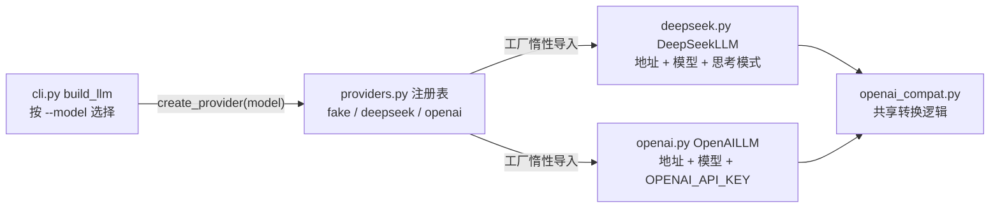
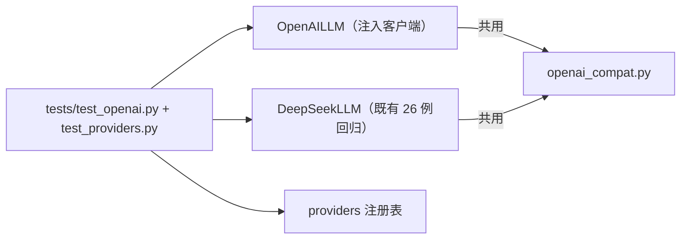
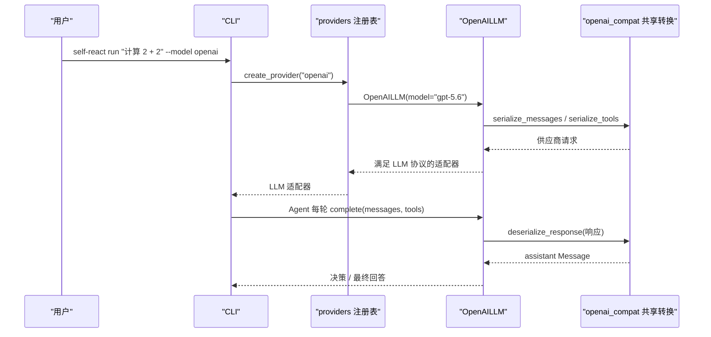

# Day 21：OpenAI 原生后端 + 模型 provider 工厂代码导读（R-01）

> 这篇文档怎么读（先看森林，再看树木）：
> - **第 0 步**：只看图，先建立整体印象，不要急着看代码；
> - **第 1 步**：认识这次改动改了什么、没改什么；
> - **第 2 步**：打开代码，按小节顺序逐段读；
> - **第 3 步**：看测试如何验证，最后回到森林图复查。

## 0. 先看森林：这一章到底在做什么

### 0.1 用大白话讲

Day 21 做的是 v0.2+ 迭代规划（`docs/project-roadmap.md`）的第一项
**R-01**：让框架真正支持第二个模型供应商。MVP 时期只有 DeepSeek 一个
适配器，CLI 里 `build_llm` 用两分支 if 选模型；这次做两件事：

1. **新增 OpenAI 原生适配器**（`OpenAILLM`），和 DeepSeek 走同一种
   OpenAI 兼容 Chat Completions 消息结构；
2. **把模型选择抽象成可注册的 provider 工厂**，让"加一个供应商"从
   "改 CLI 分支"变成"注册一个工厂"。

为了避免两个适配器各复制一份转换代码，先把 DeepSeek 里与供应商无关的
消息/工具/响应转换逻辑抽到共享模块 `openai_compat.py`，DeepSeek 与
OpenAI 都从那里导入。

可以这样理解：适配器是"翻译官"，把领域消息翻译成供应商请求、把响应翻译
回领域消息。Day 21 发现两位翻译官（DeepSeek、OpenAI）说的其实是同一种
语言（OpenAI 兼容 Chat Completions），于是把翻译词典抽成一本共享工具书，
再雇一个"调度台"（provider 工厂）按模型名派活。

### 0.2 森林全景图



读法：**CLI 不直接认识任何供应商**，只问注册表"这个模型名对应哪个工厂"；
两个适配器都不再拥有转换逻辑，只保留自己的配置并共用 `openai_compat`。

### 0.3 一句话预告

Day 21 之后，`self-react run "..." --model openai` 可以走真实的 OpenAI
原生接口；`--model` 的可选值来自注册表（`fake` / `deepseek` / `openai`）；
新增供应商只需 `register_provider("名字", 工厂)`，CLI 一行不改。

同时，Day 21 **坚决不做**：

- **不改 DeepSeek 行为**：`DeepSeekLLM` 的公开接口、请求体（含思考模式
  禁用）与错误消息全部保持原样，既有测试零改动；
- **不碰网络与密钥**：`OpenAILLM` 单测全部注入客户端，自动化测试不依赖
  真实 API Key；
- **不越界**：流式（R-05）、解析失败重试（R-02）、工具 Schema 自动生成
  （R-03）、日志/故障排查场景（R-07）都留到后续工作项；
- **不动保护文件**：`tmp/`、历史导读、交接文档与 roadmap 草案原样保留。

### 0.4 名词小词典（遇到不懂的词回来查）

| 名词 | 大白话解释 |
| --- | --- |
| 适配器（adapter） | 夹在领域模型和供应商 API 之间做翻译的模块，如 `DeepSeekLLM`、`OpenAILLM` |
| provider 工厂 | 把"模型名"变成 LLM 适配器的无参工厂函数，注册在 `providers.py` 注册表里 |
| 注入客户端（injected client） | 构造 `OpenAILLM(client=...)` 时传一个替身，替代真实 OpenAI SDK 客户端 |
| 共享转换层 | `openai_compat.py`：两个供应商共用的消息/工具/响应转换逻辑 |
| `extra_body` | OpenAI SDK 请求的额外字段；DeepSeek 用它传思考模式禁用，OpenAI 传 `None` |
| `OPENAI_API_KEY` | OpenAI 原生适配器默认读取的密钥环境变量 |

## 1. 认识改动：改了什么、没改什么

| 文件 | 改动 | 一句话解释 |
| --- | --- | --- |
| `src/self_react/openai_compat.py` | 新增 | 共享转换逻辑（从 `deepseek.py` 原样迁入） |
| `src/self_react/openai.py` | 新增 | `OpenAILLM` 适配器，读 `OPENAI_API_KEY` |
| `src/self_react/providers.py` | 新增 | provider 注册表与工厂，默认注册三个模型名 |
| `src/self_react/deepseek.py` | 重构 | 转换逻辑改用共享模块，公开行为不变 |
| `src/self_react/cli.py` | 修改 | `--model` 来自注册表，`build_llm` 委托工厂 |
| `tests/test_openai.py` | 新增 | OpenAI 适配器离线测试（27 例） |
| `tests/test_providers.py` | 新增 | 注册表与工厂测试（15 例） |
| `tests/test_cli.py` | 修改 | 补 `--model openai` 与工厂密钥测试（4 例） |
| `README.md` / `.env.example` | 修改 | 配置、运行、架构简介与局限性同步 |

**没改**：`agent.py`、`llm.py`、`prompts.py`、`parser.py`、
`models.py`、`trace.py`、`examples.py`、`tools/*`，以及既有 14 个测试
文件全部原封不动。

## 2. 进入树木：按这个顺序读代码

建议顺序：

1. [`src/self_react/openai_compat.py`](../../src/self_react/openai_compat.py)
   （共享词典）；
2. [`src/self_react/openai.py`](../../src/self_react/openai.py)
   （新翻译官）；
3. [`src/self_react/deepseek.py`](../../src/self_react/deepseek.py)
   （改造后的老翻译官，对比差异）；
4. [`src/self_react/providers.py`](../../src/self_react/providers.py)
   （调度台）；
5. [`src/self_react/cli.py`](../../src/self_react/cli.py)
   （接线）；
6. [`tests/test_openai.py`](../../tests/test_openai.py) 与
   [`tests/test_providers.py`](../../tests/test_providers.py)（考官）。

读代码时脑子里记着四个问题（这就是本段的骨架）：

1. 为什么共享转换层能同时服务 DeepSeek 和 OpenAI？
2. `OpenAILLM` 和 `DeepSeekLLM` 的真正差异到底有几处？
3. provider 工厂为什么能让 CLI "不认识任何供应商"？
4. 注册表为什么拒绝重复注册，又为什么在创建时校验返回值？

### 2.1 第一站：`openai_compat.py`——共享词典

这个模块的五个公开入口正好对应适配器需要的全部转换能力：

```python
serialize_message(message)  # 单条领域消息 -> 供应商消息
serialize_messages(messages)  # 完整上下文 -> 请求消息列表
serialize_tools(tools)  # 工具清单 -> function 工具定义
deserialize_response(response)  # 供应商响应 -> assistant Message
provider_error_code(error)  # SDK 异常 -> 稳定错误类别
```

为什么两个供应商能共用？因为 DeepSeek 的接口本来就是 OpenAI 兼容的：
请求都是 `role/content/tool_calls/tool_call_id` 消息加 function 工具定义，
响应都是 `choices[0].message` 加可选的 `tool_calls`。差异只发生在
"调用 `chat.completions.create` 时传什么默认值"，那属于适配器自己的事。

注意 `_field` / `_text` 同时兼容字典与 SDK 对象：测试传字典、真实运行时传
SDK 对象，走同一条转换路径（这是 Day 6 就定下的测试技巧，Day 21 原样保留）。

### 2.2 第二站：`openai.py`——新翻译官

`OpenAILLM` 的结构与 `DeepSeekLLM` 几乎一一对应：

```python
DEFAULT_BASE_URL = "https://api.openai.com/v1"
DEFAULT_MODEL = "gpt-5.6"
DEFAULT_TIMEOUT = 30.0
```

构造时做三件事：校验 `model` / `base_url` / `timeout`（与 DeepSeek 相同的
三面墙）；有注入客户端就直接使用；否则从 `OPENAI_API_KEY` 读取密钥并构造
`OpenAI(client=..., max_retries=0)`。

`complete` 只比 DeepSeek 少一行：DeepSeek 在 `extra_body` 里放思考模式
禁用配置，OpenAI 直接传 `extra_body=None`——OpenAI 没有 `reasoning_content`
往返约束，不需要这个开关。其余完全走共享模块。

### 2.3 第三站：`deepseek.py`——改造后的老翻译官

重构后的 `deepseek.py` 只剩 DeepSeek 自己的东西：默认地址、默认模型、
思考模式开关、密钥构造，以及 `complete` 里的 `extra_body["thinking"]`。
消息/工具/响应转换全部改成从 `openai_compat` 导入。`DeepSeekLLM` 的
公开接口与错误文本一字未变——这正是既有 26 个 DeepSeek 测试一个不用改
就能全绿的原因。

### 2.4 第四站：`providers.py`——调度台

```python
_PROVIDERS: dict[str, ProviderFactory] = {}


def register_provider(name, factory): ...  # 非空名称 + 可调用 + 不覆盖
def available_providers(): ...  # 按名称排序
def create_provider(name): ...  # 查表创建 + 校验返回值


register_provider("fake", _fake_provider)
register_provider("deepseek", _deepseek_provider)
register_provider("openai", _openai_provider)
```

三个默认工厂都是无参函数；`_deepseek_provider` / `_openai_provider`
把 `from self_react.deepseek import ...` 放在函数内部，实现惰性导入——
只有真正 `create_provider("deepseek")` 时才触碰 DeepSeek 模块与密钥。

两个防御设计值得注意：

- **重复注册直接拒绝**：扩展点一旦建立就不允许被同名工厂覆盖，避免
  "某个模块顺手注册了同名字"导致行为漂移；
- **创建时校验返回值**：`isinstance(llm, LLM)`（`LLM` 是
  `runtime_checkable` 协议），工厂返回了不满足协议的对象会得到稳定配置
  错误，而不是让错误在 `Agent` 里爆出来。

### 2.5 第五站：`cli.py`——接线

两处改动把 CLI 从"认识供应商"变成"只认识注册表"：

```python
_MODEL_CHOICES = available_providers()  # --model 的可选值来自注册表


def build_llm(model, max_steps, task):
    return create_provider(model)
```

`build_llm` 的签名（`model, max_steps, task`）保持不变，`max_steps` 与
`task` 仍只用于测试工厂断言 CLI 是否正确传参；`--model` 的帮助文本列出
三个选项。`argparse` 的 `choices` 会让未注册的模型名在参数层就报
`invalid choice`，未知模型不会走到工厂。

## 3. 测试怎么验证：考官清单

| 文件 | 用例数 | 验证什么 |
| --- | --- | --- |
| `tests/test_openai.py` | 27 | 默认常量、消息/工具序列化、响应反序列化、畸形响应拒绝、密钥来源、构造配置、SDK 错误映射 |
| `tests/test_providers.py` | 15 | 默认注册、三个 provider 创建路径、未知名称、自定义注册、重复/非法注册、非法返回值 |
| `tests/test_cli.py` 新增 | 4 | 三个模型名都是合法选项并透传、`build_llm("openai")` 无密钥报稳定错误 |

关键断言模式：

- **请求体断言**：注入客户端记录 `model/messages/stream/tools/extra_body`，
  直接断言 OpenAI 请求 `extra_body is None`、DeepSeek 请求
  `extra_body == {"thinking": {"type": "disabled"}}`，两个适配器的差异
  被钉死在测试里；
- **密钥来源**：`monkeypatch.delenv("OPENAI_API_KEY")` 后构造 `OpenAILLM()`
  抛 `LLMConfigurationError`；`create_provider("openai")` 同样报错——证明
  真实路径只读 `OPENAI_API_KEY`；
- **发请求前拒绝**：输入错误路径断言 `client.calls == []`，证明请求没发出去；
- **错误稳定**：SDK 异常只暴露稳定类别（`AUTHENTICATION` / `TIMEOUT` /
  `CONNECTION` / `RATE_LIMIT` / `BAD_REQUEST` / `SERVICE` / `UNKNOWN`），
  断言 `"secret" not in str(error)`，不泄漏 SDK 文本。



## 4. 回到森林：把整条路再走一遍



"只补一个可独立验收目标"的检查清单：

- 补了什么缺口：无 OpenAI 原生后端、无 provider 工厂（roadmap R-01）；
- 为什么值得：让"可插拔后端"从协议层面落到实现层面，新增供应商不再改
  CLI 分支；
- 代价是什么：新增 3 个源文件、2 个测试文件，改动 1 个源文件（`deepseek.py`
  重构）、2 个既有文件（`cli.py`、`test_cli.py`），无新运行时依赖；
- 边界守住了吗：`Agent`、`LLM.complete` 接口、提示词、解析器、领域模型、
  工具注册表全部零改动，DeepSeek 既有测试零改动，Day 16 示例输出不变；
- 没抄什么：没有复制 `deepseek.py` 再改常量，共享转换层是原样迁移，
  两个适配器共用同一份实现。

自测题（能答上来就算学会）：

1. 为什么 `openai_compat.py` 的转换逻辑能被 DeepSeek 和 OpenAI 同时使用？
2. `OpenAILLM` 与 `DeepSeekLLM` 在代码上的差异具体有哪几处？
3. `create_provider` 为什么要校验工厂返回值是不是 `LLM`？
4. 为什么 `--model` 的可选值改成 `available_providers()` 之后，CLI 就
   "不认识任何供应商"了？
5. 为什么重复注册同名 provider 会被拒绝？

自测题参考答案（先自己写，再对照）：

1. **DeepSeek 的接口本来就是 OpenAI 兼容的 Chat Completions：消息结构、
   工具定义形状与响应形状相同，只有默认配置（地址/模型/密钥/额外字段）
   不同。**
2. **默认地址（deepseek.com vs openai.com/v1）、默认模型名、密钥环境变量
   （DEEPSEEK vs OPENAI）、DeepSeek 多一个思考模式开关（`extra_body` 里
   的 `thinking`），以及错误消息前缀（"DeepSeek 请求失败" vs
   "OpenAI 请求失败"）。**
3. **注册表是扩展点，任何模块都能注册；在创建时校验返回值可以尽早把
   "工厂写错"变成稳定配置错误，而不是让错误在 `Agent` 里以类型问题爆开。**
4. **CLI 只调用 `create_provider(model)`，模型名到工厂的映射完全由注册表
   持有；新增供应商时注册表多一条映射，CLI 的代码和参数定义都不需要改。**
5. **防止扩展点被意外覆盖：如果两个模块想注册同一个名字，后注册的会
   静默顶掉先注册的，行为漂移很难排查；直接拒绝让冲突在注册时就暴露。**

## 5. 与后续工作的连接

Day 21 的共享转换层与 provider 工厂为 roadmap 后面的工作项铺好了路：

- **R-02 解析失败重试**只改 `Agent`，与适配器无关，可以完全不动本日的
  三个新模块；
- **R-05 流式输出**要在 `LLM` 协议加 `complete_stream`，两个适配器各自
  实现真流式——共享的 `openai_compat` 依旧负责消息与工具转换，流式只
  新增增量组装；
- **R-07 日志/故障排查场景**的模型后端现在有了 `deepseek` / `openai`
  两个选择，演示时可以直接 `--model openai` 跑真实接口手动验收；
- 再接入第三个 OpenAI 兼容供应商时，只需要新增一个适配器文件 +
  `register_provider("名字", 工厂)`，CLI 与共享转换层都不需要改。
