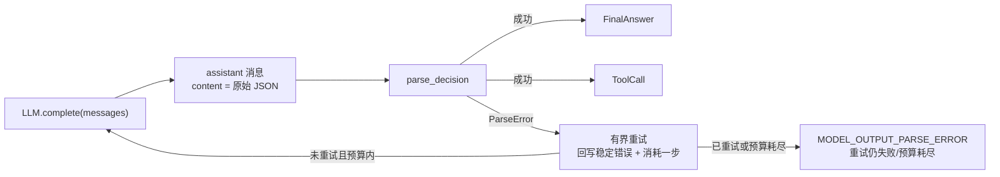
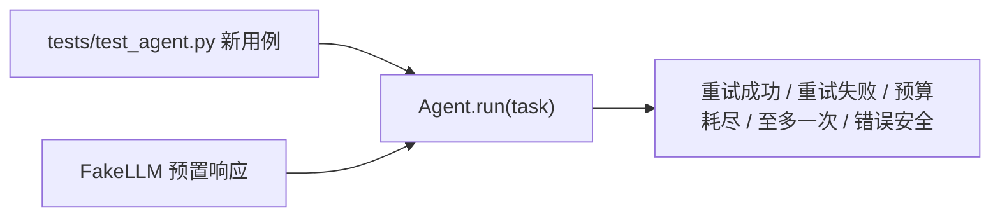
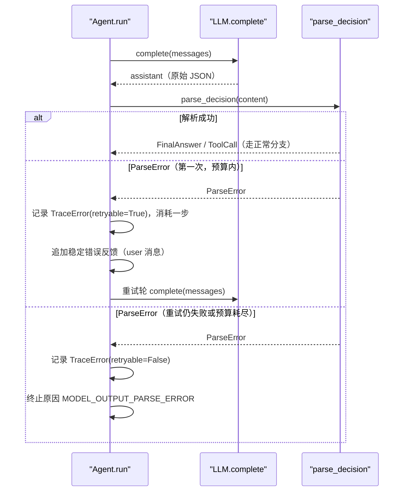

# Day 22：解析失败有界重试代码导读（R-02）

> 这篇文档怎么读（先看森林，再看树木）：
> - **第 0 步**：只看图，先建立整体印象，不要急着看代码；
> - **第 1 步**：认识这次改动改了什么、没改什么；
> - **第 2 步**：打开代码，按小节顺序逐段读；
> - **第 3 步**：看测试如何验证，最后回到森林图复查。

## 0. 先看森林：这一章到底在做什么

### 0.1 用大白话讲

Day 22 做的是 v0.2+ 迭代规划（`docs/project-roadmap.md`）的第二项
**R-02**：让解析失败从"直接终止"变成"有界重试"。MVP 时期（Day 12）模型
输出无法解析时只记录一条轨迹错误就结束，不猜、不补、不改写；但真实模型
偶尔会输出不合格式的 JSON，一次返工机会都不给会浪费整轮预算。这次只改
`Agent` 一个模块，做三件事：

1. 解析失败时把稳定错误消息回写给模型（user 角色，只含 `ParseError` 的
   中文说明，不泄漏原始输出）；
2. 失败那轮照常消耗一步预算；
3. 至多重试一次：重试成功就继续正常循环，重试仍失败或预算不足以重试就
   终止。

可以这样理解：解析器是"质检员"，主循环是"流水线"。以前质检不合格直接
报废；现在质检员把不合格原因写一张纸条（稳定错误消息）贴回流水线，让模型
返工一次。纸条只写"哪里不符合格式契约"，绝不把废品原样贴在流水线上。

### 0.2 森林全景图



读法：`ParseError` 不再直接指向终止，而是先经过"有界重试"闸门——只有
"已经重试过一次"或"预算不够再试一次"才真正终止。

### 0.3 一句话预告

Day 22 之后，模型输出非法 JSON 时会收到一条稳定错误消息并获得一次返工
机会；`MODEL_OUTPUT_PARSE_ERROR` 仍然存在，但只出现在"返工也失败"或
"没有返工预算"之后。

同时，Day 22 **坚决不做**：

- **不改其他模块**：`LLM.complete` 接口、领域模型、解析器、提示词、工具层、
  CLI 全部零改动；
- **不无限重试**：一次运行内至多重试一次，`parse_retried` 是硬闸门；
- **不泄漏原始输出**：反馈消息只含 `ParseError` 的稳定中文说明；
- **不越界**：流式（R-05）、工具 Schema 自动生成（R-03）、日志/故障排查
  场景（R-07）留到后续工作项。

### 0.4 名词小词典（遇到不懂的词回来查）

| 名词 | 大白话解释 |
| --- | --- |
| 有界重试（bounded retry） | 至多重试一次、每次都消耗步数的纠错策略，绝不形成无限子循环 |
| 稳定错误反馈 | `_parse_error_feedback` 生成的 user 消息：只含解析器中文说明 |
| `parse_retried` | `Agent.run` 里的局部布尔标志：一次运行是否已经用过唯一那次重试 |
| 预算语义 | 一步 = 一次模型决策尝试；失败轮与重试轮各算一步 |
| `TraceError.retryable` | 控制器是否还会继续重试这个错误（首次失败且预算内为 True，最终失败为 False） |

## 1. 认识改动：改了什么、没改什么

| 文件 | 改动 | 一句话解释 |
| --- | --- | --- |
| `src/self_react/agent.py` | 修改 | `MODEL_OUTPUT_PARSE_ERROR` 分支改为有界重试，新增 `_parse_error_feedback` 与 `parse_retried` |
| `tests/test_agent.py` | 修改 | 新增 5 个用例，更新既有解析失败用例与状态不变量参数化 |
| `tests/test_trace.py` | 修改 | 端到端解析失败渲染用例适配新语义 |
| `docs/architecture/react-loop.md` | 修改 | 状态图与"模型输出无法解析"章节同步 |
| `docs/architecture/day-12-agent-loop-code-walkthrough.md` | 修改 | 解析失败相关章节同步 |
| `docs/daily/day-22-parse-error-bounded-retry.md` | 新增 | 当日记录（含真实 DeepSeek 手动验收） |
| `docs/architecture/day-22-parse-error-bounded-retry-code-walkthrough.md` | 新增 | 本文档 |

**没改**：`llm.py`、`parser.py`、`prompts.py`、`models.py`、`trace.py`、
`examples.py`、`cli.py`、`providers.py`、`tools/*`，以及除上面两处外的
全部既有测试文件。

## 2. 进入树木：按这个顺序读代码

建议顺序：

1. [`src/self_react/agent.py`](../../src/self_react/agent.py)（唯一改动的
   源文件）；
2. [`tests/test_agent.py`](../../tests/test_agent.py)（考官，重点看 5 个
   新用例）。

读代码时脑子里记着四个问题（这就是本段的骨架）：

1. `retryable` 是怎么算出来的，为什么第一次失败和第二次失败不一样？
2. 为什么"预算恰好耗尽"时终止原因仍是 `MODEL_OUTPUT_PARSE_ERROR` 而不是
   `MAX_STEPS_EXCEEDED`？
3. 反馈消息为什么用 user 角色、为什么不能包含原始输出？
4. `parse_retried` 为什么是 `run` 的局部变量而不是 `AgentState` 字段？

### 2.1 第一站：有界重试分支（`run` 的 ParseError 分支）

```python
except ParseError as exc:
    # 解析失败有界重试：至多重试一次。第一次失败回写稳定
    # 错误消息并消耗一步预算；重试仍失败或预算不足以发起
    # 重试时，以 MODEL_OUTPUT_PARSE_ERROR 终止。
    retryable = not parse_retried and step_number < state.max_steps
    step = TraceStep(
        step_number=step_number,
        input_summary=input_summary,
        error=TraceError(
            code=exc.code,
            message=str(exc),
            retryable=retryable,
        ),
        duration_ms=duration_ms,
    )
    trace = [*state.trace, step]
    if not retryable:
        state = self._rebuild_state(
            task=task,
            tool_names=tool_names,
            messages=messages,
            steps_used=step_number,
            trace=trace,
            termination_reason=TerminationReason.MODEL_OUTPUT_PARSE_ERROR,
        )
        break
    state = self._rebuild_state(
        task=task,
        tool_names=tool_names,
        messages=messages,
        steps_used=step_number,
        trace=trace,
    )
    messages.append(_parse_error_feedback(exc))
    parse_retried = True
    continue
```

一行一行看：

- `retryable = not parse_retried and step_number < state.max_steps`：重试
  资格 = "还没用过重试" 且 "这轮消耗后还有预算"。第一次失败且
  `max_steps > 1` 时为 `True`；重试轮再失败时 `parse_retried` 已为 `True`，
  或预算恰好耗尽，都为 `False`；
- `TraceStep` 只带 `error`，`decision`/`observation` 都是 `None`——解析
  失败没有合法决策可记，"不伪造决策"；
- `trace = [*state.trace, step]` 先构造一次，避免把同一个 `step` 追加两遍
  触发 Day 4 校验（这个坑在当日记录里详述）；
- `if not retryable`：带 `termination_reason` 重建状态并 `break`。注意终止
  原因永远是 `MODEL_OUTPUT_PARSE_ERROR`，即使是因为预算耗尽——"为什么停"
  是解析失败，不是正常走完预算；
- `messages.append(_parse_error_feedback(exc))`：只有真正要重试时才回写
  反馈；重试仍失败时消息末尾就是那条失败的 assistant 消息；
- `parse_retried = True; continue`：标记"重试机会已用"，回到循环开头的
  预算闸门进入重试轮。

### 2.2 第二站：稳定错误反馈（`_parse_error_feedback`）

```python
def _parse_error_feedback(exc: ParseError) -> Message:
    """构造解析失败时回写给模型的稳定错误反馈消息。

    只复用 ``ParseError`` 的稳定中文说明（``str(exc)``），不泄漏模型原始
    输出、异常对象或堆栈；引导模型按 Day 10 格式契约重新输出一个 JSON
    对象，与提示词的输出纪律保持一致。反馈作为 user 角色消息追加到上下文，
    让重试轮模型能看到失败原因。
    """

    return Message(
        role=MessageRole.USER,
        content=(
            f"你的上一条输出无法解析：{exc}。请重新输出，只输出一个 "
            "JSON 对象，kind 只能是 final_answer 或 tool_call，"
            "不要包含 JSON 以外的文字、解释或代码块标记。"
        ),
    )
```

三个设计点：

- **复用稳定文本**：`{exc}` 就是 `ParseError` 的中文说明（如
  "content 必须是字符串"），与轨迹里 `TraceError.message` 同源，两边不会
  分叉；
- **不泄漏原始输出**：反馈里没有任何 `response.content` 的片段，模型原始
  输出、异常堆栈、API Key 都不会进入下一轮上下文；
- **用 user 角色**：领域模型里没有"纠错"角色，user 消息是唯一不需要新增
  领域模型就能合法追加进对话历史的角色；重试轮模型把它当作"上一轮不合格 +
  请返工"的指示。

### 2.3 第三站：`parse_retried` 与预算语义

```python
parse_retried = False
while not state.is_terminated:
    if state.steps_used >= state.max_steps:
        # MAX_STEPS_EXCEEDED
    step_number = state.steps_used + 1
```

`parse_retried` 是 `run` 的局部变量，不是领域状态——它不需要序列化，也
不会被放进 `AgentState`。它是"至多一次"的物理保证：即使第一次重试成功后
又跑了多轮工具，只要运行中再出现解析失败，`not parse_retried` 为 `False`，
直接终止。

预算语义与 Day 12 完全一致：一步 = 一次模型决策尝试。失败轮算一步、重试
轮再算一步，所以 `max_steps=1` 时第一次失败后就无预算重试；`llm.call_count`
永远不会超过 `max_steps`。

### 2.4 第四站：`TraceError.retryable` 的语义变化

Day 12 时解析失败的 `retryable` 固定 `False`（MVP 不重试）。Day 22 把它与
工具失败的 `retryable` 对齐：表示"这次失败之后控制器还会不会继续重试"。

| 场景 | retryable | 终止原因 |
| --- | --- | --- |
| 第一次解析失败且预算内 | `True` | 不终止，进入重试轮 |
| 重试仍失败 | `False` | `MODEL_OUTPUT_PARSE_ERROR` |
| 第一次失败但预算恰好耗尽 | `False` | `MODEL_OUTPUT_PARSE_ERROR` |
| 重试成功 | — | 继续正常循环 |

## 3. 测试怎么验证：考官清单

`tests/test_agent.py` 新增 5 个用例：

| 用例 | 覆盖路径 | 关键断言 |
| --- | --- | --- |
| `test_parse_error_retry_once_then_tool_call_and_final_answer` | 重试一次成功 | 错误步骤 `retryable=True`、重试轮上下文以 user 反馈结尾、工具正常执行、`FINAL_ANSWER` |
| `test_parse_error_retry_still_fails_terminates` | 重试仍失败 | 两步轨迹、第一次 `retryable=True` / 第二次 `False`、`call_count == 2`、消息末尾是 assistant |
| `test_parse_error_budget_exhausted_terminates_without_retry` | 预算恰好耗尽 | `max_steps=1` 时 `call_count == 1`、无反馈消息、`retryable=False` |
| `test_parse_error_feedback_message_is_stable_and_does_not_leak_raw_output` | 错误安全 | 反馈含"你的上一条输出无法解析"与稳定说明，不含原始字符串/数值/`Traceback`/`ValidationError` |
| `test_parse_error_retry_is_at_most_once_per_run` | 至多一次 | 重试成功后再次解析失败直接终止，`retryable=False`，无第二次反馈 |

关键断言模式：

- **用 FakeLLM 预置响应模拟路径**：`[坏输出, 工具调用, 最终回答]` 验证重试
  成功后继续；`[坏输出, 坏输出]` 验证重试失败终止；`[坏输出] + max_steps=1`
  验证预算耗尽；
- **用 `llm.calls[1][-1]` 断言重试轮输入**：证明反馈消息真的进了第二次
  模型调用的上下文；
- **断言消息角色序列**：预算耗尽路径下 `messages` 恰好是
  system/user/assistant，证明没有多余反馈；
- **状态不变量**：`steps_used == len(trace)` 且 `steps_used <= max_steps`
  在参数化用例中对所有终止路径生效。



## 4. 回到森林：把整条路再走一遍



"只改一个分支"的检查清单：

- 补了什么缺口：解析失败直接终止，模型没有返工机会（roadmap R-02）；
- 为什么值得：给模型一次纠错机会，同时用"至多一次 + 消耗步数"杜绝无限
  子循环；
- 代价是什么：只改 `agent.py` 一个源文件，新增 2 个辅助点
  （`_parse_error_feedback`、`parse_retried`）；
- 边界守住了吗：`LLM` 接口、解析器、提示词、领域模型、工具层零改动；
  Day 16 三条示例输出不变；pytest 407 通过 / 3 跳过；
- 没抄什么：没有在解析器或 LLM 层开重试循环，重试完全由唯一的循环控制器
  执行。

自测题（能答上来就算学会）：

1. `retryable = not parse_retried and step_number < state.max_steps` 两个
   条件各防什么？
2. 为什么"预算恰好耗尽"的终止原因不是 `MAX_STEPS_EXCEEDED`？
3. 反馈消息为什么不能包含模型原始输出？
4. `parse_retried` 为什么是 `run` 的局部变量而不是 `AgentState` 字段？
5. 重试成功后再次解析失败会发生什么？

自测题参考答案（先自己写，再对照）：

1. **`not parse_retried` 防"多次重试"（至多一次），
   `step_number < state.max_steps` 防"预算外重试"（绝不发起第
   `max_steps + 1` 次调用）。**
2. **终止原因描述的是"为什么停"：模型输出无法解析才是停下来的直接原因，
   预算只是限制了返工机会。工具失败后的预算耗尽仍然映射为
   `MAX_STEPS_EXCEEDED`，两条路径语义不同，测试把这一点钉死了。**
3. **模型原始输出可能包含敏感信息或触发格式注入；反馈只复用 `ParseError`
   的稳定中文说明，既安全又可复现。**
4. **它是运行期的控制状态，不需要序列化、不需要被调用方读取；放进
   `AgentState` 只会污染领域模型，还违背"状态只保存可序列化运行数据"的
   边界。**
5. **直接以 `MODEL_OUTPUT_PARSE_ERROR` 终止：重试机会已经用掉，
   `parse_retried=True` 使 `retryable` 为 `False`。**

## 5. 与后续工作的连接

Day 22 把 `Agent` 的纠错策略从"直接终止"推进到"有界重试"，为 roadmap
后面的工作项铺路：

- **R-03 工具 Schema 自动生成**会改变工具的声明与校验边界，但主循环的
  解析分支不受影响，二者可以并行推进；
- **R-05 流式输出**新增 `complete_stream` 时，解析失败重试逻辑照常作用于
  每条最终消息，不需要单独设计；
- **R-07 日志/故障排查场景**的长任务里模型更容易偶尔输出不合格式的 JSON，
  有界重试让这类任务有更高的完成率，同时 `MODEL_OUTPUT_PARSE_ERROR` 仍是
  可解释的终止原因；
- 若未来要支持"连续 N 次失败才终止"或"按错误类型决定是否重试"，可以沿用
  `parse_retried` 与 `TraceError.retryable` 这套显式语义扩展，不需要改变
  消息结构。
