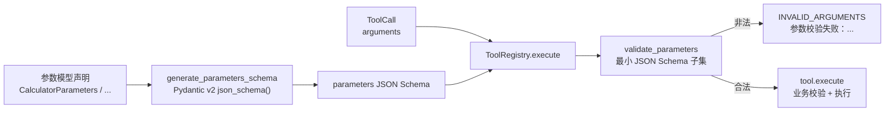
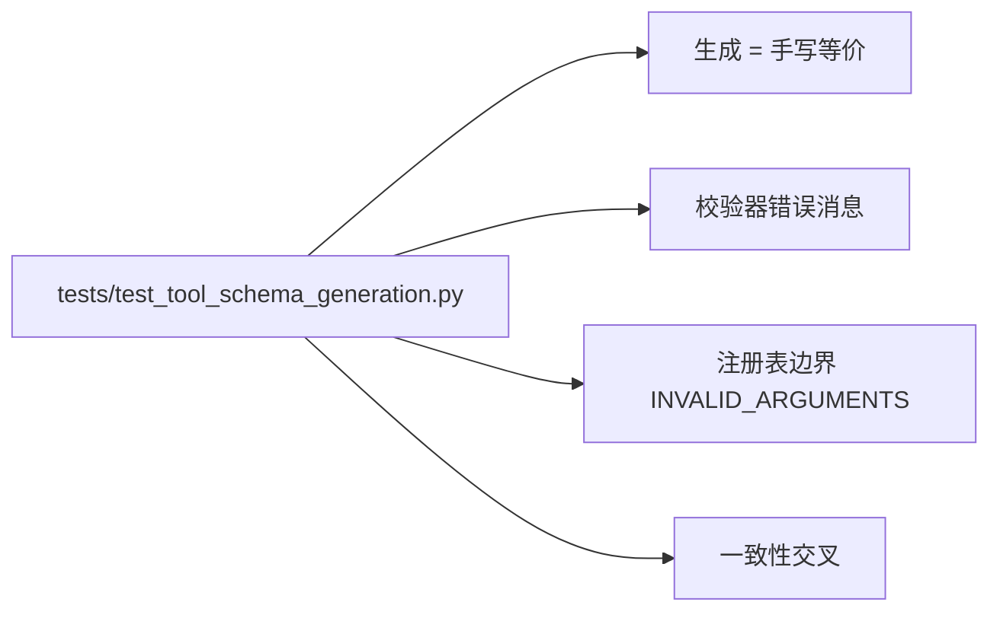
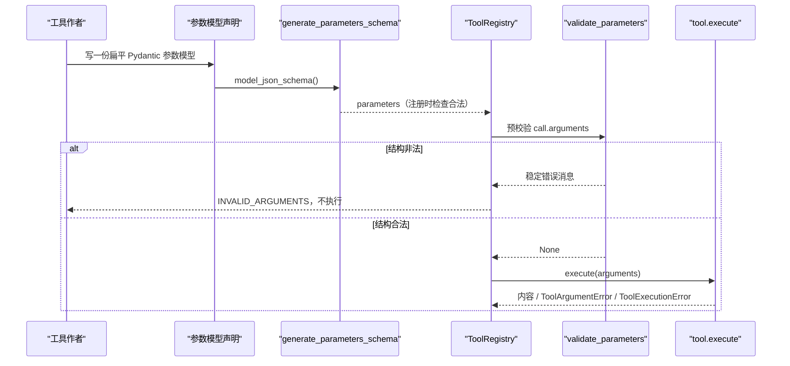

# Day 23：工具 Schema 自动生成与注册表预校验代码导读（R-03）

> 这篇文档怎么读（先看森林，再看树木）：
> - **第 0 步**：只看图，先建立整体印象，不要急着看代码；
> - **第 1 步**：认识这次改动改了什么、没改什么；
> - **第 2 步**：打开代码，按小节顺序逐段读；
> - **第 3 步**：看测试如何验证，最后回到森林图复查。

## 0. 先看森林：这一章到底在做什么

### 0.1 用大白话讲

Day 17 让工具向模型"自述参数"：每个业务工具手写一份 `parameters` JSON
Schema，适配器把它随工具定义下发给模型。手写有几个问题：容易和工具自己
的业务校验分叉（模型按 Schema 生成参数，工具却按另一套规则拒绝）；每次
加参数都要同步改两处；Schema 本身也没有被注册表使用——参数合法性仍然
等到工具业务校验才发现。

Day 23（R-03）把"手写字典"升级为"声明即校验"，做三件事：

1. 新增 `tools/schema.py`：从 Pydantic v2 参数模型（优先）或函数签名自动
   生成参数 JSON Schema，四个业务工具改为从参数模型声明生成；
2. `ToolRegistry.execute` 在业务校验之前按 Schema 预校验参数，非法参数
   以稳定错误码 `INVALID_ARGUMENTS` 被拒，工具根本不会被调用；
3. 补 Day 18 记录的候选缺口：工具 Schema 与工具校验一致性交叉测试。

可以这样理解：以前工具带着两份手写"体检表"（一份给模型看、一份自己查）；
现在只有一份"基因档案"（参数模型声明），Schema 是自动翻译出来的，注册表
在放行之前先按它做一次结构体检，业务规则（表达式语法、路径越界、主题
是否存在）仍然由工具自己把关。

### 0.2 森林全景图



读法：上半段是"声明 -> 生成"（一次性的类属性）；下半段是"调用 -> 预校验
-> 业务执行"（每次 `execute` 都会走）。`validate_parameters` 是注册表新增
的安检门，业务 `execute` 只收到通过安检的参数。

### 0.3 一句话预告

Day 23 之后，工具的 `parameters` 不再手写，而是从参数模型自动生成；注册表
在分派前先按 Schema 拒绝结构非法参数（缺必需、类型错、多余键），错误码
稳定为 `INVALID_ARGUMENTS`，且工具不被执行。

同时，Day 23 **坚决不做**：

- **不新增依赖**：生成用 Pydantic v2 内置 `model_json_schema()`，校验用
  项目内最小 JSON Schema 子集，不引入 `jsonschema`；
- **不替业务把关**：Schema 只表达结构规则；表达式语法、路径是否越界、
  主题是否存在等语义规则仍由工具在 `execute` 里校验；
- **不改变适配器**：`openai_compat.py` 读取 `parameters` 的逻辑零改动，
  生成结果与 Day 17 手写 Schema 等价，因此下发给模型的内容不变；
- **不越界**：持久化、流式、异步、并行工具调度、多智能体协作仍不属于
  本期范围。

### 0.4 名词小词典（遇到不懂的词回来查）

| 名词 | 大白话解释 |
| --- | --- |
| 声明即校验（declaration-driven） | 只写一份参数声明，Schema 生成与预校验都由它驱动 |
| 参数模型（parameters model） | 描述工具参数的扁平 Pydantic 模型，如 `CalculatorParameters` |
| 最小 JSON Schema 子集 | 项目内自写的校验器，只支持本项目实际用到的 Schema 关键字 |
| Schema 预校验 | 注册表在业务校验之前按 Schema 检查参数字典的"结构" |
| 交叉测试（cross test） | 同时验证 Schema 声明与工具业务校验对同一批参数的行为一致 |

## 1. 认识改动：改了什么、没改什么

| 文件 | 改动 | 一句话解释 |
| --- | --- | --- |
| `src/self_react/tools/schema.py` | 新增 | Schema 自动生成（模型/签名两条路径）+ 最小校验器 + Schema 结构校验 |
| `src/self_react/tools/base.py` | 修改 | `register` 检查声明的 Schema 合法性；`execute` 在业务校验前预校验参数 |
| `src/self_react/tools/__init__.py` | 修改 | 公共出口新增 `generate_parameters_schema` |
| `src/self_react/tools/calculator.py` | 修改 | 新增 `CalculatorParameters` 参数模型，`parameters` 改为自动生成 |
| `src/self_react/tools/file_reader.py` | 修改 | 新增 `FileReaderParameters`，同上 |
| `src/self_react/tools/retrieve.py` | 修改 | 新增 `RetrieveParameters`，同上 |
| `src/self_react/tools/final_answer.py` | 修改 | 新增 `FinalAnswerParameters`，同上 |
| `tests/test_tool_schema_generation.py` | 新增 | 41 个用例：生成等价、校验器、注册表边界、一致性交叉 |
| `docs/architecture/day-07-tool-registry-code-walkthrough.md` | 修改 | 补充 Schema 预校验（第 6 节） |
| `docs/daily/day-23-tool-schema-generation.md` | 新增 | 当日记录（含真实 DeepSeek 手动验收） |
| 本文档 | 新增 | Day 23 代码导读 |

**没改**：`llm.py`、`agent.py`、`parser.py`、`prompts.py`、`models.py`、
`openai_compat.py`、`deepseek.py`、`openai.py`、`providers.py`、`cli.py`、
`trace.py`、`examples.py`，以及 Day 17 的 `tests/test_tool_schemas.py`
与全部既有测试（全量回归通过）。

## 2. 进入树木：按这个顺序读代码

建议顺序：

1. [`src/self_react/tools/schema.py`](../../src/self_react/tools/schema.py)
   （全文，生成 + 校验都在这里）；
2. [`src/self_react/tools/base.py`](../../src/self_react/tools/base.py)
   （只看 `register` 与 `execute` 两个方法）；
3. [`src/self_react/tools/calculator.py`](../../src/self_react/tools/calculator.py)
   （只看参数模型与 `parameters` 两行）；
4. [`tests/test_tool_schema_generation.py`](../../tests/test_tool_schema_generation.py)
   （考官，重点看"生成等价"与"一致性交叉"两节）。

读代码时脑子里记着四个问题（这就是本段的骨架）：

1. 为什么 Schema 生成优先用 Pydantic 模型而不是函数签名？
2. 注册表预校验和工具业务校验的分工边界在哪里？
3. `validate_parameters` 为什么"只报第一个错误"？
4. 交叉测试到底在验证什么一致性？

### 2.1 第一站：Schema 自动生成（`schema.py` 上半段）

```python
def model_to_parameters_schema(model: type[BaseModel]) -> JsonObject:
    raw = model.model_json_schema()
    return _normalize_model_schema(raw)
```

生成走 Pydantic v2 内置 `model_json_schema()`，不新增依赖。关键工作在
`_normalize_model_schema`：把 Pydantic 输出规范成工具层参数形状——

- 去掉根级与属性级的 `title` 装饰字段；
- `required` 只保留确实存在的属性名；
- 强制 `additionalProperties: False`（与业务工具"不支持的参数"规则一致）；
- 发现 `$defs`（嵌套类型）直接拒绝，避免产出带 `$ref` 的残缺 Schema。

四个业务工具各自声明一个扁平参数模型，例如：

```python
class CalculatorParameters(BaseModel):
    """计算器工具的参数声明（R-03 Schema 自动生成的声明源）。"""

    model_config = ConfigDict(extra="forbid")
    expression: str = Field(description="要计算的算术表达式，例如 2 + 2 * 3")
```

然后 `parameters: JsonObject = generate_parameters_schema(CalculatorParameters)`
——声明只有一份，Schema 是翻译产物，不会再和业务校验分叉（描述文本留在
`Field(description=...)` 里，随 Schema 下发给模型）。

`generate_parameters_schema` 的分派逻辑：Pydantic `BaseModel` 子类走模型
路径；其他可调用对象走 `signature_to_parameters_schema` 轻量转换（供简单
函数工具使用）；两者都不是则抛 `TypeError`。

### 2.2 第二站：函数签名轻量转换（`signature_to_parameters_schema`）

```python
def signature_to_parameters_schema(func: Callable[..., Any]) -> JsonObject:
    signature = inspect.signature(func)
    type_hints = typing.get_type_hints(func)
    ...
    for name, parameter in signature.parameters.items():
        if parameter.kind in (VAR_POSITIONAL, VAR_KEYWORD):
            raise ValueError(f"不支持可变参数：{name}")
        annotation = type_hints.get(name, parameter.annotation)
        properties[name] = {"type": _annotation_to_json_type(annotation)}
        if parameter.default is inspect.Parameter.empty:
            required.append(name)
```

三个设计点：

- **用 `get_type_hints` 解析字符串标注**：`from __future__ import
  annotations` 下函数注解是字符串，必须先解析成真实类型才能映射；
- **带默认值不进 `required`**：`b: float = 0.0` 生成 `{"type": "number"}`
  但不进 `required`，与 JSON Schema 语义一致；
- **无法表达就报错**：可变参数、`Path` 等不支持的标注、缺失标注都抛
  `ValueError`，绝不悄悄生成错误 Schema——"轻量"不等于"猜"。

`Optional[str]`（`str | None`）只取非空类型映射为 `string`，不把 `null`
写进 `type`（校验器的最小子集不支持联合类型）。

### 2.3 第三站：注册表改动（`base.py`）

`register` 在登记前检查声明的 Schema（入场安检的延续）：

```python
parameters = getattr(tool, "parameters", None)
if parameters is not None:
    try:
        validate_parameters_schema(parameters)
    except ValueError as exc:
        raise ToolRegistrationError(
            f"工具 {tool.name} 的 parameters 非法：{exc}"
        ) from exc
```

`execute` 在找到工具之后、业务校验之前预校验参数：

```python
parameters = getattr(tool, "parameters", None)
if parameters is None:
    parameters = dict(DEFAULT_PARAMETERS_SCHEMA)
schema_error = validate_parameters(call.arguments, parameters)
if schema_error is not None:
    return ToolResult.failure(
        tool_call_id=call.call_id,
        tool_name=call.name,
        code=ToolErrorCode.INVALID_ARGUMENTS,
        message=f"参数校验失败：{schema_error}",
        retryable=True,
    )
```

要点：

- **未声明 Schema 回退到宽松对象**：`DEFAULT_PARAMETERS_SCHEMA` 没有
  `additionalProperties: False`，任何 JSON 对象参数都放行，Day 7 以来
  "不声明 schema 的简单工具照常工作"的契约不变；
- **错误码稳定**：缺必需、类型错、多余键统一映射为 `INVALID_ARGUMENTS`，
  与业务层 `ToolArgumentError` 的映射一致，模型只看错误码就能决定重试；
- **工具不被执行**：预校验失败直接 `return`，`execute` 的 `calls` 保持
  为空——测试用这一点证明"安检在业务之前"。

### 2.4 第四站：最小校验器（`validate_parameters`）

```python
def validate_parameters(arguments: JsonObject, schema: JsonObject) -> str | None:
    validate_parameters_schema(schema)
    for name in schema.get("required", []):
        if name not in arguments:
            return f"缺少必需参数：{name}"
    if schema.get("additionalProperties") is False:
        unexpected = sorted(set(arguments) - set(properties))
        if unexpected:
            return f"包含不支持的参数：{', '.join(unexpected)}"
    for name in sorted(properties):
        ...
        message = _validate_property(arguments[name], prop_schema, name)
        if message is not None:
            return message
    return None
```

为什么"只报第一个错误"：返回值是要回写给模型的 `error.message`，一条
稳定、可读的说明比一长串错误清单更利于模型下一轮纠正；多个错误按确定性
顺序（先缺必需，再多余键，再逐属性）检查，保证相同输入永远得到相同消息。

`_validate_property` 支持的关键字：`type`、`enum`、`minLength` /
`maxLength`、`minimum` / `maximum`、`pattern`、数组 `items`。未知关键字
按 JSON Schema 语义忽略；`type` 的语义严格遵守 JSON Schema——`integer`
只接受 `int`，`bool` 既不是 `integer` 也不是 `number`。

`validate_parameters_schema` 是 Schema 自身的结构检查：必须是 JSON 对象、
可序列化、`type` 为 `object`、`properties`/`required`/`additionalProperties`
形状正确。注册表和校验器共用它，保证"登记过的工具不会在执行期遇到坏
Schema"。

## 3. 测试怎么验证：考官清单

`tests/test_tool_schema_generation.py` 新增 41 个用例，分五组：

| 分组 | 覆盖路径 | 关键断言 |
| --- | --- | --- |
| 生成等价 | 四个业务工具的 `parameters` | 与 Day 17 手写 Schema 逐字段相等（含描述文本） |
| 模型生成 | `UserQuery` 独立模型、嵌套模型 | 去 `title`、带默认值不进 `required`、`$defs` 拒绝 |
| 签名转换 | 类型映射、`Optional`、默认值 | `int -> integer`、`float -> number`、`str | None -> string` |
| 签名拒绝 | 可变参数、`Path`、缺标注 | 全部 `ValueError`，不产出残缺 Schema |
| 最小校验器 | 类型/必填/多余键/长度/范围/enum/pattern/items | 稳定中文错误消息逐条钉死 |
| 注册表边界 | Schema 非法参数、缺必需、多余键、宽松回退、坏声明注册 | `INVALID_ARGUMENTS` + `calls == []`；坏声明 `ToolRegistrationError` |
| 一致性交叉 | 业务键集合、结构非法参数、Schema 合法参数、空白兜底 | Schema 与业务校验对同一批参数行为一致 |

最有代表性的是"一致性交叉"这组（Day 18 记录的候选缺口）：

```python
def test_schema_declaration_matches_tool_business_keys() -> None:
    for tool, expected_keys, expected_required in BUSINESS_TOOLS:
        schema = tool.parameters
        assert set(schema["properties"]) == expected_keys
        assert schema["required"] == expected_required
        assert schema["additionalProperties"] is False
```

它把"Schema 声明"与"业务校验读取的键"钉成同一条契约：Schema 的
`properties`/`required` 就是工具业务 `_extract_*` 读取和拒绝的键集合。
结构非法参数（缺必需、类型错、多余键）同时被注册表 Schema 预校验和业务
`ToolArgumentError` 拒绝；通过 Schema 的参数进入业务层后，表达式语法
错误仍返回 `INVALID_ARGUMENTS`、未知检索主题仍返回 `TOOL_EXECUTION_ERROR`
——两层分工各自有测试证明。



## 4. 回到森林：把整条路再走一遍



"声明即校验"的检查清单：

- 补了什么缺口：工具参数 Schema 手写、注册表不预校验、Schema 与业务校验
  可能分叉（roadmap R-03）；
- 为什么值得：声明只有一份，Schema 自动生成不会和业务分叉；结构非法参数
  在注册表边界就被拒，模型拿到稳定错误码，业务 `execute` 只处理"结构
  合法但语义不对"的输入；
- 代价是什么：新增 `tools/schema.py`，`base.py` 两个方法各加几行，四个
  业务工具各加一个参数模型；
- 边界守住了吗：适配器零改动、既有 407 个测试全绿、Day 16 三条示例输出
  不变；未声明 Schema 的工具行为与 Day 7 一致；
- 没抄什么：没有引入 `jsonschema` 依赖，没有把校验做成完整 JSON Schema
  引擎，没有把业务语义搬进 Schema。

自测题（能答上来就算学会）：

1. 为什么生成优先用 Pydantic 模型而不是函数签名？
2. 注册表预校验和工具业务校验各自负责什么？
3. `validate_parameters` 为什么只返回第一个错误？
4. 未声明 `parameters` 的工具在 R-03 之后行为变了吗？
5. 交叉测试把什么钉成了同一条契约？

自测题参考答案（先自己写，再对照）：

1. **Pydantic v2 内置 `model_json_schema()` 是官方、完整、可扩展的生成器，
   还能保留 `Field(description=...)` 等声明信息；函数签名转换只是
   "轻量回退"，覆盖不了复杂约束，无法表达就显式报错。**
2. **Schema 管"结构"：缺必需、类型错、多余键；工具业务管"语义"：表达式
   语法、路径越界、主题是否存在、长度上限等。**
3. **返回值是回写给模型的稳定错误消息，一条清晰可执行的说明比一长串清单
   更利于模型下一轮纠正；检查顺序固定，保证消息确定性。**
4. **没有。未声明时回退到宽松对象（无 `additionalProperties` 限制），任意
   JSON 对象参数照常执行，Day 7 契约由测试钉死。**
5. **Schema 的 `properties`/`required` 与业务校验读取/拒绝的键集合完全
   一致；结构非法参数在注册表边界与业务层都被拒。**

## 5. 与后续工作的连接

Day 23 把工具层的"声明"变成唯一事实来源，为 roadmap 后面的工作项铺路：

- **R-07 日志/故障排查场景**新增工具时，只需要写一个扁平参数模型，
  Schema 与校验自动对齐，不用手写两处；
- **R-05 流式输出**不触碰工具层，Schema 预校验对每条工具调用照常生效；
- 若未来工具需要 `enum`、数值范围等更丰富的参数约束，直接在参数模型里
  加 `Field` 约束即可，校验器已有的关键字能直接表达；
- 若需要支持嵌套参数模型，再扩展 `_normalize_model_schema` 对 `$defs` /
  `$ref` 的解析即可，当前显式拒绝保证了不会静默产出残缺 Schema。
