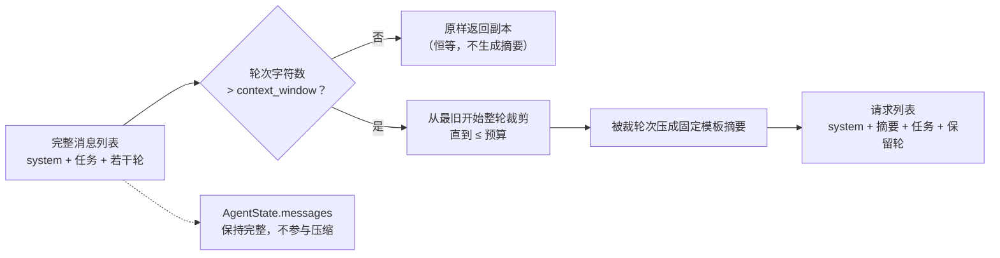

# Day 24：短程会话记忆 / 上下文管理代码导读（R-04）

> 这篇文档怎么读（先看森林，再看树木）：
> - **第 0 步**：只看图，先建立整体印象，不要急着看代码；
> - **第 1 步**：认识这次改动改了什么、没改什么；
> - **第 2 步**：打开代码，按小节顺序逐段读；
> - **第 3 步**：看测试如何验证，最后回到森林图复查。

## 0. 先看森林：这一章到底在做什么

### 0.1 用大白话讲

R-04 之前的 `Agent` 每轮把**整本对话记录**递给模型。对话越长，模型越
可能超长，而且消息里大量是已经用完的旧轮次。Day 24 加了一个"压缩器"
`ContextPolicy`：每轮请求模型之前先看一眼消息总量，超过预算就把最旧的
"整轮"（模型说调工具 + 工具结果这对消息）裁掉，并把被裁掉的内容压成几行
摘要，作为第二条 system 消息回填。模型看到的永远是"system + 摘要 + 任务
+ 最近几轮"，而 `AgentState` 里的完整记录原封不动——**只递压缩纸条，
不改记账本**。

三个铁规矩：

1. **只在请求边界动手**：`ContextPolicy.prepare(完整消息) -> 请求列表`，
   是纯函数，不保存任何记忆状态，`AgentState` 零改动；
2. **整轮是原子单位**：工具调用与工具结果必须成对保留或成对移除，绝不
   拆开，否则 OpenAI 兼容 API 会拒收请求；
3. **摘要必须确定**：固定模板 + 固定截断，相同历史永远得到相同摘要，
   离线测试可以直接断言字符串。

### 0.2 森林全景图



读法：`Check` 是闸门——只有超限才进入裁剪；`Summary` 只消费被裁掉的轮次；
右侧 `State` 用虚线表示"压缩不触碰终态"。`prepare` 是纯函数，同一张
`Full` 输入永远得到同一份 `Out`。

### 0.3 一句话预告

R-04 之后，长任务在消息超限时会自动"裁旧轮 + 补摘要"，模型请求变小，
但 `AgentState` 仍保留完整历史，`TraceStep`、最终回答与终止原因全部不变；
CLI 默认 20,000 字符窗口，现有测试与示例远低于阈值，行为逐字节不变。

同时，Day 24 **坚决不做**：

- **不改领域模型**：`AgentState`、`Message` 等 `extra="forbid"` 模型零
  新增字段，记忆状态不进 `AgentState`；
- **不拆消息对**：裁剪以"assistant 决策 + 其后 tool/user 反馈"为整轮，
  不存在半轮状态；
- **不用 LLM 生成摘要**：摘要由固定规则生成，离线确定、可断言；
- **不越界**：持久化、暂停/恢复、异步、流式（R-05）、日志场景（R-07）
  留到后续工作项。

### 0.4 名词小词典（遇到不懂的词回来查）

| 名词 | 大白话解释 |
| --- | --- |
| 上下文窗口（context window） | 除 system 与任务外，轮次消息允许占用的最大字符数 |
| 整轮（round） | 一条 assistant 决策消息 + 紧随其后的 tool/user 反馈消息 |
| 规则式摘要 | 用固定模板把每个被裁轮压成一行文本，不调用 LLM |
| 恒等（identity） | `context_policy=None` 时请求与完整消息完全一致，R-04 前行为 |
| auto-compact | Claude 风格：超限自动裁剪并把旧历史压成摘要回填 |

## 1. 认识改动：改了什么、没改什么

| 文件 | 改动 | 一句话解释 |
| --- | --- | --- |
| `src/self_react/memory.py` | 新增 | `ContextPolicy` + 字符计数/轮次切分/摘要生成，纯函数组件 |
| `src/self_react/agent.py` | 修改 | `__init__` 新增可选 `context_policy`；每轮请求前应用策略 |
| `src/self_react/cli.py` | 修改 | `run` 新增 `--context-window`（默认 20,000），构造策略传入 Agent |
| `tests/test_memory.py` | 新增 | 20 个用例覆盖裁剪边界、摘要、确定性与不变量 |
| `tests/test_agent.py` | 修改 | +3 个用例：恒等、注入裁剪、非法策略拒绝 |
| `tests/test_cli.py` | 修改 | +3 个用例：非法窗口、小窗口摘要、默认不干预短任务 |
| `docs/architecture/react-loop.md` | 修改 | 状态表新增"上下文压缩"阶段、新增 R-04 小节与约束条目 |
| `docs/architecture/day-24-context-management-code-walkthrough.md` | 新增 | 本文档 |
| `docs/daily/day-24-context-management.md` | 新增 | 当日记录（含真实 DeepSeek 手动验收） |
| `README.md` | 修改 | 特性、`run` 参数表、模块表同步 |

**没改**：`models.py`、`llm.py`、`parser.py`、`prompts.py`、`trace.py`、
`examples.py`、`providers.py`、`tools/*`，以及除上面以外的全部既有测试。

## 2. 进入树木：按这个顺序读代码

建议顺序：

1. [`src/self_react/memory.py`](../../src/self_react/memory.py)（新增全文）；
2. [`src/self_react/agent.py`](../../src/self_react/agent.py)（两处改动）；
3. [`src/self_react/cli.py`](../../src/self_react/cli.py)（参数与组装）；
4. [`tests/test_memory.py`](../../tests/test_memory.py)（考官）。

读代码时记着四个问题：

1. 为什么"整轮"是消息切分的唯一单位，解析失败反馈消息算不算一轮的一部分？
2. `prepare` 为什么必须返回新列表，为什么不能改 `state.messages`？
3. 摘要为什么以 system 角色插在任务之前，而不是 user 角色？
4. 默认 20,000 字符窗口为什么不会改变既有测试与示例的输出？

### 2.1 第一站：轮次切分（`_split_prefix_and_rounds`）

```python
def _split_prefix_and_rounds(messages):
    messages_list = list(messages)
    first_assistant = next(
        (index for index, message in enumerate(messages_list)
         if message.role is MessageRole.ASSISTANT),
        None,
    )
    if first_assistant is None:
        return messages_list, []
    ...
```

一行一行看：

- 前缀 = 第一条 assistant 消息之前的所有消息：正常运行时就是 system 提示词
  + 首条 user 任务，它们**永远保留且不计入预算**；
- 从第一条 assistant 起切"轮"：每条 assistant 消息及其后紧随的 tool/user
  消息算一轮，直到下一条 assistant 消息。这样解析失败重试轮的"assistant
  + user 反馈"、供应商多工具调用轮的"assistant + 多条 tool"都天然成对，
  不会被拦腰切断；
- 没有 assistant 消息（只有 system + 任务）时没有可裁内容，直接返回前缀。

### 2.2 第二站：字符预算（`_message_char_count`）

```python
total = len(message.content)
for call in message.tool_calls:
    total += len(call.call_id) + len(call.name) + len(
        json.dumps(call.arguments, ensure_ascii=False,
                   sort_keys=True, separators=(",", ":")))
```

预算只统计轮次消息：普通消息计 `content` 长度；助手消息的每个 `ToolCall`
额外计入 `call_id`、`name` 与**排序、紧凑序列化**的参数 JSON。`sort_keys`
与 `separators` 保证同样的参数永远得到同样的字符串，字符数是确定性的。
项目没有 tokenizer，字符数是"离线可测 + 单调接近 token 数"的代理指标。

### 2.3 第三站：主流程（`prepare`）

```python
prefix, rounds = _split_prefix_and_rounds(messages)
total = sum(...)
if total <= self._context_window:
    return list(messages)          # 未超限：恒等副本

removed_rounds = []
while rounds and total > self._context_window:
    removed = rounds.pop(0)        # 从最旧开始整轮裁
    removed_rounds.append(removed)
    total -= sum(...)

summary_message = Message(role=MessageRole.SYSTEM,
                          content=_build_summary(removed_rounds))
```

- 未超限返回 `list(messages)`：一份新列表，调用方随便用，输入不受影响；
- 超限则从最旧轮开始整轮弹出，直到剩余 ≤ 预算。因为整轮是原子单位，
  裁完可能明显低于预算——这是特性，不是缺陷；
- 摘要消息用 **system 角色**插入：语义上它是系统给的背景材料，不是用户
  新指令；位置放在 system 与任务之间，模型先读背景再读任务；
- 摘要永远只包含**被裁掉**的轮次：没裁就没有摘要，默认短任务请求逐字节
  不变。

### 2.4 第四站：摘要生成（`_round_summary_line` / `_build_summary`）

```python
line = f"- 第 {round_number} 轮：调用 {call.name}，参数 {args} → {result}"
```

- 每轮一行：工具名 + 参数 + 结果（结果先压缩空白，避免换行破坏行结构）；
- 单行上限 `SUMMARY_LINE_LIMIT = 200`，超出用固定省略号 `…` 截断；
- 没有工具调用的轮（解析失败重试）用稳定描述"模型输出未通过解析"，不把
  模型原始输出写进摘要；
- 总量上限 `SUMMARY_TOTAL_LIMIT = 1_000`：逐行贪心加入，放不下就停止并
  追加固定标记 `（其余历史已省略）`，必要时让出已接受的行保证不超限；
- 全程无随机性，相同历史永远得到相同摘要。

### 2.5 第五站：Agent 与 CLI 集成

```python
# agent.py：构造参数（默认 None = 恒等）
context_policy: ContextPolicy | None = None

# agent.py：每轮请求前应用，请求与终态解耦
request_messages = (
    messages
    if self._context_policy is None
    else self._context_policy.prepare(messages)
)
response = self._llm.complete(request_messages, tools=tools)
```

- `Agent` 的公开行为在 `context_policy=None` 时与 R-04 前完全一致，既有
  测试一行不改；
- 压缩只发生在 `LLM.complete` 的入参上，响应仍追加到完整 `messages`，
  终态 `AgentState` 不变；
- CLI 用 `ContextPolicy(context_window=arguments.context_window)` 显式构造
  并传入，`--context-window` 默认 `DEFAULT_CONTEXT_WINDOW = 20_000`；
  `hello` 与 `example` 子命令不构造 Agent，天然不受影响。

## 3. 测试怎么考

`tests/test_memory.py` 是考官，重点看这几类：

| 用例 | 考什么 |
| --- | --- |
| `test_prepare_at_exact_boundary_does_not_trim` | "超过才裁"，恰好等于窗口不裁 |
| `test_prepare_trims_oldest_round_and_backfills_summary` | 只裁最旧一轮，摘要只含被裁轮 |
| `test_prepare_never_splits_round_pairs` | 请求里 assistant 的 `tool_calls` 与 tool 消息一一对应 |
| `test_prepare_trims_until_under_window_and_keeps_system_task` | 窗口极小也只裁轮次，system + 任务永在 |
| `test_prepare_summary_line_is_truncated` / `..._total_capped_with_marker` | 行限 200、总限 1000、固定省略标记 |
| `test_prepare_is_deterministic` | 相同输入两次调用逐条相等 |
| `test_prepare_keeps_multi_tool_call_round_whole` | 单条 assistant 携带多个 `ToolCall` 时整轮一起保留/移除 |
| `test_prepare_summarizes_parse_error_round_without_raw_output` | 解析失败轮不泄漏原始输出 |

`test_agent.py` 与 `test_cli.py` 的 6 个新用例负责集成缝：默认恒等、注入
后请求被裁剪而终态完整、非法窗口/非法策略被拒、CLI 小窗口触发摘要。

## 4. 边界与权衡

- **为什么用字符数而不是 token 数**：项目没有 tokenizer；字符数确定、
  可测，且与 token 数单调相关，够用作保守护栏；
- **为什么 CLI 默认"开"且 20,000**：工业界 auto-compact 默认开；20,000
  远高于现有测试与示例的真实规模（全库最长字符串字面量不足 2000 字符），
  同时是真实护栏（文件读取单轮最多 10,000 字符）；
- **为什么摘要不用 LLM**：不可复现、要花钱、破坏离线确定性；规则式固定
  模板满足 roadmap"摘要文本稳定可测"；
- **已知边界**：窗口过小（如 120 字符）会让真实模型丢失细节、反复试探
  工具直到预算耗尽（真实 API 压力测试记录见当日文档）。这是极端配置的
  预期行为，不是默认路径缺陷。
