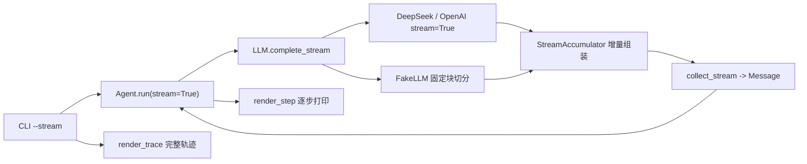

# Day 25：流式输出与中间过程展示代码导读（R-05）

> 这篇文档怎么读（先看森林，再看树木）：
> - **第 0 步**：只看图，先建立整体印象，不要急着看代码；
> - **第 1 步**：认识这次改动改了什么、没改什么；
> - **第 2 步**：打开代码，按小节顺序逐段读；
> - **第 3 步**：看测试如何验证，最后回到森林图复查。

## 0. 先看森林：这一章到底在做什么

### 0.1 用大白话说

R-04 之前的每一次模型调用都是"一次等到底"：模型把整条 JSON 决策一次性返回，
CLI 只能等全部跑完再打印结果。R-05 让模型调用变成"边吐边收"：底层 API 把
回答切成一小块一小块增量（token），我们收到一块就展示一块，最终组装出来的
消息与一次性调用完全一致。

四个铁规矩：

1. **默认路径不动**：不加 `--stream` 时，`Agent` 仍然走 `LLM.complete`，
   行为与 R-04 之前逐字节一致，477 个既有测试原样通过；
2. **流式只是换一种取回方式**：`complete_stream` 增量组装出的
   `Message` 与 `complete` 完全等价，决策、轨迹、终止原因全部不变；
3. **展示与结果解耦**：`StreamChunk` 只负责"增量文本 + 已组装的工具调用"，
   CLI 用 `on_step` 回调把每一步的可读文本即时打印出来；
4. **确定性可测**：Fake LLM 按固定块大小切分内容，相同输入永远得到相同
   块序列；适配器用注入客户端测试，不访问网络。

### 0.2 森林全景图



读法：CLI 打开 `--stream` 后，`Agent` 每轮从 `complete_stream` 消费增量；
适配器（或 Fake LLM）产出 `StreamChunk`，`Agent` 边透传边用 `collect_stream`
组装出与 `complete` 等价的 `Message`；每个 `TraceStep` 完成后通过
`on_step` 回调即时打印（与 `render_trace` 共用同一套文本）。

### 0.3 一句话预告

这一次改动的核心是给 `LLM` 协议加一个"增量迭代器"，并让 `Agent` 在显式
开启时消费它；不改领域模型、不改解析器、不改工具层，默认行为零变化。

## 1. 认识改动：改了什么、没改什么

| 文件 | 改动 | 一句话解释 |
| --- | --- | --- |
| `src/self_react/llm.py` | 修改 | 新增 `StreamChunk`、`collect_stream`、`complete_stream` 协议方法与 `FakeLLM.complete_stream` |
| `src/self_react/openai_compat.py` | 修改 | 新增 `StreamAccumulator`：跨块累积内容与工具调用参数片段 |
| `src/self_react/deepseek.py` / `openai.py` | 修改 | 新增 `complete_stream`：`stream=True` + 增量组装 + 稳定错误映射 |
| `src/self_react/agent.py` | 修改 | `run` 新增 `stream` / `on_chunk` / `on_step` 可选参数；文本工具调用补成原生 `tool_calls` 写回历史 |
| `src/self_react/trace.py` | 修改 | `_render_step` 改为公开 `render_step`，供流式展示与完整轨迹共用 |
| `src/self_react/cli.py` | 修改 | `run` 新增 `--stream`，逐步即时打印 |
| `tests/*` | 修改/新增 | +31 个用例覆盖协议、适配器、Agent、CLI 与渲染 |
| `README.md` | 修改 | 特性、`--stream` 参数表、运行示例、流式手动验收记录 |
| `docs/architecture/day-25-streaming-output-code-walkthrough.md` | 新增 | 本文档 |
| `docs/daily/day-25-streaming-output.md` | 新增 | 当日记录（含真实 DeepSeek 验收） |

**没改**：`models.py`、`parser.py`、`prompts.py`、`examples.py`、
`providers.py`、`tools/*`、`memory.py`。

## 2. 进入树木：按这个顺序读代码

建议顺序：

1. [`src/self_react/llm.py`](../../src/self_react/llm.py)（协议与 Fake 流）；
2. [`src/self_react/openai_compat.py`](../../src/self_react/openai_compat.py)（增量组装）；
3. [`src/self_react/deepseek.py`](../../src/self_react/deepseek.py)（真流式）；
4. [`src/self_react/agent.py`](../../src/self_react/agent.py)（循环集成）；
5. [`src/self_react/cli.py`](../../src/self_react/cli.py) 与
   [`src/self_react/trace.py`](../../src/self_react/trace.py)（展示）。

读代码时记着四个问题：

1. `StreamChunk` 为什么同时携带"内容增量"和"工具调用"？
2. `collect_stream` 为什么是唯一的"等价性"实现点？
3. `Agent` 为什么用可选参数而不是新增一个 `run_stream`？
4. 为什么解析出文本工具调用后要把历史消息补成原生 `tool_calls`？

### 2.1 第一站：协议与 Fake 流（llm.py）

```python
@dataclass(frozen=True)
class StreamChunk:
    content: str
    tool_calls: tuple[ToolCall, ...] = ()
```

`StreamChunk` 是一次流式调用中的一段增量：`content` 是本块新增文本（可为空），
`tool_calls` 是到当前块为止已完成组装的工具调用（通常只在最后一块出现）。
把两者放进同一块，是因为展示层需要文本增量，而"与一次性调用等价"需要
最终拿到完整的工具调用列表。

```python
def collect_stream(chunks: Iterable[StreamChunk]) -> Message:
    content_parts = []
    tool_calls = []
    for chunk in chunks:
        ...
    return Message(
        role=MessageRole.ASSISTANT,
        content="".join(content_parts),
        tool_calls=tool_calls,
    )
```

`collect_stream` 是唯一的"流式 == 非流式"实现点：拼接所有内容增量、按顺序
收集工具调用，构造出的 `Message` 与 `complete` 的返回值走同一个领域模型
校验。组装失败（例如重复 `call_id`）报稳定 `LLMResponseError`。

Fake LLM 的流按 `FAKE_STREAM_CHUNK_SIZE = 8` 固定切块：

```python
def complete_stream(self, messages, *, tools=None):
    self._prepare_call(messages, tools)  # 与 complete 相同的校验与历史记录
    if self._next_response_index >= len(self._responses):
        raise LLMResponseExhaustedError(...)
    response = self._responses[self._next_response_index]
    self._next_response_index += 1
    for index in range(0, len(response.content), FAKE_STREAM_CHUNK_SIZE):
        yield StreamChunk(
            content=response.content[index : index + FAKE_STREAM_CHUNK_SIZE]
        )
    if response.tool_calls:
        yield StreamChunk(content="", tool_calls=tuple(response.tool_calls))
```

它与 `complete` 共用 `_prepare_call`：先校验输入、快照消息与工具清单、写入
调用历史，再按序消耗一条预置响应；耗尽时报同样的
`LLMResponseExhaustedError` 且计入历史。这样"流式调用"和"一次性调用"在
Fake LLM 眼里是同一套记账规则。

### 2.2 第二站：增量组装（openai_compat.py）

```python
class StreamAccumulator:
    def feed(self, chunk) -> StreamChunk: ...
    def message(self) -> Message: ...
```

`feed` 消费一个 OpenAI 兼容的流式块：

- 读取 `choices[0].delta.content` 作为内容增量（可为 `None`/空）；
- 读取 `delta.tool_calls`，把每个片段的 `id`、`name`、`arguments` 按
  `index` 累积进槽位（参数是跨块拼接的字符串片段）；
- 忽略 `reasoning_content`（DeepSeek 思考模式），与非流式路径的约定一致：
  领域 `Message` 不承载推理文本。

`message()` 在所有块消费完后按 `index` 排序，用既有的
`_deserialize_tool_call` 把累积槽位转成 `ToolCall`，再构造 `Message`——
因此工具调用的字段校验与一次性响应完全复用。

### 2.3 第三站：真流式（deepseek.py / openai.py）

```python
def complete_stream(self, messages, *, tools=None):
    ...
    stream = self._client.chat.completions.create(
        model=self.model,
        messages=payload,
        stream=True,
        tools=serialized_tools,
        extra_body=extra_body,
    )
    accumulator = StreamAccumulator()
    try:
        for chunk in stream:
            delta = accumulator.feed(chunk)
            if delta.content:
                yield delta
        message = accumulator.message()
        if message.tool_calls:
            yield StreamChunk(content="", tool_calls=tuple(message.tool_calls))
    except LLMResponseError:
        raise
    except Exception as exc:
        raise LLMProviderError(provider_error_code(exc), ...)
```

两个 try/except 的分工：

- `create()` 阶段的异常（建连、鉴权、限流等）映射成稳定
  `LLMProviderError` 类别；
- 迭代过程中的 SDK 异常同样映射成稳定类别；`LLMResponseError`（增量本身
  畸形）原样向上传播，与非流式路径的约定一致。

DeepSeek 保留 `thinking: {"type": "disabled"}` 配置；OpenAI 不带额外配置。

### 2.4 第四站：循环集成（agent.py）

```python
def run(self, task, *, stream=False, on_chunk=None, on_step=None):
    ...
    if stream:
        response = collect_stream(
            self._stream_with_callback(
                self._llm.complete_stream(request_messages, tools=tools),
                on_chunk,
            )
        )
    else:
        response = self._llm.complete(request_messages, tools=tools)
```

`stream=False` 时行为与 R-04 之前完全一致；`stream=True` 时把 `complete`
换成 `complete_stream` + `collect_stream`，其余决策分支一字不改。新增的
`on_step` 回调在每个 `TraceStep` 构建后触发，让 CLI 边产生边打印。

这里还埋了一个真实 API 兼容性修复：当模型用"JSON 文本"（而不是原生
`tool_calls`）发出工具调用时，解析出的 `ToolCall` 会被补成 assistant
消息的原生 `tool_calls` 再写回历史：

```python
if isinstance(decision, ToolCall) and not response.tool_calls:
    messages[-1] = Message(
        role=MessageRole.ASSISTANT,
        content=response.content,
        tool_calls=[decision],
    )
```

原因：OpenAI 兼容 API 要求 `tool` 角色消息必须紧跟带 `tool_calls` 的
assistant 消息；否则下一轮请求会被拒绝（DeepSeek 流式实测返回
`Messages with role 'tool' must be a response to a preceding message with 'tool_calls'`）。
这个修复对流式与非流式同样生效，是流式验收逼出来的正确性补丁。

### 2.5 第五站：展示（trace.py / cli.py）

`trace.py` 把 `_render_step` 改名为公开的 `render_step`；`render_trace`
内部复用它，因此流式展示与完整轨迹天然共用同一套"决策/观察文本"。

`cli.py` 新增 `--stream`：

```python
if arguments.stream:
    state = agent.run(arguments.task, stream=True, on_step=_print_stream_step)
else:
    state = agent.run(arguments.task)
```

`_print_stream_step` 在每个步骤完成后打印 `render_step(step)`。因为模型输出
本身是 JSON 决策，CLI 不逐字符打印原始 JSON，而是以"步骤完成即打印"的
粒度实时展示；`--show-trace` 仍可在结束后打印完整轨迹，两者不冲突。

## 3. 测试怎么验

`tests/test_llm.py` 是协议层考官，重点看这几类：

| 用例 | 考什么 |
| --- | --- |
| `test_fake_llm_complete_stream_chunks_content_deterministically` | 固定块大小、相同输入相同序列 |
| `test_fake_llm_complete_stream_carries_tool_calls_in_final_chunk` | 工具调用在末尾块一次性携带 |
| `test_fake_llm_complete_stream_consumes_presets_and_exhausts` | 按序消耗与耗尽语义与 `complete` 一致 |
| `test_collect_stream_assembles_message_equivalent_to_complete` | 流式组装 == 一次性调用 |
| `test_collect_stream_rejects_duplicate_tool_call_ids` | 组装失败报稳定错误 |

`tests/test_deepseek.py` / `tests/test_openai.py` 覆盖适配器：`stream=True`
请求参数、跨块工具调用参数拼接、`reasoning_content` 忽略、创建/中途错误的
稳定映射、畸形增量拒绝。`tests/test_agent.py` 验证流式与非流式状态等价、
`on_chunk` / `on_step` 回调；`tests/test_cli.py` 验证 `--stream` 逐步输出与
`--show-trace` 共存；`tests/test_trace.py` 验证 `render_step` 与完整轨迹
文本一致。

## 4. 边界与权衡

- **为什么"等价性"只在一个地方实现**：`collect_stream` 是唯一组装点，
  三个实现（Fake / DeepSeek / OpenAI）都只负责产出增量，避免"等价"语义
  分散到每个消费者；
- **为什么 Fake 用固定块而不是逐字符**：逐字符会让测试断言脆弱、CLI 输出
  碎片化；固定 8 字符既体现"增量"又保持确定性；
- **为什么 `complete_stream` 是协议的必需方法**：三个实现都在仓库内同步
  交付；代价是外部只实现 `complete` 的旧适配器不再满足协议（测试里同步
  补上了流式方法）；
- **为什么 CLI 展示粒度是"步骤"而不是"字符"**：模型输出是 JSON 决策，
  逐字符打印原始 JSON 对用户不友好；"步骤完成即打印"已经让
  决策/工具调用/观察边产生边显示，token 级增量由协议层承担；
- **已知边界**：真实 DeepSeek 偶尔会在 JSON 前输出散文，触发一次有界
  解析重试后恢复（实测出现过一次）；`OPENAI_API_KEY` 当前无效，OpenAI
  流式留待有效密钥后手动验收。

## 5. 与后续工作的连接

- R-07 日志/故障排查场景的长任务里，流式让"边跑边看"成为可能，配合
  R-04 的上下文压缩与 R-02 的有界重试，交互体验更完整；
- 若未来要支持"暂停/恢复"或异步调度，`complete_stream` 的增量迭代器是
  天然的事件源，不需要再改协议层；
- M2 里程碑（R-04 + R-05）完成后按 roadmap 打 `v0.3.0` 标签发布，本次
  不在范围内。
