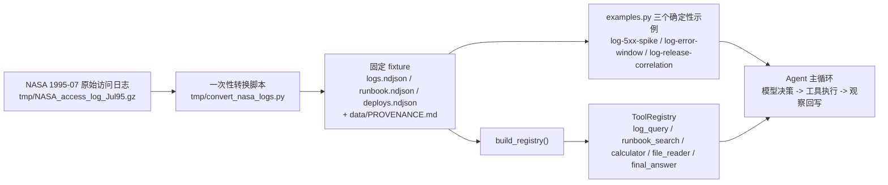

# Day 27：真实日志场景化代码导读（R-08）

> 这篇文档怎么读（先看森林，再看树木）：
> - **第 0 步**：只看图，先建立整体印象，不要急着看代码；
> - **第 1 步**：认识这次改动改了什么、没改什么；
> - **第 2 步**：打开文件，按小节顺序逐段读；
> - **第 3 步**：看测试如何验证，最后回到森林图复查。

## 0. 先看森林：这一章到底在做什么

### 0.1 用大白话说

R-07 落地了“日志/故障排查助手”场景，但日志是手写的合成数据（虚构的
`auth / payment / checkout` 服务）。R-08 用**真实日志**替换合成数据：从
Internet Traffic Archive 下载 NASA Kennedy Space Center WWW 服务器 1995-07
访问日志（公共领域、页面声明可自由再分发），截取包含真实故障的固定时间窗，并
按固定 NDJSON 字段规范化后作为 fixture 入库。

这个真实故障是：**1995-07-03 10:49:40 ~ 10:52:29，`GET /cgi-bin/geturlstats.pl`
连续返回 53 次 HTTP 500**。三个确定性示例全部围绕它重写：

1. `log-5xx-spike`：统计 cgi-bin 服务的 500 突增与占比；
2. `log-error-window`：定位 500 集中出现的整点桶；
3. `log-release-correlation`：用发布记录判断故障是否与发布相关。

### 0.2 森林全景图



读法：原始日志只在本地经一次性脚本转为固定 fixture；运行时 `build_registry()`
只读 `data/` 下的文件，不下载任何东西。示例仍然是“数据 + 预置响应”，复用
`Agent` 主循环。

### 0.3 一句话预告

场景从“演给模型看的假日志”变成“历史上真实发生过的排障事件”，而框架代码一行
没改——`log_query` 的过滤/聚合、`runbook_search` 的 BM25、`Agent` 主循环
全部原样复用，只换了数据和示例。

## 1. 认识改动：改了什么、没改什么

| 文件 | 改动 | 一句话解释 |
| --- | --- | --- |
| `scenarios/log_troubleshooting/data/logs.ndjson` | 替换 | 合成 80 行 -> 真实 14,130 行（1995-07-03 09:00-11:59 窗口） |
| `scenarios/log_troubleshooting/data/runbook.ndjson` | 替换 | 错误码改为真实出现的 500/404/501，服务改为 cgi-bin/images |
| `scenarios/log_troubleshooting/data/deploys.ndjson` | 替换 | cgi-bin geturlstats 1.1.0 于 10:00 发布，与 500 起点 10:49 对齐 |
| `scenarios/log_troubleshooting/data/PROVENANCE.md` | 新增 | 数据来源、许可、隐私、截取窗口与规范化规则 |
| `scenarios/log_troubleshooting/examples.py` | 修改 | 三个示例的任务/工具序列/最终回答随真实数据更新 |
| `tests/test_log_troubleshooting_scenario.py` | 修改 | 计数与稳定回答断言改为真实数据 |
| `docs/adr/0002-real-log-fixture.md` | 新增 | 真实日志 fixture 的架构决策记录 |
| 本文档 | 新增 | Day 27 代码导读 |
| `docs/daily/day-27-real-log-scenario.md` | 新增 | 当日记录（含真实 DeepSeek 验收） |
| `README.md` | 修改 | 示例任务、演示记录表与数据说明更新 |

**没改**：`tools/`（含 `log_query`、`runbook_search`）、`agent.py`、
`llm.py`、`parser.py`、`prompts.py`、`cli.py`、Day 16 三条既有 `example`
与全部既有测试。

## 2. 进入树木：按这个顺序读

1. [`data/PROVENANCE.md`](../../src/self_react/scenarios/log_troubleshooting/data/PROVENANCE.md)
   （数据从哪来、为什么可以入库、怎么规范化的）；
2. [`tmp/convert_nasa_logs.py`](../../tmp/convert_nasa_logs.py)（本地一次性转换脚本）；
3. [`examples.py`](../../src/self_react/scenarios/log_troubleshooting/examples.py)
   （三个示例如何对齐真实事件）；
4. [`tests/test_log_troubleshooting_scenario.py`](../../tests/test_log_troubleshooting_scenario.py)
   （计数与稳定回答如何钉死真实数据）。

### 2.1 数据来源与许可（PROVENANCE.md）

原始日志来自 Internet Traffic Archive 的 NASA-HTTP 页面，页面明确声明
“The traces may be freely redistributed”。原始行包含 host/IP，规范化时丢弃该
列，规避 PII。窗口选择不是随机的：`1995-07-03 09:00:00 ~ 11:59:59` 内含
真实故障（53 次 500 全部来自 `geturlstats.pl`），窗口前后 500 计数为 0，
天然形成“突增 -> 定位 -> 关联发布”三条主线。

### 2.2 转换规则（一次性脚本）

```text
原始行：[01/Jul/1995:00:00:01 -0400] "GET /cgi-bin/geturlstats.pl HTTP/1.0" 500 0
规范化：
  timestamp = 1995-07-01 00:00:01
  service   = cgi-bin（路径第一段，/ 映射为 root）
  level     = ERROR（5xx）/ WARN（4xx）/ INFO（2xx、3xx）
  error_code= 500（所有行保留真实状态码）
  message   = GET /cgi-bin/geturlstats.pl HTTP/1.0
```

畸形行（解析不出时间戳、请求或状态码）跳过；脚本只做截取与映射，不篡改请求
内容，保证“相同输入相同输出”。

### 2.3 示例对齐真实事件（examples.py）

三个示例仍是“任务 + Fake LLM 预置响应”，但每一步的数值来自真实数据：

- `log-5xx-spike`：`service=cgi-bin` 命中 487 条；`error_code=500` 命中 53 条；
  `calculator(53 / 487 * 100)` 得到 10.88...（回答约 10.9%）；聚合错误码只有
  `500: 53`；`runbook_search` 首选 RB-500。
- `log-error-window`：`error_code=500, group_by=hour` 得到
  `1995-07-03 10:00:00: 53`，09:00 与 11:00 桶为 0。
- `log-release-correlation`：09:00-09:59 为 0、10:00-10:59 为 53，
  `file_reader(deploys.ndjson)` 读到 cgi-bin 于 10:00 发布 geturlstats 1.1.0，
  与 10:49 的 500 起点重合。

### 2.4 测试钉死真实数据

`test_scenario_log_data_matches_expected_counts` 直接断言 `log_query` 返回
`匹配 487 条 / 共 14130 条`、`匹配 53 条 / 共 14130 条` 与 `500: 53`；
`test_scenario_example_final_answers_are_stable` 断言最终回答包含 `10.9%`、
`10:49`、`发布相关`。fixture 固定，这些断言永不漂移。

## 3. 测试怎么验

| 用例 | 考什么 |
| --- | --- |
| `test_scenario_log_data_matches_expected_counts` | 真实 fixture 的 cgi-bin/500 计数被钉死 |
| `test_scenario_deploys_readable_via_file_reader` | 发布记录可通过 file_reader 读取 |
| `test_scenario_example_final_answers_are_stable` | 三个示例最终回答固定（回归基准） |
| `test_scenario_examples_are_deterministic` | 相同示例两次运行决策/观察/回答一致 |
| `test_scenario_examples_tool_calls_succeed` | 示例内所有工具观察成功 |
| `test_example_command_runs_scenario_examples` | CLI `example log-*` 打印正常 |

## 4. 边界与权衡

- **为什么选 NASA 而不是 LogHub**：LogHub 许可为“研究/学术使用”，公开入库再
  分发存在边界；NASA 数据页面明确可自由再分发，且含真实 HTTP 5xx 状态码。
  （见 ADR 0002）
- **为什么截 3 小时而不是整月**：整月 189 万行（约 205 MB）不适合入库；3 小时
  窗口保留完整故障叙事且仅 2.2 MB，`log_query` 单次约 30 ms。
- **为什么所有行都保留 `error_code`**：HTTP 访问日志每行都有状态码，保留真实
  状态码比只在错误行填码更忠实；`group_by error_code` 因此能看到完整分布。
- **发布记录是构造的**：NASA 日志不含发布信息，`deploys.ndjson` 按真实 500
  起点（10:49）与发布（10:00）对齐构造，并在 PROVENANCE.md 中明示边界。
- **已知边界**：fixture 是 1995 年历史数据；`service` 是路径段的近似维度，
  不是现代微服务语义；发布记录为演示 fixture。

## 5. 与后续工作的连接

- M3：真实场景完成后可打 `v1.0.0` 标签并发布 GitHub Release。
- `--stream` 真实模型不流式的问题（原生 `final_answer` 工具调用）为独立 Issue，
  与本改动互不影响。
- 若未来引入 Loki/ES 查询后端，`log_query` 的“根目录 + NDJSON + 过滤/聚合”
  契约可替换实现，工具层接口不变；`data/PROVENANCE.md` 的模式也可复用到其他
  真实数据集。
