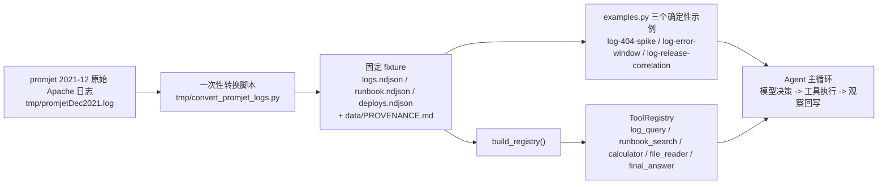

# Day 28：promjet 真实日志替换代码导读（R-09）

> 这篇文档怎么读（先看森林，再看树木）：
> - **第 0 步**：只看图，先建立整体印象，不要急着看代码；
> - **第 1 步**：认识这次改动改了什么、没改什么；
> - **第 2 步**：打开文件，按小节顺序逐段读；
> - **第 3 步**：看测试如何验证，最后回到森林图复查。

## 0. 先看森林：这一章到底在做什么

### 0.1 用大白话说

R-08 用 NASA 1995-07 真实日志替换了合成数据，但该数据年代久远、形态单一
（1995 年单服务器 CGI 场景）。R-09 把数据源换成 **promjet.ru 2021-12 真实
Apache 访问日志**（GitHub `vberkutovv/ApacheLog-Dataset`，MIT），截取包含
真实错误突增的固定时间窗，并按 R-08 验证过的规范化规则转成 NDJSON fixture
入库。框架代码一行没改——只换了数据、示例文案与配套文档。

这次的真实事件是：**2021-12-17 03:14 ~ 03:18，五分钟 733 条 HTTP 404**
（整站备份/源码文件探测，如 `/promjet.ru.sql`、`/backup/root.rar`、多 IP
并发，疑似外部扫描）。三个确定性示例围绕它重写：

1. `log-404-spike`（原 `log-5xx-spike`）：统计 404 突增并判断是外部扫描还是
   应用故障；
2. `log-error-window`：定位 404 集中出现的时间窗口；
3. `log-release-correlation`：用发布记录判断 404 突增是否与发布相关
   （结论：不相关、疑似外部扫描）。

### 0.2 森林全景图

读法：原始日志只在本地经一次性脚本转为固定 fixture；运行时 `build_registry()`
只读 `data/` 下的文件，不下载任何东西。示例仍然是“数据 + 预置响应”，复用
`Agent` 主循环。

### 0.3 一句话预告

场景数据从"1995 年单服务器 CGI"换成"2021 年现代站点 + 扫描流量"，演示主线
从"服务端 5xx 故障"变为"客户端 404 突增 + 外部扫描甄别"；`log_query` 的
过滤/聚合、`runbook_search` 的 BM25、`Agent` 主循环全部原样复用。

## 1. 认识改动：改了什么、没改什么

| 文件 | 改动 | 一句话解释 |
| --- | --- | --- |
| `scenarios/log_troubleshooting/data/logs.ndjson` | 替换 | NASA 14,130 行 -> promjet 931 行（2021-12-17 03:00-03:59 窗口） |
| `scenarios/log_troubleshooting/data/runbook.ndjson` | 替换 | RB-500/404/501 -> RB-404/403/503（service 统一 `web`） |
| `scenarios/log_troubleshooting/data/deploys.ndjson` | 替换 | cgi-bin geturlstats 1.1.0 -> jet 1.2.0（2021-12-16 22:00，演示数据） |
| `scenarios/log_troubleshooting/data/PROVENANCE.md` | 重写 | promjet 来源、MIT 许可、隐私与规范化规则 |
| `scenarios/log_troubleshooting/examples.py` | 修改 | 示例改名 `log-404-spike`，任务/工具序列/最终回答随真实数据更新 |
| `tests/test_log_troubleshooting_scenario.py` | 修改 | 计数与稳定回答断言改为 promjet 数据 |
| `cli.py` | 修改 | `example` 帮助文本中的示例名同步 |
| `docs/adr/0003-promjet-log-fixture.md` | 新增 | 数据集替换决策（supersedes 0002） |
| `docs/adr/0002-real-log-fixture.md` | 修改 | Status 标记 superseded by 0003 |
| `README.md` | 修改 | 示例表、真实场景说明与验收命令更新 |
| 本文档 | 新增 | Day 28 代码导读（含真实 DeepSeek 验收） |

**没改**：`tools/`（含 `log_query`、`runbook_search`）、`agent.py`、
`llm.py`、`parser.py`、`prompts.py`、`models.py`、`memory.py`、`trace.py`、
Day 16 三条既有 `example` 与其余既有测试。**按约定不再新增 daily 文档**
（从 R-09 起每日记录并入架构导读）。

## 2. 进入树木：按这个顺序读

1. [`data/PROVENANCE.md`](../../src/self_react/scenarios/log_troubleshooting/data/PROVENANCE.md)
   （数据从哪来、什么许可、怎么规范化、演示 fixture 边界）；
2. [`tmp/convert_promjet_logs.py`](../../tmp/convert_promjet_logs.py)
   （本地一次性转换脚本：解析 combined 格式、截窗口、生成三个 fixture）；
3. [`examples.py`](../../src/self_react/scenarios/log_troubleshooting/examples.py)
   （三个示例如何对齐 404 突增事件）；
4. [`tests/test_log_troubleshooting_scenario.py`](../../tests/test_log_troubleshooting_scenario.py)
   （计数与稳定回答断言）；
5. [`docs/adr/0003-promjet-log-fixture.md`](../adr/0003-promjet-log-fixture.md)
   （为什么换数据源、备选与后果）。

## 3. 关键点

### 3.1 转换脚本与 fixture

`tmp/convert_promjet_logs.py` 与 `convert_nasa_logs.py` 同构：正则解析
Apache combined 行（丢弃 IP、UA、Referer），按固定窗口截取，写出
`timestamp / service / level / error_code / message` 五行 NDJSON，并在末尾
断言窗口行数（931）与状态码分布（200×194、304×1、404×736），防止静默改版。

`runbook.ndjson` 与 `deploys.ndjson` 也由脚本确定性生成：runbook 覆盖
404/403/503 三种错误码（`service` 统一 `web`）；deploys 只有一条演示记录
`jet 1.2.0 @ 2021-12-16 22:00`，与 03:14 突增起点不重合，支撑"与发布无关"
的结论。两者的演示属性在 `PROVENANCE.md` 中明确标注。

### 3.2 示例如何对齐真实事件

- `log-404-spike`：`error_code=404` 过滤（736/931）-> 03:14-03:18 时间窗
  （733/931）-> `calculator` 算 99.6% 占比 -> `runbook_search` 命中 RB-404
  -> 最终回答给出"外部扫描、无需回滚"的结论；
- `log-error-window`：`group_by=hour` 定位 03 点桶 -> 时间窗过滤锁定
  03:14-03:18；
- `log-release-correlation`：时间窗过滤（03:14-03:18）+ `file_reader` 读
  `deploys.ndjson` -> 对比发布时刻与突增起点，结论"与发布无关、疑似外部扫描"。

### 3.3 为什么叙事变了

promjet 全月**没有 500/501**，503 只有 13 条且分散在 12 个不同小时（多为
UptimeRobot 探测），因此"5xx 突增"叙事不成立；真实可复现的事件是 404 突增
（外部扫描）。这是换数据的必然代价，也是更贴近现代站点排障的真实场景
（甄别扫描与故障）。示例名 `log-5xx-spike` 随之更名为 `log-404-spike`。

## 4. 测试如何验证

`tests/test_log_troubleshooting_scenario.py` 覆盖：

- 注册表仍含五个工具、顺序不变；
- 三个示例都以 `FINAL_ANSWER` 终止、步数与预置响应一致、两次运行完全确定；
- 稳定回答断言：`log-404-spike` 含 `79.1%`、`log-error-window` 含 `03:14`、
  `log-release-correlation` 含 `无关`；
- fixture 计数断言：404 匹配 736/931、03:14-03:18 匹配 733/931、按
  `error_code` 聚合含 `404: 736`；
- `deploys.ndjson` 经 `file_reader` 可读，含 `jet` / `1.2.0` /
  `2021-12-16 22:00:00`；
- `example` 子命令对每个场景示例打印标题、回答与轨迹。

`test_runbook_search.py` 使用自建条目，与场景数据无关，无需改动。

## 5. 真实 DeepSeek 手动验收（2026-08-15）

按约定用真实 DeepSeek 验收一次 404 突增排查任务（`--scenario
log-troubleshooting --show-trace`）。另补充一条聚焦任务。结果非确定性，如实
记录，不作为自动化测试前置条件。

| 任务 | 真实轨迹 | 步数 | 结果 |
| --- | --- | --- | --- |
| 排查 promjet 网站 2021-12-17 凌晨的 404 突增，判断是外部扫描还是应用故障，给出根因假设与下一步动作 | log_query(group_by=hour) -> log_query(group_by=error_code) -> log_query(group_by=service) -> log_query(keyword=backup) -> runbook_search | 5 / 5 | 步数耗尽（MAX_STEPS_EXCEEDED）；已识别 404×736 与备份/源码探测模式并命中 RB-404，未在预算内给出最终回答 |
| 找出 promjet 网站 2021-12-17 凌晨 404 错误集中出现的时间窗口 | log_query 路径猜错失败×2 -> log_query(keyword=404，0 命中) -> log_query 全量 -> log_query(error_code=404, group_by=hour) | 5 / 5 | 步数耗尽（MAX_STEPS_EXCEEDED）；最后一步才用对 error_code 过滤（03 点桶 736），未在预算内给出最终回答 |

两条任务均在 5 步预算内耗尽并被框架明确终止（与 R-08 实测一致）。观察到的
真实模型行为：模型倾向把状态码当 `keyword` 过滤（`keyword` 只匹配 message
子串，`404` 命中 0 条）、猜测不存在的文件名（`promjet.ndjson`），消耗多步后
才改用 `error_code` 过滤。`--stream` 下“计算 2 + 2”以 `FINAL_ANSWER` 结束
（2/5 步），最终回答仍由渲染器兜底一次性打印——原生 `final_answer` 工具调用
不逐字流式的已知问题未在本 Issue 范围内处理。
