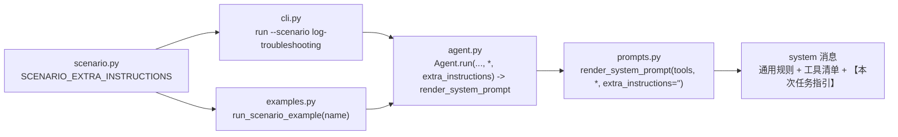

# Day 29：日志场景提示词引导代码导读（R-10）

> 这篇文档怎么读（先看森林，再看树木）：
> - **第 0 步**：只看图，先建立整体印象，不要急着看代码；
> - **第 1 步**：认识这次改动改了什么、没改什么；
> - **第 2 步**：打开文件，按小节顺序逐段读；
> - **第 3 步**：看测试如何验证，最后回到森林图复查。

## 0. 先看森林：这一章到底在做什么

### 0.1 用大白话说

R-09 把日志场景换成真实数据后，真实 DeepSeek 手动验收（day-28 §5）发现：
系统提示词是通用的，只渲染工具清单，没有任何场景知识，导致模型猜错文件名、
把状态码当 `keyword` 过滤（0 命中）、证据足够仍一路深挖，两条任务都在 5 步
预算内 `MAX_STEPS_EXCEEDED`。

R-10（本 Issue）给系统提示词开了一条**场景附加指引**的缝：`render_system_prompt`
新增 keyword-only 参数 `extra_instructions`（默认空字符串，输出与现状逐字节
一致），场景层提供 `SCENARIO_EXTRA_INSTRUCTIONS` 常量（针对真实模型实测的
失败模式逐条写的中文指引），`Agent.run` 透传，CLI `run --scenario
log-troubleshooting` 与三个场景示例注入。真实复跑预算从 5 步放宽到 8 步
（B 方案，CLI 默认仍是 5）。

一句话预告：**代码只加了"可选的场景知识注入缝"，工具行为一行没改；真实模型
从"猜文件名/用错过滤参数"进步到"首步即用 `error_code` + 正确文件名"**，剩余
的失败模式由真实验收记录在案（见 §5），作为后续迭代依据。

### 0.2 森林全景图



读法：指引文本只存在于场景层；`render_system_prompt` 保持纯函数（同输入同
输出），默认不注入；只有显式透传（CLI 场景路径、场景示例）时，指引作为系统
提示词最后一个小节渲染。Fake LLM 忽略提示词内容，因此示例与既有测试完全
不受影响。

### 0.3 一句话预告

给"通用 ReAct 提示词"加了一个可选的场景知识注入缝，用真实验收发现的失败
模式写成指引，让真实模型少走弯路；工具行为、默认预算、离线确定性全部不变。

## 1. 认识改动：改了什么、没改什么

| 文件 | 改动 | 一句话解释 |
| --- | --- | --- |
| `src/self_react/prompts.py` | `render_system_prompt` 新增 keyword-only `extra_instructions: str = ""` | 非空时作为最后一个小节渲染；默认输出逐字节不变 |
| `src/self_react/scenarios/log_troubleshooting/scenario.py` | 新增导出常量 `SCENARIO_EXTRA_INSTRUCTIONS` | 五条中文指引，逐条对应真实验收观察到的失败模式 |
| `src/self_react/scenarios/log_troubleshooting/__init__.py` | 重新导出 `SCENARIO_EXTRA_INSTRUCTIONS` | 包级公开 API |
| `src/self_react/agent.py` | `Agent.run` 新增 keyword-only `extra_instructions` 并透传 | 唯一生产接缝：系统提示词在 `Agent.run` 内渲染 |
| `src/self_react/cli.py` | `_run_command` 在 `--scenario` 时注入场景指引 | `run` 非场景路径不受影响 |
| `src/self_react/scenarios/log_troubleshooting/examples.py` | `run_scenario_example` 透传指引 | 示例与真实运行路径一致，Fake LLM 保证确定性 |
| `tests/test_prompts.py` | +4 测试 | 默认等价 / 末尾小节渲染 / 全空白缺省 / 类型校验 |
| `tests/test_agent.py` | +2 测试 | `Agent.run` 透传进 system 消息、默认与基线一致、类型校验 |
| `tests/test_log_troubleshooting_scenario.py` | +4 测试 | 常量覆盖三（五）失败模式、示例注入、CLI 注入/不注入 |

没改：工具行为（`log_query` / `file_reader` 等一行未动）、`--max-steps` 默认值
（仍为 5）、三个通用示例（`single-tool` / `multi-tool` / `failure-recovery`）、
`--stream` 渲染器（真实模型不逐字流式是另一 Issue）。

## 2. 关键代码走查

### 2.1 `prompts.py`：可选的附加指引小节

```python
def render_system_prompt(
    tools: Sequence[PromptTool],
    *,
    extra_instructions: str = "",
) -> str:
    ...
    if not isinstance(extra_instructions, str):
        raise TypeError("extra_instructions 必须是字符串")
    ...
    extra = extra_instructions.strip()
    if extra:
        sections.append(extra)
    return "\n\n".join(sections).strip()
```

- keyword-only + 默认 `""`：既有 20+ 个位置调用（`tests/test_prompts.py`、
  `tests/test_agent.py:131`）零改动、零影响；
- 全空白视为缺省（`.strip()` 后为空则不加小节），避免"加了个空段"；
- 小节追加在 `_OUTPUT_RULES` 之后，作为提示词最后一部分；整体仍 `.strip()`，
  保持"纯函数确定性"契约（相同输入 -> 相同输出）。

### 2.2 `scenario.py`：场景指引常量

```python
SCENARIO_EXTRA_INSTRUCTIONS = (
    "【本次任务指引】\n"
    "\n"
    "1. 数据文件固定为 logs.ndjson、runbook.ndjson、deploys.ndjson，"
    "路径参数只能填这三个文件名。\n"
    "2. 按状态码过滤必须用 error_code 参数；keyword 参数只匹配 "
    "message（请求行）子串，不能用来过滤状态码。\n"
    "3. service 参数是请求行里的主机名（如 jet、root、wp-content），"
    "不是站点名，不要用 promjet 作为 service 过滤值。\n"
    "4. 读取日志内容用 log_query 过滤/聚合，不要用 file_reader "
    "直接读 logs.ndjson 全文。\n"
    "5. 证据足以回答时立即输出 final_answer，不要继续额外查询；"
    "重复相同的过滤/聚合不会带来新信息。"
)
```

- 常量用隐式字符串拼接，运行时文本是"三句 + 空行"结构，每条源行不超过 88
  字符（ruff E501）；
- 条目与真实验收观察一一对应：1=猜文件名、2=把状态码当 keyword、
  3=把站点名当 service 过滤值、4=用 file_reader 直读全文、5=证据足够仍深挖
  （3/4 是 2026-08-16 复跑后补的一轮有界措辞调整，见 §5）；
- `__all__` 导出，包 `__init__.py` 重新导出，CLI 与示例从这里取。

### 2.3 `agent.py`：唯一生产接缝

系统提示词只在 `Agent.run` 内渲染（CLI 组装 `Agent` 时从不渲染），因此接缝
在 `run`：

```python
def run(
    self,
    task: str,
    *,
    stream: bool = False,
    on_chunk: ... = None,
    on_step: ... = None,
    extra_instructions: str = "",
) -> AgentState:
    ...
    Message(role=MessageRole.SYSTEM, content=render_system_prompt(
        tools, extra_instructions=extra_instructions)),
```

### 2.4 `cli.py` 与示例：注入点

```python
extra_instructions = (
    SCENARIO_EXTRA_INSTRUCTIONS if arguments.scenario is not None else ""
)
agent.run(arguments.task, extra_instructions=extra_instructions)
```

三个场景示例的 `run_scenario_example` 同样透传，让示例的 system 消息与真实
运行一致（Fake LLM 忽略提示词，决策/观察/终局不变）。

## 3. 测试如何验证（全部离线）

| 类别 | 测试 | 断言 |
| --- | --- | --- |
| ① 渲染层 | `test_render_default_extra_instructions_is_identical_to_baseline` | 默认 `""` 与不传逐字节一致 |
| ① 渲染层 | `test_render_appends_extra_instructions_as_final_section` | 非空值原样出现在末尾且位于输出规则之后 |
| ① 渲染层 | `test_render_treats_whitespace_only_extra_instructions_as_absent` | 全空白等价缺省 |
| ① 渲染层 | `test_render_rejects_non_string_extra_instructions` | 非字符串抛 `TypeError` |
| ② 场景层 | `test_scenario_extra_instructions_cover_three_failure_modes` | 三个文件名 / `error_code` / `keyword` 语义 / `final_answer` 止损 |
| ③ Agent | `test_run_injects_extra_instructions_into_system_message` | 透传进 `messages[0]`，默认与 `render_system_prompt(tools)` 一致 |
| ③ Agent | `test_run_rejects_non_string_extra_instructions` | 类型校验 |
| ④ 场景级 | `test_scenario_examples_render_scenario_guidance_in_system_message` | 三个示例 system 消息含指引且终局仍 FINAL_ANSWER |
| ④ CLI | `test_run_with_scenario_injects_guidance_into_system_message` | `run --scenario` 注入 |
| ④ CLI | `test_run_without_scenario_does_not_inject_scenario_guidance` | `run` 不带场景不注入 |

既有 555 个测试全部不变（仅 `test_agent.py:131` 断言默认系统提示词原文，默认
路径不受影响）。

## 4. 离线验收结果（2026-08-16）

```text
uv run pytest               -> 565 passed, 3 skipped（基线 555 + 新增 10）
uv run ruff check src tests -> All checks passed!
uv run ruff format --check  -> 50 files already formatted
git diff --check            -> 无输出（通过）
uv run self-react hello     -> Hello from Self-ReAct!（exit 0）
6 个 example                -> 全部 exit 0，最终回答与基线一致
```

运行时抽查：三个场景示例的 system 消息尾部均为 `【本次任务指引】` 全文，
`guidance_in_system=True`，步数与最终回答不变（5/3/3）。

## 5. 真实 DeepSeek 手动验收（2026-08-16）

按约定（B 方案）两条任务均加 `--max-steps 8` 复跑；结果非确定，如实记录，
不作为自动化测试前置条件（D 约定）。

验收口径（2026-08-16 确认）：**聚焦窗口任务移出真实模型验收**。该任务本质是
确定性查询——离线示例 `log-error-window` 用两条固定 `log_query` 即得精确
答案（736 / 03 点桶、733 / 03:14-03:18），不需要模型判断力；真实模型复跑
暴露的"逐分钟逼近边界"是搜索策略问题，不是框架或指引缺陷，把它当作验收
任务会把"模型搜索策略"误当成"框架能力"来考核。真实验收以开放排查任务
为准（需要"扫描 vs 应用故障"的判断）；下表聚焦窗口记录保留仅供复盘。

| 轮次 | 任务 | 真实轨迹（摘要） | 步数 | 结果 |
| --- | --- | --- | --- | --- |
| 1 | 排查 promjet 网站 2021-12-17 凌晨的 404 突增… | error_code=404+service=promjet(0 命中) -> service=promjet(0 命中) -> file_reader deploys -> group_by=service(931, 探测模式) -> group_by=hour(931, 03:00) -> group_by=error_code(404: 736) -> keyword=PHPSESSID(0 命中) -> error_code=404(736, 备份/源码探测路径) | 8 / 8 | 步数耗尽（MAX_STEPS_EXCEEDED）；已识别 404×736、03 点集中与备份/源码探测模式，未在预算内给出最终回答 |
| 1 | 找出 promjet 网站 2021-12-17 凌晨 404 错误集中出现的时间窗口 | error_code=404+service=promjet(0 命中)×2 -> group_by=service(931) -> file_reader logs.ndjson 全文 -> error_code=404+group_by=hour(736, 03:00) -> 重复同查询 -> error_code=404+03:00-04:00(736) -> error_code=404+03:00-03:14:59(141) | 8 / 8 | 步数耗尽（MAX_STEPS_EXCEEDED）；第 5 步已得出 03 点桶 736，继续验证直至预算耗尽 |
| 2（措辞调整后） | 排查 promjet 网站 2021-12-17 凌晨的 404 突增… | error_code=404+group_by=hour(736, 03:00) -> group_by=service(backup/temp/tmp 各 185) -> error_code=404+limit=30(探测路径) -> error_code=404+keyword=/backup(212) -> file_reader deploys -> runbook_search(命中 RB-404) -> FINAL_ANSWER | 7 / 8 | **最终回答（FINAL_ANSWER）**：判定外部扫描非应用故障，根因假设与 RB-404 下一步动作完整，结论正确 |
| 2（措辞调整后） | 找出 promjet 网站 2021-12-17 凌晨 404 错误集中出现的时间窗口 | error_code=404+group_by=hour(736, 03:00) -> group_by=service(探测模式) -> keyword=promjet(57) -> runbook_search -> group_by=service 重复 -> 03:13-03:15(143) -> 03:00-03:13:59(1) -> 03:15-04:00(595) | 8 / 8 | 步数耗尽（MAX_STEPS_EXCEEDED）；第 1 步已得出 03 点桶 736，继续细分窗口直至预算耗尽 |

对比 R-09（day-28 §5）：第 1 轮即确认指引对三个原始失败模式生效——两任务
首步都用 `error_code` 过滤且用对文件名（不再猜 `promjet.ndjson`），`keyword`
仅在开放任务第 7 步出现一次（`PHPSESSID`，非状态码）。剩余失败模式为：
把站点名当 `service` 过滤值（两任务均 0 命中两次）、证据足够仍重复查询
验证、用 `file_reader` 直读 `logs.ndjson` 全文。据此做了一轮有界措辞调整
（指引新增第 3/4/5 条）后重跑第二轮。

第二轮结论：**开放任务在 7/8 步内给出正确完整最终回答**（判定外部扫描非应用
故障、根因假设、RB-404 动作，且首步即用 `error_code=404` 聚合命中 03 点桶
736，`keyword` 用法正确——`/backup` 子串 212 命中）。聚焦窗口任务仍 8/8
耗尽，但轨迹明显收敛：第 1 步即得出 03 点桶 736，后续在细分窗口
（03:13-03:15 → 143、03:00-03:13:59 → 1、03:15-04:00 → 595），模型把
"找出窗口"理解成"逐步逼近分钟级边界"，在给出最终回答前预算耗尽。按预案
（一轮有界措辞调整后仍失败则如实记录、不再无限调参），本 Issue 就此收尾；
**聚焦窗口任务据此移出真实验收口径**（确定性查询任务，见本节验收口径），
不再作为真实模型验收项，也无需"改题重考"或继续提示词/预算迭代。

冒烟：`计算 2 + 2`（--model deepseek --show-trace --stream）→ FINAL_ANSWER，
2/5 步，最终回答"2 + 2 = 4"。`--stream` 下真实模型最终回答仍由渲染器兜底
打印（原生 `final_answer` 工具调用不逐字流式），属另一 Issue，不在本范围。

## 6. 已知问题与后续

- 真实验收口径：开放排查任务（8 步预算内 7/8 收敛）；**聚焦窗口任务已移出
  真实验收**（本质是确定性查询任务，离线示例两步即得精确答案，模型"逐分钟
  逼近"是搜索策略问题而非框架缺陷，记录见 §5 仅供复盘）。工具层兜底（如
  `log_query` 校验 `service`/`path` 参数）是 defense-in-depth 方向，需单独
  评估（本 Issue 范围外）。
- `--stream` 真实模型不逐字流式：另立 Issue 修复（`StreamAccumulator` 对
  `final_answer` 工具参数增量透出 + 渲染器消费 `chunk.tool_calls`）。
- v1.0.0 标签与 GitHub Release、R-06 规划/反思模块：按交接文档顺序另行确认。
