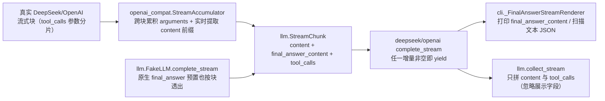

# Day 30：--stream 真实模型逐字流式修复代码导读（R-11）

> 这篇文档怎么读（先看森林，再看树木）：
> - **第 0 步**：只看图，先建立整体印象，不要急着看代码；
> - **第 1 步**：认识这次改动改了什么、没改什么；
> - **第 2 步**：打开文件，按小节顺序逐段读；
> - **第 3 步**：看测试如何验证，最后回到森林图复查。

## 0. 先看森林：这一章到底在做什么

### 0.1 用大白话说

`run --stream` 在真实模型（DeepSeek）下"不流式"：最终回答要等整个运行结束
才一次性打印（R-09/R-10 多次复现，见 day-28/29 §5）。根因：真实模型用
**原生 `final_answer` 工具调用**交付最终回答，流式管线只把工具参数增量
累积到最后一刻，CLI 渲染器只认文本 JSON 形态（`chunk.content`），所以拿不到
任何实时内容，只能靠运行结束后的 `finish()` 兜底打印全文。

R-11（本 Issue）让管线对原生 `final_answer` 的 `content` 参数做**实时增量
透出**：`StreamAccumulator` 从跨块累积的 arguments JSON 片段里扫描出
`content` 字符串值的完整前缀，经新增的 `StreamChunk.final_answer_content`
字段逐块送出；渲染器直接打印它。消息组装（`collect_stream`）不消费该字段，
因此"流式 = 非流式"的等价性不变。

一句话预告：**给 `StreamChunk` 加一个"只供展示、不参与组装"的字段，让原生
`final_answer` 工具调用的 `content` 参数像文本 JSON 一样逐字流出来**；离线
示例、消息等价、全部既有测试都不变。

### 0.2 森林全景图



读法：`final_answer_content` 只走"展示"链路（Acc -> Chunk -> Prov -> Renderer）；
`collect_stream` 组装消息时忽略它，保证与 `complete` 路径逐字节等价。

### 0.3 一句话预告

真实模型下 `--stream` 的最终回答从"运行结束一次性打印"变成"实时逐字到达"，
且消息组装与非流式完全等价。

## 1. 认识改动：改了什么、没改什么

| 文件 | 改动 | 一句话解释 |
| --- | --- | --- |
| `src/self_react/llm.py` | `StreamChunk` 新增字段 `final_answer_content: str = ""`（+ 类型校验） | 承载原生 `final_answer` content 增量，仅用于展示 |
| `src/self_react/llm.py` | `FakeLLM.complete_stream` 对原生 `final_answer` 预置按块透出 | 离线确定性测试可复现真实形态 |
| `src/self_react/openai_compat.py` | `StreamAccumulator` 跟踪 `final_answer` 参数并实时提取 content 前缀 | 增量透出的核心 |
| `src/self_react/deepseek.py` / `openai.py` | `complete_stream` 在 `final_answer_content` 非空时也 yield | 增量块能到达渲染层 |
| `src/self_react/cli.py` | `_FinalAnswerStreamRenderer` 消费 `final_answer_content` 直接打印 | 实时输出，`finish()` 不重复 |
| `tests/test_llm.py` | +3 测试 | Fake 原生路径透出 / 非 final 工具不透出 / 字段类型校验 |
| `tests/test_deepseek.py` / `test_openai.py` | +3 测试 | 合成流下 final_answer content 实时增量、非 final 工具无增量 |
| `tests/test_cli.py` | +2 测试 | 渲染器实时打印且 finish 不重复、CLI `--stream` 原生路径只打印一次 |
| `tests/test_agent.py` | +1 测试 | Agent 流式模式原生 final_answer 正常终止 |

没改：`collect_stream`（消息组装仍只消费 content/tool_calls）、`Agent` 主循环、
文本 JSON 路径（离线示例仍走 `chunk.content` 扫描）、`--stream` 之外的全部
CLI 行为。

## 2. 关键代码走查

### 2.1 `llm.py`：`StreamChunk.final_answer_content`

```python
@dataclass(frozen=True)
class StreamChunk:
    content: str
    final_answer_content: str = ""
    tool_calls: tuple[ToolCall, ...] = ()
```

- 放在 `content` 与 `tool_calls` 之间、带默认值：既有 `StreamChunk(content=...)`
  调用全部不变；
- 文档明确"仅供流式渲染实时展示，不参与 `collect_stream` 的消息组装"；
- `__post_init__` 增加类型校验，与既有 content/tool_calls 校验同一风格。

### 2.2 `openai_compat.py`：增量提取器

`_extract_final_answer_content_prefix(arguments)` 对**可能不完整**的
arguments JSON 片段做纯文本扫描：

1. 逐字符找 JSON 键 `"content"`（跳过转义与其它键）；
2. 找到后跳过空白与冒号，进入字符串值；
3. `_read_json_string_prefix` 逐字符读值：处理 `\\`、`\uXXXX` 等转义，值未
   结束（如转义序列只到一半）时只返回已确定前缀，绝不返回半个转义序列。

`StreamAccumulator` 只跟踪名为 `final_answer` 的工具调用（`_sync_final_arguments`
按 index 序找第一个），`feed()` 返回 `StreamChunk(content=..., final_answer_content=增量)`，
增量 = 当前完整前缀减去已透出部分（`_final_content_emitted` 游标）。

### 2.3 `deepseek.py` / `openai.py`：产出条件

```python
for chunk in stream:
    delta = accumulator.feed(chunk)
    if delta.content or delta.final_answer_content:
        yield delta
```

内容增量与最终回答增量任一非空即产出；末尾块仍照旧携带完整 `tool_calls`，
`collect_stream` 组装结果与非流式等价。

### 2.4 `cli.py`：渲染器消费

```python
if chunk.final_answer_content:
    self._write(chunk.final_answer_content)
if not chunk.content:
    return
self._buffer += chunk.content
self._scan()
```

原生增量直接打印并推进 `_printed` 游标，因此运行结束后的 `finish(expected)`
发现 `_printed == expected` 即空操作——不会重复输出。文本 JSON 路径原样保留。

### 2.5 `FakeLLM.complete_stream`：离线复现真实形态

预置响应是原生 `final_answer` 工具调用（`tool_calls[0].name == "final_answer"`
且 `arguments["content"]` 是字符串）时，把 `content` 值按
`FAKE_STREAM_CHUNK_SIZE` 切块，经 `final_answer_content` 增量透出，末尾块仍
携带完整 `tool_calls`。离线测试因此能确定性地覆盖"真实模型形态"。

## 3. 测试如何验证（全部离线）

| 类别 | 测试 | 断言 |
| --- | --- | --- |
| 字段契约 | `test_stream_chunk_rejects_non_string_final_answer_content` | 非字符串抛 `TypeError` |
| Fake 原生路径 | `test_fake_llm_complete_stream_streams_native_final_answer_content` | content 按块透出、末尾块携带完整 tool_calls、collect_stream 等价 |
| Fake 非 final | `test_fake_llm_complete_stream_ignores_non_final_tool_content` | calculator 工具不产生 final_answer_content |
| DeepSeek 合成流 | `test_deepseek_complete_stream_streams_final_answer_content_live` | 参数分片逐块透出 `["2 ", "+ 2 = ", "4。", ""]`，消息组装等价 |
| DeepSeek 非 final | `test_deepseek_complete_stream_non_final_tool_has_no_final_content` | 无增量 |
| OpenAI 合成流 | `test_openai_complete_stream_streams_final_answer_content_live` | 同 DeepSeek |
| 渲染器 | `test_stream_renderer_prints_native_final_answer_content_live` | 逐块打印且前缀不变式成立，finish 不重复 |
| CLI 端到端 | `test_run_stream_native_final_answer_prints_answer_once` | `--stream` 原生路径只打印一次 |
| Agent 流式 | `test_stream_mode_native_final_answer_terminates_with_final_answer` | 原生 final_answer 流式正常终止 |

既有 565 个测试全部不变。

## 4. 离线验收结果（2026-08-16）

```text
uv run pytest               -> 574 passed, 3 skipped（基线 565 + 新增 9）
uv run ruff check src tests -> All checks passed!
uv run ruff format --check  -> 50 files already formatted
git diff --check            -> 无输出（通过）
uv run self-react hello     -> Hello from Self-ReAct!（exit 0）
6 个 example                -> 全部 exit 0，最终回答与基线一致
```

## 5. 真实 DeepSeek 手动验收（2026-08-16）

结果非确定，如实记录（D 约定），不作为自动化测试前置条件。两路验证：

**① CLI 冒烟：`计算 2 + 2`（--model deepseek --show-trace --stream）**
- FINAL_ANSWER，2/5 步，最终回答"2 + 2 = 4"，exit 0。
- 该次运行模型以**文本 JSON**（`chunk.content`）交付最终回答，走既有
  content 扫描路径实时流式（修复前后该路径本就支持流式）。另一次驱动运行
  中模型在文本前夹带散文导致一次解析重试（steps=3），属模型输出噪声，
  由既有解析重试机制处理，与本次修复无关。

**② 原生 `final_answer` 路径增量证据（场景开放排查任务，--stream）**
用真实 Agent + 场景注册表 + 场景指引运行"排查 promjet 网站 2021-12-17 凌晨
的 404 突增…"（stream=True，on_chunk 包装记录器），模型以原生 `final_answer`
工具调用交付最终回答：

```text
termination=FINAL_ANSWER    steps=6/8
final_answer_len=876        final_content_increments=482
increment[0]  t=18.788s  piece='##'            printed_before=0
increment[1]  t=18.810s  piece=' '             printed_before=2
increment[2]  t=18.810s  piece='排查'           printed_before=3
increment[3]  t=18.837s  piece='结论'           printed_before=5
...（共 482 个增量，每块 1~8 字符，持续约 3.3 秒）
renderer_printed_total=876
```

结论：最终回答 876 字符以 **482 个增量块在约 3.3 秒内逐字到达**渲染器并
实时打印，`renderer_printed_total == final_answer_len`，运行结束后 `finish()`
空操作（无重复输出）。修复前该路径 0 增量、全部由 `finish()` 兜底一次性打印。

## 6. 已知问题与后续

- 真实模型流式块粒度由供应商决定：`final_answer_content` 的增量可能大可能小，
  透出机制保证"到达即打印"，但逐字粒度取决于参数分片；若供应商单块携带全文
  则表现为一次打印（仍优于运行结束后兜底）。
- v1.0.0 标签与 GitHub Release、R-06 规划/反思模块：按交接文档顺序另行确认。
