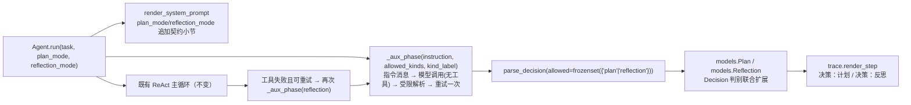

# Day 31：规划/反思模块代码导读（R-06）

> 这篇文档怎么读（先看森林，再看树木）：
> - **第 0 步**：只看图，先建立整体印象，不要急着看代码；
> - **第 1 步**：认识这次改动改了什么、没改什么；
> - **第 2 步**：打开文件，按小节顺序逐段读；
> - **第 3 步**：看测试如何验证，最后回到森林图复查。

## 0. 先看森林：这一章到底在做什么

### 0.1 用大白话说

R-06 给 `Agent` 增加两种**可选**的"先规划后执行 / 失败后反思"能力
（roadmap 10.4 的 P2 加分项）：默认全部关闭，关闭时既有行为逐字节不变。

- **plan-then-execute**：任务开始先让模型输出一个结构化计划
  （`{"kind": "plan", "content": "..."}`），计划计入一步预算并写入轨迹，
  然后才进入既有 ReAct 循环；
- **reflection**：工具调用失败（可重试的失败，含重复动作拦截）后，强制
  一步"总结原因 + 下一步方案"（`{"kind": "reflection", "content": "..."}`），
  也计入一步预算并写入轨迹，再继续循环。

两种模式复用同一个"特化阶段"机制：一条稳定指令消息 + 一次**不传工具定义**
的模型调用 + 按受限 kind 集合解析 + 有界重试一次。不传工具定义是关键：
模型在规划/反思阶段只能输出文本 JSON，不可能夹带原生 `tool_calls`。

一句话预告：**在既有主循环前后各开一个"只输出文本 JSON、有界重试、计步
入轨迹"的特化阶段，用 `parse_decision(allowed=...)` 把可接受的 kind 限定
到 plan/reflection**；默认不开启，开启与否只影响系统提示词多两小节、循环
前后多几次模型调用。

### 0.2 森林全景图



读法：`_aux_phase` 是唯一的新控制流单元，被规划阶段（主循环前）与反思
阶段（主循环内、可重试失败后）复用；`allowed` 受限解析保证特化阶段只产出
对应形态；`Plan` / `Reflection` 作为 `Decision` 的新判别成员进入轨迹渲染。

### 0.3 一句话预告

两种可选模式 = **一个复用的特化阶段助手 + 领域模型/解析器/提示词各加一个
"只接受一种 kind"的缝**；默认关闭，613 个离线测试与六个既有示例全部不变。

## 1. 认识改动：改了什么、没改什么

| 文件 | 改动 | 一句话解释 |
| --- | --- | --- |
| `src/self_react/models.py` | 新增 `Plan` / `Reflection`；`Decision` 联合扩展 | 结构化计划/反思的领域对象，与 `FinalAnswer` 同构（只含非空 `content`） |
| `src/self_react/parser.py` | `parse_decision(raw, *, allowed=None)`；`_parse_content_kind` 抽取 | 默认只接受 final_answer/tool_call（错误文本逐字节不变）；`allowed` 限定到 plan/reflection 供特化阶段复用 |
| `src/self_react/prompts.py` | `render_system_prompt(..., plan_mode=False, reflection_mode=False)` | 两个可选契约小节（仅开启时追加，仍在 extra_instructions 之前），默认输出不变 |
| `src/self_react/agent.py` | `run(..., plan_mode=False, reflection_mode=False)`；`_aux_phase` 助手；`_PLAN_INSTRUCTION` / `_REFLECTION_INSTRUCTION` | 规划阶段在主循环前、反思阶段在可重试失败后；`_notify_step` 提升为模块级函数 |
| `src/self_react/trace.py` | `_render_decision` 增加 Plan/Reflection 分支 | 轨迹渲染"决策：计划 / 决策：反思" |
| `src/self_react/cli.py` | `run --plan` / `run --reflect`；example 帮助文本 | 两种模式的可选开关与两个新示例名 |
| `src/self_react/examples.py` | `ExampleScenario` 增加模式字段；新增 `plan-demo` / `reflection-demo` | 离线确定性演示：计划先行与失败后反思 |
| `tests/*` | +39 个离线确定性测试 | models/parser/prompts/agent/trace/cli/examples 全覆盖 |

没改：`Agent` 主循环主体、`collect_stream`、DeepSeek/OpenAI 适配器、工具层、
文本 JSON 与原生 `tool_calls` 两条既有路径、`--stream` 之外的全部 CLI 行为。

## 2. 关键代码走查

### 2.1 `models.py`：Plan / Reflection

```python
class Plan(BaseModel):
    model_config = ConfigDict(extra="forbid")
    kind: Literal["plan"] = "plan"
    content: Annotated[str, Field(strict=True, min_length=1)]
    _validate_content = field_validator("content")(_ensure_non_blank)
```

- 与 `FinalAnswer` 完全同构：只携带非空文本，不关联工具或运行时资源；
- `Decision` 联合扩展为
  `ToolCall | FinalAnswer | Plan | Reflection`（判别字段 `kind`）；
- `TraceStep.decision` 因此能直接记录计划/反思步骤，`AgentState`
  `steps_used == len(trace)` 不变量自然保持。

### 2.2 `parser.py`：`allowed` 受限解析

```python
_DEFAULT_ALLOWED_KINDS = frozenset({"final_answer", "tool_call"})

def parse_decision(raw, *, allowed=None):
    kinds = _DEFAULT_ALLOWED_KINDS if allowed is None else allowed
    ...
    if kind not in _KNOWN_KINDS or kind not in kinds:
        if allowed is None:
            raise ParseError("kind 只能是 final_answer 或 tool_call")
        raise ParseError(_restricted_kind_message(kinds))
```

- 默认（`allowed=None`）行为与 R-06 之前逐字节一致：主循环仍只接受两种
  kind，未知 kind（含 plan/reflection）的错误文本不变；
- 规划阶段传 `allowed=frozenset({"plan"})`、反思阶段传
  `allowed=frozenset({"reflection"})`，特化阶段不可能误产出其它形态；
- `_parse_content_kind` 抽取三个单文本决策共用的字段校验。

### 2.3 `prompts.py`：可选契约小节

```python
if plan_mode:
    sections.append(_PLAN_PHASE_SECTION)        # {"kind": "plan", ...}
if reflection_mode:
    sections.append(_REFLECTION_PHASE_SECTION)  # {"kind": "reflection", ...}
extra = extra_instructions.strip()
if extra:
    sections.append(extra)                      # R-10 契约：仍为最后小节
```

- 两个小节都在"输出规则"之后、`extra_instructions` 之前，R-10 的
  "extra 最后渲染"契约不变；
- 两个开关默认 `False`，默认输出与基线逐字节一致（有测试锁定）。

### 2.4 `agent.py`：`_aux_phase` 特化阶段助手

```python
def _aux_phase(self, *, task, tool_names, messages, state, on_step,
               instruction, allowed_kinds, kind_label):
    messages.append(Message(role=MessageRole.USER, content=instruction))
    retried = False
    while True:
        if state.steps_used >= state.max_steps:      # 硬预算
            ... MAX_STEPS_EXCEEDED ...
        response = self._llm.complete(messages)      # 不传 tools
        try:
            decision = parse_decision(response.content, allowed=allowed_kinds)
        except ParseError as exc:
            ... 有界重试一次：回写稳定反馈、消耗一步 ...
            ... 仍失败 -> MODEL_OUTPUT_PARSE_ERROR ...
        if not isinstance(decision, (Plan, Reflection)):
            raise RuntimeError("特化阶段返回了未知决策类型")  # 防御分支
        ... 记录 TraceStep(decision=...) ...
```

- **不传工具定义**（`self._llm.complete(messages)`）：真实模型无法返回原生
  `tool_calls`，只能按契约输出文本 JSON；
- **计步入轨迹**：每轮尝试消耗一步并记录 `TraceStep`，`steps_used` 与
  `max_steps` 不变量保持；
- **有界重试一次**：与主循环解析失败的处理同风格，反馈消息用
  `_aux_parse_feedback`（kind 标签为 plan/reflection）；
- 规划阶段在主循环前调用一次；反思阶段在主循环内、可重试工具失败后调用
  （`reflection_mode and not result.is_success and not terminated`），
  不可恢复失败不触发反思（直接终止）。

### 2.5 `examples.py` / `cli.py`：离线演示与开关

- `ExampleScenario` 增加 `plan_mode` / `reflection_mode` 字段，`run_example`
  原样传给 `Agent.run`；`plan-demo`（计划 → 计算 → 检索 → 回答）、
  `reflection-demo`（检索失败 → 反思 → 改用 react → 回答）各 4 步；
- CLI `run --plan` / `run --reflect` 透传给 `Agent.run`，`example` 帮助文本
  同步更新。

## 3. 测试如何验证（全部离线）

| 类别 | 测试 | 断言 |
| --- | --- | --- |
| 领域模型 | `test_plan_model_requires_non_blank_content...` 等 4 个 | Plan/Reflection 非空 content、拒绝多余字段、可入 TraceStep、JSON 往返 |
| 解析器 | `test_parse_plan_with_allowed_plan_kind` 等 11 个 | 受限解析、拒绝错误 kind（稳定错误文本）、默认模式错误文本不变、`allowed` 参数校验 |
| 提示词 | `test_render_plan_mode_appends_plan_phase_section` 等 6 个 | 模式小节存在与顺序、extra 仍最后、默认输出逐字节一致、非布尔拒绝 |
| Agent | `test_plan_mode_plans_then_executes` 等 11 个 | 计划/反思流程、计步预算、解析失败重试与终止、0 预算不调用、on_step 回调、非布尔拒绝 |
| 轨迹 | `test_render_plan_step_shows_plan_decision` 等 3 个 | "决策：计划 / 决策：反思"渲染、端到端含两种步骤 |
| CLI | `test_run_plan_flag_enables_plan_then_execute` 等 3 个 | `--plan`/`--reflect` 透传、默认无计划/反思输出 |
| 示例 | `test_plan_demo_trace_contains_plan_step` 等 | 新示例含计划/反思步骤、示例表更新为五个 |

既有 574 个测试全部不变。

## 4. 离线验收结果（2026-08-17）

```text
uv run pytest               -> 613 passed, 3 skipped（基线 574 + 新增 39）
uv run ruff check src tests -> All checks passed!
uv run ruff format --check  -> 50 files already formatted
git diff --check            -> 无输出（通过）
uv run self-react hello     -> Hello from Self-ReAct!（exit 0）
8 个 example                -> 全部 exit 0；既有六个输出与基线一致，
                               plan-demo/reflection-demo 轨迹含计划/反思步骤
```

## 5. 真实 DeepSeek 手动验收（2026-08-17）

结果非确定，如实记录（D 约定），不作为自动化测试前置条件。三路验证：

**① `--plan` 冒烟：`计算 2 + 2，并检索 react 主题`（--model deepseek --plan）**
- FINAL_ANSWER，4/5 步。第 1 步输出结构化计划：
  "先调用 calculator 计算 2 + 2，再调用 retrieve 检索 react 主题，
  收集两项结果后给出最终回答。"——后续 2-4 步严格按计划执行并收尾。

**② `--reflect`：`先检索 qwerty123（预期失败），失败后反思并改用 react 继续`**
- FINAL_ANSWER，5/5 步。检索 qwerty123 失败（可重试）后，第 2 步强制输出
  反思："检索失败是因为主题「qwerty123」不在知识库的可用主题列表
  （deepseek, pydantic, python, react, uv）中，属于未知主题。下一步改用
  有效主题「react」继续检索。"随后第 3 步改用 react 成功，第 5 步最终回答
  完整引用反思与恢复过程。第 4 步模型输出一次非 JSON 散文，由既有解析
  失败有界重试机制处理（记录 MODEL_OUTPUT_PARSE_ERROR、可重试，下一轮
  恢复），与 R-06 无关。

**③ 场景组合：`排查 promjet 网站 2021-12-17 凌晨的 404 突增…`
（--scenario log-troubleshooting --plan --reflect --max-steps 8）**
- **FINAL_ANSWER，6/8 步**（R-10 基线为 7/8 步）。第 1 步计划完整遵循
  R-10 五条场景指引（"先用 log_query 按 service=jet、error_code=404、
  time 限定 2021-12-17 凌晨聚合查看突增规模与分布，再用 runbook_search
  检索 404 突增的诊断条目，结合部署记录（如需要）判断是外部扫描还是
  应用故障，证据足够时输出根因假设与下一步动作"）；第 2-5 步 log_query
  ×3 + runbook_search，第 6 步给出完整结论：**外部备份/源码文件扫描而非
  应用故障**（证据：736 条集中在 03 点小时、HEAD 探测备份/源码档案扩展名、
  真实应用服务 jet 仅 2 条、与 RB-404 吻合），根因假设与 5 项下一步动作
  完整正确。本次运行无工具失败，未触发反思步骤。

对比：R-10 之前该任务 5/5 步耗尽、R-10 后 7/8 步 FINAL_ANSWER；本此
`--plan` 使模型首步即产出符合场景指引的调查路线，6/8 步完成且结论完整，
可解释性（计划可见）与收敛性（少用一步）均有提升。

## 6. 已知问题与后续

- **预算权衡**：规划/反思各计一步，严格受 `max_steps` 约束。反思在紧预算
  下可能"吃掉"恢复机会（失败即反思 → 预算耗尽 → MAX_STEPS_EXCEEDED）；
  这是"严格限定步数预算"的刻意取舍，演示示例已按 4 步配好预算。
- **触发边界**：反思只挂在主循环的单工具执行路径上；供应商一次返回多个
  `tool_calls` 时（首个成功、其余回写可恢复观察）不触发反思；不可恢复失败
  不触发反思（直接终止）。
- **真实模型输出**：规划/反思阶段不传工具定义，模型只能输出文本 JSON；
  若模型仍输出散文，会走有界重试（一次）后以 `MODEL_OUTPUT_PARSE_ERROR`
  终止，与主循环的解析纪律一致。
- roadmap 10.1 的结构性收敛修复方向（规划/反思）已落地；工具层
  defense-in-depth（10.2 候选）仍待单独立项。
