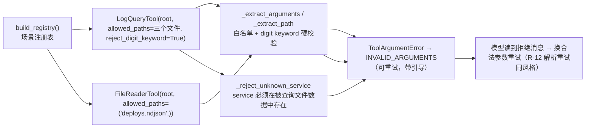

# Day 32：工具层 defense-in-depth 代码导读（Issue #77）

> 这篇文档怎么读（先看森林，再看树木）：
> - **第 0 步**：只看图，先建立整体印象，不要急着看代码；
> - **第 1 步**：认识这次改动改了什么、没改什么；
> - **第 2 步**：打开文件，按小节顺序逐段读；
> - **第 3 步**：看测试如何验证，最后回到森林图复查。

## 0. 先看森林：这一章到底在做什么

### 0.1 用大白话说

R-09/R-10 真实验收记录了三类"模型忽略提示词软约束"的失败模式：把站点名
`promjet` 当 `service` 过滤值（0 命中）、猜测不存在的文件名、把状态码 `404`
当 `keyword` 过滤（0 命中）、用 `file_reader` 直读 `logs.ndjson` 全文。
R-10 用提示词五条指引（软约束）缓解后收敛性明显改善，但软约束仍依赖模型
自觉。Issue #77 把这些**工具层可硬化**的指引变成参数硬校验：非法参数在
工具边界被稳定拒绝（`INVALID_ARGUMENTS`，可重试，带引导消息），而不是
静默返回 0 条。

三处硬校验：

1. **路径白名单**（`allowed_paths` 构造配置）：`log_query` 场景只允许
   `logs.ndjson` / `runbook.ndjson` / `deploys.ndjson`；`file_reader` 场景
   只允许 `deploys.ndjson`（发布记录），`logs.ndjson` / `runbook.ndjson`
   被硬拒绝（把指引 1"只填三个文件名"与指引 4"不读 logs.ndjson 全文"
   变成硬约束）；
2. **service 数据驱动校验**（无需配置）：`service` 必须是被查询文件内实际
   存在的主机名，站点名 `promjet` 等非法值被稳定拒绝（把指引 3 变硬约束）；
3. **全数字 keyword 拒绝**（`reject_digit_keyword` 构造配置）：`keyword` 为
   全 ASCII 数字时被拒绝并引导改用 `error_code`（把指引 2 变硬约束）。

所有新配置默认关闭，关闭时工具行为与之前逐字节一致。

一句话预告：**给工具加"可选白名单 + 数据驱动 service 校验 + 可选 digit
keyword 拒绝"，场景注册表开启配置，把提示词软约束变成第二道硬防线**；
默认 registry 与既有测试零影响。

### 0.2 森林全景图



读法：`allowed_paths` / `reject_digit_keyword` 是构造时配置（默认关闭）；
service 校验在文件加载后按数据判断（无需配置）；拒绝统一走
`ToolArgumentError` → `INVALID_ARGUMENTS`，模型可重试。

### 0.3 一句话预告

提示词软约束之外的第二道硬防线 = **两个可选构造配置 + 一个数据驱动校验**；
默认关闭零影响，场景开启后非法参数在工具边界被稳定拒绝并引导。

## 1. 认识改动：改了什么、没改什么

| 文件 | 改动 | 一句话解释 |
| --- | --- | --- |
| `src/self_react/tools/log_query.py` | `allowed_paths` / `reject_digit_keyword` 构造配置；`_reject_unknown_service` 数据驱动校验 | 路径白名单、全数字 keyword 拒绝、service 必须存在于数据中 |
| `src/self_react/tools/file_reader.py` | `allowed_paths` 构造配置 | 路径白名单（场景只读发布记录） |
| `src/self_react/scenarios/log_troubleshooting/scenario.py` | `build_registry` 传入配置 | 场景启用硬校验：log_query 三个文件 + digit 拒绝；file_reader 只读 deploys |
| `tests/test_log_query.py` | +8 测试 | 白名单放行/拒绝、service 拒绝/空查询不误伤、digit keyword、构造校验 |
| `tests/test_file_reader.py` | +3 测试 | 白名单放行/拒绝、构造校验 |
| `tests/test_log_troubleshooting_scenario.py` | +6 测试 | 场景硬约束生效（promjet 拒绝、digit 拒绝、路径白名单、三文件可查、deploys 可读） |

没改：过滤/聚合/时间窗/limit 的合法参数语义、`R-10` 提示词文本（软约束
保留，与硬约束双保险）、默认 registry（root=C:/allowed 不启用配置）、
`RunbookSearchTool` / `calculator` / `retrieve`、Agent 主循环。

## 2. 关键代码走查

### 2.1 `log_query.py`：路径白名单与 digit keyword 拒绝

```python
def __init__(self, root_directory, *, allowed_paths=None, reject_digit_keyword=False):
    # 校验：allowed_paths 是包含非空字符串的非空序列；reject_digit_keyword 是 bool
    self.root = Path(root_directory)
    self.allowed_paths = normalized_paths   # None 或 tuple
    self.reject_digit_keyword = reject_digit_keyword
```

- `_extract_arguments(..., allowed_paths=..., reject_digit_keyword=...)`：
  - 白名单：`if allowed_paths is not None and path not in allowed_paths:` →
    `ToolArgumentError("path 只能是 logs.ndjson、runbook.ndjson、deploys.ndjson 之一")`；
  - digit keyword：`keyword.isascii() and keyword.isdigit()` →
    `ToolArgumentError("keyword 不能是全数字：状态码请用 error_code 参数过滤，keyword 只匹配 message（请求行）子串")`；
  - 默认 `None` / `False` 时跳过，行为与之前逐字节一致。

### 2.2 `log_query.py`：service 数据驱动校验

```python
def _reject_unknown_service(service, lines):
    distinct = {str(line.get("service")) for line in lines
                if isinstance(line.get("service"), str) and line.get("service")}
    if service not in distinct:
        raise ToolArgumentError(
            f"service 值 {service!r} 在该文件中不存在；service 必须是数据中"
            "实际存在的主机名，不要用站点名等值"
        )
```

- 在 `_load_lines` 之后、过滤之前调用：只把"被查询文件里根本不存在"的
  service 值当作非法（`promjet` 不在数据中 → 拒绝）；数据中存在但过滤后
  无匹配的合法值（如 `jet` 在某小时窗口无命中）仍正常返回 0 条，不误伤
  合法空查询；
- 无需构造配置：按文件数据判断，与 `allowed_paths` 不同；
- `ToolArgumentError` 由注册表统一转 `INVALID_ARGUMENTS`（可重试），
  模型读到引导消息后可换合法值重试。

### 2.3 `file_reader.py`：路径白名单

```python
class FileReaderTool:
    def __init__(self, root_directory, *, allowed_paths=None):
        # 与 log_query 相同的校验与归一化
        self.allowed_paths = normalized_paths

    def execute(self, arguments):
        path_text = _extract_path(arguments, allowed_paths=self.allowed_paths)
        ...
```

- 场景传 `allowed_paths=("deploys.ndjson",)`：`file_reader` 只读发布记录，
  `logs.ndjson` / `runbook.ndjson` 被硬拒绝（指引 4"不读 logs.ndjson 全文"
  变成硬约束；runbook 用 `runbook_search` 查询）。

### 2.4 `scenario.py`：场景开启配置

```python
_LOG_QUERY_ALLOWED_PATHS = ("logs.ndjson", "runbook.ndjson", "deploys.ndjson")
_FILE_READER_ALLOWED_PATHS = ("deploys.ndjson",)

registry.register(FileReaderTool(root_directory=_DATA_DIR, allowed_paths=_FILE_READER_ALLOWED_PATHS))
registry.register(LogQueryTool(root_directory=_DATA_DIR, allowed_paths=_LOG_QUERY_ALLOWED_PATHS, reject_digit_keyword=True))
```

- 默认 registry（`cli._build_registry`，root=C:/allowed）不启用任何配置，
  行为不变；service 校验无需配置，对任何 `log_query` 实例生效。

## 3. 测试如何验证（全部离线）

| 类别 | 测试 | 断言 |
| --- | --- | --- |
| log_query 白名单 | `test_log_query_allowed_paths_accepts_listed_file` / `rejects_other_files` | 放行允许文件；拒绝白名单外文件并列出允许值（INVALID_ARGUMENTS、可重试） |
| log_query service | `test_log_query_rejects_service_not_present_in_data` / `accepts_service_present_in_data_even_without_match` | 站点名 promjet 被拒（消息含"主机名"引导）；数据中存在但无匹配 → 正常 0 条 |
| log_query keyword | `test_log_query_rejects_digit_keyword_when_enabled` / `digit_keyword_allowed_by_default` | 开启时全数字 keyword 被拒（引导 error_code）；默认行为不变 |
| log_query 构造 | `test_log_query_rejects_invalid_hardening_config` | allowed_paths 非法类型/空/空项、reject_digit_keyword 非 bool 被拒 |
| file_reader 白名单 | `test_file_reader_allowed_paths_accepts_listed_file` / `rejects_other_files` / `rejects_invalid_allowed_paths_config` | 放行/拒绝/构造校验 |
| 场景硬约束 | `test_scenario_log_query_rejects_site_name_as_service` 等 6 个 | promjet 拒绝、digit keyword 拒绝、path 白名单拒绝/三文件可查、file_reader 拒 logs/runbook 且可读 deploys |

既有 613 个测试全部不变。

## 4. 离线验收结果（2026-08-17）

```text
uv run pytest               -> 629 passed, 3 skipped（基线 613 + 新增 17）
uv run ruff check src tests -> All checks passed!
uv run ruff format --check  -> 50 files already formatted
git diff --check            -> 无输出（通过）
uv run self-react hello     -> Hello from Self-ReAct!（exit 0）
8 个 example                -> 全部 exit 0；既有六个输出与基线一致
硬约束冒烟（场景注册表直接执行）：
  log_query service=promjet  -> INVALID_ARGUMENTS：service 值 'promjet' 在该文件中不存在…
  log_query path=app.log     -> INVALID_ARGUMENTS：path 只能是 logs.ndjson、runbook.ndjson、deploys.ndjson 之一
  log_query keyword=404      -> INVALID_ARGUMENTS：keyword 不能是全数字：状态码请用 error_code…
  file_reader logs.ndjson    -> INVALID_ARGUMENTS：path 只能是 deploys.ndjson 之一
```

## 5. 真实 DeepSeek 手动验收（2026-08-17）

结果非确定，如实记录（D 约定），不作为自动化测试前置条件。三路验证：

**① 标准场景任务回归（--scenario --plan --reflect --max-steps 8）**
- FINAL_ANSWER，结论完整正确（外部备份/源码文件扫描而非应用故障，根因假设
  与按优先级的下一步动作完整）。硬约束未阻碍任何合法用法，收敛性与 R-06
  验收一致。

**② 诱导 keyword 过滤状态码（任务提示"用 keyword 参数过滤状态码"）**
- FINAL_ANSWER。该次模型自觉遵守提示词指引（error_code 过滤 + keyword
  补充），并在最终回答中主动说明"keyword 仅匹配请求行子串，无法用于状态码
  过滤"——软约束（R-10 指引）与硬约束（digit keyword 拒绝）双保险生效。

**③ 强制 service=promjet（任务明确"必须用 service 参数过滤，值用 promjet"）**
- 第 1 步模型尝试 `service: "promjet"` → **观察（失败）：service 值
  'promjet' 在该文件中不存在；service 必须是数据中实际存在的主机名，不要用
  站点名等值**，错误码 INVALID_ARGUMENTS；
- 模型随后改用 `keyword=promjet` 调查、读取发布记录，最终 6/6 FINAL_ANSWER：
  明确引用工具的拒绝消息，解释"promjet 是站点名，并非主机名，数据中不存在
  service=promjet 的记录；任务指引也明确指出'不要用 promjet 作为 service
  过滤值'"，拒绝编造不存在的统计结果——硬约束的拒绝与引导完整生效，模型
  诚实收敛而非幻觉。

## 6. 已知问题与后续

- **软约束与硬约束并存**：R-10 提示词五条指引保留（双保险）；硬约束失败时
  模型先收到 INVALID_ARGUMENTS 引导消息，通常一步内修正。
- **service 校验是数据驱动的**：只拒绝"被查询文件里不存在"的值；若未来 fixture
  数据变化，允许集合随之变化，无需改代码（但 fixture 固定是场景纪律，实际
  不会变）。
- **digit keyword 拒绝是启发式**：全 ASCII 数字的 keyword 在 message（请求行）
  子串语义下几乎必然是状态码误用，故按构造配置拒绝；若未来出现合法的纯数字
  message 检索需求，可关闭该配置。
- **指引 5（证据足够即 final_answer）**是循环收敛行为，不属于工具参数校验，
  保持提示词软约束；R-06 的规划/反思模式已从机制上缓解。
- roadmap 10.2 候选（`--stream` 逐字流式）与 10.6/10.7（数据覆盖度扩展、
  PII 守卫）仍待按需单独立项。
