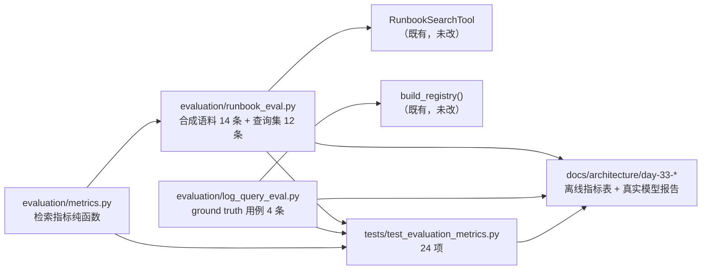

# Day 33：评估集与效果指标代码导读（Issue #81）

> 这篇文档怎么读（先看森林，再看树木）：
> - **第 0 步**：只看图，先建立整体印象，不要急着看代码；
> - **第 1 步**：认识这次改动改了什么、没改什么；
> - **第 2 步**：打开文件，按小节顺序逐段读；
> - **第 3 步**：看测试如何验证，最后回到森林图复查，再看真实模型验收。

## 0. 先看森林：这一章到底在做什么

### 0.1 用大白话说

roadmap 10.8 给项目补上大模型应用标准的**效果指标**。此前项目可量化的东西
只有"工具正确性断言"与"性能/收敛前后对比"，没有业界通行的召回率 / 精确率 /
F1 / 任务成功率这类数字。本次落地三组指标：

1. **runbook_search 检索质量（离线确定）**：真实 runbook 语料只有 3 条，
   `top_k=3` 时每次查询都会返回全部条目，指标恒为 1.0 / 1/3 没有区分度。
   因此在**测试内**构造一套合成扩展语料（14 条中文风格条目 + 12 条固定查询，
   其中 2 条查询有 2 个相关条目），按标准 top-k 口径统计**宏平均召回率 /
   精确率 / F1**，档位取 `top_k ∈ {1,3,5}`；真实 3 条 fixture 只做确定性
   冒烟断言，不碰任何数据文件。
2. **log_query 查询准确性（离线确定）**：把场景 ground truth（`error_code=404`
   命中 736 条 / 共 931 条、03 点小时桶 736、03:14-03:18 窗口 733 条）与
   防回归用例（`keyword="404"` 必须被硬校验拒绝）固化成评估用例表，全部
   离线确定进 pytest。
3. **端到端任务评估集（真实 DeepSeek，手动验收）**：6 个带标准答案的任务
   （开放式排查 / 窗口定位 / 发布关联 / 403 / 503 / 组合任务），每个任务
   默认配置跑 3 次，任务①与⑥另加跑 `--plan --reflect` 3 次（共 24 次真实
   调用），统计**任务成功率 / 收敛率 / 平均步数 / 平均耗时 / 关键数字准确率**，
   结果如实记录进本文档 §5。真实模型结果非确定，只作手动验收记录，不做
   自动化测试前置条件。

一句话预告：**新增一个纯库函数的 `self_react.evaluation` 评估包（离线指标
可复现进 pytest）+ 一份真实模型评估报告（§5），不改任何工具、提示词与
fixture 数据**。

### 0.2 森林全景图



读法：评估包只**调用**既有工具与场景注册表，不修改它们；测试既验证指标
公式口径，也锁定评估集实测基线。

### 0.3 一句话预告

离线指标 = **指标公式纯函数 + 合成评估集 + ground truth 用例表**，全部确定
性进 pytest；真实模型指标 = **6 任务 × 24 次手动评估记录**，进架构导读。

## 1. 认识改动：改了什么、没改什么

| 文件 | 改动 | 一句话解释 |
| --- | --- | --- |
| `src/self_react/evaluation/__init__.py` | 新增包导出 | 对外暴露两类离线评估能力与评估集常量 |
| `src/self_react/evaluation/metrics.py` | 新增 | 检索指标纯函数：`retrieval_metrics_at_k` / `macro_average` |
| `src/self_react/evaluation/runbook_eval.py` | 新增 | 合成扩展语料 + 固定查询集 + `evaluate_runbook_search` |
| `src/self_react/evaluation/log_query_eval.py` | 新增 | ground truth 用例表 + `evaluate_log_query_accuracy` |
| `tests/test_evaluation_metrics.py` | 新增（24 项） | 指标公式口径、评估集回归基线、fixture 冒烟、log_query 用例 |
| `docs/architecture/day-33-*.md` | 新增（本文档） | 代码导读 + 离线指标表 + 真实模型评估报告 |

没改：`RunbookSearchTool` / `LogQueryTool` / 场景注册表 / 提示词 / 三个
NDJSON fixture（数据保持固定与离线确定性）；真实模型评估驱动脚本只放
`tmp/eval_driver_108.py`（一次性工具，不入库）；不加 CLI 入口。

## 2. 关键代码走查

### 2.1 `metrics.py`：检索指标纯函数

```python
def retrieval_metrics_at_k(ranked_ids, relevant_ids, k) -> Metrics:
    # recall@k   = |relevant ∩ top-k| / |relevant|（relevant 为空 → 0）
    # precision@k = |relevant ∩ top-k| / k（k 是请求档位，结果不足 k 条也按 k）
    # F1 = 2*P*R/(P+R)，P 与 R 都为 0 → 0（避免除零）
```

- 标准 top-k 口径的两个关键决定：**精确率分母恒为请求档位 k**（即使语料不足
  k 条），**召回率分母为相关条目数**（允许每个查询多个相关条目）；
- `macro_average` 对每条查询等权（宏平均），与"按查询数平均"的惯例一致；
- 纯函数：不 import 任何工具，便于单独测试公式。

### 2.2 `runbook_eval.py`：检索评估集

```python
RUNBOOK_EVAL_ENTRIES  # 14 条合成 runbook：404/403/503/502/504/429/500/
# 连接池/慢查询/磁盘/内存/配置/发布/扫描，中文风格与 fixture 一致
RUNBOOK_EVAL_QUERIES  # 12 条固定查询；2 条有 2 个相关条目（区分度来源）
RUNBOOK_EVAL_TOP_KS  # (1, 3, 5)


def evaluate_runbook_search() -> RunbookMetricsResult:
    tool = RunbookSearchTool(
        entries=[RunbookEntry.model_validate(e) for e in RUNBOOK_EVAL_ENTRIES]
    )
    for item in RUNBOOK_EVAL_QUERIES:
        ranked = tool.search(query, max(TOP_KS))  # 复用既有 BM25
        per_k = {k: retrieval_metrics_at_k(ranked, relevant, k) for k in TOP_KS}
    return RunbookMetricsResult(per_k={k: macro_average(...)}, queries=...)
```

- 完全复用既有 `RunbookSearchTool` 的 BM25（未改一行），评估的是**检索效果**
  而不是检索实现；
- 双相关查询（"404 突增 备份 源码探测"→ RB-404+RB-SCAN、"连接池耗尽 慢查询"
  → RB-CONN+RB-SLOW）让 `recall@1` 出现 < 1 的值，指标有区分度；
- 相同输入永远相同输出（确定性），回归基线锁进测试。

### 2.3 `log_query_eval.py`：查询准确性评估集

```python
LOG_QUERY_EVAL_CASES = (
    LogQueryCase("404-count",        {path, error_code: "404"},           expect_substring="匹配 736 条 / 共 931 条"),
    LogQueryCase("404-hour-bucket",  {path, error_code, group_by: "hour"}, expect_substring="2021-12-17 03:00:00: 736"),
    LogQueryCase("404-spike-window", {path, error_code, time_start, time_end}, expect_substring="匹配 733 条"),
    LogQueryCase("keyword-404-rejected", {path, keyword: "404"},           expect_invalid_arguments=True),
)

def evaluate_log_query_accuracy(registry=None) -> LogQueryEvalResult:
    # registry 默认 build_registry()（含 defense-in-depth 硬校验）
    # 每条用例：registry.execute(ToolCall(...)) → 断言成功内容或 INVALID_ARGUMENTS
```

- 前三条是 ground truth 计数（736 / 03 点小时桶 / 733），第四条是防回归：
  `keyword="404"` 在 `reject_digit_keyword=True` 下必须 `INVALID_ARGUMENTS`
  （defense-in-depth 之前这类用法召回率为 0，现被硬约束防住）；
- 用例表是"数据"，评估器是"执行器"，新增用例只需加一行；
- 允许注入自定义注册表：用空注册表评估时如实报告失败，验证评估器不掩盖问题。

## 3. 测试如何验证（全部离线）

| 类别 | 测试 | 断言 |
| --- | --- | --- |
| 指标公式 | `test_retrieval_metrics_*`（7 项） | 命中/部分命中/零命中/F1 公式/k 超长/空相关/k<1 拒绝 |
| 宏平均 | `test_macro_average_*`（2 项） | 等权平均；空输入为全 0 |
| 评估集结构 | `test_runbook_eval_set_is_well_formed` | 12≤语料≤15、10≤查询≤12、id 唯一、相关条目都在语料内 |
| 确定性 | `test_runbook_eval_is_deterministic` | 两次评估结果完全相等 |
| 指标形态 | `test_runbook_eval_reports_three_top_k_levels` / `recall_is_non_decreasing` / `recall_strictly_improves_between_k1_and_k3` | 三档齐全、指标在 [0,1]、召回率随 k 单调且严格上升（区分度） |
| 回归基线 | `test_runbook_eval_macro_metrics_regression_baseline` | k=1: R=0.9167/P=1.0/F1=0.9444；k=3: R=1.0/P=0.3889/F1=0.55；k=5: R=1.0/P=0.2333/F1=0.3730（BM25 首跑实测值） |
| 逐查询明细 | `test_runbook_eval_reports_per_query_ranking` / `key_query_503_hits_relevant_entry_first` / `multi_relevant_query_finds_both` | top-5 排序记录齐全；代表性查询 top-1 命中；双相关查询都在 top-5 |
| fixture 冒烟 | `test_runbook_eval_real_fixture_smoke` | 真实 3 条语料：RB-404 确定性命中且两次一致 |
| log_query | `test_log_query_eval_*`（4 项） | 4 条用例全覆盖且全部通过；明细含 736/733/03:00:00；空注册表如实报失败 |

既有 644 个测试全部不变（本次 +24 → 668 通过 / 3 跳过）。

## 4. 离线验收结果（2026-08-19）

```text
uv run pytest               -> 668 passed, 3 skipped（基线 644 + 新增 24）
uv run ruff check src tests -> All checks passed!
uv run ruff format --check  -> 56 files already formatted
git diff --check            -> 无输出（通过）
uv run self-react hello     -> Hello from Self-ReAct!（exit 0）
8 个 example                -> 全部 exit 0；既有输出与基线一致

离线指标实测（evaluate_runbook_search）：
  top_k=1:  recall 0.9167 / precision 1.0000 / F1 0.9444
  top_k=3:  recall 1.0000 / precision 0.3889 / F1 0.5500
  top_k=5:  recall 1.0000 / precision 0.2333 / F1 0.3730
  形态符合标准 top-k 口径：召回率随 k 单调上升（双相关查询让 top-1 召回 < 1），
  精确率随 k 下降（相关条目数远小于档位），F1 在 top-1 最高。

log_query 评估（evaluate_log_query_accuracy）：4/4 通过
  404-count        -> 匹配 736 条 / 共 931 条 ✓
  404-hour-bucket  -> 2021-12-17 03:00:00: 736 ✓
  404-spike-window -> 匹配 733 条 ✓
  keyword-404-rejected -> INVALID_ARGUMENTS ✓（防回归）
```

## 5. 真实 DeepSeek 手动验收（2026-08-19）

> 结果非确定，如实记录（不当作自动化测试前置条件）。6 个带标准答案任务 ×
> 默认配置 N=3（18 次）+ 任务 t01 与 t06 另加跑 `--plan --reflect` N=3
> （6 次），共 **24 次**真实调用，`--scenario log-troubleshooting
> --max-steps 8`。判定口径：任务成功 = FINAL_ANSWER 且结论与标准答案一致
> （人工阅读最终回答判定，关键数字作为辅助证据）；收敛率 = 预算内给出最终
> 回答的占比；平均步数 / 平均耗时仅统计收敛任务；关键数字准确率 = 最终回答
> 命中 ground truth 关键数字的比例。完整逐次运行记录见
> `tmp/eval_108_results.jsonl`（驱动脚本 `tmp/eval_driver_108.py`，不入库）。

### 5.1 指标总表

| 任务 | 模式 | 次数 | 收敛率 | 任务成功率 | 平均步数 | 平均耗时(s) | 关键数字准确率 |
| --- | --- | --- | --- | --- | --- | --- | --- |
| t01 404 突增排查 | 默认 | 3 | 2/3 | 2/3 | 6.0 | 21.8 | 4/15 (26.7%) |
| t01 404 突增排查 | plan+reflect | 3 | 3/3 | 3/3 | 7.3 | 21.1 | 5/15 (33.3%) |
| t02 窗口定位 | 默认 | 3 | 0/3 | 0/3 | — | — | 0/12 (0%) |
| t03 发布关联 | 默认 | 3 | 1/3 | 1/3 | 7.0 | 19.8 | 3/12 (25%) |
| t04 403 排查 | 默认 | 3 | 3/3 | 3/3 | 5.3 | 10.8 | 3/3 (100%) |
| t05 503 排查 | 默认 | 3 | 3/3 | 3/3 | 5.7 | 13.5 | 3/3 (100%) |
| t06 组合任务 | 默认 | 3 | 1/3 | 1/3 | 8.0 | 23.2 | 4/18 (22.2%) |
| t06 组合任务 | plan+reflect | 3 | 3/3 | 3/3 | 7.3 | 20.2 | 10/18 (55.6%) |
| **合计** | | **24** | **16/24 (66.7%)** | **16/24 (66.7%)** | **6.5** | **17.7** | **32/96 (33.3%)** |

要点：

- **任务成功率 = 收敛率 = 66.7%**：所有收敛的运行，最终回答结论都与标准答案
  一致（含根因判断与下一步动作），失败模式**只有一种**——8 步预算耗尽
  （MAX_STEPS_EXCEEDED，无最终回答）；
- **t02（窗口定位，单查询任务）收敛率 0/3**：本应是最简单的任务，3 次都在
  8 步内反复查询而未输出 final_answer（R-10 指引 5"证据足够即收尾"对短任务
  失效）；提示"简单任务反而步数耗尽"，值得后续用更小预算或更明确的收尾
  指令验证；
- **--plan --reflect 对比组收敛性提升明显**：t01 0.667→1.0、t06 0.333→1.0，
  t06 关键数字准确率 0.222→0.556，与 R-06 验收的"规划/反思提升开放式任务
  收敛性"方向一致；
- **t04/t05（日志无 403/503 样本）成功率 3/3**：模型面对数据不足时诚实给出
  "0 条 + runbook 指引"的结论，无幻觉编造；
- **关键数字准确率整体 33.3%**：`736` / `1.2.0` / `2021-12-16` / `403` /
  `503` 命中率高；`733` / `03:18` / `79.1%` 常缺失——模型自然输出粒度是
  "736 条全在 03 点小时桶"，不会主动下钻到 03:14-03:18 子窗口与占比，除非
  任务文本显式要求（t02 若收敛本应带出 733）。这提示评估集关键数字要贴合
  模型自然回答粒度，或任务文本显式点名关键数字。

### 5.2 单次运行判定明细

| # | 任务/模式/第几次 | 步数 | 耗时(s) | 终止 | 判定 | 说明 |
| --- | --- | --- | --- | --- | --- | --- |
| 1 | t01 默认 1 | 5 | 19.4 | FINAL_ANSWER | 成功 | 结论"外部扫描（备份/源码探测）非应用故障"正确，证据链完整；缺 733/03:18/79.1% |
| 2 | t01 默认 2 | 7 | 24.2 | FINAL_ANSWER | 成功 | 同上，补充"发布窗口排除应用故障"论证 |
| 3 | t01 默认 3 | 8 | 17.2 | MAX_STEPS_EXCEEDED | 失败 | 步数耗尽无最终回答 |
| 4 | t01 plan+reflect 1 | 8 | 20.6 | FINAL_ANSWER | 成功 | 结论正确，明确"全部 404 集中在 03:00 一小时" |
| 5 | t01 plan+reflect 2 | 7 | 20.6 | FINAL_ANSWER | 成功 | 结论正确，含"全部 404 证明未泄露"判断 |
| 6 | t01 plan+reflect 3 | 7 | 22.0 | FINAL_ANSWER | 成功 | 结论正确，含 HEAD 节奏/俄语备份名等细节 |
| 7 | t02 默认 1 | 8 | 25.3 | MAX_STEPS_EXCEEDED | 失败 | 反复查询未收尾 |
| 8 | t02 默认 2 | 8 | 11.2 | MAX_STEPS_EXCEEDED | 失败 | 同上 |
| 9 | t02 默认 3 | 8 | 11.9 | MAX_STEPS_EXCEEDED | 失败 | 同上 |
| 10 | t03 默认 1 | 7 | 19.8 | FINAL_ANSWER | 成功 | "与发布无关"判定正确：jet 1.2.0 @ 2021-12-16 22:00 与 03:00 突增差 5 小时，jet 仅 2 条 404 |
| 11 | t03 默认 2 | 8 | 14.1 | MAX_STEPS_EXCEEDED | 失败 | 步数耗尽 |
| 12 | t03 默认 3 | 8 | 21.0 | MAX_STEPS_EXCEEDED | 失败 | 步数耗尽 |
| 13 | t04 默认 1 | 5 | 9.8 | FINAL_ANSWER | 成功 | "无 403"结论正确：error_code=403 命中 0 条 + 分布证据 + RB-403 指引 |
| 14 | t04 默认 2 | 5 | 10.4 | FINAL_ANSWER | 成功 | 同上，补充 promjet 相关 58 条请求核查 |
| 15 | t04 默认 3 | 6 | 12.3 | FINAL_ANSWER | 成功 | 同上，补充 58 条聚合（404×57/200×1） |
| 16 | t05 默认 1 | 7 | 16.1 | FINAL_ANSWER | 成功 | "无 503"结论正确：0 条 + 分布 + deploys 核对 + RB-503 指引 |
| 17 | t05 默认 2 | 7 | 16.7 | FINAL_ANSWER | 成功 | 同上，补充 level 聚合（WARN 736/INFO 195/ERROR 0） |
| 18 | t05 默认 3 | 3 | 7.7 | FINAL_ANSWER | 成功 | 同上，最短收敛（3 步） |
| 19 | t06 默认 1 | 8 | 23.2 | FINAL_ANSWER | 成功 | 完整：窗口 03:00（736 条）+ 发布无关 + 根因扫描 + 动作 |
| 20 | t06 默认 2 | 8 | 16.3 | MAX_STEPS_EXCEEDED | 失败 | 步数耗尽 |
| 21 | t06 默认 3 | 8 | 19.1 | MAX_STEPS_EXCEEDED | 失败 | 步数耗尽 |
| 22 | t06 plan+reflect 1 | 6 | 14.8 | FINAL_ANSWER | 成功 | 完整结论，6 步收敛 |
| 23 | t06 plan+reflect 2 | 8 | 21.3 | FINAL_ANSWER | 成功 | 完整结论，含"扫描已收敛"复核建议 |
| 24 | t06 plan+reflect 3 | 8 | 24.5 | FINAL_ANSWER | 成功 | 完整结论，含"无需回滚"明确判断 |

### 5.3 代表性最终回答摘录

- **t06 plan+reflect 3 的组合任务收尾**："deploys.ndjson 中唯一发布记录为
  jet 服务 v1.2.0，部署于 2021-12-16 22:00:00。但该 404 窗口内 jet 服务的
  404 仅有 2 条……因此该 404 突增与发布无关，无需回滚，也不是发布回归。"
- **t05 默认 3 的诚实结论（最短收敛）**："按状态码精确过滤 503：
  `log_query(error_code=503)` 命中 0 条……promjet 网站没有 503 服务不可用
  问题。"
- **t01 默认 1 的根因细节**："请求方法为 HEAD……03:14 起在数秒内连续发出
  `1.gz→1.rar→1.tar→1.tar.bz2→1.tgz→1.zip→12.rar→12.tar→123.rar...` 的批量
  枚举，是标准自动化扫描工具的行为特征。"

### 5.4 与标准答案的偏差（如实记录）

- 收敛任务的结论方向全部正确，但**关键数字粒度不足**：多数回答停在"736 条
  集中在 03 点小时桶"，未给出 03:14-03:18 子窗口的 733 条与 79.1%/99.6%
  占比（除 t06 plan+reflect 3 提到"实际爆发在 03:14–03:15"）；
- t02 的任务文本"找出 404 错误集中出现的时间窗口"未显式点名 733，模型在
  8 步内反复组合查询（group_by=hour / service / time 窗口）而没有收尾，
  是本次唯一全败任务；标准答案的判定在"窗口=03 点小时桶"层面与模型的
  查询轨迹一致，但模型未落成 final_answer；
- 非收敛运行（8/24）均无幻觉或错误结论，只是预算耗尽；--plan --reflect
  显著减少这类失败。

## 6. 已知问题与后续

- **合成语料指标不代表真实语料检索能力**：runbook top-k 指标是对合成评估集
  的测量（真实语料仅 3 条，无法单独构成有区分度的检索评估）；真实 3 条只做
  冒烟。若未来扩充 runbook fixture（roadmap 10.6 方向），可把真实语料直接
  接入同一评估器。
- **真实模型指标样本量小**：每任务 3 次（对比组 3 次），波动大，报告如实
  标注样本量；roadmap 10.8 原文建议 N=3~5，本次取 3。
- **任务成功率是人工判定**：关键数字准确率可自动化，但"结论与标准答案一致"
  需要读语义；判定过程记录在 §5 逐次明细中，可复核。
- **评估器是只读观察层**：`self_react.evaluation` 不修改任何工具/数据/提示词，
  后续 roadmap 10.1（评估集量化收敛提升）可直接复用它做前后对比。
- 真实模型评估报告 §5 的逐次明细在 `tmp/eval_108_results.jsonl`（未跟踪，
  不入库），报告内保留摘要与代表性原文。
