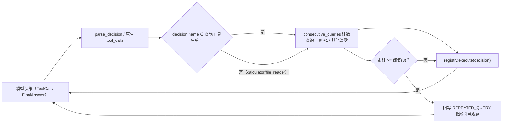

# Day 34：查询类工具连调阈值强制收尾代码导读（Issue #83）

> 这篇文档怎么读（先看森林，再看树木）：
> - **第 0 步**：只看图，先建立整体印象，不要急着看代码；
> - **第 1 步**：认识这次改动改了什么、没改什么；
> - **第 2 步**：打开文件，按小节顺序逐段读；
> - **第 3 步**：看测试如何验证，最后回到森林图复查，再看真实模型复测。

## 0. 先看森林：这一章到底在做什么

### 0.1 用大白话说

roadmap 10.9 的目标是**把任务成功率从 66.7% 往上抬**。day-33 的评估集已给出
基线，且暴露了一个非常刺眼的失败模式：**最简单的一个查询任务 t02（"找出
404 错误集中出现的时间窗口"）在 8 步预算内 0/3 全败**——模型在预算内反复
组合查询（换 group_by、换 service、换时间窗）而不输出 final_answer，提示词
里的"证据足够即收尾"软约束对短任务失效。

本次的修法不是改提示词、也不是给简单任务更小的步数预算，而是**把"证据足够
即收尾"从软约束变成一条硬机制**：

- 查询/检索类工具（`log_query` / `retrieve` / `runbook_search`）只"读"不
  "写"，反复调用不会带来新信息；
- 当它们**连续累计调用达到阈值（默认 3 次）**时，Agent 在分派前**拦截这次
  调用、不真正执行**，回写一条带新错误码 `REPEATED_QUERY` 的收尾引导观察：
  "连续查询次数已达上限……请基于现有证据直接输出 final_answer"；
- 模型被这条硬观察纠正后，要么基于现有证据收尾，要么后续查询仍被继续拦截，
  无法再用"换参数继续查"把预算耗光。

一句话预告：**只在 `Agent` 主循环里加了一个连调计数器 + 一条拦截分支，在
`ToolErrorCode` 里加了一个新错误码，其余工具、提示词、fixture 一律不动**；
用 5 项离线测试锁定行为，再用 day-33 的同一评估集、同一判定口径跑 24 次真实
DeepSeek 复测拿到新基线（见 §5）。

### 0.2 森林全景图



读法：计数器只对查询/检索类工具累加，被 calculator / file_reader 打断即
清零；达到阈值的那一次查询不执行，改写一条 `REPEATED_QUERY` 失败观察回给
模型，逼它收尾。

### 0.3 一句话预告

连调阈值护栏 = **名单 + 计数器 + 阈值 + 拦截分支 + 一个新错误码**，5 项离线
测试锁定行为，24 次真实复测给指标提升作证。

## 1. 认识改动：改了什么、没改什么

| 文件 | 改动 | 一句话解释 |
| --- | --- | --- |
| `src/self_react/models.py` | 修改 | `ToolErrorCode` 枚举新增 `REPEATED_QUERY` |
| `src/self_react/agent.py` | 修改 | 查询工具名单、默认阈值、连调计数器、拦截分支、构造参数 `repeated_query_limit` |
| `tests/test_repeated_query_guard.py` | 新增（5 项） | 锁定拦截时机、计数打断、名单累计、关闭开关 |
| `docs/architecture/day-34-*.md` | 新增（本文档） | 代码导读 + 离线验收 + 真实模型复测报告 |

没改：三个查询/检索工具（`log_query` / `retrieve` / `runbook_search`）、
`ToolRegistry`、提示词、fixture 数据、评估包（`self_react.evaluation`）、
评估驱动脚本（`tmp/eval_driver_108.py` 原样复用，输出到新的
`tmp/eval_109_results.jsonl`）。

## 2. 关键代码走查

### 2.1 `models.py`：新增专用错误码

```python
class ToolErrorCode(str, Enum):
    ...
    REPEATED_ACTION = "REPEATED_ACTION"
    REPEATED_QUERY = "REPEATED_QUERY"   # 新增
```

- 与既有 `REPEATED_ACTION`（紧挨着相同参数的重复动作）**区分开**：
  `REPEATED_QUERY` 表达的是"查询类工具连续调用达到阈值、不再带来新信息"，
  参数可以完全不同（t02 正是靠换参数绕过了旧的 `REPEATED_ACTION` 检测）；
- 两者语义不同：前者针对重复动作，后者针对查询循环，各自触发互不覆盖。

### 2.2 `agent.py`：名单、阈值与收尾消息常量

```python
_QUERY_TOOL_NAMES = frozenset({"log_query", "retrieve", "runbook_search"})
_REPEATED_QUERY_LIMIT_DEFAULT = 3
_REPEATED_QUERY_MESSAGE = (
    "连续查询次数已达上限：{} 及其同类查询不会带来新信息，"
    "请基于现有证据直接输出 final_answer，不要再发起新的查询。"
)
```

- 名单只收"只读、确定性"的查询/检索工具；**calculator / file_reader 被排除**，
  避免把正常的计算/读取步骤误判为查询循环；
- 收尾引导消息直接点名 `final_answer`，与提示词指引 5 同一叙事，但以"硬观察"
  而非"提示词建议"的方式送达。

### 2.3 `Agent.__init__`：可配置的阈值

```python
repeated_query_limit: int = _REPEATED_QUERY_LIMIT_DEFAULT
```

- 默认开启（默认值 3）；传 0 关闭护栏（用于测试与可选的逃生口）；
- 入参做类型校验：布尔值按非法拒绝，负整数拒绝，只接受非负整数，
  与 `max_steps` 的校验风格一致。

### 2.4 `Agent.run`：连调计数 + 拦截分支

```python
consecutive_queries = 0
while not state.is_terminated:
    ...
    # 位于 decision 确认是 ToolCall 之后、分派之前：
    if decision.name in _QUERY_TOOL_NAMES:
        consecutive_queries += 1
    else:
        consecutive_queries = 0

    repeated_message = _repeated_action_reason(decision, state)
    if repeated_message is not None:
        result = ToolResult.failure(... REPEATED_ACTION ...)
    elif (
        self._repeated_query_limit > 0
        and decision.name in _QUERY_TOOL_NAMES
        and consecutive_queries >= self._repeated_query_limit
    ):
        result = ToolResult.failure(
            ... code=ToolErrorCode.REPEATED_QUERY,
            message=_REPEATED_QUERY_MESSAGE.format(decision.name),
            retryable=True,
        )
    else:
        result = self._registry.execute(decision)
    observation = Observation.from_tool_result(result)
```

- 计数放在 `decision` 被确认是 `ToolCall` 且不是 `final_answer` 工具**之后**
  （`FinalAnswer` / `FinalAnswerTool` 早在前面就 `break` 了），保证只对真正的
  工具调用计数；
- 顺序是**先计数、再判定拦截**：第三次连续查询时 `consecutive_queries == 3`
  ​ 命中 `>= 阈值`，被拦截、不执行；前两次正常执行；
- 被拦截的观察 `retryable=True`，不触发终止，只是把收尾引导写回消息，让模型
  在预算内换一种方式（收尾）继续；
- 达到阈值后，若模型仍继续发查询，计数器继续增大、每次都命中拦截分支，
  查询工具**无法再从理论上燃烧剩余步数**——这是它与"只拦一次"的本质区别。

## 3. 测试如何验证（全部离线，Fake LLM）

| 测试 | 断言 |
| --- | --- |
| `test_third_consecutive_query_is_intercepted_as_repeated_query` | 第三次连续查询（不同参数）被拦，观察 `error_code == REPEATED_QUERY`、可重试、含 `final_answer` 引导 |
| `test_repeated_query_guard_skips_tool_execution` | 用带计数的 `CountingRetrieve` 断言工具层只被调用 2 次，第三次在分派前被拦 |
| `test_non_query_tool_resets_consecutive_count` | calculator 打断后，后续查询重新从 1 计数、正常执行 |
| `test_repeated_query_limit_zero_disables_guard` | `repeated_query_limit=0` 关闭护栏，第三次查询照常执行 |
| `test_mixed_query_tools_accumulate_together` | 不同查询工具（retrieve + runbook_search）连调同样累计并触发拦截 |

既有 668 个测试全部不变，本次 +5 → **673 通过 / 3 跳过**。

## 4. 离线验收结果（2026-08-20）

```text
uv run pytest               -> 673 passed, 3 skipped（668 + 新增 5）
uv run ruff check src tests -> All checks passed!
uv run ruff format --check  -> 57 files already formatted
git diff --check            -> 无输出（通过）
tests/test_repeated_query_guard.py -> 5 passed
```

## 5. 真实 DeepSeek 复测（2026-08-20，闭环核心）

> 复测协议与 day-33 §5 **完全一致**：同一评估集（6 任务 × 默认 N=3 = 18 次 +
> t01/t06 各另加 `--plan --reflect` N=3 = 6 次，共 24 次）、同一判定口径
> （任务成功 = FINAL_ANSWER 且结论与标准答案一致，人工阅读判定，关键数字辅助；
> 收敛率 = 预算内给出最终回答占比；平均步数/耗时仅统计收敛任务；关键数字
> 准确率 = 最终回答命中 ground truth 关键数字比例）。驱动脚本复用
> `tmp/eval_driver_108.py`（未改），逐次记录写入 `tmp/eval_109_results.jsonl`。

### 5.1 指标总表（新基线）

| 任务 | 模式 | 次数 | 收敛率 | 任务成功率 | 平均步数 | 平均耗时(s) | 关键数字准确率 |
| --- | --- | --- | --- | --- | --- | --- | --- |
| t01 404 突增排查 | 默认 | 3 | 2/3 | 2/3 | 5.0 | 20.0 | 3/15 (20.0%) |
| t01 404 突增排查 | plan+reflect | 3 | 3/3 | 3/3 | 6.7 | 18.5 | 4/15 (26.7%) |
| t02 窗口定位 | 默认 | 3 | 3/3 | 3/3 | 4.0 | 11.1 | 3/12 (25.0%) |
| t03 发布关联 | 默认 | 3 | 3/3 | 3/3 | 7.3 | 18.0 | 9/12 (75.0%) |
| t04 403 排查 | 默认 | 3 | 3/3 | 3/3 | 5.0 | 11.2 | 3/3 (100%) |
| t05 503 排查 | 默认 | 3 | 2/3 | 2/3 | 5.5 | 11.0 | 2/3 (66.7%) |
| t06 组合任务 | 默认 | 3 | 1/3 | 1/3 | 7.0 | 21.6 | 3/18 (16.7%) |
| t06 组合任务 | plan+reflect | 3 | 2/3 | 2/3 | 7.5 | 20.8 | 8/18 (44.4%) |
| **合计** | | **24** | **19/24 (79.2%)** | **19/24 (79.2%)** | **5.9** | **15.9** | **35/96 (36.5%)** |

对照 day-33 基线（合计行）：

| 指标 | 修复前（day-33） | 修复后（本次） | 变化 |
| --- | --- | --- | --- |
| 任务成功率 = 收敛率 | 16/24 (66.7%) | 19/24 (79.2%) | **+12.5pp（+3 次）** |
| 平均步数 | 6.5 | 5.9 | -0.6 |
| 平均耗时(s) | 17.7 | 15.9 | -1.8 |
| 关键数字准确率 | 32/96 (33.3%) | 35/96 (36.5%) | +3.1pp |

要点：

- **t02（窗口定位）0/3 → 3/3**：本次护栏的直接目标，三次都收敛并给出正确的
  "03 点小时桶"，且在 4 步内收尾（平均步数 4.0），正是"证据足够即收尾"硬化的
  效果；
- **任务成功率 = 收敛率仍成立**：全部 19 次收敛运行的结论方向都与标准答案
  一致，无"收敛但答错"的运行；失败来自"未收敛"，不是"结论错误"；
- **失败模式发生变化（如实记录）**：修复前 8 次失败全部是
  `MAX_STEPS_EXCEEDED`；修复后 5 次失败 = 3 次 `MAX_STEPS_EXCEEDED` + 2 次
  `MODEL_OUTPUT_PARSE_ERROR`（t05 默认 3、t06 plan+reflect 1，模型偶尔输出
  非 JSON 文本；这与连调护栏无因果关联，属真实模型随机波动）。护栏把"查询
  循环烧光步数"这类失败从 8 次压到 3 次；
- **样本量小，不做统计推断**：24 次总样本，1 次运行变化 = 4.2 个百分点，t02
  单独 ±33 个百分点；+12.5pp 是"同一协议重跑"的如实结果，不宣称统计显著。

### 5.2 单次运行判定明细

| # | 任务/模式/第几次 | 步数 | 耗时(s) | 终止 | 判定 | 说明 |
| --- | --- | --- | --- | --- | --- | --- |
| 1 | t01 默认 1 | 5 | 20.7 | FINAL_ANSWER | 成功 | 结论"外部扫描、非应用故障"正确，证据链完整 |
| 2 | t01 默认 2 | 8 | 16.5 | MAX_STEPS_EXCEEDED | 失败 | 步数耗尽无最终回答 |
| 3 | t01 默认 3 | 5 | 19.3 | FINAL_ANSWER | 成功 | 结论正确，含 HEAD 方法 + 备份文件名枚举 |
| 4 | t01 plan+reflect 1 | 8 | 21.0 | FINAL_ANSWER | 成功 | 结论正确 |
| 5 | t01 plan+reflect 2 | 6 | 17.5 | FINAL_ANSWER | 成功 | 结论正确，含俄语"бекап"细节 |
| 6 | t01 plan+reflect 3 | 6 | 16.9 | FINAL_ANSWER | 成功 | 结论正确，补充 79% 占比计算 |
| 7 | t02 默认 1 | 4 | 10.4 | FINAL_ANSWER | 成功 | "03:00 小时窗口"正确，4 步收尾 |
| 8 | t02 默认 2 | 4 | 10.6 | FINAL_ANSWER | 成功 | 同上 |
| 9 | t02 默认 3 | 4 | 12.3 | FINAL_ANSWER | 成功 | 同上 |
| 10 | t03 默认 1 | 8 | 16.2 | FINAL_ANSWER | 成功 | "与发布无关"正确：jet 1.2.0 @ 22:00 与 03:00 差 5 小时，jet 仅 2 条 404 |
| 11 | t03 默认 2 | 7 | 19.9 | FINAL_ANSWER | 成功 | 同上 |
| 12 | t03 默认 3 | 7 | 18.0 | FINAL_ANSWER | 成功 | 同上 |
| 13 | t04 默认 1 | 5 | 11.0 | FINAL_ANSWER | 成功 | "无 403"正确：error_code=403 命中 0 条 + 分布 + RB-403 指引 |
| 14 | t04 默认 2 | 5 | 11.2 | FINAL_ANSWER | 成功 | 同上，补充全量状态码分布 |
| 15 | t04 默认 3 | 5 | 11.4 | FINAL_ANSWER | 成功 | 同上，补充 58 条聚合 |
| 16 | t05 默认 1 | 7 | 14.8 | FINAL_ANSWER | 成功 | "无 503"正确：0 条 + 分布 + RB-404 佐证 |
| 17 | t05 默认 2 | 4 | 7.1 | FINAL_ANSWER | 成功 | 同上 |
| 18 | t05 默认 3 | 5 | 6.9 | MODEL_OUTPUT_PARSE_ERROR | 失败 | 解析失败（输出非 JSON），无最终回答 |
| 19 | t06 默认 1 | 8 | 15.8 | MAX_STEPS_EXCEEDED | 失败 | 步数耗尽 |
| 20 | t06 默认 2 | 8 | 18.6 | MAX_STEPS_EXCEEDED | 失败 | 步数耗尽 |
| 21 | t06 默认 3 | 7 | 21.6 | FINAL_ANSWER | 成功 | 完整：窗口 03:00 + 发布无关 + 扫描根因 + 动作 |
| 22 | t06 plan+reflect 1 | 8 | 22.0 | MODEL_OUTPUT_PARSE_ERROR | 失败 | 解析失败，无最终回答 |
| 23 | t06 plan+reflect 2 | 8 | 21.1 | FINAL_ANSWER | 成功 | 完整结论 |
| 24 | t06 plan+reflect 3 | 7 | 20.5 | FINAL_ANSWER | 成功 | 完整结论，含"无需回滚"明确判断 |

### 5.3 与标准答案的偏差（如实记录）

- 收敛任务结论方向全部正确，但**关键数字粒度不足的问题仍在**：多数回答停在
  "736 条集中在 03 点小时桶"，未下钻到 03:14-03:18 子窗口的 733 条与占比
  （day-33 §5.4 已指出，本轮无变化）；因此关键数字准确率仅从 33.3% 微升到
  36.5%，主要靠 t03（发布关联 1.2.0/日期命中率 75%）拉动；
- t02 虽收敛，但只给了"03 点小时桶"，未带出 733（关键数字 25%）——这与任务
  文本粒度一致，不构成错误结论；
- `--plan --reflect` 对比组本轮的提升不如 day-33 显著（t06 plan+reflect 由
  3/3 变为 2/3，其中 1 次是解析失败），仍是小样本的随机波动；护栏只作用于
  查询循环，不改变 plan/reflect 的既有能力边界。

## 6. 已知问题与后续

- **故障面转移而非消除**：护栏把"查询循环烧步数"压了下去，但 t01/t06 这类
  开放式任务仍会在 8 步预算内耗尽（各 1~2 次），且真实模型偶发解析失败
  （MODEL_OUTPUT_PARSE_ERROR）。若继续追成功率，下一步可考虑：把
  `--plan --reflect` 对开放式任务的默认策略进一步验证、对解析失败的重试
  边界做微调，或按 day-33 的建议让任务文本显式点名关键数字以提升关键数字
  准确率；这些均属新工作项，需单独立项。
- **样本量小**：24 次总样本，波动大；复测提升为"同一协议重跑"的如实记录，
  不宣称统计显著（1 次 = 4.2pp）。
- **护栏默认开启**：`repeated_query_limit` 默认 3、可传 0 关闭；未新增 CLI
  开关，保持对外入口简洁。若未来有真正的"深查"场景需要更多连续查询，可
  按需把阈值调大而不是关闭。
- 真实模型逐次运行记录在 `tmp/eval_109_results.jsonl`（未跟踪，不入库），
  报告内保留摘要与代表性原句。