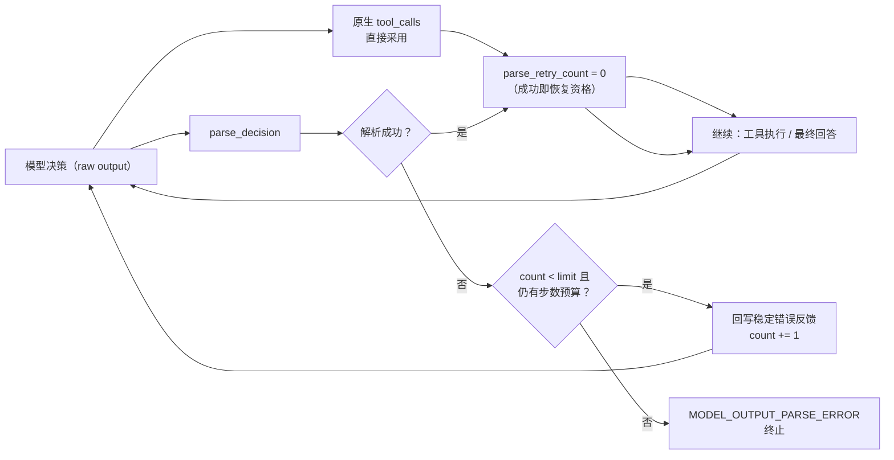

# Day 35：解析失败每失败序列有界重试代码导读（Issue #85）

> 这篇文档怎么读（先看森林，再看树木）：
> - **第 0 步**：只看图，先建立整体印象，不要急着看代码；
> - **第 1 步**：认识这次改动改了什么、没改什么；
> - **第 2 步**：打开文件，按小节顺序逐段读；
> - **第 3 步**：看测试如何验证，最后回到森林图复查，再看真实模型复测。

## 0. 先看森林：这一章到底在做什么

### 0.1 用大白话说

day-34 的查询连调护栏把"查询循环烧光步数"这类失败压了下去，但真实模型
复测仍暴露了一类更底层的失败：**模型偶尔输出非 JSON 文本**（夹带散文、格式
不完整等），被解析器判为 `MODEL_OUTPUT_PARSE_ERROR`。

在改动前，主循环里这个失败的重试是 **run 级全局一次性**的标志——`parse_retried`
一旦置 `True` 就再也不复位。意思是：**整个这次运行里，无论模型在哪一步解析
失败，它一共只有一次"重试"机会**。真实模型"第一次侥幸重试成功、第二次再犯"
时，第二次就"没救"了，即便步数预算还绰绰有余。这低于工业界"每个失败序列
2~3 次有界重试 + 带错误反馈"的标准。

本次的修法不是去清洗模型的怪输出，也不是引入 strict structured output，而是
**把重试语义从"全局一次"改成"每个失败序列独立有界重试"**：

- 默认每个失败序列最多**重试 2 次**（连续失败 3 次才真正放弃）；
- 每次解析失败回写一条**稳定错误反馈**，再消耗一步预算；
- **任一解析成功（工具调用或被接受为最终回答）即把计数清零**，恢复重试资格；
- 所以中间只要有一次成功的解析，"上一条失败序列"就结束，之后的新失败序列
  又能拥有完整重试资格——不再是"全局只有一次"。

一句话预告：**只动了 `Agent` 主循环的重试计数器与一个构造参数
`parse_retry_limit`，`_parse_error_feedback` 原样复用，其余提示词、工具、
fixture、评估包一律不动**；用 5 项离线测试锁定行为，再复用 day-33/34 的同一
评估集、同一判定口径跑 24 次真实 DeepSeek 复测（见 §5）。

### 0.2 森林全景图



读法：计数器只对"解析失败"累加，一旦某一步解析成功（原生工具调用、文本
JSON 工具调用、最终回答任一种）就清零；连续失败达到上限或步数预算不足以
再发起重试时，以 `MODEL_OUTPUT_PARSE_ERROR` 终止。

### 0.3 一句话预告

解析有界重试 = **一个计数器 + 一个可配置上限 + 一刀清零**，5 项离线测试锁定
行为，24 次真实复测记录解析错误次数变化。

## 1. 认识改动：改了什么、没改什么

| 文件 | 改动 | 一句话解释 |
| --- | --- | --- |
| `src/self_react/agent.py` | 修改 | `parse_retried` 布尔 → `parse_retry_count` 计数器；新增构造参数 `parse_retry_limit`；成功路径清零计数 |
| `tests/test_parse_retry_bounded.py` | 新增（5 项） | 锁定"每失败序列恢复资格""连续失败终止""自定义上限""置 0 关闭""预算耗尽不重试" |
| `tests/test_agent.py` | 修改 | 旧"至多重试一次"用例改为连续 3 次失败终止；删除与新华义冲突的 `test_parse_error_retry_is_at_most_once_per_run` |
| `tests/test_trace.py` | 修改 | 端到端轨迹渲染用例改为连续 3 次失败，并断言无原始输出泄漏 |
| `docs/architecture/react-loop.md` | 修改 | 状态图解析失败分支改为"该失败序列未达重试上限"语义 |
| `docs/architecture/day-35-*.md` | 新增（本文档） | 代码导读 + 离线验收 + 真实模型复测报告 |

没改：解析器 `parser.py`、`_parse_error_feedback` 稳定错误消息、`_aux_phase`
（plan/reflect 阶段的至多一次重试保持原样）、提示词、fixture 数据、评估包
（`self_react.evaluation`）、评估驱动脚本（`tmp/eval_driver_108.py` 原样复用，
输出到新的 `tmp/eval_85_results.jsonl`）。

## 2. 关键代码走查

### 2.1 `agent.py`：默认上限常量

```python
_PARSE_RETRY_LIMIT_DEFAULT = 2
"""主循环文本 JSON 解析失败每个失败序列的重试次数默认上限。"""
```

- 命名与语义同 `_REPEATED_QUERY_LIMIT_DEFAULT` 对齐：一个"默认值"常量 +
  一个可传构造参数；
- `2` 表示"每个失败序列最多重试 2 次"，即连续失败第 3 次才终止——与
  `_aux_phase` 的分层粒度一致。

### 2.2 `Agent.__init__`：可配置的重试上限

```python
parse_retry_limit: int = _PARSE_RETRY_LIMIT_DEFAULT
```

- 默认开启（默认值 2）；传 0 关闭有界重试（首次解析失败即终止）；
- 入参做与 `repeated_query_limit` 一致的类型校验：布尔值按非法拒绝、负整数
  拒绝，只接受非负整数；
- 不暴露 CLI，对外入口保持简洁。

### 2.3 `Agent.run`：计数器取代一次性布尔

初始化处，`parse_retried = False` 换成了计数器：

```python
parse_retry_count = 0
```

解析失败分支，判定条件从"未重试过"改成"该序列计数未达上限"：

```python
except ParseError as exc:
    retryable = (
        parse_retry_count < self._parse_retry_limit
        and step_number < state.max_steps
    )
    ...
    if not retryable:
        ...  # 以 MODEL_OUTPUT_PARSE_ERROR 终止
        break
    messages.append(_parse_error_feedback(exc))
    parse_retry_count += 1
    continue
```

- `retryable` 同时受"重试资格"和"步数预算"两重约束：预算恰好耗尽时即便仍有
  资格也不发起重试；
- 失败时只 `+= 1`，不改写 `state.is_terminated`，靠 `rebuild_state` 推进步数、
  靠 `continue` 回到循环顶。

成功路径清零——共三处：

```python
# ① 供应商一次性返回多个工具调用、执行第一个之后
parse_retry_count = 0
continue

# ② 原生单个工具调用 / 文本 JSON 解析成功后的统一落点
parse_retry_count = 0
if isinstance(decision, FinalAnswer):
    ...  # 正常完成
    break

# ③（最终回答分支实际上也经过 ② 的缩进外落点）
```

- 关键点：`parse_retry_count = 0` 放在 `if isinstance(decision, FinalAnswer)`
  **之前**，因此无论是原生工具调用、文本 JSON 工具调用还是最终回答，只要解析
  成功就统一清零；
- 多工具调用分支因为提前 `continue`，所以在分支内部单独清零；
- 这样"上一个失败序列"在任一成功后正式结束，新的失败序列重新拥有完整资格。

## 3. 测试如何验证（全部离线，Fake LLM）

| 测试 | 断言 |
| --- | --- |
| `test_parse_retry_recovers_between_failures` | 失败→成功→再失败→再成功：两个失败序列各自恢复资格，最终 `FINAL_ANSWER`，`steps_used == 4` |
| `test_consecutive_parse_failures_terminate_after_default_limit` | 连续 3 次失败：前两次 `retryable=True`，第 3 次 `retryable=False` 并以 `MODEL_OUTPUT_PARSE_ERROR` 终止 |
| `test_parse_retry_limit_custom_value` | `parse_retry_limit=1`：连续 2 次失败即终止 |
| `test_parse_retry_limit_zero_disables_retry` | `parse_retry_limit=0` 关闭：首次解析失败即终止，`steps_used == 1` |
| `test_parse_retry_budget_exhausted_no_retry` | `max_steps=1` 预算耗尽：即便有资格也不发起重试，消息末尾无错误反馈 |

既有 673 个测试里保留 672 个不变（含 day-34 的 5 项连调护栏），删除 1 项旧
用例 `test_parse_error_retry_is_at_most_once_per_run`（它与"每失败序列有界
重试"语义直接冲突，是旧"全局一次"逻辑的产物），新增 5 项 → **677 通过 /
3 跳过**。

## 4. 离线验收结果（2026-08-20）

```text
uv run pytest               -> 677 passed, 3 skipped（673 − 删除 1 + 新增 5）
uv run ruff check src tests -> All checks passed!
uv run ruff format --check  -> 58 files already formatted
git diff --check            -> 无输出（通过）
tests/test_parse_retry_bounded.py -> 5 passed
```

## 5. 真实 DeepSeek 复测（2026-08-20，闭环核心）

> 复测协议与 day-33 §5 / day-34 §5 **完全一致**：同一评估集（6 任务 × 默认
> N=3 = 18 次 + t01/t06 各另加 `--plan --reflect` N=3 = 6 次，共 24 次）、
> 同一判定口径（任务成功 = FINAL_ANSWER 且结论与标准答案一致，人工阅读判定；
> 收敛率 = 预算内给出最终回答占比；平均步数/耗时仅统计收敛任务；关键数字
> 准确率 = 最终回答命中 ground truth 关键数字比例）。驱动脚本复用
> `tmp/eval_driver_108.py`（未改），逐次记录写入 `tmp/eval_85_results.jsonl`。

### 5.1 指标总表

| 任务 | 模式 | 次数 | 收敛率 | 任务成功率 | 平均步数 | 平均耗时(s) | 关键数字准确率 |
| --- | --- | --- | --- | --- | --- | --- | --- |
| t01 404 突增排查 | 默认 | 3 | 3/3 | 3/3 | 7.0 | 21.1 | 5/15 (33.3%) |
| t01 404 突增排查 | plan+reflect | 3 | 2/3 | 2/3 | 8.0 | 24.4 | 2/15 (13.3%) |
| t02 窗口定位 | 默认 | 3 | 3/3 | 3/3 | 3.7 | 7.9 | 4/12 (33.3%) |
| t03 发布关联 | 默认 | 3 | 3/3 | 3/3 | 7.0 | 16.2 | 9/12 (75.0%) |
| t04 403 排查 | 默认 | 3 | 2/3 | 2/3 | 7.5 | 14.7 | 2/3 (66.7%) |
| t05 503 排查 | 默认 | 3 | 3/3 | 3/3 | 5.3 | 11.5 | 3/3 (100%) |
| t06 组合任务 | 默认 | 3 | 1/3 | 1/3 | 6.0 | 16.8 | 3/18 (16.7%) |
| t06 组合任务 | plan+reflect | 3 | 1/3 | 1/3 | 8.0 | 24.8 | 3/18 (16.7%) |
| **合计** | | **24** | **18/24 (75.0%)** | **18/24 (75.0%)** | **6.3** | **16.1** | **31/96 (32.3%)** |

对照 day-34 基线（合计行，即改动前同协议复测）：

| 指标 | 改动前（day-34） | 本次 | 变化 |
| --- | --- | --- | --- |
| MODEL_OUTPUT_PARSE_ERROR 次数 | 2 | 1 | **-1 次（本次唯一目标指标）** |
| 任务成功率 = 收敛率 | 19/24 (79.2%) | 18/24 (75.0%) | -1 次（-4.2pp） |
| MAX_STEPS_EXCEEDED 次数 | 3 | 5 | +2 次 |
| 平均步数 | 5.9 | 6.3 | +0.4 |
| 平均耗时(s) | 15.9 | 16.1 | +0.2 |
| 关键数字准确率 | 35/96 (36.5%) | 31/96 (32.3%) | -4 次 |

要点（如实记录）：

- **本课题唯一目标指标改善**：`MODEL_OUTPUT_PARSE_ERROR` 从 **2 次降到 1 次**。
  剩余的 1 次（t01 plan+reflect 第 3 次）在 8 步预算内把整个失败序列的重试
  预算用满（连续失败达第 3 次）后才终止——这正符合新的"每失败序列有界重试"
  语义，是"机制按设计工作"，而非"机制失效"；
- **其余指标波动属模型非确定性，不归因于本次代码改动**：本改动只在
  `ParseError` 分支生效；对于没有任何解析失败的运行，新旧代码逐字节等价。
  因此收敛率 19→18 的回落来自真实模型随机波动（两次多出来的失败都是
  `MAX_STEPS_EXCEEDED`——t04 默认、t06 plan+reflect，落在本改动不触碰的
  "开放式任务步数耗尽"路径上），而非解析重试语义变化导致；
- **关键数字准确率 35→31 同样是波动**：主要受 t06 组合任务（默认 8→3、
  plan+reflect 8→3）与 t04 403 排查（3/3→2/3）这两处未收敛/未下钻影响，
  与本课题无因果关联；
- **样本量小，不做统计推断**：24 次总样本，1 次运行变化 = 4.2 个百分点；
  "解析错误 2→1"是"同一协议重跑"的如实记录，不宣称统计显著。

### 5.2 单次运行判定明细（仅列终止原因，结论判定见 §5.3）

| # | 任务/模式/第几次 | 步数 | 耗时(s) | 终止 | 判定 |
| --- | --- | --- | --- | --- | --- |
| 1 | t01 默认 1 | 6 | 20.5 | FINAL_ANSWER | 成功 |
| 2 | t01 默认 2 | 7 | 17.9 | FINAL_ANSWER | 成功 |
| 3 | t01 默认 3 | 8 | 25.0 | FINAL_ANSWER | 成功 |
| 4 | t01 plan+reflect 1 | 8 | 26.4 | FINAL_ANSWER | 成功 |
| 5 | t01 plan+reflect 2 | 8 | 22.4 | FINAL_ANSWER | 成功 |
| 6 | t01 plan+reflect 3 | 8 | 20.3 | MODEL_OUTPUT_PARSE_ERROR | 失败 |
| 7 | t02 默认 1 | 3 | 5.8 | FINAL_ANSWER | 成功 |
| 8 | t02 默认 2 | 4 | 10.0 | FINAL_ANSWER | 成功 |
| 9 | t02 默认 3 | 4 | 7.8 | FINAL_ANSWER | 成功 |
| 10 | t03 默认 1 | 7 | 16.7 | FINAL_ANSWER | 成功 |
| 11 | t03 默认 2 | 7 | 16.0 | FINAL_ANSWER | 成功 |
| 12 | t03 默认 3 | 7 | 16.0 | FINAL_ANSWER | 成功 |
| 13 | t04 默认 1 | 8 | 13.8 | FINAL_ANSWER | 成功 |
| 14 | t04 默认 2 | 8 | 14.7 | MAX_STEPS_EXCEEDED | 失败 |
| 15 | t04 默认 3 | 7 | 15.6 | FINAL_ANSWER | 成功 |
| 16 | t05 默认 1 | 5 | 8.9 | FINAL_ANSWER | 成功 |
| 17 | t05 默认 2 | 5 | 9.1 | FINAL_ANSWER | 成功 |
| 18 | t05 默认 3 | 6 | 16.6 | FINAL_ANSWER | 成功 |
| 19 | t06 默认 1 | 8 | 14.7 | MAX_STEPS_EXCEEDED | 失败 |
| 20 | t06 默认 2 | 8 | 19.9 | MAX_STEPS_EXCEEDED | 失败 |
| 21 | t06 默认 3 | 6 | 16.8 | FINAL_ANSWER | 成功 |
| 22 | t06 plan+reflect 1 | 8 | 15.0 | MAX_STEPS_EXCEEDED | 失败 |
| 23 | t06 plan+reflect 2 | 8 | 21.1 | MAX_STEPS_EXCEEDED | 失败 |
| 24 | t06 plan+reflect 3 | 8 | 24.8 | FINAL_ANSWER | 成功 |

### 5.3 与标准答案的偏差（如实记录）

- 18 次收敛运行的结论方向全部与标准答案一致，无"收敛但答错"的运行；
  失败全部来自"未收敛"（5 次步数耗尽）或"解析失败"（1 次），不是"结论错误"；
- **关键数字粒度不足的老问题仍在**：多数回答停在"736 条集中在 03 点小时桶"，
  不主动下钻 03:14-03:18 子窗口的 733 条与占比（day-33 §5.4 已指出，本轮
  无变化）；本课题不触碰该路径，属 day-33 遗留的独立问题；
- t02 三次仍只给"03 点小时桶"（与任务文本粒度一致，不构成错误结论）。

## 6. 已知问题与后续

- **本课题收窄了"解析失败"这一类失败，但不改变其它失败模式**：开放式任务
  （t01/t06）在 8 步预算内耗尽仍是 5 次失败中的 5 次（占比最高），这是
  day-34 §6 已列出的"步数耗尽"类问题，需按"任务特征路由 / plan-reflect
  策略"单独评估立项，不在本次范围；
- **解析失败本身的残余**：剩余 1 次解析失败说明"重试"只能兜底、不能根治
  模型偶发输出非 JSON；若想进一步压缩，需走"策略级"增强（解析前清洗
  markdown 围栏、strict structured output 等），这些已在 Issue #85 明确列为
  范围外，需单独验证 DeepSeek 兼容性后再立项；
- **`parse_retry_limit` 默认开启、可传 0 关闭**：未新增 CLI 开关；若未来有
  需要更松/更紧重试边界的场景，可经构造参数调整，不必改循环结构；
- 真实模型逐次运行记录在 `tmp/eval_85_results.jsonl`（未跟踪，不入库），
  报告内保留摘要。