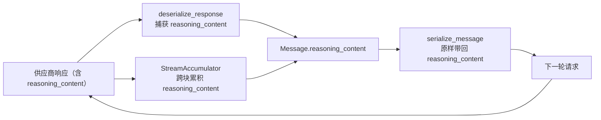

# Day 36：DeepSeek 思考模式与 reasoning_content 完整往返代码导读（Issue #88）

> 这篇文档怎么读（先看森林，再看树木）：
> - **第 0 步**：只看图，先建立整体印象，不要急着看代码；
> - **第 1 步**：认识这次改动改了什么、没改什么；
> - **第 2 步**：打开文件，按小节顺序逐段读；
> - **第 3 步**：看测试如何验证，最后回到森林图复查，再看真实模型验收。

## 0. 先看森林：这一章到底在做什么

### 0.1 用大白话说

R-01 起，DeepSeek 适配器就有一个保守默认值：**关闭思考模式**
（`DEFAULT_THINKING_DISABLED = True`，每次请求带
`extra_body={"thinking": {"type": "disabled"}}`）。当时的理由写得很清楚——
思考模式会在响应里多返回一个 `reasoning_content`（思考过程），而 DeepSeek
要求后续请求把它**原样传回**；本项目按 Day 10 契约只保留模型输出的 JSON
决策，没有地方存这块内容，又无法保证它在多轮工具调用里完整往返，于是宁可
关闭，避免“多轮调用被 API 拒绝”。

这个保守取舍换来的代价是：**模型全程不做深度思考**，对需要多步推理、多维度
证据收口的开放式任务而言，少了那一段“先在脑子里盘一遍再动手”的过程。

本次把这块补上，方向是“打开思考模式，并让 `reasoning_content` 成为一等公民
完整往返”：

- 领域模型 `Message` 新增 `reasoning_content` 字段（只允许出现在 assistant
  消息）；
- 请求序列化时把它原样带回、响应反序列化时把它捕获、流式路径跨块累积后
  同样写回；
- 适配器默认值从“禁用思考”翻转为“启用思考”（`thinking_enabled=True`），
  并保留 `thinking_enabled=False` 的关灯开关。

一句话预告：**只动了 `models.py`、`openai_compat.py`、`llm.py`、
`deepseek.py` 四个源文件与两个测试文件；提示词、工具、fixture、评估包、
Agent 主循环一律不动**。用 3 项新增离线测试锁定行为，再做真实 DeepSeek
非流式与流式两条路径的手动验收（见 §5）。

### 0.2 森林全景图



读法：一条消息的 `reasoning_content` 在“反序列化/流式累积 → 领域 Message →
再序列化”这条链路里完整往返，不再被丢弃；这也是思考模式能被安全打开的前提。

### 0.3 一句话预告

思考模式 = **一个开关翻转 + `reasoning_content` 从“被丢弃”升级为“完整往返”**，
3 项新增离线测试锁定行为，非流式/流式两条真实路径各复测一次。

## 1. 认识改动：改了什么、没改什么

| 文件 | 改动 | 一句话解释 |
| --- | --- | --- |
| `src/self_react/models.py` | 修改 | `Message` 新增 `reasoning_content: str \| None = None`，校验只允许 assistant 携带 |
| `src/self_react/openai_compat.py` | 修改 | 序列化/反序列化/流式累积三处补上 `reasoning_content` 处理 |
| `src/self_react/llm.py` | 修改 | `StreamChunk` 增 `reasoning_content` 字段；`collect_stream` 组装进最终消息 |
| `src/self_react/deepseek.py` | 修改 | `DEFAULT_THINKING_DISABLED` → `DEFAULT_THINKING_ENABLED`；构造参数 `thinking_disabled` → `thinking_enabled`；默认发 `{"thinking":{"type":"enabled"}}` |
| `tests/test_deepseek.py` | 修改 + 新增 2 项 | 改默认启用断言、改流式累积断言；新增反序列化捕获、串行回传两项 |
| `tests/test_models.py` | 新增 1 项 | 锁定 `reasoning_content` 只能出现在 assistant 消息 |

没改：`parser.py`、`agent.py` 主循环、提示词、工具与注册表、fixture 数据、
`self_react.evaluation` 评估包、以及 `openai.py`（OpenAI 原生适配器不涉及
思考模式，`extra_body` 仍为 `None`）。

## 2. 关键代码走查

### 2.1 `models.py`：Message 新增 reasoning_content

```python
reasoning_content: Annotated[str | None, Field(strict=True)] = None
```

配套校验（`validate_role_payload` 顶部）：

```python
if (
    self.reasoning_content is not None
    and self.role is not MessageRole.ASSISTANT
):
    raise ValueError("reasoning_content 只能出现在 assistant 消息中")
```

- 用 `None` 表示“没有思考过程”，与 `content`（必填非空）区分开；
- 只有 assistant 能带思考过程，与 `tool_calls` 的归属约束保持同构。

### 2.2 `openai_compat.py`：三段式往返

序列化——assistant 消息带非空 `reasoning_content` 时原样写入 payload：

```python
if message.role is MessageRole.ASSISTANT:
    if message.tool_calls:
        payload["tool_calls"] = [...]
    if message.reasoning_content:
        payload["reasoning_content"] = message.reasoning_content
```

反序列化——从响应消息里读取，并把空串规范成 `None`：

```python
reasoning_content = _field(raw_message, "reasoning_content", None)
if reasoning_content is not None and not isinstance(reasoning_content, str):
    raise LLMResponseError("供应商响应 message.reasoning_content 必须是字符串或 null")
if reasoning_content == "":
    reasoning_content = None
```

流式累积——`StreamAccumulator.feed` 逐块追加，`message()` 拼回：

```python
reasoning = _field(raw_delta, "reasoning_content", None)
if reasoning is not None:
    if not isinstance(reasoning, str):
        raise LLMResponseError("流式响应 delta.reasoning_content 必须是字符串或 null")
    self._reasoning_parts.append(reasoning)
```

### 2.3 `llm.py`：StreamChunk 与 collect_stream 接上流式链路

`StreamChunk` 增字段，`collect_stream` 把各块的 `reasoning_content` 拼回：

```python
reasoning_content: str = ""

# collect_stream 内：
reasoning_parts.append(chunk.reasoning_content)
...
reasoning_content="".join(reasoning_parts) or None,
```

- 流式下 `reasoning_content` 只在末尾块完整携带，`collect_stream` 是它进入
  领域 Message 的唯一入口；漏掉这里会像改动前那样在流式路径被丢弃。

### 2.4 `deepseek.py`：默认启用思考模式

```python
DEFAULT_THINKING_ENABLED = True

# 构造参数
thinking_enabled: bool = DEFAULT_THINKING_ENABLED

# 请求体
extra_body: dict[str, Any] = {
    "thinking": {"type": "enabled" if self.thinking_enabled else "disabled"}
}
```

- 默认打开思考；传 `thinking_enabled=False` 仍可关闭（发 `disabled`）；
- 语义命名从“是否禁用”翻转为“是否启用”，让默认值 `True` 读起来顺理成章。

## 3. 测试如何验证（全部离线，Fake LLM）

| 测试 | 断言 |
| --- | --- |
| `test_message_reasoning_content_only_allowed_on_assistant` | assistant 可携带；user/tool 携带抛 `ValidationError` |
| `test_deepseek_deserializes_reasoning_content_into_message` | 响应含 `reasoning_content` 时写回 `Message.reasoning_content` |
| `test_deepseek_serializes_reasoning_content_back_on_assistant_message` | assistant 消息带思考过程时，请求 payload 原样回传该字段 |
| `test_deepseek_complete_stream_accumulates_reasoning_content_delta` | 流式跨块思考增量累积并写回（原“忽略”断言改为“累积”） |
| `test_deepseek_thinking_can_be_disabled_explicitly` | `thinking_enabled=False` 时请求携带 `{"type":"disabled"}` |

既有 677 个测试里保留 677 个不变，新增 3 项 → **680 通过 / 3 跳过**（净增 3）。

## 4. 离线验收结果（2026-08-20）

```text
uv run pytest               -> 680 passed, 3 skipped（677 + 新增 3）
uv run ruff check src tests -> All checks passed!
uv run ruff format --check  -> 58 files already formatted
git diff --check            -> 通过
```

## 5. 真实 DeepSeek 手动验收（2026-08-20）

### 5.1 协议行为实测（抛根问底）

用机器级 `DEEPSEEK_API_KEY` 直连官方 `api.deepseek.com`、模型
`deepseek-v4-flash`，临时脚本实测（脚本不保留，结论记录于此）：

- 发 `{"thinking":{"type":"enabled"}}` 时响应稳定携带 `reasoning_content`
  （简单题约 19 字符、带工具调用约 86 字符）；
- 多轮工具调用的第二轮，**回传与不回传 `reasoning_content` 均能正常收敛**
  （官方当前不强制回传），但本例仍实现完整往返，保证以后切到更严格的推理
  模型也不被“必须回传”卡住。

### 5.2 端到端验收

```text
# 非流式 + 多工具 + 规划：验证多轮工具调用中 reasoning_content 往返不报错
uv run self-react run "计算 2 + 2，并检索 react 主题" --model deepseek --plan --show-trace
    -> 步数 4/5，FINAL_ANSWER，exit 0；calculator + retrieve 两步工具调用均成功

# 流式 + 单工具：验证流式组装路径
uv run self-react run "计算 2 + 2" --model deepseek --show-trace --stream
    -> 步数 1/5，FINAL_ANSWER，exit 0
```

两条路径（非流式、流式）均在思考模式开启下正常收敛，`reasoning_content`
往返未引发任何 `MODEL_OUTPUT_PARSE_ERROR` 或供应商拒绝。

## 6. 已知问题与后续

- **思考内容未进入 trace/日志**：`reasoning_content` 只在消息上下文里往返，
  刻意不写进 `TraceStep.input_summary`（保持“只摘要、不默认保存完整隐藏
  推理”的既有约定）；
- **默认开启带来的成本/延迟上升**：思考模式会在响应里多产出 `reasoning_content`
  tokens，简单任务延迟上升（验收中单工具任务约 2.8s）。若后续需要“简单任务
  关思考、复杂任务开思考”的路由，可复用现有 `thinking_enabled` 开关，不必改
  循环结构；
- **其它失败模式不受影响**：本改动不触碰开放式任务步数耗尽（t01/t06）、关键
  数字下钻不足等 day-34/day-35 已列出的独立问题，这些仍需按
  `docs/handoff/next-session.md` §三的 A/B 单独立项。