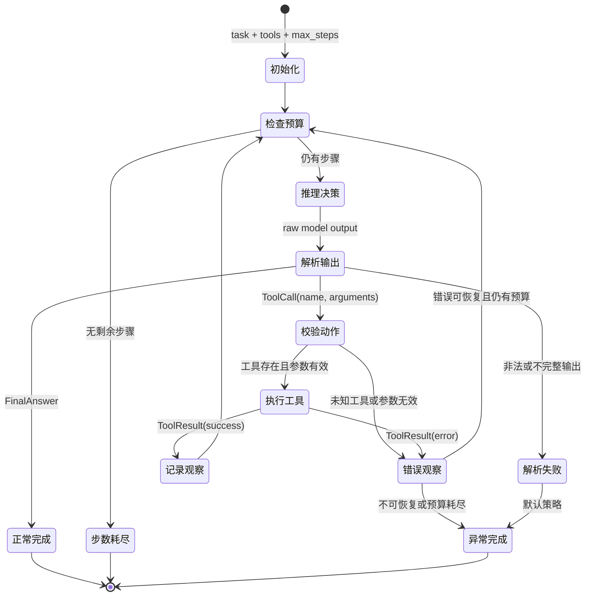

# ReAct 核心循环与实现边界

> 调研日期：2026-08-01
> 适用范围：Self-ReAct 的最小单智能体实现
> 来源原则：论文原文、论文作者仓库、LangChain/LangGraph 官方文档与源码

## 结论

ReAct（Reason + Act）不是某个固定的提示词格式，而是一种让模型推理与外部行动交错进行的控制范式。论文把语言形式的推理轨迹与任务动作放在同一条轨迹中：推理用于形成、跟踪和调整行动计划，任务动作改变外部环境或获取外部信息，环境返回的 Observation（观察）又成为下一次决策的上下文。模型可以继续行动，也可以给出最终答案。[ReAct 论文摘要与第 2 节](https://arxiv.org/abs/2210.03629)

对本项目而言，最小闭环应显式表现为：

```text
任务输入
  -> 根据当前状态推理/决策
  -> 解析为“工具动作”或“最终回答”
  -> 校验并执行工具动作
  -> 将工具结果转换为观察并写回状态
  -> 进入下一轮决策，或以明确原因终止
```

论文中的 `Thought` 是不直接改变环境的语言动作，`Action` 才作用于外部环境；两者不应在工程上混成一次不可检查的副作用。成熟框架也未必暴露逐字的 Thought，它可以只把模型决策表示为结构化 `tool_calls` 或最终消息。需要保留的是“基于状态做决策 -> 执行动作 -> 回写观察”的语义，而不是强制模型输出隐藏推理过程。[ReAct 论文第 2 节](https://arxiv.org/abs/2210.03629)；[LangChain Agents 文档](https://docs.langchain.com/oss/python/langchain/agents)

## 论文中的 ReAct

论文将智能体与环境的交互描述为一条由观察和动作构成的轨迹。传统行动只会作用于环境；ReAct 额外允许模型生成自然语言“思考”，这种语言动作不会直接改变环境，而是把新的推理内容加入当前上下文，供后续行动参考。作者在知识密集型任务中使用 `Thought -> Action -> Observation` 的密集交错轨迹，在决策任务中则允许只在需要规划或处理例外时稀疏地产生 Thought。[ReAct 论文第 2 节](https://arxiv.org/abs/2210.03629)

论文摘要强调两类互补作用：

- 推理轨迹帮助模型归纳、跟踪和更新行动计划，并处理行动过程中的异常。
- 动作让模型与外部来源交互，从而获得当前上下文中没有的新信息。

因此，Observation 不是调试日志，而是下一轮模型输入的一部分；如果工具结果没有回写给模型，闭环就被截断了。[ReAct 论文摘要](https://arxiv.org/abs/2210.03629)

## 完整状态流



这个状态图是本项目的工程化解释，不是论文规定的唯一实现。原始 `ysymyth/ReAct` 在 HotpotQA notebook 中用固定轮数循环，把每轮 `Thought`、`Action` 和环境返回的 `Observation` 拼回提示词，并在 `finish[...]` 动作出现时退出；其 Wiki 环境只接受任务定义的 `search[...]`、`lookup[...]` 和 `finish[...]` 动作。[作者仓库 README](https://github.com/ysymyth/ReAct/blob/master/README.md)；[HotpotQA notebook](https://github.com/ysymyth/ReAct/blob/master/hotpotqa.ipynb)；[Wiki 环境源码](https://github.com/ysymyth/ReAct/blob/master/wikienv.py)

## 阶段、输入输出与职责边界

| 阶段 | 输入 | 输出 | 只负责 | 不负责 |
| --- | --- | --- | --- | --- |
| 初始化 | `task`、工具清单、`max_steps`、运行配置 | 初始 `AgentState` | 保存原始任务，初始化消息、轨迹和步数 | 调模型、执行工具 |
| 推理/决策 | 当前消息与观察、可用工具描述 | 原始模型输出 | 请求模型基于当前状态选择下一步 | 猜测或补造工具结果 |
| 解析 | 原始模型输出 | `FinalAnswer` 或结构化 `ToolCall`，或 `ParseError` | 做语法、字段和类型校验 | 查找工具、执行工具、吞掉非法输出 |
| 工具解析与分派 | `ToolCall`、`ToolRegistry` | 已选工具或 `UnknownTool` | 按精确名称查找工具，校验调用边界 | 让模型直接持有 Python 函数对象 |
| 工具执行 | 已选工具、已校验参数 | `ToolResult` | 调用工具，把成功或失败统一为结果 | 修改模型决策，决定是否继续循环 |
| 观察写回 | `ToolResult`、当前状态 | `Observation`、新 `TraceStep`、更新后的状态 | 保存模型可读观察和机器可读元数据 | 隐瞒失败、把失败伪装为成功 |
| 循环控制 | 更新后的状态、终止原因、步数预算 | 下一轮、正常完成或异常完成 | 统一决定路由，保证循环有界 | 解释具体工具业务语义 |
| 最终输出 | `FinalAnswer` 或终止错误、完整轨迹 | `AgentResult` | 向调用方返回稳定结果与终止原因 | 在完成后继续调用模型或工具 |

这组边界与成熟框架的控制流相符：LangChain 当前 `create_agent` 的官方说明是模型节点读取消息，若 `AIMessage` 带有 `tool_calls` 则进入工具节点；工具结果作为 `ToolMessage` 加入消息列表，再回到模型节点，直到模型不再产生工具调用。[LangChain `create_agent` 官方文档](https://docs.langchain.com/oss/python/langchain/agents)；[LangChain agent factory 源码](https://github.com/langchain-ai/langchain/blob/master/libs/langchain_v1/langchain/agents/factory.py)

建议用判别联合而不是松散字典表达决策：

```text
Decision = FinalAnswer(content)
         | ToolCall(name, arguments, call_id)

ToolResult = Success(content, metadata)
           | Failure(code, message, retryable)

Termination = FINAL_ANSWER
            | MAX_STEPS_EXCEEDED
            | MODEL_OUTPUT_PARSE_ERROR
            | UNKNOWN_TOOL
            | TOOL_EXECUTION_ERROR
```

其中 `Termination` 表示运行最终为何结束；可恢复的 `UnknownTool` 或 `ToolExecutionError` 可以先成为 Observation，只有控制器决定不再重试时才成为最终终止原因。这样既能恢复，也能保证调用方总能判断运行结果。

## 正常终止与异常分支

### 最终回答

当解析器得到 `FinalAnswer` 时，循环正常结束，不再执行工具。原始 HotpotQA 实现以 `finish[...]` 表示这一分支；现代 LangChain/LangGraph agent 则在最后一条 `AIMessage` 不包含 `tool_calls` 时路由到图的 `END`。两者的终止信号不同，但语义相同。[HotpotQA notebook](https://github.com/ysymyth/ReAct/blob/master/hotpotqa.ipynb)；[LangGraph `create_react_agent` 源码](https://github.com/langchain-ai/langgraph/blob/main/libs/prebuilt/langgraph/prebuilt/chat_agent_executor.py)

### 最大步数耗尽

`max_steps` 必须由循环控制器强制执行，不能依赖模型自觉停止。建议本项目把“一次模型决策尝试”定义为一步，并在每次模型调用前检查预算；耗尽后返回 `MAX_STEPS_EXCEEDED` 和已有轨迹，不再发起模型或工具调用。这个定义比“图节点执行次数”更适合最小线性循环，文档和测试必须保持一致。

LangGraph 在图执行层用 `recursion_limit` 防止无停止条件的循环，并以 `GraphRecursionError` 表示图达到最大步数；其预构建 ReAct agent 还维护 `remaining_steps`，当剩余步骤不足而模型仍请求工具时，会改为返回“需要更多步骤”的最终 AI 消息。需要注意，LangGraph 的限制按图执行步计算，不应与本项目的决策轮数直接等同。[LangGraph `GraphRecursionError` 源码](https://github.com/langchain-ai/langgraph/blob/main/libs/langgraph/langgraph/errors.py)；[预构建 agent 的 `remaining_steps` 处理](https://github.com/langchain-ai/langgraph/blob/main/libs/prebuilt/langgraph/prebuilt/chat_agent_executor.py)

### 模型输出无法解析

解析失败必须成为显式结果，至少记录错误码、失败阶段和经安全截断的原始输出。MVP 默认直接以 `MODEL_OUTPUT_PARSE_ERROR` 结束，避免用猜测修补动作；若后续增加纠错，应规定至多一次格式重试并消耗步数，不能形成解析重试的无限子循环。

原始 HotpotQA notebook 依赖文本标记拆分 `Thought` 与 `Action`，拆分失败时会再调用模型补取 Action。这说明提示词时代的参考实现把解析恢复写在任务脚本里；成熟框架使用模型供应商的结构化 `tool_calls` 和统一消息类型，把格式解析从每个任务脚本上移到模型/消息适配层。[HotpotQA notebook](https://github.com/ysymyth/ReAct/blob/master/hotpotqa.ipynb)；[LangChain Messages 文档](https://docs.langchain.com/oss/python/langchain/messages)

### 未知工具

未知工具应在注册表分派阶段被识别，绝不能通过动态导入或任意名称查找来执行。建议生成 `UNKNOWN_TOOL` 错误观察，其中包含请求的工具名和允许的工具名；若仍有预算，可让模型在下一轮纠正，否则异常结束。

LangGraph 的 `ToolNode` 采用同类策略：工具名不在 `tools_by_name` 时返回状态为 `error` 的 `ToolMessage`，消息提示所请求工具无效并列出可用工具；该消息随后可以沿循环返回模型。[LangGraph `ToolNode` 源码](https://github.com/langchain-ai/langgraph/blob/main/libs/prebuilt/langgraph/prebuilt/tool_node.py)

### 工具执行失败

工具边界应捕获预期的参数校验错误和业务执行异常，将其转换成结构化 `TOOL_EXECUTION_ERROR`，保留工具名、调用编号和可公开错误信息。可恢复错误作为 Observation 回到模型，不可恢复错误或预算耗尽则结束；取消、进程退出等系统级异常不应被伪装成普通工具观察。

LangGraph `ToolNode` 支持通过 `handle_tool_errors` 配置把所选异常转换为状态为 `error` 的 `ToolMessage`，也允许关闭处理后让异常向上传播；参数校验错误会包装为工具调用错误。这说明“执行工具”和“决定错误是否可恢复”是两个不同边界。[LangGraph `ToolNode` 源码](https://github.com/langchain-ai/langgraph/blob/main/libs/prebuilt/langgraph/prebuilt/tool_node.py)；[LangChain Tools 文档](https://docs.langchain.com/oss/python/langchain/tools)

## 原始实现与成熟框架的抽象差异

| 维度 | `ysymyth/ReAct` 原始参考实现 | LangChain/LangGraph 成熟框架 | Self-ReAct 的取舍 |
| --- | --- | --- | --- |
| 目标 | 复现论文实验与基准结果 | 提供可组合的通用 agent 运行时 | 学习并实现可解释的最小闭环 |
| 决策表示 | notebook 中的 `Thought N:` / `Action N:` 文本 | `AIMessage`、结构化 `tool_calls`、可选结构化响应 | 自定义小型 `Decision` 联合类型 |
| 环境/工具 | 每个基准拥有固定动作集合和 `env.step(action)` | `BaseTool`/函数、schema、`ToolNode`、工具消息 | 小型工具协议与显式注册表 |
| 状态 | 字符串提示词持续追加轨迹 | 类型化消息状态，可扩展 schema | `AgentState` + `TraceStep`，只保留 MVP 所需字段 |
| 循环 | notebook 中的 `for`、字符串解析和 `finish` 判断 | 模型节点与工具节点构成条件图，可并行工具调用 | 普通 Python 有界循环，路由规则集中在 Agent |
| 错误处理 | 任务脚本内局部补救，非法动作由环境文本反馈 | 统一工具错误消息、hooks/middleware、图级错误 | 统一错误码与恢复策略，不引入中间件系统 |
| 运行能力 | 面向单次实验 | checkpoint、store、interrupt、debug、middleware 等 | 本期不引入持久化、人工介入、通用图引擎 |

作者仓库 README 明确把项目定位为论文中 GPT-3 prompting 实验的代码，并按 HotpotQA、FEVER、ALFWorld、WebShop 等任务提供 notebook；因此它适合学习轨迹形态，不应被当成通用 SDK 的模块模板。[`ysymyth/ReAct` README](https://github.com/ysymyth/ReAct/blob/master/README.md)

LangGraph 把循环提升为显式状态图；其预构建实现包含模型节点、工具节点、条件边、剩余步数、可选前后钩子、checkpoint、store 和 interrupt。当前源码已将 `create_react_agent` 标记为弃用，并引导使用 LangChain 的 `create_agent` 与 middleware，说明成熟框架继续把公共循环和横切能力上移到更高层的 agent factory。[LangGraph 预构建 agent 源码](https://github.com/langchain-ai/langgraph/blob/main/libs/prebuilt/langgraph/prebuilt/chat_agent_executor.py)；[LangGraph v1 迁移说明](https://docs.langchain.com/oss/python/migrate/langgraph-v1)；[LangChain Agents 文档](https://docs.langchain.com/oss/python/langchain/agents)

Self-ReAct 不引入这些框架作为运行时依赖。应借鉴的是显式状态、稳定消息/结果类型、集中路由和错误边界；暂不复制并行工具调度、持久化、人工中断、中间件或通用图执行器。这既保留可测试性，也确保核心循环仍能被逐行讲清楚。

## 对后续实现的约束

1. 模型适配器只负责模型请求与响应转换，不能直接执行工具。
2. 解析器只生成 `FinalAnswer` 或 `ToolCall`，未知工具由注册表判断。
3. 工具调用无论成功或失败都必须产生可记录的 `ToolResult`；可恢复失败必须作为 Observation 回写。
4. 循环控制器拥有唯一的步数计数和终止判断，其他模块不能私自开启重试循环。
5. 每轮至少记录模型输入摘要、决策、工具调用、观察、错误和耗时；记录中不得包含 API Key 或不必要的完整隐藏推理。
6. 单元测试使用 Fake LLM 和确定性工具覆盖最终回答、单/多轮工具调用、步数耗尽、解析失败、未知工具、工具失败后恢复与失败后终止。

## 参考来源

- [Yao et al., *ReAct: Synergizing Reasoning and Acting in Language Models*（arXiv）](https://arxiv.org/abs/2210.03629)，摘要与第 2 节，访问：2026-08-01。
- [ReAct 论文 OpenReview 页面](https://openreview.net/forum?id=WE_vluYUL-X)，ICLR 2023 论文记录，访问：2026-08-01。
- [`ysymyth/ReAct` 官方仓库](https://github.com/ysymyth/ReAct)，访问：2026-08-01。
- [`ysymyth/ReAct` HotpotQA notebook](https://github.com/ysymyth/ReAct/blob/master/hotpotqa.ipynb)，访问：2026-08-01。
- [`ysymyth/ReAct` Wiki 环境源码](https://github.com/ysymyth/ReAct/blob/master/wikienv.py)，访问：2026-08-01。
- [LangChain Agents 官方文档](https://docs.langchain.com/oss/python/langchain/agents)，访问：2026-08-01。
- [LangChain Messages 官方文档](https://docs.langchain.com/oss/python/langchain/messages)，访问：2026-08-01。
- [LangChain Tools 官方文档](https://docs.langchain.com/oss/python/langchain/tools)，访问：2026-08-01。
- [LangChain `create_agent` 官方源码](https://github.com/langchain-ai/langchain/blob/master/libs/langchain_v1/langchain/agents/factory.py)，访问：2026-08-01。
- [LangGraph `create_react_agent` 官方源码](https://github.com/langchain-ai/langgraph/blob/main/libs/prebuilt/langgraph/prebuilt/chat_agent_executor.py)，访问：2026-08-01。
- [LangGraph `ToolNode` 官方源码](https://github.com/langchain-ai/langgraph/blob/main/libs/prebuilt/langgraph/prebuilt/tool_node.py)，访问：2026-08-01。
- [LangGraph 错误类型官方源码](https://github.com/langchain-ai/langgraph/blob/main/libs/langgraph/langgraph/errors.py)，访问：2026-08-01。
